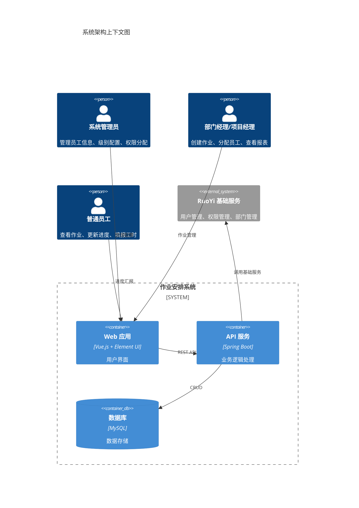
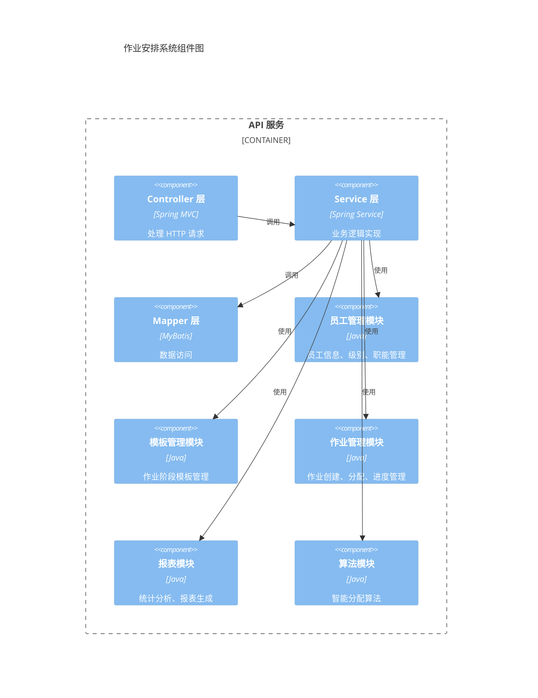
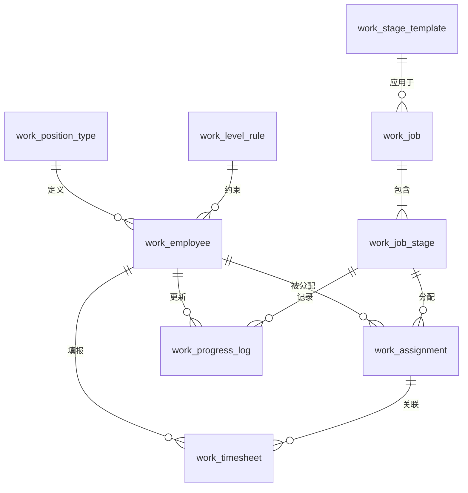
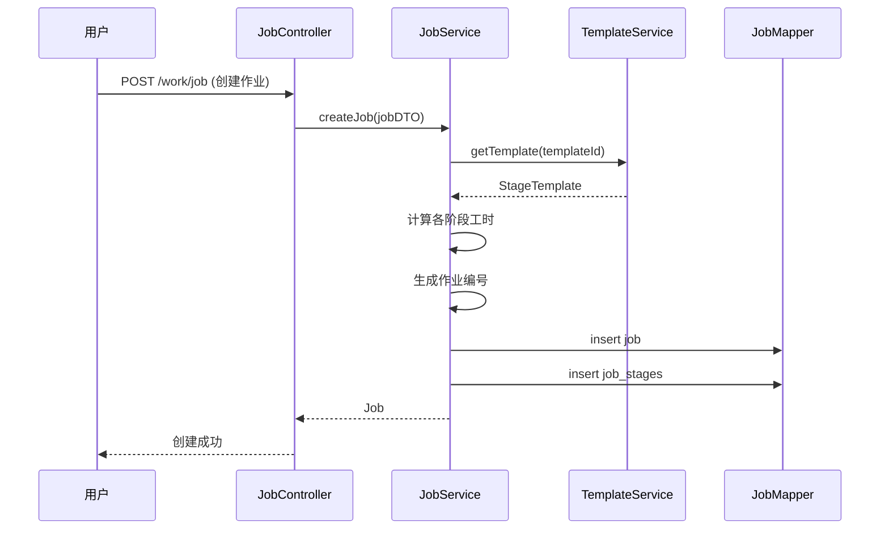
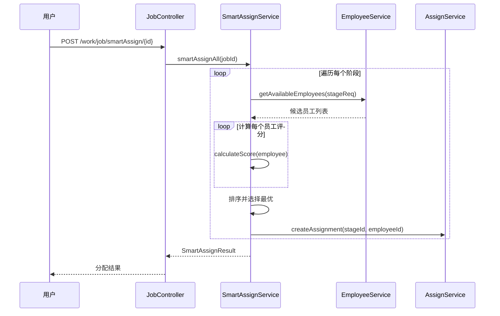

# 技术设计文档

## 1. 概述

### 1.1 系统总结

本系统是基于 RuoYi-Vue 框架的部门员工作业安排管理平台，实现作业分割、工时管理、进度安排、智能分配等核心功能。

### 1.2 设计目标

- 集成 RuoYi 现有权限体系和用户管理
- 遵循 RuoYi 分层架构（Controller → Service → Mapper）
- 支持部门级作业阶段模板自定义
- 实现智能员工分配算法
- 提供完整的进度跟踪和统计分析

### 1.3 技术栈

| 层级 | 技术选型 | 版本 |
| --- | --- | --- |
| 后端框架 | Spring Boot | 2.x |
| 权限框架 | Apache Shiro | 1.x |
| 持久层 | MyBatis | 3.x |
| 数据库 | MySQL | 5.7+ |
| 前端框架 | Vue.js | 2.x |
| UI 组件库 | Element UI | 2.x |
| 构建工具 | Maven | 3.x |

## 2. 技术架构

### 2.1 系统架构图



### 2.2 组件架构图



### 2.3 模块划分

| 模块名 | 包路径 | 职责 |
| --- | --- | --- |
| 员工管理 | `com.ruoyi.work.employee` | 员工信息、级别、职能管理 |
| 模板管理 | `com.ruoyi.work.template` | 作业阶段模板管理 |
| 作业管理 | `com.ruoyi.work.job` | 作业创建、分配、进度管理 |
| 报表统计 | `com.ruoyi.work.report` | 统计分析、报表生成 |
| 算法引擎 | `com.ruoyi.work.algorithm` | 智能分配算法 |

## 3. 业务实现

### 3.1 数据模型设计

#### 3.1.1 员工信息表 (work_employee)

```sql
CREATE TABLE `work_employee` (
  `employee_id` bigint(20) NOT NULL AUTO_INCREMENT COMMENT '员工 ID',
  `employee_no` varchar(32) NOT NULL COMMENT '员工工号',
  `employee_name` varchar(64) NOT NULL COMMENT '员工姓名',
  `dept_id` bigint(20) NOT NULL COMMENT '部门 ID',
  `user_id` bigint(20) DEFAULT NULL COMMENT '关联用户 ID',
  `position_type` varchar(32) NOT NULL COMMENT '职能类型',
  `position_level` int(2) NOT NULL COMMENT '职级 (1-10)',
  `skills` varchar(1024) DEFAULT NULL COMMENT '技能标签 (JSON)',
  `status` char(1) DEFAULT '0' COMMENT '状态 (0 空闲 1 工作中 2 过载)',
  `current_workload` decimal(10,2) DEFAULT '0.00' COMMENT '当前工时负载',
  `max_workload` decimal(10,2) DEFAULT '40.00' COMMENT '最大工时容量',
  `del_flag` char(1) DEFAULT '0' COMMENT '删除标志',
  `create_by` varchar(64) DEFAULT '' COMMENT '创建者',
  `create_time` datetime DEFAULT NULL COMMENT '创建时间',
  `update_by` varchar(64) DEFAULT '' COMMENT '更新者',
  `update_time` datetime DEFAULT NULL COMMENT '更新时间',
  PRIMARY KEY (`employee_id`),
  UNIQUE KEY `uk_employee_no` (`employee_no`),
  KEY `idx_dept_id` (`dept_id`),
  KEY `idx_position` (`position_type`, `position_level`)
) ENGINE=InnoDB DEFAULT CHARSET=utf8mb4 COMMENT='员工信息表';
```

#### 3.1.2 职能类型表 (work_position_type)

```sql
CREATE TABLE `work_position_type` (
  `type_id` bigint(20) NOT NULL AUTO_INCREMENT COMMENT '类型 ID',
  `type_code` varchar(32) NOT NULL COMMENT '类型编码',
  `type_name` varchar(64) NOT NULL COMMENT '类型名称',
  `sort_order` int(4) DEFAULT '0' COMMENT '排序',
  `status` char(1) DEFAULT '0' COMMENT '状态 (0 正常 1 停用)',
  `create_time` datetime DEFAULT NULL COMMENT '创建时间',
  `update_time` datetime DEFAULT NULL COMMENT '更新时间',
  PRIMARY KEY (`type_id`),
  UNIQUE KEY `uk_type_code` (`type_code`)
) ENGINE=InnoDB DEFAULT CHARSET=utf8mb4 COMMENT='职能类型表';
```

#### 3.1.3 级别规则表 (work_level_rule)

```sql
CREATE TABLE `work_level_rule` (
  `rule_id` bigint(20) NOT NULL AUTO_INCREMENT COMMENT '规则 ID',
  `level` int(2) NOT NULL COMMENT '职级',
  `level_name` varchar(64) DEFAULT NULL COMMENT '级别名称',
  `min_stage` varchar(32) DEFAULT NULL COMMENT '可执行最低阶段',
  `max_stage` varchar(32) DEFAULT NULL COMMENT '可执行最高阶段',
  `description` varchar(256) DEFAULT NULL COMMENT '描述',
  `create_time` datetime DEFAULT NULL COMMENT '创建时间',
  PRIMARY KEY (`rule_id`),
  UNIQUE KEY `uk_level` (`level`)
) ENGINE=InnoDB DEFAULT CHARSET=utf8mb4 COMMENT='级别规则表';
```

#### 3.1.4 作业阶段模板表 (work_stage_template)

```sql
CREATE TABLE `work_stage_template` (
  `template_id` bigint(20) NOT NULL AUTO_INCREMENT COMMENT '模板 ID',
  `template_name` varchar(128) NOT NULL COMMENT '模板名称',
  `dept_id` bigint(20) DEFAULT NULL COMMENT '适用部门 ID(NULL 通用)',
  `stages_config` text NOT NULL COMMENT '阶段配置 (JSON)',
  `is_default` char(1) DEFAULT '0' COMMENT '是否默认 (0 否 1 是)',
  `version` int(4) DEFAULT '1' COMMENT '版本号',
  `usage_count` int(11) DEFAULT '0' COMMENT '使用次数',
  `status` char(1) DEFAULT '0' COMMENT '状态 (0 启用 1 禁用)',
  `create_by` varchar(64) DEFAULT '' COMMENT '创建者',
  `create_time` datetime DEFAULT NULL COMMENT '创建时间',
  `update_by` varchar(64) DEFAULT '' COMMENT '更新者',
  `update_time` datetime DEFAULT NULL COMMENT '更新时间',
  PRIMARY KEY (`template_id`),
  KEY `idx_dept_id` (`dept_id`)
) ENGINE=InnoDB DEFAULT CHARSET=utf8mb4 COMMENT='作业阶段模板表';
```

#### 3.1.5 作业主表 (work_job)

```sql
CREATE TABLE `work_job` (
  `job_id` bigint(20) NOT NULL AUTO_INCREMENT COMMENT '作业 ID',
  `job_no` varchar(32) NOT NULL COMMENT '作业编号',
  `job_name` varchar(128) NOT NULL COMMENT '作业名称',
  `dept_id` bigint(20) NOT NULL COMMENT '部门 ID',
  `template_id` bigint(20) NOT NULL COMMENT '阶段模板 ID',
  `total_workload` decimal(10,2) NOT NULL COMMENT '总工时',
  `status` char(1) DEFAULT '0' COMMENT '状态 (0 未开始 1 进行中 2 已完成 3 已取消)',
  `start_date` date DEFAULT NULL COMMENT '计划开始日期',
  `end_date` date DEFAULT NULL COMMENT '计划结束日期',
  `actual_end_date` date DEFAULT NULL COMMENT '实际结束日期',
  `progress` decimal(5,2) DEFAULT '0.00' COMMENT '整体进度 (%)',
  `create_by` varchar(64) DEFAULT '' COMMENT '创建者',
  `create_time` datetime DEFAULT NULL COMMENT '创建时间',
  `update_by` varchar(64) DEFAULT '' COMMENT '更新者',
  `update_time` datetime DEFAULT NULL COMMENT '更新时间',
  `remark` varchar(512) DEFAULT NULL COMMENT '备注',
  PRIMARY KEY (`job_id`),
  UNIQUE KEY `uk_job_no` (`job_no`),
  KEY `idx_dept_id` (`dept_id`),
  KEY `idx_status` (`status`)
) ENGINE=InnoDB DEFAULT CHARSET=utf8mb4 COMMENT='作业主表';
```

#### 3.1.6 作业阶段表 (work_job_stage)

```sql
CREATE TABLE `work_job_stage` (
  `job_stage_id` bigint(20) NOT NULL AUTO_INCREMENT COMMENT '作业阶段 ID',
  `job_id` bigint(20) NOT NULL COMMENT '作业 ID',
  `stage_code` varchar(32) NOT NULL COMMENT '阶段编码',
  `stage_name` varchar(64) NOT NULL COMMENT '阶段名称',
  `stage_order` int(4) NOT NULL COMMENT '阶段顺序',
  `planned_workload` decimal(10,2) NOT NULL COMMENT '计划工时',
  `actual_workload` decimal(10,2) DEFAULT '0.00' COMMENT '实际工时',
  `min_level` int(2) NOT NULL COMMENT '最低级别要求',
  `required_skills` varchar(512) DEFAULT NULL COMMENT '技能要求 (JSON)',
  `status` char(1) DEFAULT '0' COMMENT '状态 (0 未开始 1 进行中 2 已完成)',
  `assigned_employees` text COMMENT '已分配员工 (JSON)',
  `start_date` date DEFAULT NULL COMMENT '开始日期',
  `end_date` date DEFAULT NULL COMMENT '结束日期',
  `progress` decimal(5,2) DEFAULT '0.00' COMMENT '进度 (%)',
  `create_time` datetime DEFAULT NULL COMMENT '创建时间',
  `update_time` datetime DEFAULT NULL COMMENT '更新时间',
  PRIMARY KEY (`job_stage_id`),
  KEY `idx_job_id` (`job_id`),
  KEY `idx_stage_code` (`stage_code`)
) ENGINE=InnoDB DEFAULT CHARSET=utf8mb4 COMMENT='作业阶段表';
```

#### 3.1.7 作业分配表 (work_assignment)

```sql
CREATE TABLE `work_assignment` (
  `assign_id` bigint(20) NOT NULL AUTO_INCREMENT COMMENT '分配 ID',
  `job_stage_id` bigint(20) NOT NULL COMMENT '作业阶段 ID',
  `employee_id` bigint(20) NOT NULL COMMENT '员工 ID',
  `workload` decimal(10,2) DEFAULT '0.00' COMMENT '分配工时',
  `status` char(1) DEFAULT '0' COMMENT '状态 (0 进行中 1 已完成 2 已取消)',
  `assign_by` varchar(64) DEFAULT '' COMMENT '分配人',
  `assign_time` datetime DEFAULT NULL COMMENT '分配时间',
  `complete_time` datetime DEFAULT NULL COMMENT '完成时间',
  `remark` varchar(256) DEFAULT NULL COMMENT '备注',
  PRIMARY KEY (`assign_id`),
  KEY `idx_job_stage` (`job_stage_id`),
  KEY `idx_employee` (`employee_id`)
) ENGINE=InnoDB DEFAULT CHARSET=utf8mb4 COMMENT='作业分配表';
```

#### 3.1.8 工时记录表 (work_timesheet)

```sql
CREATE TABLE `work_timesheet` (
  `timesheet_id` bigint(20) NOT NULL AUTO_INCREMENT COMMENT '工时记录 ID',
  `assign_id` bigint(20) NOT NULL COMMENT '分配 ID',
  `work_date` date NOT NULL COMMENT '工作日期',
  `workload` decimal(10,2) NOT NULL COMMENT '工时数',
  `content` varchar(512) DEFAULT NULL COMMENT '工作内容',
  `submit_by` varchar(64) DEFAULT '' COMMENT '提交人',
  `submit_time` datetime DEFAULT NULL COMMENT '提交时间',
  `status` char(1) DEFAULT '0' COMMENT '状态 (0 草稿 1 已提交 2 已审核)',
  `create_time` datetime DEFAULT NULL COMMENT '创建时间',
  `update_time` datetime DEFAULT NULL COMMENT '更新时间',
  PRIMARY KEY (`timesheet_id`),
  KEY `idx_assign_id` (`assign_id`),
  KEY `idx_work_date` (`work_date`)
) ENGINE=InnoDB DEFAULT CHARSET=utf8mb4 COMMENT='工时记录表';
```

#### 3.1.9 进度更新记录表 (work_progress_log)

```sql
CREATE TABLE `work_progress_log` (
  `log_id` bigint(20) NOT NULL AUTO_INCREMENT COMMENT '日志 ID',
  `job_stage_id` bigint(20) NOT NULL COMMENT '作业阶段 ID',
  `employee_id` bigint(20) NOT NULL COMMENT '员工 ID',
  `progress` decimal(5,2) NOT NULL COMMENT '进度 (%)',
  `prev_progress` decimal(5,2) DEFAULT '0.00' COMMENT '上次进度',
  `remark` varchar(512) DEFAULT NULL COMMENT '备注',
  `create_time` datetime DEFAULT NULL COMMENT '创建时间',
  PRIMARY KEY (`log_id`),
  KEY `idx_job_stage` (`job_stage_id`),
  KEY `idx_create_time` (`create_time`)
) ENGINE=InnoDB DEFAULT CHARSET=utf8mb4 COMMENT='进度更新记录表';
```

### 3.2 实体关系图



### 3.3 API 接口设计

#### 3.3.1 员工管理 API

| 方法 | 路径 | 描述 | 权限 |
| --- | --- | --- | --- |
| GET | /work/employee/list | 员工列表 | work:employee:view |
| GET | /work/employee/{id} | 员工详情 | work:employee:view |
| POST | /work/employee | 新增员工 | work:employee:add |
| PUT | /work/employee | 编辑员工 | work:employee:edit |
| DELETE | /work/employee/{ids} | 删除员工 | work:employee:delete |
| GET | /work/employee/position/types | 职能类型列表 | work:employee:view |
| GET | /work/employee/level/rules | 级别规则列表 | work:employee:view |

#### 3.3.2 模板管理 API

| 方法 | 路径 | 描述 | 权限 |
| --- | --- | --- | --- |
| GET | /work/template/list | 模板列表 | work:template:view |
| GET | /work/template/{id} | 模板详情 | work:template:view |
| POST | /work/template | 新增模板 | work:template:add |
| PUT | /work/template | 编辑模板 | work:template:edit |
| DELETE | /work/template/{ids} | 删除模板 | work:template:delete |
| POST | /work/template/copy/{id} | 复制模板 | work:template:add |
| PUT | /work/template/setDefault/{id} | 设为默认 | work:template:edit |

#### 3.3.3 作业管理 API

| 方法 | 路径 | 描述 | 权限 |
| --- | --- | --- | --- |
| GET | /work/job/list | 作业列表 | work:job:view |
| GET | /work/job/{id} | 作业详情 | work:job:view |
| POST | /work/job | 创建作业 | work:job:add |
| PUT | /work/job | 编辑作业 | work:job:edit |
| DELETE | /work/job/{ids} | 删除作业 | work:job:delete |
| POST | /work/job/assign | 分配员工 | work:job:assign |
| POST | /work/job/smartAssign/{id} | 智能分配 | work:job:assign |
| PUT | /work/job/progress | 更新进度 | work:job:progress |
| GET | /work/job/stages/{jobId} | 阶段列表 | work:job:view |

#### 3.3.4 报表 API

| 方法 | 路径 | 描述 | 权限 |
| --- | --- | --- | --- |
| GET | /work/report/dept/load | 部门负载报表 | work:report:view |
| GET | /work/report/employee/efficiency | 员工效率报表 | work:report:view |
| GET | /work/report/job/statistics | 作业统计 | work:report:view |
| POST | /work/report/export | 导出报表 | work:report:export |

### 3.4 核心业务方法

#### 3.4.1 智能分配算法

```java
/**
 * 智能分配服务接口
 */
public interface ISmartAssignService {
    
    /**
     * 为作业阶段推荐员工
     * @param jobStageId 作业阶段 ID
     * @param limit 推荐数量
     * @return 推荐员工列表（按评分排序）
     */
    List<EmployeeRecommendVO> recommendEmployees(Long jobStageId, int limit);
    
    /**
     * 一键智能分配作业所有阶段
     * @param jobId 作业 ID
     * @return 分配结果
     */
    SmartAssignResult smartAssignAll(Long jobId);
    
    /**
     * 计算员工综合评分
     * @param employee 员工信息
     * @param stageRequirement 阶段要求
     * @return 综合评分 (0-100)
     */
    double calculateScore(Employee employee, StageRequirement stageRequirement);
}

/**
 * 员工推荐 VO
 */
@Data
public class EmployeeRecommendVO {
    private Long employeeId;
    private String employeeName;
    private String positionType;
    private Integer positionLevel;
    private BigDecimal currentWorkload;
    private BigDecimal maxWorkload;
    private double loadScore;      // 负载分
    private double matchScore;     // 匹配分
    private double efficiencyScore; // 效率分
    private double totalScore;     // 综合评分
    private String skillMatch;     // 技能匹配描述
}
```

#### 3.4.2 工时计算服务

```java
/**
 * 工时计算服务
 */
@Service
public class WorkloadCalculationServiceImpl implements IWorkloadCalculationService {
    
    @Override
    public Map<String, BigDecimal> calculateStageWorkload(BigDecimal totalWorkload, 
                                                           List<StageConfig> stages) {
        Map<String, BigDecimal> result = new HashMap<>();
        for (StageConfig stage : stages) {
            BigDecimal stageWorkload = totalWorkload.multiply(
                new BigDecimal(stage.getWorkloadRatio()));
            result.put(stage.getStageCode(), stageWorkload);
        }
        return result;
    }
    
    @Override
    public int calculateRequiredHeadcount(BigDecimal stageWorkload, 
                                          BigDecimal standardEfficiency,
                                          int workDays) {
        BigDecimal required = stageWorkload
            .divide(standardEfficiency, RoundingMode.UP)
            .divide(new BigDecimal(workDays), RoundingMode.UP);
        return required.intValue();
    }
}
```

### 3.5 时序图

#### 3.5.1 作业创建流程



#### 3.5.2 智能分配流程



## 4. 错误处理

### 4.1 错误分类

| 错误类型 | HTTP 状态码 | 说明 |
| --- | --- | --- |
| 参数校验失败 | 400 | 请求参数不合法 |
| 未授权 | 401 | 用户未登录 |
| 权限不足 | 403 | 无操作权限 |
| 资源不存在 | 404 | 数据不存在 |
| 业务异常 | 500 | 业务规则冲突 |
| 系统异常 | 500 | 系统内部错误 |

### 4.2 统一响应格式

```java
@Data
public class AjaxResult {
    private int code;      // 状态码 (200 成功 500 失败)
    private String msg;    // 提示信息
    private Object data;   // 返回数据
    
    public static AjaxResult success(Object data) { ... }
    public static AjaxResult error(String msg) { ... }
}
```

### 4.3 业务异常定义

```java
/**
 * 作业管理业务异常
 */
public class WorkException extends RuntimeException {
    public WorkException(String message) {
        super(message);
    }
}

// 异常类型
- 员工不存在
- 模板不存在
- 作业不存在
- 阶段占比总和不等于 100%
- 员工负载已满
- 无符合要求的员工
- 作业状态不允许此操作
```

## 5. 测试策略

### 5.1 单元测试

| 模块 | 测试重点 | 工具 |
| --- | --- | --- |
| 员工服务 | CRUD 操作、状态计算 | JUnit + Mockito |
| 模板服务 | 模板配置校验、JSON 解析 | JUnit |
| 作业服务 | 工时计算、状态流转 | JUnit |
| 分配算法 | 评分计算、排序逻辑 | JUnit |

### 5.2 集成测试

| 测试场景 | 测试内容 |
| --- | --- |
| 作业创建流程 | 模板选择→工时计算→数据持久化 |
| 智能分配流程 | 员工筛选→评分计算→分配创建 |
| 进度更新流程 | 进度校验→负载更新→日志记录 |

### 5.3 测试数据

```sql
-- 初始化测试数据
INSERT INTO work_position_type VALUES (1, 'frontend', '前端', 1, '0', NOW(), NOW());
INSERT INTO work_position_type VALUES (2, 'backend', '后端', 2, '0', NOW(), NOW());
INSERT INTO work_position_type VALUES (3, 'test', '测试', 3, '0', NOW(), NOW());

INSERT INTO work_level_rule VALUES (1, 3, '初级', '单体测试', '开发', 'P3 初级员工');
INSERT INTO work_level_rule VALUES (2, 4, '中级', '开发', '结合测试', 'P4 中级员工');
INSERT INTO work_level_rule VALUES (3, 6, '资深', '基本设计', '内部设计', 'P6 资深员工');
INSERT INTO work_level_rule VALUES (4, 9, '高级专家', '需求分析', '需求分析', 'P9 高级专家');
```

## 6. 安全考虑

### 6.1 认证与授权

- 集成 RuoYi Shiro 认证
- 基于角色的权限控制 (RBAC)
- 方法级权限注解 `@RequiresPermissions`

### 6.2 输入验证

- 所有请求参数进行校验
- SQL 注入防护 (使用 MyBatis 参数绑定)
- XSS 防护 (使用 RuoYi 过滤器)

### 6.3 数据安全

- 敏感操作记录日志
- 逻辑删除代替物理删除
- 工时数据修改需要权限

### 6.4 接口安全

- 所有 API 需要登录认证
- 写操作需要 CSRF 保护
- 数据导出需要额外权限验证

## 7. 部署说明

### 7.1 数据库初始化

1. 执行 SQL 脚本创建表结构
2. 初始化基础数据（职能类型、级别规则）
3. 配置 RuoYi 菜单和权限

### 7.2 配置说明

```yaml
# application.yml 新增配置
work:
  # 标准人效 (小时/天)
  standard-efficiency: 6
  # 负载预警阈值
  load-warning-threshold: 0.9
  # 空闲阈值
  idle-threshold: 0.5
```

## 8. 附录

### 8.1 作业阶段编码

| 编码 | 名称 | 说明 |
| --- | --- | --- |
| requirements | 需求分析 | 需求调研和分析 |
| basic_design | 基本设计 | 概要设计 |
| detail_design | 内部设计 | 详细设计 |
| development | 开发 | 编码实现 |
| unit_test | 单体测试 | 单元测试 |
| integration_test | 结合测试 | 集成测试 |
| system_test | 综合测试 | 系统测试 |
| release | 上线 | 发布上线 |

### 8.2 JSON 配置示例

**阶段配置 JSON**:

```json
[
  {
    "stage_code": "requirements",
    "stage_name": "需求分析",
    "stage_order": 1,
    "workload_ratio": 0.10,
    "min_level": 9,
    "required_skills": ["需求分析", "业务理解"]
  },
  {
    "stage_code": "basic_design",
    "stage_name": "基本设计",
    "stage_order": 2,
    "workload_ratio": 0.15,
    "min_level": 6,
    "required_skills": ["系统设计"]
  }
]
```

**员工技能 JSON**:

```json
["Java", "Spring Boot", "MySQL", "Vue.js"]