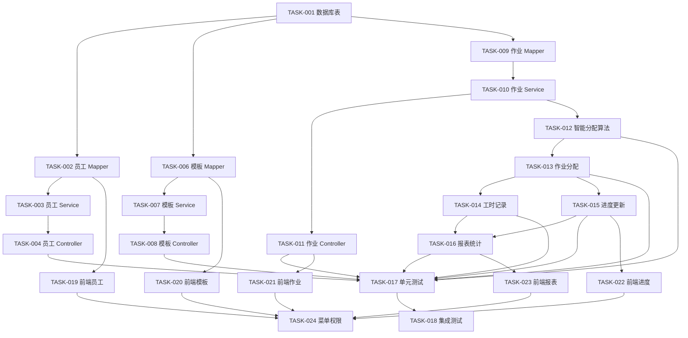

# Task 目录清单

## 任务概览

| Task ID | 任务名称 | 模块 | 优先级 | 预估工时 | 状态 |
| --- | --- | --- | --- | --- | --- |
| TASK-001 | 数据库表结构创建 | 基础设施 | P0 | 4h | pending |
| TASK-002 | 员工管理 Mapper 层实现 | 员工管理 | P0 | 3h | pending |
| TASK-003 | 员工管理 Service 层实现 | 员工管理 | P0 | 6h | pending |
| TASK-004 | 员工管理 Controller 层实现 | 员工管理 | P0 | 4h | pending |
| TASK-005 | 职能类型和级别规则管理 | 员工管理 | P0 | 4h | pending |
| TASK-006 | 作业阶段模板 Mapper 层实现 | 模板管理 | P0 | 2h | pending |
| TASK-007 | 作业阶段模板 Service 层实现 | 模板管理 | P0 | 4h | pending |
| TASK-008 | 作业阶段模板 Controller 层实现 | 模板管理 | P0 | 3h | pending |
| TASK-009 | 作业管理 Mapper 层实现 | 作业管理 | P0 | 3h | pending |
| TASK-010 | 作业管理 Service 层实现 | 作业管理 | P0 | 8h | pending |
| TASK-011 | 作业管理 Controller 层实现 | 作业管理 | P0 | 4h | pending |
| TASK-012 | 智能分配算法实现 | 算法引擎 | P0 | 8h | pending |
| TASK-013 | 作业分配功能实现 | 作业管理 | P0 | 6h | pending |
| TASK-014 | 工时记录功能实现 | 进度管理 | P0 | 4h | pending |
| TASK-015 | 进度更新功能实现 | 进度管理 | P0 | 4h | pending |
| TASK-016 | 报表统计功能实现 | 报表统计 | P1 | 6h | pending |
| TASK-017 | 单元测试编写 | 测试 | P0 | 12h | pending |
| TASK-018 | 集成测试编写 | 测试 | P0 | 8h | pending |
| TASK-019 | 前端员工管理页面 | 前端 | P0 | 8h | pending |
| TASK-020 | 前端模板管理页面 | 前端 | P0 | 6h | pending |
| TASK-021 | 前端作业管理页面 | 前端 | P0 | 10h | pending |
| TASK-022 | 前端进度管理页面 | 前端 | P0 | 6h | pending |
| TASK-023 | 前端报表页面 | 前端 | P1 | 6h | pending |
| TASK-024 | 菜单和权限配置 | 系统配置 | P0 | 2h | pending |

## 任务依赖关系

## 执行顺序

### 第一阶段：基础设施 (TASK-001)
- 创建数据库表结构
- 初始化基础数据

### 第二阶段：后端核心功能 (TASK-002 ~ TASK-018)
1. 员工管理模块 (TASK-002 ~ TASK-005)
2. 模板管理模块 (TASK-006 ~ TASK-008)
3. 作业管理模块 (TASK-009 ~ TASK-011)
4. 智能分配算法 (TASK-012)
5. 作业分配功能 (TASK-013)
6. 进度管理功能 (TASK-014 ~ TASK-015)
7. 报表统计功能 (TASK-016)
8. 测试代码 (TASK-017 ~ TASK-018)

### 第三阶段：前端页面 (TASK-019 ~ TASK-023)
1. 员工管理页面 (TASK-019)
2. 模板管理页面 (TASK-020)
3. 作业管理页面 (TASK-021)
4. 进度管理页面 (TASK-022)
5. 报表页面 (TASK-023)

### 第四阶段：系统配置 (TASK-024)
- 菜单配置
- 权限配置

## 任务详细链接

- [TASK-001](TASK-001.md) - 数据库表结构创建
- [TASK-002](TASK-002.md) - 员工管理 Mapper 层实现
- [TASK-003](TASK-003.md) - 员工管理 Service 层实现
- [TASK-004](TASK-004.md) - 员工管理 Controller 层实现
- [TASK-005](TASK-005.md) - 职能类型和级别规则管理
- [TASK-006](TASK-006.md) - 作业阶段模板 Mapper 层实现
- [TASK-007](TASK-007.md) - 作业阶段模板 Service 层实现
- [TASK-008](TASK-008.md) - 作业阶段模板 Controller 层实现
- [TASK-009](TASK-009.md) - 作业管理 Mapper 层实现
- [TASK-010](TASK-010.md) - 作业管理 Service 层实现
- [TASK-011](TASK-011.md) - 作业管理 Controller 层实现
- [TASK-012](TASK-012.md) - 智能分配算法实现
- [TASK-013](TASK-013.md) - 作业分配功能实现
- [TASK-014](TASK-014.md) - 工时记录功能实现
- [TASK-015](TASK-015.md) - 进度更新功能实现
- [TASK-016](TASK-016.md) - 报表统计功能实现
- [TASK-017](TASK-017.md) - 单元测试编写
- [TASK-018](TASK-018.md) - 集成测试编写
- [TASK-019](TASK-019.md) - 前端员工管理页面
- [TASK-020](TASK-020.md) - 前端模板管理页面
- [TASK-021](TASK-021.md) - 前端作业管理页面
- [TASK-022](TASK-022.md) - 前端进度管理页面
- [TASK-023](TASK-023.md) - 前端报表页面
- [TASK-024](TASK-024.md) - 菜单和权限配置