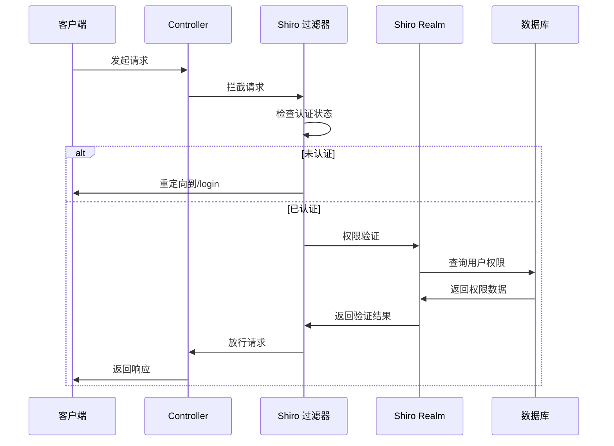
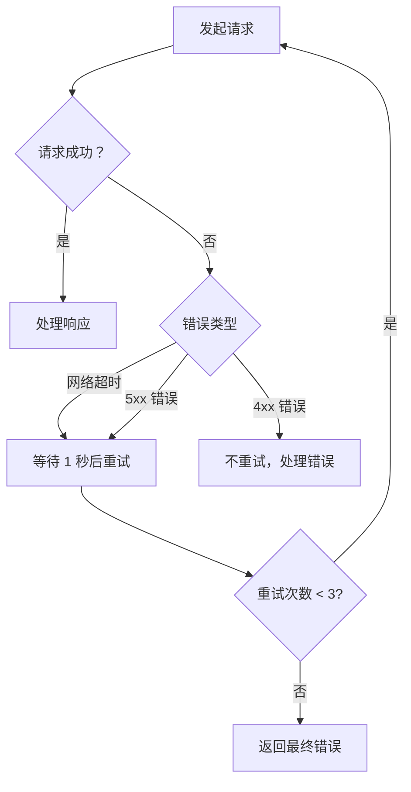
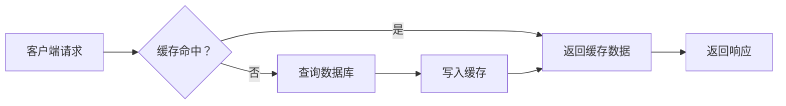

# API 参考文档

**本文档中引用的文件**
- [pom.xml](../../../../pom.xml)
- [application.yml](../../../../ruoyi-admin/src/main/resources/application.yml)
- [SysUserController.java](../../../../ruoyi-admin/src/main/java/com/ruoyi/web/controller/system/SysUserController.java)
- [TestController.java](../../../../ruoyi-admin/src/main/java/com/ruoyi/web/controller/tool/TestController.java)

## 目录
1. [简介](#简介)
2. [认证和授权](#认证和授权)
3. [系统管理 API](#系统管理-api)
4. [监控管理 API](#监控管理-api)
5. [工具 API](#工具-api)
6. [演示 API](#演示-api)
7. [错误处理](#错误处理)
8. [最佳实践](#最佳实践)
## API 文档索引
- [系统管理 API](./系统管理API.md)
- [监控管理 API](./监控管理API.md)
- [工具 API](./工具API.md)
- [演示 API](./演示API.md)

## API 文档维护流程

- 新增接口时同步补充 `API参考` 子文档并更新 `目录.md`。
- 变更接口逻辑时同时更新文档说明、请求参数与响应示例。
- 定期比对 `/v3/api-docs` 输出与实际接口列表，确保文档一致。
- 推荐使用 `@Tag`、`@Operation`、`@Schema` 注解增强 OpenAPI 说明。
- 对于废弃接口，应在文档中标记 `deprecated` 并保留历史说明。

## 简介

若依管理系统（RuoYi）是一个基于 Spring Boot 3.5.14 和 Apache Shiro 的企业级快速开发平台，提供完整的权限管理、系统监控和开发工具功能。系统采用 SpringDoc 2.8.17 作为 API 文档生成工具，支持 OpenAPI 3.0 规范。

### 版本控制策略
- API 版本：v4.8.3
- URL 格式：`/{module}/{endpoint}`
- 内容协商：支持 JSON 格式
- 缓存策略：默认禁用缓存（开发环境）

### 基础配置
- 服务器端口：80
- 应用上下文路径：/
- 数据库连接池：Druid
- 请求超时：默认配置（Tomcat）

### API 访问端点
- **Swagger UI**: `/swagger-ui.html`
- **OpenAPI 文档**: `/v3/api-docs`

**配置来源**
- [pom.xml](../../../../pom.xml) - SpringDoc 版本 2.8.17
- [application.yml](../../../../ruoyi-admin/src/main/resources/application.yml) - 服务器与 SpringDoc 配置

## 认证和授权

### 认证机制

系统采用 Apache Shiro 2.2.0 作为安全框架，提供基于 Session 的认证机制和 RememberMe 功能。



**图表来源**
- [application.yml](../../../../ruoyi-admin/src/main/resources/application.yml)(L86-L124)

### 角色定义

| 角色 | 描述 | 权限范围 |
|------|------|----------|
| 超级管理员 | 系统最高权限角色 | 所有菜单和操作权限 |
| 普通角色 | 普通用户角色 | 分配的菜单和操作权限 |
| 匿名角色 | 未登录用户 | 仅允许访问公开接口 |

### 认证头部要求

所有需要认证的 API 请求必须包含以下头部信息：
```
Authorization: Bearer <TOKEN>
Content-Type: application/json
```

### Shiro 配置说明

- **登录地址**: `/login`
- **权限认证失败地址**: `/unauth`
- **首页地址**: `/index`
- **验证码开关**: 启用
- **验证码类型**: math（数字计算）
- **Session 超时时间**: 30 分钟
- **RememberMe**: 启用（默认 30 天）

**章节来源**
- [application.yml](../../../../ruoyi-admin/src/main/resources/application.yml)(L86-L124)

## 系统管理 API

系统管理模块提供用户、角色、菜单、部门、岗位、字典、参数、通知等核心管理功能。

### 用户管理 API

**基础路径**: `/system/user`

| 接口 | 方法 | 描述 | 权限要求 |
|------|------|------|----------|
| `/system/user` | GET | 进入用户管理页面 | `system:user:view` |
| `/system/user/list` | POST | 获取用户列表（分页） | `system:user:list` |
| `/system/user/export` | POST | 导出用户数据 | `system:user:export` |
| `/system/user/importData` | POST | 导入用户数据 | `system:user:import` |
| `/system/user/add` | GET | 进入新增用户页面 | `system:user:add` |
| `/system/user/add` | POST | 新增用户 | `system:user:add` |
| `/system/user/edit/{userId}` | GET | 进入修改用户页面 | `system:user:edit` |
| `/system/user/edit` | POST | 修改用户 | `system:user:edit` |
| `/system/user/remove` | POST | 删除用户（批量） | `system:user:remove` |
| `/system/user/resetPwd/{userId}` | GET | 进入重置密码页面 | `system:user:resetPwd` |
| `/system/user/resetPwd` | POST | 重置用户密码 | `system:user:resetPwd` |
| `/system/user/changeStatus` | POST | 修改用户状态 | `system:user:changeStatus` |

**响应格式示例**（列表接口）：
```json
{
  "total": 100,
  "rows": [
    {
      "userId": 1,
      "userName": "admin",
      "nickName": "管理员",
      "email": "admin@ruoyi.vip",
      "phonenumber": "15888888888",
      "sex": "0",
      "status": "0"
    }
  ]
}
```

**章节来源**
- [SysUserController.java](../../../../ruoyi-admin/src/main/java/com/ruoyi/web/controller/system/SysUserController.java)

### 角色管理 API

**基础路径**: `/system/role`

| 接口 | 方法 | 描述 | 权限要求 |
|------|------|------|----------|
| `/system/role` | GET | 进入角色管理页面 | `system:role:view` |
| `/system/role/list` | POST | 获取角色列表（分页） | `system:role:list` |
| `/system/role/export` | POST | 导出角色数据 | `system:role:export` |
| `/system/role/add` | GET/POST | 新增角色 | `system:role:add` |
| `/system/role/edit/{roleId}` | GET/POST | 修改角色 | `system:role:edit` |
| `/system/role/remove` | POST | 删除角色（批量） | `system:role:remove` |
| `/system/role/authUser/allocatedList` | POST | 查询已分配用户列表 | `system:role:view` |
| `/system/role/authUser/selectAll` | POST | 批量授权用户 | `system:role:edit` |
| `/system/role/authUser/cancel` | POST | 取消用户授权 | `system:role:edit` |

### 菜单管理 API

**基础路径**: `/system/menu`

| 接口 | 方法 | 描述 | 权限要求 |
|------|------|------|----------|
| `/system/menu` | GET | 进入菜单管理页面 | `system:menu:view` |
| `/system/menu/list` | POST | 获取菜单列表（树形） | `system:menu:list` |
| `/system/menu/add` | GET/POST | 新增菜单 | `system:menu:add` |
| `/system/menu/edit/{menuId}` | GET/POST | 修改菜单 | `system:menu:edit` |
| `/system/menu/remove/{menuId}` | POST | 删除菜单 | `system:menu:remove` |

### 部门管理 API

**基础路径**: `/system/dept`

| 接口 | 方法 | 描述 | 权限要求 |
|------|------|------|----------|
| `/system/dept` | GET | 进入部门管理页面 | `system:dept:view` |
| `/system/dept/list` | POST | 获取部门列表（树形） | `system:dept:list` |
| `/system/dept/add` | GET/POST | 新增部门 | `system:dept:add` |
| `/system/dept/edit/{deptId}` | GET/POST | 修改部门 | `system:dept:edit` |
| `/system/dept/remove/{deptId}` | POST | 删除部门 | `system:dept:remove` |

### 岗位管理 API

**基础路径**: `/system/post`

| 接口 | 方法 | 描述 | 权限要求 |
|------|------|------|----------|
| `/system/post` | GET | 进入岗位管理页面 | `system:post:view` |
| `/system/post/list` | POST | 获取岗位列表（分页） | `system:post:list` |
| `/system/post/export` | POST | 导出岗位数据 | `system:post:export` |
| `/system/post/add` | GET/POST | 新增岗位 | `system:post:add` |
| `/system/post/edit/{postId}` | GET/POST | 修改岗位 | `system:post:edit` |
| `/system/post/remove` | POST | 删除岗位（批量） | `system:post:remove` |

### 字典管理 API

**基础路径**: `/system/dict`

| 接口 | 方法 | 描述 | 权限要求 |
|------|------|------|----------|
| `/system/dict/type` | GET/POST | 字典类型管理 | `system:dict:view` |
| `/system/dict/data` | GET/POST | 字典数据管理 | `system:dict:view` |
| `/system/dict/data/optionselect` | GET | 获取字典选择框列表 | 无 |

### 参数管理 API

**基础路径**: `/system/config`

| 接口 | 方法 | 描述 | 权限要求 |
|------|------|------|----------|
| `/system/config` | GET | 进入参数设置页面 | `system:config:view` |
| `/system/config/list` | POST | 获取参数列表（分页） | `system:config:list` |
| `/system/config/export` | POST | 导出参数数据 | `system:config:export` |
| `/system/config/add` | GET/POST | 新增参数 | `system:config:add` |
| `/system/config/edit/{configId}` | GET/POST | 修改参数 | `system:config:edit` |
| `/system/config/remove` | POST | 删除参数（批量） | `system:config:remove` |
| `/system/config/checkConfigKey` | POST | 校验参数键名 | `system:config:view` |

### 通知公告 API

**基础路径**: `/system/notice`

| 接口 | 方法 | 描述 | 权限要求 |
|------|------|------|----------|
| `/system/notice` | GET | 进入通知公告页面 | `system:notice:view` |
| `/system/notice/list` | POST | 获取公告列表（分页） | `system:notice:list` |
| `/system/notice/add` | GET/POST | 新增公告 | `system:notice:add` |
| `/system/notice/edit/{noticeId}` | GET/POST | 修改公告 | `system:notice:edit` |
| `/system/notice/remove` | POST | 删除公告（批量） | `system:notice:remove` |

## 监控管理 API

监控管理模块提供缓存、数据库连接池、服务器信息、登录日志、操作日志、在线用户等监控功能。

### 缓存监控 API

**基础路径**: `/monitor/cache`

| 接口 | 方法 | 描述 | 权限要求 |
|------|------|------|----------|
| `/monitor/cache` | GET | 进入缓存监控页面 | `monitor:cache:view` |
| `/monitor/cache/getNames` | GET | 获取所有缓存名称 | `monitor:cache:view` |
| `/monitor/cache/getKeys/{cacheName}` | GET | 获取缓存键名列表 | `monitor:cache:view` |
| `/monitor/cache/getValue/{cacheName}/{cacheKey}` | GET | 获取缓存内容 | `monitor:cache:view` |
| `/monitor/cache/clearCacheName/{cacheName}` | POST | 清理指定缓存 | `monitor:cache:remove` |
| `/monitor/cache/clearCacheKey/{cacheName}/{cacheKey}` | POST | 清理指定键缓存 | `monitor:cache:remove` |
| `/monitor/cache/clearCacheAll` | POST | 清理所有缓存 | `monitor:cache:remove` |

### 数据库连接池监控 API

**基础路径**: `/monitor/druid`

| 接口 | 方法 | 描述 | 权限要求 |
|------|------|------|----------|
| `/monitor/druid` | GET | 进入 Druid 监控页面 | `monitor:druid:view` |

**章节来源**
- [DruidController.java](../../../../ruoyi-admin/src/main/java/com/ruoyi/web/controller/monitor/DruidController.java)

### 服务器监控 API

**基础路径**: `/monitor/server`

| 接口 | 方法 | 描述 | 权限要求 |
|------|------|------|----------|
| `/monitor/server` | GET | 获取服务器信息 | `monitor:server:view` |

**响应格式示例**：
```json
{
  "cpu": {
    "cpuNum": 8,
    "combined": 45.5
  },
  "jvm": {
    "total": "256M",
    "max": "512M",
    "used": "128M",
    "free": "128M"
  },
  "mem": {
    "total": "16G",
    "used": "8G",
    "free": "8G"
  },
  "sys": {
    "osName": "Windows 11",
    "osArch": "amd64"
  }
}
```

**章节来源**
- [ServerController.java](../../../../ruoyi-admin/src/main/java/com/ruoyi/web/controller/monitor/ServerController.java)

### 登录日志 API

**基础路径**: `/monitor/logininfor`

| 接口 | 方法 | 描述 | 权限要求 |
|------|------|------|----------|
| `/monitor/logininfor` | GET | 进入登录日志页面 | `monitor:logininfor:view` |
| `/monitor/logininfor/list` | POST | 获取登录日志列表（分页） | `monitor:logininfor:list` |
| `/monitor/logininfor/export` | POST | 导出登录日志 | `monitor:logininfor:export` |
| `/monitor/logininfor/remove` | POST | 删除登录日志（批量） | `monitor:logininfor:remove` |
| `/monitor/logininfor/unlock` | POST | 解锁账户 | `monitor:logininfor:unlock` |

### 操作日志 API

**基础路径**: `/monitor/operlog`

| 接口 | 方法 | 描述 | 权限要求 |
|------|------|------|----------|
| `/monitor/operlog` | GET | 进入操作日志页面 | `monitor:operlog:view` |
| `/monitor/operlog/list` | POST | 获取操作日志列表（分页） | `monitor:operlog:list` |
| `/monitor/operlog/export` | POST | 导出操作日志 | `monitor:operlog:export` |
| `/monitor/operlog/remove` | POST | 删除操作日志（批量） | `monitor:operlog:remove` |
| `/monitor/operlog/detail/{operId}` | GET | 查看操作日志详情 | `monitor:operlog:view` |

### 在线用户监控 API

**基础路径**: `/monitor/online`

| 接口 | 方法 | 描述 | 权限要求 |
|------|------|------|----------|
| `/monitor/online` | GET | 进入在线用户页面 | `monitor:online:view` |
| `/monitor/online/list` | POST | 获取在线用户列表 | `monitor:online:list` |
| `/monitor/online/batchLogout` | POST | 批量强退在线用户 | `monitor:online:force` |
| `/monitor/online/forceLogout/{tokenId}` | POST | 强退指定在线用户 | `monitor:online:force` |

## 工具 API

工具模块提供构建信息查询、Swagger 测试接口等功能。

### 构建信息查询 API

**基础路径**: `/tool/build`

| 接口 | 方法 | 描述 | 权限要求 |
|------|------|------|----------|
| `/tool/build` | GET | 获取项目构建信息 | 无 |

**响应格式示例**：
```json
{
  "version": "4.8.3",
  "startTime": "2026-01-01 00:00:00",
  "runTime": "1 天 2 小时 30 分钟",
  "homePage": "http://www.ruoyi.vip"
}
```

**章节来源**
- [BuildController.java](../../../../ruoyi-admin/src/main/java/com/ruoyi/web/controller/tool/BuildController.java)

### Swagger 测试 API

**基础路径**: `/test/user`

| 接口 | 方法 | 描述 | 权限要求 |
|------|------|------|----------|
| `/test/user/list` | GET | 获取用户列表 | 无 |
| `/test/user/{userId}` | GET | 获取用户详细信息 | 无 |
| `/test/user/save` | POST | 新增用户 | 无 |
| `/test/user/update` | PUT | 更新用户信息 | 无 |
| `/test/user/{userId}` | DELETE | 删除用户 | 无 |

**请求体格式**（新增/更新）：
```json
{
  "userId": 1,
  "userName": "admin",
  "userPhone": "15888888888"
}
```

**响应格式示例**：
```json
{
  "code": 200,
  "msg": "操作成功",
  "data": {}
}
```

**章节来源**
- [TestController.java](../../../../ruoyi-admin/src/main/java/com/ruoyi/web/controller/tool/TestController.java)(L1-L100)

## 演示 API

演示模块提供功能演示接口，用于展示系统功能特性。

> 注意：演示环境已启用（`ruoyi.demoEnabled: true`），部分操作可能受到限制。

**章节来源**
- [application.yml](../../../../ruoyi-admin/src/main/resources/application.yml)(L10)

## API 文档生成与扫描

系统使用 SpringDoc 2.8.17 自动生成 OpenAPI 文档。主要配置位于 `application.yml` 中，扫描包范围包括 `com.ruoyi.web.controller` 下的控制器。

### 关键配置

- `springdoc.api-docs.path`: `/v3/api-docs`
- `springdoc.swagger-ui.path`: `/swagger-ui.html`
- `springdoc.group-configs[0].group`: `default`
- `springdoc.packages-to-scan`: `com.ruoyi.web.controller.tool`

### 访问说明

- Swagger UI：`http://localhost/swagger-ui.html`
- OpenAPI JSON：`http://localhost/v3/api-docs`
- 若需要新增 API 文档分组，可在 `application.yml` 中补充 `springdoc.group-configs` 配置。

### 扩展建议

- API 接口增加 `@Operation`、`@Tag`、`@Schema` 注解以提升文档可读性
- 对复杂返回类型使用 `@Schema(description = "...")` 进行字段说明
- 定期验证 `/v3/api-docs` 输出与实际接口是否一致

## 错误处理

### HTTP 状态码

| 状态码 | 含义 | 使用场景 |
|--------|------|----------|
| 200 | OK | 请求成功 |
| 400 | Bad Request | 请求参数错误 |
| 401 | Unauthorized | 未认证或 Token 过期 |
| 403 | Forbidden | 权限不足 |
| 404 | Not Found | 资源不存在 |
| 429 | Too Many Requests | 请求频率过高 |
| 500 | Internal Server Error | 服务器内部错误 |

### 错误响应格式

```json
{
  "code": 500,
  "msg": "错误描述信息",
  "data": null
}
```

或（分页查询场景）：

```json
{
  "total": 0,
  "rows": []
}
```

### 常见错误类型

#### 认证失败
- **错误码**: 401
- **场景**: 未登录或 Session 过期
- **处理**: 重定向到登录页面 `/login`

#### 权限不足
- **错误码**: 403
- **场景**: 用户无操作权限
- **处理**: 重定向到权限错误页面 `/unauth`

#### 参数验证失败
- **错误码**: 400
- **场景**: 请求参数格式错误或必填字段缺失
- **处理**: 返回具体错误信息

## 最佳实践

### 请求重试策略



### 速率限制

- 系统默认未配置速率限制
- 生产环境建议配置 Nginx 或 API 网关进行限流
- 敏感接口（如登录、注册）建议增加验证码防护

### 缓存策略



### 错误恢复

1. **自动重试**: 对于网络超时和 5xx 错误，建议实现指数退避重试机制
2. **降级处理**: 对于非核心功能（如统计报表），可实现服务降级
3. **监控告警**: 关键错误应触发告警通知

### 性能优化建议

1. **批量操作**: 使用批量导入/导出接口，减少网络往返
2. **分页查询**: 列表查询必须使用分页，避免一次性加载大量数据
3. **条件过滤**: 尽量使用精确查询条件，减少数据库扫描
4. **缓存利用**: 字典数据、配置参数等静态数据优先使用缓存

### 安全最佳实践

1. **HTTPS 传输**: 生产环境必须使用 HTTPS 加密传输
2. **输入验证**: 所有用户输入必须经过验证和过滤（系统已启用 XSS 过滤）
3. **输出编码**: 响应数据应进行适当的编码处理
4. **日志审计**: 关键操作应记录审计日志（系统已启用操作日志）
5. **权限最小化**: 用户权限应遵循最小化原则，仅分配必要权限

---

## 附录：API 模块扫描范围

根据 SpringDoc 配置，API 文档扫描范围如下：

- **默认组**: `default`
- **扫描包**: `com.ruoyi.web.controller.tool`
- **路径匹配**: `/**`

**配置来源**
- [application.yml](../../../../ruoyi-admin/src/main/resources/application.yml)(L125-L137)
