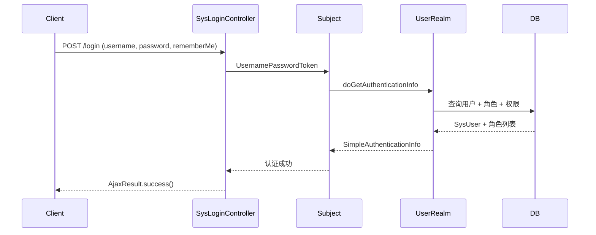

# API参考文档

**本文档中引用的文件**
- [SysUserController.java](../../../../ruoyi-admin/src/main/java/com/ruoyi/web/controller/system/SysUserController.java)
- [SysLoginController.java](../../../../ruoyi-admin/src/main/java/com/ruoyi/web/controller/system/SysLoginController.java)
- [SysRoleController.java](../../../../ruoyi-admin/src/main/java/com/ruoyi/web/controller/system/SysRoleController.java)
- [SysMenuController.java](../../../../ruoyi-admin/src/main/java/com/ruoyi/web/controller/system/SysMenuController.java)
- [SysDeptController.java](../../../../ruoyi-admin/src/main/java/com/ruoyi/web/controller/system/SysDeptController.java)
- [SysPostController.java](../../../../ruoyi-admin/src/main/java/com/ruoyi/web/controller/system/SysPostController.java)
- [SysConfigController.java](../../../../ruoyi-admin/src/main/java/com/ruoyi/web/controller/system/SysConfigController.java)
- [SysDictTypeController.java](../../../../ruoyi-admin/src/main/java/com/ruoyi/web/controller/system/SysDictTypeController.java)
- [SysDictDataController.java](../../../../ruoyi-admin/src/main/java/com/ruoyi/web/controller/system/SysDictDataController.java)
- [SysNoticeController.java](../../../../ruoyi-admin/src/main/java/com/ruoyi/web/controller/system/SysNoticeController.java)
- [SysProfileController.java](../../../../ruoyi-admin/src/main/java/com/ruoyi/web/controller/system/SysProfileController.java)
- [SysCaptchaController.java](../../../../ruoyi-admin/src/main/java/com/ruoyi/web/controller/system/SysCaptchaController.java)
- [SysRegisterController.java](../../../../ruoyi-admin/src/main/java/com/ruoyi/web/controller/system/SysRegisterController.java)
- [SysIndexController.java](../../../../ruoyi-admin/src/main/java/com/ruoyi/web/controller/system/SysIndexController.java)
- [CacheController.java](../../../../ruoyi-admin/src/main/java/com/ruoyi/web/controller/monitor/CacheController.java)
- [ServerController.java](../../../../ruoyi-admin/src/main/java/com/ruoyi/web/controller/monitor/ServerController.java)
- [SysOperlogController.java](../../../../ruoyi-admin/src/main/java/com/ruoyi/web/controller/monitor/SysOperlogController.java)
- [SysLogininforController.java](../../../../ruoyi-admin/src/main/java/com/ruoyi/web/controller/monitor/SysLogininforController.java)
- [SysUserOnlineController.java](../../../../ruoyi-admin/src/main/java/com/ruoyi/web/controller/monitor/SysUserOnlineController.java)
- [DruidController.java](../../../../ruoyi-admin/src/main/java/com/ruoyi/web/controller/monitor/DruidController.java)
- [CommonController.java](../../../../ruoyi-admin/src/main/java/com/ruoyi/web/controller/common/CommonController.java)
- [SwaggerController.java](../../../../ruoyi-admin/src/main/java/com/ruoyi/web/controller/tool/SwaggerController.java)
- [BuildController.java](../../../../ruoyi-admin/src/main/java/com/ruoyi/web/controller/tool/BuildController.java)
- [TestController.java](../../../../ruoyi-admin/src/main/java/com/ruoyi/web/controller/tool/TestController.java)
- [WorkEmployeeController.java](../../../../ruoyi-admin/src/main/java/com/ruoyi/web/controller/system/WorkEmployeeController.java)
- [WorkAssignmentController.java](../../../../ruoyi-admin/src/main/java/com/ruoyi/web/controller/system/WorkAssignmentController.java)
- [WorkJobController.java](../../../../ruoyi-admin/src/main/java/com/ruoyi/web/controller/system/WorkJobController.java)
- [WorkJobStageController.java](../../../../ruoyi-admin/src/main/java/com/ruoyi/web/controller/system/WorkJobStageController.java)
- [WorkLevelRuleController.java](../../../../ruoyi-admin/src/main/java/com/ruoyi/web/controller/system/WorkLevelRuleController.java)
- [WorkPositionTypeController.java](../../../../ruoyi-admin/src/main/java/com/ruoyi/web/controller/system/WorkPositionTypeController.java)
- [WorkProgressLogController.java](../../../../ruoyi-admin/src/main/java/com/ruoyi/web/controller/system/WorkProgressLogController.java)
- [WorkStageTemplateController.java](../../../../ruoyi-admin/src/main/java/com/ruoyi/web/controller/system/WorkStageTemplateController.java)
- [WorkTimesheetController.java](../../../../ruoyi-admin/src/main/java/com/ruoyi/web/controller/system/WorkTimesheetController.java)
- [AjaxResult.java](../../../../ruoyi-common/src/main/java/com/ruoyi/common/core/domain/AjaxResult.java)
- [BaseController.java](../../../../ruoyi-common/src/main/java/com/ruoyi/common/core/controller/BaseController.java)

## 目录
1. [简介](#简介)
2. [认证和授权](#认证和授权)
3. [系统管理 API](#系统管理-api)
4. [认证与账户 API](#认证与账户-api)
5. [监控 API](#监控-api)
6. [Work 管理 API](#work-管理-api)
7. [通用 API](#通用-api)
8. [工具 API](#工具-api)
9. [错误处理](#错误处理)

---

## 简介

RuoYi v4.8.3（Spring Boot 3.5.14 版）是一个基于 Spring Boot、Shiro、MyBatis 与 Thymeleaf 的权限管理系统。API 采用 RESTful 风格，通过 Shiro 框架实现认证与授权，统一返回 `AjaxResult`（`{code, msg, data}`）或 `TableDataInfo`（`{total, rows, code, msg}`）格式。

### 版本控制策略
- API 版本：v1（隐含，通过 URL 路径区分）
- URL 格式：`/module/resource/{id}`
- 内容协商：支持 JSON（`@ResponseBody`）与 Thymeleaf 视图（返回页面路径字符串）
- 缓存策略：EhCache（Shiro 授权缓存）、PageHelper（分页缓存）

### 基础配置
- 服务器端口：80
- 应用上下文路径：`/`
- 数据库连接池：Druid（初始化 5，最小 5，最大 20）
- 请求超时：由 Tomcat 默认处理
- 文件上传大小：10MB（单文件）

### API 模块概览

| 模块 | 路径前缀 | Controller 数量 | 子文档 |
|------|----------|----------------|--------|
| 系统管理 | `/system/*` | 9 | [系统管理API](./系统管理API.md) |
| 认证与账户 | `/login`, `/register`, `/captcha`, `/system/user/profile` | 4 | [认证与账户API](./认证与账户API.md) |
| 监控 | `/monitor/*` | 6 | [监控API](./监控API.md) |
| Work 管理 | `/system/work/*` | 9 | [Work管理API](./Work管理API.md) |
| 通用 | `/common/*` | 1 | [通用API](./通用API.md) |
| 工具 | `/tool/*`, `/test/*` | 3 | [工具API](./工具API.md) |

**章节来源**
- [BaseController.java](../../../../ruoyi-common/src/main/java/com/ruoyi/common/core/controller/BaseController.java)
- [AjaxResult.java](../../../../ruoyi-common/src/main/java/com/ruoyi/common/core/domain/AjaxResult.java)

---

## 认证和授权

### 认证机制

系统使用 **Apache Shiro** 进行认证。登录流程如下：



**图表来源**
- [SysLoginController.java](../../../../ruoyi-admin/src/main/java/com/ruoyi/web/controller/system/SysLoginController.java)

### 角色定义

| 角色 | 描述 | 权限范围 |
|------|------|----------|
| 管理员（admin） | 系统超级管理员 | 所有菜单和操作 |
| 普通角色 | 自定义角色 | 通过 `sys_role_menu` 配置的菜单权限 |

权限通过 `@RequiresPermissions("module:resource:action")` 注解在 Controller 方法上声明，Shiro 在方法调用前自动拦截校验。

### 数据权限

通过 `@DataScope(deptAlias = "d", userAlias = "u")` 注解实现，支持五种数据范围：

| 范围 | 说明 |
|------|------|
| 全部 | 可查看所有数据 |
| 自定义 | 仅限指定部门 |
| 本部门 | 仅限所属部门 |
| 本部门及以下 | 所属部门及其子部门 |
| 仅本人 | 仅限本人创建的数据 |

### 认证头部要求

页面端通过 Shiro Session 自动维护认证状态，Ajax 请求无需手动携带 Token。对于需要认证的 API，Shiro 在 Session 超时（默认 30 分钟）后自动跳转至登录页。若请求为 Ajax 方式，返回 JSON 字符串 `{"code":"1","msg":"未登录或登录超时。请重新登录"}`。

```http
Content-Type: application/x-www-form-urlencoded
```

**章节来源**
- [SysLoginController.java](../../../../ruoyi-admin/src/main/java/com/ruoyi/web/controller/system/SysLoginController.java)
- [SysIndexController.java](../../../../ruoyi-admin/src/main/java/com/ruoyi/web/controller/system/SysIndexController.java)

---

## 系统管理 API

系统管理模块提供用户、角色、菜单、部门、岗位、字典、参数、通知公告等核心业务的管理接口。

| 路径前缀 | Controller | 功能 |
|----------|-----------|------|
| `/system/user` | SysUserController | 用户管理（增删改查、导入导出、重置密码、状态变更、角色授权） |
| `/system/role` | SysRoleController | 角色管理（增删改查、数据权限、用户分配） |
| `/system/menu` | SysMenuController | 菜单管理（增删改查、角色菜单树） |
| `/system/dept` | SysDeptController | 部门管理（增删改查、部门树） |
| `/system/post` | SysPostController | 岗位管理（增删改查） |
| `/system/config` | SysConfigController | 参数配置（增删改查） |
| `/system/dict` | SysDictTypeController | 字典类型管理 |
| `/system/dict/data` | SysDictDataController | 字典数据管理 |
| `/system/notice` | SysNoticeController | 通知公告管理 |

详细接口请参阅 [系统管理API](./系统管理API.md)。

**章节来源**
- [SysUserController.java](../../../../ruoyi-admin/src/main/java/com/ruoyi/web/controller/system/SysUserController.java)
- [SysRoleController.java](../../../../ruoyi-admin/src/main/java/com/ruoyi/web/controller/system/SysRoleController.java)
- [SysMenuController.java](../../../../ruoyi-admin/src/main/java/com/ruoyi/web/controller/system/SysMenuController.java)
- [SysDeptController.java](../../../../ruoyi-admin/src/main/java/com/ruoyi/web/controller/system/SysDeptController.java)
- [SysPostController.java](../../../../ruoyi-admin/src/main/java/com/ruoyi/web/controller/system/SysPostController.java)
- [SysConfigController.java](../../../../ruoyi-admin/src/main/java/com/ruoyi/web/controller/system/SysConfigController.java)
- [SysDictTypeController.java](../../../../ruoyi-admin/src/main/java/com/ruoyi/web/controller/system/SysDictTypeController.java)
- [SysDictDataController.java](../../../../ruoyi-admin/src/main/java/com/ruoyi/web/controller/system/SysDictDataController.java)
- [SysNoticeController.java](../../../../ruoyi-admin/src/main/java/com/ruoyi/web/controller/system/SysNoticeController.java)

---

## 认证与账户 API

提供登录、注册、验证码、个人信息管理等接口。

| 路径 | Controller | 功能 |
|------|-----------|------|
| `GET/POST /login` | SysLoginController | 登录页面与登录验证 |
| `GET /index` | SysIndexController | 系统首页（菜单导航） |
| `GET /captcha/captchaImage` | SysCaptchaController | 生成验证码图片 |
| `POST /register` | SysRegisterController | 用户注册 |
| `/system/user/profile` | SysProfileController | 个人信息查看、修改、头像上传、密码修改 |

详细接口请参阅 [认证与账户API](./认证与账户API.md)。

**章节来源**
- [SysLoginController.java](../../../../ruoyi-admin/src/main/java/com/ruoyi/web/controller/system/SysLoginController.java)
- [SysCaptchaController.java](../../../../ruoyi-admin/src/main/java/com/ruoyi/web/controller/system/SysCaptchaController.java)
- [SysRegisterController.java](../../../../ruoyi-admin/src/main/java/com/ruoyi/web/controller/system/SysRegisterController.java)
- [SysProfileController.java](../../../../ruoyi-admin/src/main/java/com/ruoyi/web/controller/system/SysProfileController.java)

---

## 监控 API

提供系统监控相关接口，包括缓存、服务器信息、操作日志、登录日志、在线用户等。

| 路径前缀 | Controller | 功能 |
|----------|-----------|------|
| `/monitor/cache` | CacheController | 缓存监控（查看缓存名称、键值、清理缓存） |
| `/monitor/server` | ServerController | 服务器监控（CPU、内存、磁盘、JVM 信息） |
| `/monitor/operlog` | SysOperlogController | 操作日志查询与删除 |
| `/monitor/logininfor` | SysLogininforController | 登录日志查询与删除 |
| `/monitor/online` | SysUserOnlineController | 在线用户监控与强退 |
| `/monitor/data` | DruidController | Druid 数据源监控页面 |

详细接口请参阅 [监控API](./监控API.md)。

**章节来源**
- [CacheController.java](../../../../ruoyi-admin/src/main/java/com/ruoyi/web/controller/monitor/CacheController.java)
- [ServerController.java](../../../../ruoyi-admin/src/main/java/com/ruoyi/web/controller/monitor/ServerController.java)
- [SysOperlogController.java](../../../../ruoyi-admin/src/main/java/com/ruoyi/web/controller/monitor/SysOperlogController.java)
- [SysLogininforController.java](../../../../ruoyi-admin/src/main/java/com/ruoyi/web/controller/monitor/SysLogininforController.java)
- [SysUserOnlineController.java](../../../../ruoyi-admin/src/main/java/com/ruoyi/web/controller/monitor/SysUserOnlineController.java)
- [DruidController.java](../../../../ruoyi-admin/src/main/java/com/ruoyi/web/controller/monitor/DruidController.java)

---

## Work 管理 API

Work 管理模块是业务扩展模块，提供员工、任务、分配、工时、进度等业务管理接口。

| 路径前缀 | Controller | 功能 |
|----------|-----------|------|
| `/system/work/employee` | WorkEmployeeController | 员工管理（增删改查、空闲员工查询、按职能检索） |
| `/system/work/assignment` | WorkAssignmentController | 任务分配管理 |
| `/system/work/job` | WorkJobController | 工单/任务管理 |
| `/system/work/jobStage` | WorkJobStageController | 工单阶段管理 |
| `/system/work/levelRule` | WorkLevelRuleController | 级别规则管理 |
| `/system/work/positionType` | WorkPositionTypeController | 职能类型管理 |
| `/system/work/progressLog` | WorkProgressLogController | 进度日志管理 |
| `/system/work/stageTemplate` | WorkStageTemplateController | 阶段模板管理 |
| `/system/work/timesheet` | WorkTimesheetController | 工时表管理 |

详细接口请参阅 [Work管理API](./Work管理API.md)。

**章节来源**
- [WorkEmployeeController.java](../../../../ruoyi-admin/src/main/java/com/ruoyi/web/controller/system/WorkEmployeeController.java)
- [WorkAssignmentController.java](../../../../ruoyi-admin/src/main/java/com/ruoyi/web/controller/system/WorkAssignmentController.java)
- [WorkJobController.java](../../../../ruoyi-admin/src/main/java/com/ruoyi/web/controller/system/WorkJobController.java)
- [WorkJobStageController.java](../../../../ruoyi-admin/src/main/java/com/ruoyi/web/controller/system/WorkJobStageController.java)
- [WorkLevelRuleController.java](../../../../ruoyi-admin/src/main/java/com/ruoyi/web/controller/system/WorkLevelRuleController.java)
- [WorkPositionTypeController.java](../../../../ruoyi-admin/src/main/java/com/ruoyi/web/controller/system/WorkPositionTypeController.java)
- [WorkProgressLogController.java](../../../../ruoyi-admin/src/main/java/com/ruoyi/web/controller/system/WorkProgressLogController.java)
- [WorkStageTemplateController.java](../../../../ruoyi-admin/src/main/java/com/ruoyi/web/controller/system/WorkStageTemplateController.java)
- [WorkTimesheetController.java](../../../../ruoyi-admin/src/main/java/com/ruoyi/web/controller/system/WorkTimesheetController.java)

---

## 通用 API

通用模块提供文件上传和下载接口。

| 路径 | Controller | 功能 |
|------|-----------|------|
| `GET /common/download` | CommonController | 通用文件下载（支持删除源文件） |
| `POST /common/upload` | CommonController | 单文件上传（返回 URL、文件名等信息） |
| `POST /common/uploads` | CommonController | 多文件上传 |
| `GET /common/download/resource` | CommonController | 本地资源文件下载 |

详细接口请参阅 [通用API](./通用API.md)。

**章节来源**
- [CommonController.java](../../../../ruoyi-admin/src/main/java/com/ruoyi/web/controller/common/CommonController.java)

---

## 工具 API

工具模块提供 Swagger 文档、代码生成和测试接口。

| 路径 | Controller | 功能 |
|------|-----------|------|
| `GET /tool/swagger` | SwaggerController | 跳转 Swagger UI 文档页面 |
| `/tool/build` | BuildController | 代码生成构建工具 |
| `/test/user` | TestController | 用户测试接口 |

详细接口请参阅 [工具API](./工具API.md)。

**章节来源**
- [SwaggerController.java](../../../../ruoyi-admin/src/main/java/com/ruoyi/web/controller/tool/SwaggerController.java)
- [BuildController.java](../../../../ruoyi-admin/src/main/java/com/ruoyi/web/controller/tool/BuildController.java)
- [TestController.java](../../../../ruoyi-admin/src/main/java/com/ruoyi/web/controller/tool/TestController.java)

---

## 错误处理

### HTTP 状态码

| 状态码 | 含义 | 使用场景 |
|--------|------|----------|
| 200 | OK | 请求成功 |
| 301 | WARN | 业务警告（AjaxResult 内部状态码） |
| 400 | Bad Request | 请求参数错误（参数校验失败） |
| 401 | Unauthorized | 未认证或会话超时 |
| 403 | Forbidden | 权限不足（@RequiresPermissions 校验失败） |
| 404 | Not Found | 资源不存在 |
| 500 | Internal Server Error | 服务器内部错误 |

### 统一响应格式

**成功响应：**
```json
{
  "code": 0,
  "msg": "操作成功",
  "data": {}
}
```

**错误响应：**
```json
{
  "code": 500,
  "msg": "错误描述信息",
  "data": null
}
```

### 常见错误类型

#### 未登录或会话超时
Ajax 请求返回 JSON 字符串：
```json
{"code":"1","msg":"未登录或登录超时。请重新登录"}
```

#### 权限不足
Shiro 抛出 `AuthorizationException`，全局异常处理器根据请求类型处理：
- 页面请求：跳转至 `error/unauth` 页面
- Ajax 请求：返回 `AjaxResult.error("权限不足")`

#### 演示模式限制
当 `demoEnabled=true` 时，所有写操作（POST/PUT/DELETE）抛出 `DemoModeException`，返回提示信息。

#### 参数校验失败
使用 `@Validated` 注解的参数校验失败时，返回 400 状态码及字段错误信息。

**章节来源**
- [SysLoginController.java](../../../../ruoyi-admin/src/main/java/com/ruoyi/web/controller/system/SysLoginController.java)(L40-L47)
- [AjaxResult.java](../../../../ruoyi-common/src/main/java/com/ruoyi/common/core/domain/AjaxResult.java)