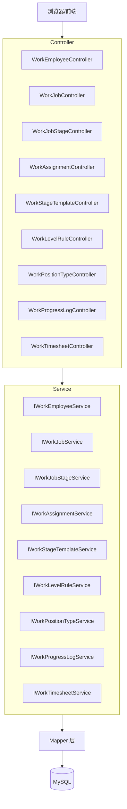
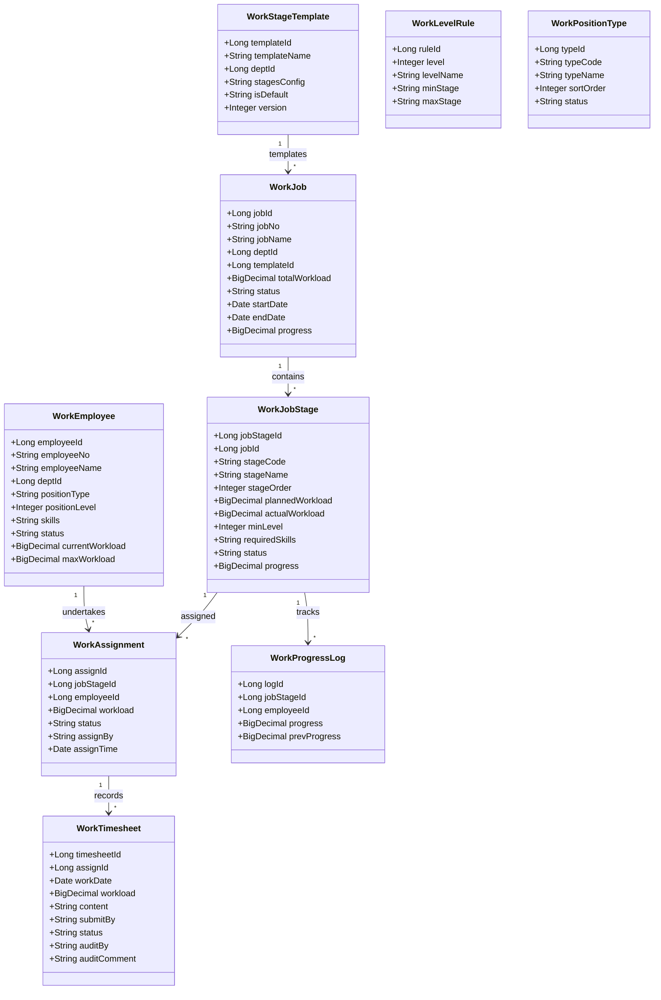
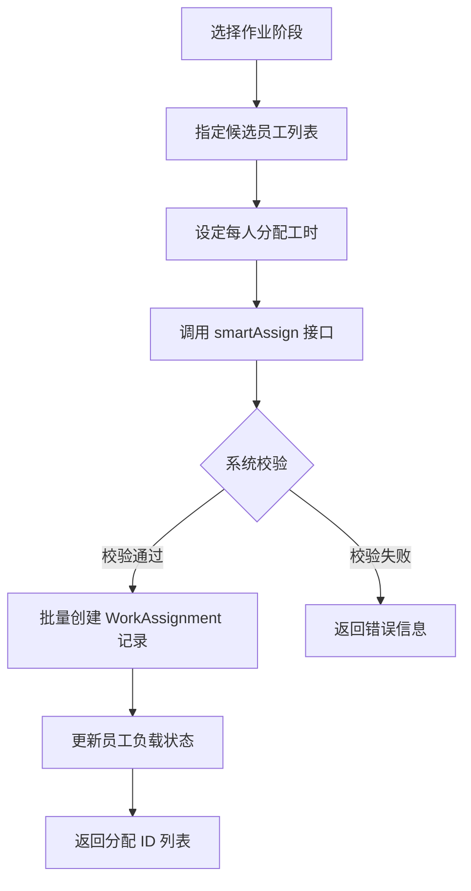

# Work 管理 API

**本文档中引用的文件**
- [WorkEmployeeController.java](../../../src/main/java/com/ruoyi/web/controller/system/WorkEmployeeController.java)
- [WorkAssignmentController.java](../../../src/main/java/com/ruoyi/web/controller/system/WorkAssignmentController.java)
- [WorkJobController.java](../../../src/main/java/com/ruoyi/web/controller/system/WorkJobController.java)
- [WorkJobStageController.java](../../../src/main/java/com/ruoyi/web/controller/system/WorkJobStageController.java)
- [WorkLevelRuleController.java](../../../src/main/java/com/ruoyi/web/controller/system/WorkLevelRuleController.java)
- [WorkPositionTypeController.java](../../../src/main/java/com/ruoyi/web/controller/system/WorkPositionTypeController.java)
- [WorkProgressLogController.java](../../../src/main/java/com/ruoyi/web/controller/system/WorkProgressLogController.java)
- [WorkStageTemplateController.java](../../../src/main/java/com/ruoyi/web/controller/system/WorkStageTemplateController.java)
- [WorkTimesheetController.java](../../../src/main/java/com/ruoyi/web/controller/system/WorkTimesheetController.java)
- [WorkEmployee.java](../../../ruoyi-system/src/main/java/com/ruoyi/system/work/domain/WorkEmployee.java)
- [WorkAssignment.java](../../../ruoyi-system/src/main/java/com/ruoyi/system/work/domain/WorkAssignment.java)
- [WorkJob.java](../../../ruoyi-system/src/main/java/com/ruoyi/system/work/domain/WorkJob.java)
- [WorkJobStage.java](../../../ruoyi-system/src/main/java/com/ruoyi/system/work/domain/WorkJobStage.java)
- [WorkLevelRule.java](../../../ruoyi-system/src/main/java/com/ruoyi/system/work/domain/WorkLevelRule.java)
- [WorkPositionType.java](../../../ruoyi-system/src/main/java/com/ruoyi/system/work/domain/WorkPositionType.java)
- [WorkProgressLog.java](../../../ruoyi-system/src/main/java/com/ruoyi/system/work/domain/WorkProgressLog.java)
- [WorkStageTemplate.java](../../../ruoyi-system/src/main/java/com/ruoyi/system/work/domain/WorkStageTemplate.java)
- [WorkTimesheet.java](../../../ruoyi-system/src/main/java/com/ruoyi/system/work/domain/WorkTimesheet.java)

## 目录
1. [简介](#简介)
2. [项目架构概览](#项目架构概览)
3. [核心数据模型](#核心数据模型)
4. [API端点](#api端点)
5. [智能分配](#智能分配)
6. [权限控制与角色管理](#权限控制与角色管理)
7. [错误处理与异常管理](#错误处理与异常管理)
8. [总结](#总结)

## 简介

- **系统描述**: Work 管理模块是 RuoYi-Vue 平台的作业管理扩展，提供从作业创建、阶段拆分、员工分配到工时审核的全流程管理能力，支撑团队协作与项目进度跟踪。
- **核心功能**: 员工管理、作业管理、作业阶段管理、作业分配（含智能分配）、阶段模板管理、级别规则管理、职能类型管理、进度日志、工时记录与审核。
- **技术架构**: 基于 Spring Boot 3 + Shiro + MyBatis 的经典分层架构，Controller 层（ruoyi-admin）→ Service 层（ruoyi-system/work）→ Mapper/XML → MySQL。
- **用户角色**: 项目经理（创建作业、分配任务）、团队负责人（审核工时）、普通员工（提交进度与工时）。

## 项目架构概览



**图表来源**
- [WorkEmployeeController.java](../../../src/main/java/com/ruoyi/web/controller/system/WorkEmployeeController.java)
- [WorkJobController.java](../../../src/main/java/com/ruoyi/web/controller/system/WorkJobController.java)
- [WorkAssignmentController.java](../../../src/main/java/com/ruoyi/web/controller/system/WorkAssignmentController.java)

## 核心数据模型



**章节来源**
- [WorkJob.java](../../../ruoyi-system/src/main/java/com/ruoyi/system/work/domain/WorkJob.java)
- [WorkJobStage.java](../../../ruoyi-system/src/main/java/com/ruoyi/system/work/domain/WorkJobStage.java)
- [WorkAssignment.java](../../../ruoyi-system/src/main/java/com/ruoyi/system/work/domain/WorkAssignment.java)
- [WorkEmployee.java](../../../ruoyi-system/src/main/java/com/ruoyi/system/work/domain/WorkEmployee.java)
- [WorkTimesheet.java](../../../ruoyi-system/src/main/java/com/ruoyi/system/work/domain/WorkTimesheet.java)
- [WorkProgressLog.java](../../../ruoyi-system/src/main/java/com/ruoyi/system/work/domain/WorkProgressLog.java)
- [WorkStageTemplate.java](../../../ruoyi-system/src/main/java/com/ruoyi/system/work/domain/WorkStageTemplate.java)
- [WorkLevelRule.java](../../../ruoyi-system/src/main/java/com/ruoyi/system/work/domain/WorkLevelRule.java)
- [WorkPositionType.java](../../../ruoyi-system/src/main/java/com/ruoyi/system/work/domain/WorkPositionType.java)

### 关键属性说明

| 实体 | 字段 | 说明 |
|------|------|------|
| WorkJob | status | 0=未开始, 1=进行中, 2=已完成, 3=已取消 |
| WorkJob | progress | 整体进度百分比 (0-100) |
| WorkJobStage | status | 0=未开始, 1=进行中, 2=已完成 |
| WorkJobStage | minLevel | 最低级别要求，关联 WorkLevelRule.level |
| WorkAssignment | status | 0=进行中, 1=已完成, 2=已取消 |
| WorkEmployee | status | 0=空闲, 1=工作中, 2=过载 |
| WorkEmployee | positionLevel | 职级 1-10，关联 WorkLevelRule |
| WorkTimesheet | status | 0=草稿, 1=已提交, 2=已审核, 3=已驳回 |
| WorkStageTemplate | isDefault | 0=否, 1=是 |
| WorkPositionType | status | 0=正常, 1=停用 |

## API端点

### 员工管理 `/system/work/employee`

| HTTP方法 | 路径 | 权限 | 说明 |
|----------|------|------|------|
| GET | /system/work/employee | system:work:employee:view | 员工列表页面 |
| POST | /system/work/employee/list | system:work:employee:list | 分页查询员工列表 |
| POST | /system/work/employee/export | system:work:employee:export | 导出员工Excel |
| POST | /system/work/employee/remove | system:work:employee:remove | 批量删除员工 |
| GET | /system/work/employee/add | system:work:employee:add | 新增员工页面 |
| POST | /system/work/employee/add | system:work:employee:add | 保存新增员工 |
| GET | /system/work/employee/edit/{employeeId} | system:work:employee:edit | 修改员工页面 |
| POST | /system/work/employee/edit | system:work:employee:edit | 保存修改员工 |
| POST | /system/work/employee/idle/list | system:work:employee:list | 查询空闲员工列表 |
| POST | /system/work/employee/position/list | system:work:employee:list | 按职能和级别查询员工 |
| POST | /system/work/employee/checkEmployeeNoUnique | — | 校验员工工号唯一性 |

**章节来源**
- [WorkEmployeeController.java](../../../src/main/java/com/ruoyi/web/controller/system/WorkEmployeeController.java)

### 作业管理 `/system/work/job`

| HTTP方法 | 路径 | 权限 | 说明 |
|----------|------|------|------|
| GET | /system/work/job | system:work:job:view | 作业列表页面 |
| POST | /system/work/job/list | system:work:job:list | 分页查询作业列表 |
| GET | /system/work/job/list/all | system:work:job:list | 查询所有作业 |
| GET | /system/work/job/list/byDept/{deptId} | system:work:job:list | 按部门查询作业 |
| POST | /system/work/job/remove | system:work:job:remove | 批量删除作业 |
| GET | /system/work/job/add | system:work:job:add | 新增作业页面 |
| POST | /system/work/job/add | system:work:job:add | 保存新增作业 |
| GET | /system/work/job/edit/{jobId} | system:work:job:edit | 修改作业页面 |
| POST | /system/work/job/edit | system:work:job:edit | 保存修改作业 |
| GET | /system/work/job/detail/{jobId} | system:work:job:query | 查看作业详情 |
| POST | /system/work/job/updateProgress | system:work:job:edit | 更新作业进度 |
| POST | /system/work/job/updateStatus | system:work:job:edit | 更新作业状态 |
| POST | /system/work/job/checkJobNoUnique | — | 校验作业编号唯一性 |
| GET | /system/work/job/generateJobNo/{deptId} | system:work:job:add | 生成作业编号 |

**章节来源**
- [WorkJobController.java](../../../src/main/java/com/ruoyi/web/controller/system/WorkJobController.java)

### 作业阶段 `/system/work/jobStage`

| HTTP方法 | 路径 | 权限 | 说明 |
|----------|------|------|------|
| GET | /system/work/jobStage | system:work:jobStage:view | 作业阶段列表页面 |
| POST | /system/work/jobStage/list | system:work:jobStage:list | 分页查询阶段列表 |
| GET | /system/work/jobStage/list/byJob/{jobId} | system:work:jobStage:list | 按作业查询阶段 |
| GET | /system/work/jobStage/list/toAssign | system:work:jobStage:list | 查询待分配阶段 |
| POST | /system/work/jobStage/remove | system:work:jobStage:remove | 批量删除阶段 |
| GET | /system/work/jobStage/add | system:work:jobStage:add | 新增阶段页面 |
| POST | /system/work/jobStage/add | system:work:jobStage:add | 保存新增阶段 |
| GET | /system/work/jobStage/edit/{jobStageId} | system:work:jobStage:edit | 修改阶段页面 |
| POST | /system/work/jobStage/edit | system:work:jobStage:edit | 保存修改阶段 |
| GET | /system/work/jobStage/detail/{jobStageId} | system:work:jobStage:query | 查看阶段详情 |
| POST | /system/work/jobStage/updateStatus | system:work:jobStage:edit | 更新阶段状态 |
| GET | /system/work/jobStage/canStart/{jobStageId} | system:work:jobStage:query | 检查阶段是否可开始 |
| POST | /system/work/jobStage/start/{jobStageId} | system:work:jobStage:edit | 开始作业阶段 |
| POST | /system/work/jobStage/complete/{jobStageId} | system:work:jobStage:edit | 完成作业阶段 |

**章节来源**
- [WorkJobStageController.java](../../../src/main/java/com/ruoyi/web/controller/system/WorkJobStageController.java)

### 作业分配 `/system/work/assignment`

| HTTP方法 | 路径 | 权限 | 说明 |
|----------|------|------|------|
| GET | /system/work/assignment | system:work:assignment:view | 分配列表页面 |
| POST | /system/work/assignment/list | system:work:assignment:list | 分页查询分配列表 |
| GET | /system/work/assignment/list/byJobStage/{jobStageId} | system:work:assignment:list | 按阶段查询分配 |
| GET | /system/work/assignment/list/byEmployee/{employeeId} | system:work:assignment:list | 按员工查询分配 |
| GET | /system/work/assignment/list/pending/{employeeId} | system:work:assignment:list | 查询员工待处理分配 |
| POST | /system/work/assignment/remove | system:work:assignment:remove | 批量删除分配 |
| GET | /system/work/assignment/add | system:work:assignment:add | 新增分配页面 |
| POST | /system/work/assignment/add | system:work:assignment:add | 保存新增分配 |
| GET | /system/work/assignment/edit/{assignId} | system:work:assignment:edit | 修改分配页面 |
| POST | /system/work/assignment/edit | system:work:assignment:edit | 保存修改分配 |
| GET | /system/work/assignment/detail/{assignId} | system:work:assignment:query | 查看分配详情 |
| POST | /system/work/assignment/updateStatus | system:work:assignment:edit | 更新分配状态 |
| POST | /system/work/assignment/cancel/{assignId} | system:work:assignment:edit | 取消分配 |
| POST | /system/work/assignment/smartAssign | system:work:assignment:add | 智能分配 |
| GET | /system/work/assignment/employeeWorkload/{employeeId} | system:work:assignment:query | 获取员工负载情况 |

**章节来源**
- [WorkAssignmentController.java](../../../src/main/java/com/ruoyi/web/controller/system/WorkAssignmentController.java)

### 阶段模板 `/system/work/stageTemplate`

| HTTP方法 | 路径 | 权限 | 说明 |
|----------|------|------|------|
| GET | /system/work/stageTemplate | system:work:stageTemplate:view | 模板列表页面 |
| POST | /system/work/stageTemplate/list | system:work:stageTemplate:list | 分页查询模板列表 |
| POST | /system/work/stageTemplate/remove | system:work:stageTemplate:remove | 批量删除模板 |
| GET | /system/work/stageTemplate/add | system:work:stageTemplate:add | 新增模板页面 |
| POST | /system/work/stageTemplate/add | system:work:stageTemplate:add | 保存新增模板 |
| GET | /system/work/stageTemplate/edit/{templateId} | system:work:stageTemplate:edit | 修改模板页面 |
| POST | /system/work/stageTemplate/edit | system:work:stageTemplate:edit | 保存修改模板 |
| POST | /system/work/stageTemplate/copy/{templateId} | system:work:stageTemplate:add | 复制模板 |
| POST | /system/work/stageTemplate/setDefault/{templateId} | system:work:stageTemplate:edit | 设为默认模板 |
| GET | /system/work/stageTemplate/list/all | system:work:stageTemplate:list | 查询所有模板 |
| GET | /system/work/stageTemplate/list/byDept/{deptId} | system:work:stageTemplate:list | 按部门查询模板 |
| GET | /system/work/stageTemplate/default | system:work:stageTemplate:list | 查询默认模板 |
| POST | /system/work/stageTemplate/checkTemplateNameUnique | — | 校验模板名称唯一性 |

**章节来源**
- [WorkStageTemplateController.java](../../../src/main/java/com/ruoyi/web/controller/system/WorkStageTemplateController.java)

### 级别规则 `/system/work/levelRule`

| HTTP方法 | 路径 | 权限 | 说明 |
|----------|------|------|------|
| GET | /system/work/levelRule | system:work:levelRule:view | 级别规则列表页面 |
| POST | /system/work/levelRule/list | system:work:levelRule:list | 分页查询级别规则 |
| POST | /system/work/levelRule/remove | system:work:levelRule:remove | 批量删除级别规则 |
| GET | /system/work/levelRule/add | system:work:levelRule:add | 新增级别规则页面 |
| POST | /system/work/levelRule/add | system:work:levelRule:add | 保存新增级别规则 |
| GET | /system/work/levelRule/edit/{ruleId} | system:work:levelRule:edit | 修改级别规则页面 |
| POST | /system/work/levelRule/edit | system:work:levelRule:edit | 保存修改级别规则 |
| GET | /system/work/levelRule/list/all | system:work:levelRule:list | 查询所有级别规则 |
| GET | /system/work/levelRule/stageRange/{level} | system:work:levelRule:list | 根据职级获取可执行阶段范围 |
| POST | /system/work/levelRule/checkLevelUnique | — | 校验职级唯一性 |

**章节来源**
- [WorkLevelRuleController.java](../../../src/main/java/com/ruoyi/web/controller/system/WorkLevelRuleController.java)

### 职能类型 `/system/work/positionType`

| HTTP方法 | 路径 | 权限 | 说明 |
|----------|------|------|------|
| GET | /system/work/positionType | system:work:positionType:view | 职能类型列表页面 |
| POST | /system/work/positionType/list | system:work:positionType:list | 分页查询职能类型 |
| POST | /system/work/positionType/remove | system:work:positionType:remove | 批量删除职能类型 |
| GET | /system/work/positionType/add | system:work:positionType:add | 新增职能类型页面 |
| POST | /system/work/positionType/add | system:work:positionType:add | 保存新增职能类型 |
| GET | /system/work/positionType/edit/{typeId} | system:work:positionType:edit | 修改职能类型页面 |
| POST | /system/work/positionType/edit | system:work:positionType:edit | 保存修改职能类型 |
| GET | /system/work/positionType/list/all | system:work:positionType:list | 查询所有职能类型 |
| POST | /system/work/positionType/checkTypeCodeUnique | — | 校验类型编码唯一性 |

**章节来源**
- [WorkPositionTypeController.java](../../../src/main/java/com/ruoyi/web/controller/system/WorkPositionTypeController.java)

### 进度日志 `/system/work/progressLog`

| HTTP方法 | 路径 | 权限 | 说明 |
|----------|------|------|------|
| GET | /system/work/progressLog | system:work:progressLog:view | 进度日志列表页面 |
| POST | /system/work/progressLog/list | system:work:progressLog:list | 分页查询进度日志 |
| GET | /system/work/progressLog/list/byJobStage/{jobStageId} | system:work:progressLog:list | 按阶段查询进度日志 |
| GET | /system/work/progressLog/list/byEmployee/{employeeId} | system:work:progressLog:list | 按员工查询进度日志 |
| POST | /system/work/progressLog/remove | system:work:progressLog:remove | 批量删除进度日志 |
| GET | /system/work/progressLog/add | system:work:progressLog:add | 新增进度日志页面 |
| POST | /system/work/progressLog/add | system:work:progressLog:add | 保存新增进度日志 |
| GET | /system/work/progressLog/detail/{logId} | system:work:progressLog:query | 查看进度日志详情 |
| POST | /system/work/progressLog/record | system:work:progressLog:add | 记录进度更新 |
| GET | /system/work/progressLog/latest/{jobStageId} | system:work:progressLog:query | 查询阶段最新进度 |

**章节来源**
- [WorkProgressLogController.java](../../../src/main/java/com/ruoyi/web/controller/system/WorkProgressLogController.java)

### 工时记录 `/system/work/timesheet`

| HTTP方法 | 路径 | 权限 | 说明 |
|----------|------|------|------|
| GET | /system/work/timesheet | system:work:timesheet:view | 工时记录列表页面 |
| POST | /system/work/timesheet/list | system:work:timesheet:list | 分页查询工时记录 |
| GET | /system/work/timesheet/list/byAssign/{assignId} | system:work:timesheet:list | 按分配查询工时 |
| GET | /system/work/timesheet/list/byEmployee/{employeeId} | system:work:timesheet:list | 按员工查询工时 |
| GET | /system/work/timesheet/list/byDateRange | system:work:timesheet:list | 按日期范围查询工时 |
| POST | /system/work/timesheet/remove | system:work:timesheet:remove | 批量删除工时记录 |
| GET | /system/work/timesheet/add | system:work:timesheet:add | 新增工时记录页面 |
| POST | /system/work/timesheet/add | system:work:timesheet:add | 保存新增工时记录 |
| GET | /system/work/timesheet/edit/{timesheetId} | system:work:timesheet:edit | 修改工时记录页面 |
| POST | /system/work/timesheet/edit | system:work:timesheet:edit | 保存修改工时记录 |
| GET | /system/work/timesheet/detail/{timesheetId} | system:work:timesheet:query | 查看工时记录详情 |
| POST | /system/work/timesheet/submit/{timesheetId} | system:work:timesheet:edit | 提交工时记录 |
| POST | /system/work/timesheet/approve/{timesheetId} | system:work:timesheet:edit | 审核通过工时 |
| POST | /system/work/timesheet/reject/{timesheetId} | system:work:timesheet:edit | 审核驳回工时 |
| GET | /system/work/timesheet/summary/{employeeId} | system:work:timesheet:query | 统计员工工时 |

**章节来源**
- [WorkTimesheetController.java](../../../src/main/java/com/ruoyi/web/controller/system/WorkTimesheetController.java)

## 智能分配

智能分配是 Work 模块的核心业务功能，支持根据员工职能、级别和负载情况自动将作业阶段分配给合适的员工。



**关键接口**:

- `POST /system/work/assignment/smartAssign` — 智能分配
  - 参数: `jobStageId` (作业阶段ID), `employeeIds` (员工ID列表), `workloadPerEmployee` (每人分配工时)
  - 返回: 分配成功的 assignId 列表

- `GET /system/work/assignment/employeeWorkload/{employeeId}` — 获取员工负载
  - 返回: 员工信息、当前负载、已完成负载、最大容量、可用负载、负载率

- `POST /system/work/employee/idle/list` — 查询空闲员工
  - 参数: `positionType` (职能类型), `minLevel` (最低级别)
  - 用于筛选可分配的员工

**章节来源**
- [WorkAssignmentController.java](../../../src/main/java/com/ruoyi/web/controller/system/WorkAssignmentController.java)(L187-L226)
- [WorkEmployeeController.java](../../../src/main/java/com/ruoyi/web/controller/system/WorkEmployeeController.java)(L131-L151)

## 权限控制与角色管理

所有 Work API 均通过 Shiro `@RequiresPermissions` 注解进行权限控制，权限标识遵循 `system:work:{模块}:{操作}` 的命名规范。

### 权限矩阵

| 模块 | view | list | add | edit | remove | export | query |
|------|------|------|-----|------|--------|--------|-------|
| employee | ✓ | ✓ | ✓ | ✓ | ✓ | ✓ | — |
| job | ✓ | ✓ | ✓ | ✓ | ✓ | — | ✓ |
| jobStage | ✓ | ✓ | ✓ | ✓ | ✓ | — | ✓ |
| assignment | ✓ | ✓ | ✓ | ✓ | ✓ | — | ✓ |
| stageTemplate | ✓ | ✓ | ✓ | ✓ | ✓ | — | — |
| levelRule | ✓ | ✓ | ✓ | ✓ | ✓ | — | — |
| positionType | ✓ | ✓ | ✓ | ✓ | ✓ | — | — |
| progressLog | ✓ | ✓ | ✓ | — | ✓ | — | ✓ |
| timesheet | ✓ | ✓ | ✓ | ✓ | ✓ | — | ✓ |

### 权限验证流程

```mermaid
flowchart TD
    A[请求到达] --> B{Shiro 过滤链}
    B -->|未认证| C[重定向登录页]
    B -->|已认证| D{RequiresPermissions}
    D -->|无权限| E[返回 403]
    D -->|有权限| F[执行 Controller 方法]
    F --> G{写操作?}
    G -->|是| H[@Log 异步记录操作日志]
    G -->|否| I[直接返回结果]
    H --> I
```

**章节来源**
- [WorkEmployeeController.java](../../../src/main/java/com/ruoyi/web/controller/system/WorkEmployeeController.java)
- [WorkAssignmentController.java](../../../src/main/java/com/ruoyi/web/controller/system/WorkAssignmentController.java)

## 错误处理与异常管理

### 业务校验错误

| 场景 | 触发条件 | 错误消息 |
|------|----------|----------|
| 员工工号重复 | 新增/修改员工时工号已存在 | 新增/修改员工'{name}'失败，工号已存在 |
| 作业编号重复 | 新增/修改作业时编号已存在 | 新增/修改作业'{name}'失败，作业编号已存在 |
| 级别规则重复 | 新增/修改级别规则时职级已存在 | 新增/修改级别规则失败，职级 P{n}已存在 |
| 职能类型编码重复 | 新增/修改职能类型时编码已存在 | 新增/修改职能类型'{name}'失败，类型编码已存在 |
| 模板名称重复 | 新增/修改模板时名称已存在 | 新增/修改模板'{name}'失败，模板名称已存在 |
| 进度范围无效 | 更新作业进度不在 0-100 | 进度必须在 0-100 之间 |
| 前置阶段未完成 | 开始阶段时前置阶段未完成 | 前置阶段未完成，无法开始此阶段 |
| 员工不存在 | 查询员工负载时员工ID无效 | 员工不存在 |

### 错误响应格式

```json
{
  "code": 500,
  "msg": "新增员工'张三'失败，工号已存在",
  "data": null
}
```

### 唯一性校验端点

以下端点无需权限即可调用，用于前端实时校验：

| 端点 | 参数 | 返回 |
|------|------|------|
| POST /system/work/employee/checkEmployeeNoUnique | employeeNo, employeeId | boolean |
| POST /system/work/job/checkJobNoUnique | jobNo, jobId | boolean |
| POST /system/work/levelRule/checkLevelUnique | level, ruleId | boolean |
| POST /system/work/positionType/checkTypeCodeUnique | typeCode, typeId | boolean |
| POST /system/work/stageTemplate/checkTemplateNameUnique | templateName, templateId | boolean |

## 总结

- **主要特点**:
  1. 覆盖作业全生命周期：从模板创建 → 作业建立 → 阶段拆分 → 员工分配 → 进度跟踪 → 工时审核
  2. 智能分配机制：基于员工职能、级别和负载自动匹配最优分配方案
  3. 级别规则控制：通过 WorkLevelRule 约束不同职级可执行的阶段范围
  4. 工时审核流程：草稿 → 提交 → 审核(通过/驳回) 的完整审批链路
  5. 阶段前置依赖：作业阶段支持顺序控制，前置阶段未完成时禁止开始后续阶段

- **技术亮点**:
  1. 统一权限模型：所有 API 遵循 `system:work:{模块}:{操作}` 权限标识规范
  2. 操作日志审计：写操作通过 `@Log` 注解由 AsyncManager 异步记录
  3. Excel 导出：基于 `@Excel` 注解声明式导出，支持字段类型和字典转换
  4. 参数校验：使用 JSR-303 `@Validated` + `@NotBlank/@NotNull/@Size` 等注解
  5. 唯一性校验：前后端双重校验，前端实时调用 checkXxxUnique 端点

- **业务价值**: 为团队提供结构化的作业管理能力，通过阶段模板标准化作业流程，通过智能分配优化人力资源配置，通过工时审核保障数据准确性。
