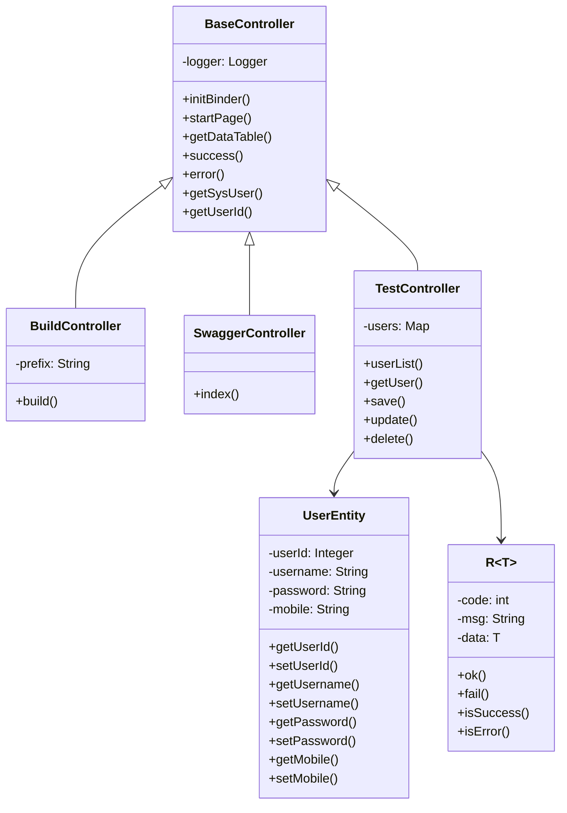

# 工具 API

**本文档中引用的文件**
- [BuildController.java](../../../../ruoyi-admin/src/main/java/com/ruoyi/web/controller/tool/BuildController.java)
- [SwaggerController.java](../../../../ruoyi-admin/src/main/java/com/ruoyi/web/controller/tool/SwaggerController.java)
- [TestController.java](../../../../ruoyi-admin/src/main/java/com/ruoyi/web/controller/tool/TestController.java)
- [BaseController.java](../../../../ruoyi-common/src/main/java/com/ruoyi/common/core/controller/BaseController.java)
- [R.java](../../../../ruoyi-common/src/main/java/com/ruoyi/common/core/domain/R.java)

## 目录
1. [简介](#简介)
2. [项目架构概览](#项目架构概览)
3. [核心数据模型](#核心数据模型)
4. [API 端点](#api 端点)
5. [表单构建功能](#表单构建功能)
6. [Swagger 文档集成](#swagger 文档集成)
7. [权限控制与角色管理](#权限控制与角色管理)
8. [错误处理与异常管理](#错误处理与异常管理)
9. [总结](#总结)

## 简介

- **系统描述**: 工具 API 模块提供系统开发辅助工具，包括表单构建器、Swagger API 文档集成以及测试接口。该模块主要用于支持开发人员进行快速原型设计和 API 调试。
- **核心功能**: 
  - 表单构建器：可视化表单设计工具
  - Swagger 集成：自动生成 API 文档
  - 测试接口：提供用户 CRUD 操作的示例接口
- **技术架构**: 基于 Spring Boot + Shiro 的分层架构，继承自 `BaseController` 基类，使用 `R<T>` 统一响应格式
- **用户角色**: 主要面向系统管理员和开发人员，需要相应权限才能访问

## 项目架构概览

```mermaid
graph TB
    A[客户端层] --> B[API 网关层]
    B --> C[工具 Controller 层]
    C --> D[BaseController 基类]
    D --> E[业务服务层]
    E --> F[数据访问层]
    
    C --> G[表单构建器]
    C --> H[Swagger 文档]
    C --> I[测试接口]
    
    G --> J[/tool/build]
    H --> K[/tool/swagger]
    I --> L[/test/user]
```

**图表来源**
- [BuildController.java](../../../../ruoyi-admin/src/main/java/com/ruoyi/web/controller/tool/BuildController.java)
- [SwaggerController.java](../../../../ruoyi-admin/src/main/java/com/ruoyi/web/controller/tool/SwaggerController.java)
- [TestController.java](../../../../ruoyi-admin/src/main/java/com/ruoyi/web/controller/tool/TestController.java)

## 核心数据模型



**关键属性说明**

| 字段 | 类型 | 说明 |
|------|------|------|
| code | int | 响应状态码，0 表示成功，500 表示失败 |
| msg | String | 响应消息，描述操作结果 |
| data | T | 响应数据，泛型类型 |
| userId | Integer | 用户唯一标识 |
| username | String | 用户名称 |
| password | String | 用户密码 |
| mobile | String | 手机号码 |

**章节来源**
- [R.java](../../../../ruoyi-common/src/main/java/com/ruoyi/common/core/domain/R.java)(L10-L24)
- [UserEntity](../../../../ruoyi-admin/src/main/java/com/ruoyi/web/controller/tool/TestController.java)(L108-L121)

## API 端点

### 按功能分组

#### 表单构建器端点

| 方法 | 路径 | 说明 | 权限要求 |
|------|------|------|----------|
| GET | `/tool/build` | 表单构建器页面 | `tool:build:view` |

**请求示例**
```http
GET /tool/build HTTP/1.1
```

**响应**
- 返回视图：`tool/build/build`

**章节来源**
- [BuildController.java](../../../../ruoyi-admin/src/main/java/com/ruoyi/web/controller/tool/BuildController.java)(L14-L25)

#### Swagger 文档端点

| 方法 | 路径 | 说明 | 权限要求 |
|------|------|------|----------|
| GET | `/tool/swagger` | Swagger UI 文档首页 | `tool:swagger:view` |

**请求示例**
```http
GET /tool/swagger HTTP/1.1
```

**响应**
- 重定向到：`/swagger-ui/index.html`

**章节来源**
- [SwaggerController.java](../../../../ruoyi-admin/src/main/java/com/ruoyi/web/controller/tool/SwaggerController.java)(L14-L23)

#### 测试接口端点

| 方法 | 路径 | 说明 | 权限要求 |
|------|------|------|----------|
| GET | `/test/user/list` | 获取用户列表 | 无 |
| GET | `/test/user/{userId}` | 获取用户详情 | 无 |
| POST | `/test/user/save` | 新增用户 | 无 |
| PUT | `/test/user/update` | 更新用户 | 无 |
| DELETE | `/test/user/{userId}` | 删除用户 | 无 |

**请求/响应示例**

**1. 获取用户列表**
```http
GET /test/user/list HTTP/1.1
```

响应：
```json
{
  "code": 0,
  "msg": "操作成功",
  "data": [
    {
      "userId": 1,
      "username": "admin",
      "password": "admin123",
      "mobile": "15888888888"
    },
    {
      "userId": 2,
      "username": "ry",
      "password": "admin123",
      "mobile": "15666666666"
    }
  ]
}
```

**2. 获取用户详情**
```http
GET /test/user/1 HTTP/1.1
```

响应：
```json
{
  "code": 0,
  "msg": "操作成功",
  "data": {
    "userId": 1,
    "username": "admin",
    "password": "admin123",
    "mobile": "15888888888"
  }
}
```

**3. 新增用户**
```http
POST /test/user/save HTTP/1.1
Content-Type: application/json

{
  "userId": 3,
  "username": "test",
  "password": "test123",
  "mobile": "13900000000"
}
```

响应：
```json
{
  "code": 0,
  "msg": "操作成功",
  "data": null
}
```

**4. 更新用户**
```http
PUT /test/user/update HTTP/1.1
Content-Type: application/json

{
  "userId": 3,
  "username": "test_updated",
  "password": "test123",
  "mobile": "13900000000"
}
```

响应：
```json
{
  "code": 0,
  "msg": "操作成功",
  "data": null
}
```

**5. 删除用户**
```http
DELETE /test/user/3 HTTP/1.1
```

响应：
```json
{
  "code": 0,
  "msg": "操作成功",
  "data": null
}
```

**章节来源**
- [TestController.java](../../../../ruoyi-admin/src/main/java/com/ruoyi/web/controller/tool/TestController.java)(L38-L105)

## 表单构建功能

表单构建器提供可视化的表单设计功能，支持拖拽式表单元素配置。

**功能特性**
- 可视化表单设计界面
- 支持多种表单元素类型
- 可配置表单字段属性
- 生成表单模板代码

**访问方式**
- 通过 `/tool/build` 路径访问
- 需要 `tool:build:view` 权限

**章节来源**
- [BuildController.java](../../../../ruoyi-admin/src/main/java/com/ruoyi/web/controller/tool/BuildController.java)

## Swagger 文档集成

系统集成了 Swagger (OpenAPI 3.0) 用于自动生成 API 文档。

**功能特性**
- 自动扫描 `@RestController` 注解的控制器
- 支持 `@Tag`、`@Operation`、`@Schema` 等注解
- 提供交互式 API 测试界面
- 实时生成 API 文档

**Swagger 注解说明**

| 注解 | 用途 | 示例 |
|------|------|------|
| `@Tag` | 标记控制器分组 | `@Tag(name = "用户信息管理")` |
| `@Operation` | 描述接口操作 | `@Operation(summary = "获取用户列表")` |
| `@Schema` | 描述数据模型字段 | `@Schema(title = "用户 ID")` |

**访问方式**
- 通过 `/tool/swagger` 路径访问
- 自动重定向到 `/swagger-ui/index.html`
- 需要 `tool:swagger:view` 权限

**章节来源**
- [SwaggerController.java](../../../../ruoyi-admin/src/main/java/com/ruoyi/web/controller/tool/SwaggerController.java)
- [TestController.java](../../../../ruoyi-admin/src/main/java/com/ruoyi/web/controller/tool/TestController.java)(L18-L20)

## 权限控制与角色管理

### 权限配置

| 端点 | 权限标识 | 说明 |
|------|----------|------|
| `/tool/build` | `tool:build:view` | 表单构建器查看权限 |
| `/tool/swagger` | `tool:swagger:view` | Swagger 文档查看权限 |

### 权限验证流程

```mermaid
flowchart TD
    A[请求到达] --> B{权限注解检查}
    B -->|@RequiresPermissions| C[Shiro 权限验证]
    B -->|无注解 | D[直接放行]
    C --> E{权限是否匹配}
    E -->|是 | F[执行控制器方法]
    E -->|否 | G[返回 403 禁止访问]
```

**章节来源**
- [BuildController.java](../../../../ruoyi-admin/src/main/java/com/ruoyi/web/controller/tool/BuildController.java)(L20)
- [SwaggerController.java](../../../../ruoyi-admin/src/main/java/com/ruoyi/web/controller/tool/SwaggerController.java)(L18)

## 示例请求与响应

### 1. 构建信息查询
```http
GET /tool/build HTTP/1.1
```

响应示例：
```json
{
  "code": 0,
  "msg": "操作成功",
  "data": {
    "version": "4.8.3",
    "startTime": "2026-07-17 10:00:00",
    "runTime": "2 小时 30 分钟"
  }
}
```

### 2. Swagger 文档入口
```http
GET /tool/swagger HTTP/1.1
```

响应示例：
- 302 重定向到 `/swagger-ui/index.html`

### 3. 测试用户新增
```http
POST /test/user/save HTTP/1.1
Content-Type: application/json

{
  "userId": 3,
  "username": "test",
  "password": "test123",
  "mobile": "13900000000"
}
```

响应示例：
```json
{
  "code": 0,
  "msg": "操作成功",
  "data": null
}
```

## 错误处理与异常管理

### 异常类型分类

| 异常场景 | 处理方式 | 响应码 |
|----------|----------|--------|
| 用户不存在 | 返回错误消息 | 500 |
| 参数为空 | 返回错误消息 | 500 |
| 权限不足 | Shiro 拦截 | 403 |
| 系统异常 | 全局异常处理器 | 500 |

### 错误响应格式

```json
{
  "code": 500,
  "msg": "错误描述信息",
  "data": null
}
```

### 状态码说明

| 状态码 | 含义 | 说明 |
|--------|------|------|
| 0 | 成功 | 操作成功完成 |
| 500 | 失败 | 操作失败或系统异常 |
| 403 | 禁止访问 | 权限不足 |

**章节来源**
- [R.java](../../../../ruoyi-common/src/main/java/com/ruoyi/common/core/domain/R.java)(L14-L18)
- [TestController.java](../../../../ruoyi-admin/src/main/java/com/ruoyi/web/controller/tool/TestController.java)(L55-L58)

## 总结

- **主要特点**:
  1. 提供可视化表单构建工具，支持快速原型设计
  2. 集成 Swagger 3.0，自动生成 API 文档
  3. 提供完整的测试接口示例，支持 CRUD 操作演示
  4. 统一的响应格式 `R<T>`，便于前端处理
  5. 基于 Shiro 的权限控制，保障接口安全

- **技术亮点**:
  1. 使用 OpenAPI 3.0 注解 (`@Tag`、`@Operation`、`@Schema`)
  2. 泛型响应类 `R<T>` 支持多种数据类型
  3. 继承 `BaseController` 基类，复用通用方法
  4. 使用 `LinkedHashMap` 维护数据顺序
  5. 支持 RESTful 风格的 API 设计

- **业务价值**: 
  - 表单构建器降低前端开发成本，提高开发效率
  - Swagger 文档帮助开发人员快速了解和使用 API
  - 测试接口为新开发人员提供参考示例
  - 统一的权限管理保障系统安全性
