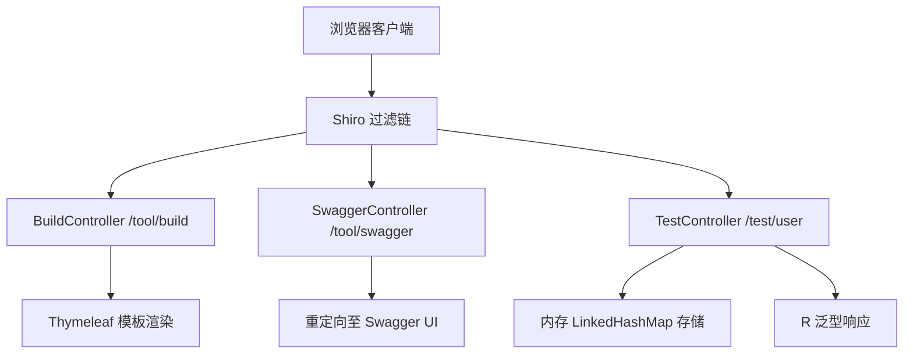
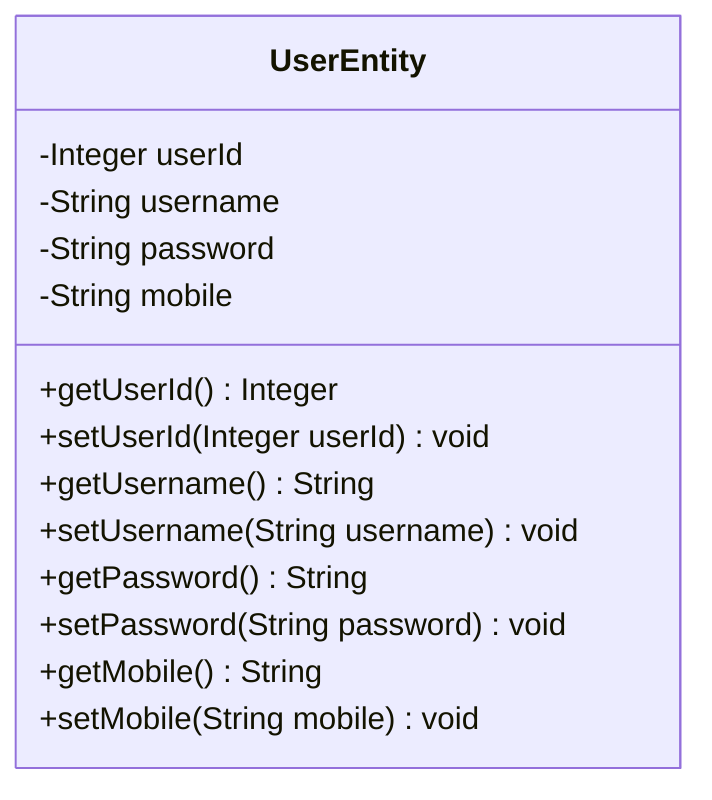

# 工具API

**本文档中引用的文件**
- [BuildController.java](../../../src/main/java/com/ruoyi/web/controller/tool/BuildController.java)
- [SwaggerController.java](../../../src/main/java/com/ruoyi/web/controller/tool/SwaggerController.java)
- [TestController.java](../../../src/main/java/com/ruoyi/web/controller/tool/TestController.java)(L27-L175)
- [R.java](../../../../ruoyi-common/src/main/java/com/ruoyi/common/core/domain/R.java)
- [BaseController.java](../../../../ruoyi-common/src/main/java/com/ruoyi/common/core/controller/BaseController.java)

## 目录
1. [简介](#简介)
2. [项目架构概览](#项目架构概览)
3. [核心数据模型](#核心数据模型)
4. [API端点](#api端点)
5. [权限控制](#权限控制)
6. [错误处理](#错误处理)
7. [总结](#总结)

## 简介

- **系统描述**：工具模块提供表单构建、Swagger 接口文档和用户测试接口三类辅助功能，属于 RuoYi 后台管理系统中的开发工具集。
- **核心功能**：
  - 表单构建：可视化表单设计器入口
  - Swagger 接口：在线 API 文档查看与调试
  - 测试接口：基于内存的 CRUD 示例接口，用于 Swagger 功能演示
- **技术架构**：遵循 RuoYi 分层架构，Controller 层继承 [BaseController](../../../../ruoyi-common/src/main/java/com/ruoyi/common/core/controller/BaseController.java)，通过 Shiro 注解控制权限，REST 接口统一使用 [R\<T\>](../../../../ruoyi-common/src/main/java/com/ruoyi/common/core/domain/R.java) 泛型响应封装。
- **用户角色**：面向系统管理员和开发人员，需具备相应工具权限方可访问。

## 项目架构概览



**图表来源**
- [BuildController.java](../../../src/main/java/com/ruoyi/web/controller/tool/BuildController.java)
- [SwaggerController.java](../../../src/main/java/com/ruoyi/web/controller/tool/SwaggerController.java)
- [TestController.java](../../../src/main/java/com/ruoyi/web/controller/tool/TestController.java)

## 核心数据模型

### UserEntity

`UserEntity` 是 [TestController](../../../src/main/java/com/ruoyi/web/controller/tool/TestController.java)(L108-L175) 中定义的内部类，用于测试接口的数据承载，使用 `@Schema` 注解标注 Swagger 文档信息。



| 属性 | 类型 | 说明 | Schema 标注 |
|------|------|------|-------------|
| userId | Integer | 用户ID | 用户ID |
| username | String | 用户名称 | 用户名称 |
| password | String | 用户密码 | 用户密码 |
| mobile | String | 用户手机 | 用户手机 |

> 数据存储：使用 `LinkedHashMap<Integer, UserEntity>` 内存存储，预置两条测试数据（admin/ry），应用重启后数据丢失。

**章节来源**
- [TestController.java](../../../src/main/java/com/ruoyi/web/controller/tool/TestController.java)(L108-L175)

## API端点

### 表单构建端点

| HTTP方法 | 路径 | 权限 | 返回类型 | 说明 |
|----------|------|------|----------|------|
| GET | `/tool/build` | `tool:build:view` | Thymeleaf 视图 | 表单构建器页面 |

该端点返回 `tool/build/build` 模板页面，用于可视化拖拽构建表单。

**章节来源**
- [BuildController.java](../../../src/main/java/com/ruoyi/web/controller/tool/BuildController.java)(L20-L25)

### Swagger 接口端点

| HTTP方法 | 路径 | 权限 | 返回类型 | 说明 |
|----------|------|------|----------|------|
| GET | `/tool/swagger` | `tool:swagger:view` | 重定向 | 跳转至 Swagger UI |

该端点将请求重定向到 `/swagger-ui/index.html`，进入 SpringDoc 生成的在线 API 文档界面。

**章节来源**
- [SwaggerController.java](../../../src/main/java/com/ruoyi/web/controller/tool/SwaggerController.java)(L18-L23)

### 测试接口端点

`@Tag(name = "用户信息管理")` 标注，所有接口返回 [R\<T\>](../../../../ruoyi-common/src/main/java/com/ruoyi/common/core/domain/R.java) 泛型响应。

#### 获取用户列表

```
GET /test/user/list
```

- **权限**：无额外权限要求（@RestController，未标注 @RequiresPermissions）
- **响应示例**：

```json
{
  "code": 200,
  "msg": "操作成功",
  "data": [
    {
      "userId": 1,
      "username": "admin",
      "password": "***",
      "mobile": "15888888888"
    },
    {
      "userId": 2,
      "username": "ry",
      "password": "***",
      "mobile": "15666666666"
    }
  ]
}
```

> password 字段已脱敏，实际值为明文存储。

#### 获取用户详细

```
GET /test/user/{userId}
```

- **路径参数**：`userId`（Integer，必填）
- **响应示例**（成功）：

```json
{
  "code": 200,
  "msg": "操作成功",
  "data": {
    "userId": 1,
    "username": "admin",
    "password": "***",
    "mobile": "15888888888"
  }
}
```

- **响应示例**（用户不存在）：

```json
{
  "code": 500,
  "msg": "用户不存在"
}
```

#### 新增用户

```
POST /test/user/save
```

- **请求参数**：UserEntity 表单字段（userId、username、password、mobile）
- **校验规则**：userId 不能为空
- **响应示例**（成功）：

```json
{
  "code": 200,
  "msg": "操作成功"
}
```

- **响应示例**（userId 为空）：

```json
{
  "code": 500,
  "msg": "用户ID不能为空"
}
```

#### 更新用户

```
PUT /test/user/update
```

- **请求体**：JSON 格式的 UserEntity 对象
- **校验规则**：userId 不能为空，用户必须存在
- **请求示例**：

```json
{
  "userId": 1,
  "username": "admin_new",
  "password": "***",
  "mobile": "15999999999"
}
```

- **响应示例**（用户不存在）：

```json
{
  "code": 500,
  "msg": "用户不存在"
}
```

#### 删除用户信息

```
DELETE /test/user/{userId}
```

- **路径参数**：`userId`（Integer，必填）
- **响应示例**（成功）：

```json
{
  "code": 200,
  "msg": "操作成功"
}
```

- **响应示例**（用户不存在）：

```json
{
  "code": 500,
  "msg": "用户不存在"
}
```

**章节来源**
- [TestController.java](../../../src/main/java/com/ruoyi/web/controller/tool/TestController.java)(L27-L106)

## 权限控制

| 端点路径 | 权限标识 | 类型 | 说明 |
|----------|----------|------|------|
| `/tool/build` | `tool:build:view` | 视图页面 | 需通过 Shiro 认证并拥有表单构建查看权限 |
| `/tool/swagger` | `tool:swagger:view` | 视图页面 | 需通过 Shiro 认证并拥有 Swagger 查看权限 |
| `/test/user/**` | 无 | REST API | 无额外权限要求，仅需登录认证 |

> BuildController 和 SwaggerController 使用 `@Controller` + `@RequiresPermissions`，属于页面级权限控制；TestController 使用 `@RestController`，未标注权限注解。

**章节来源**
- [BuildController.java](../../../src/main/java/com/ruoyi/web/controller/tool/BuildController.java)(L20)
- [SwaggerController.java](../../../src/main/java/com/ruoyi/web/controller/tool/SwaggerController.java)(L18)

## 错误处理

测试接口通过 [R\<T\>](../../../../ruoyi-common/src/main/java/com/ruoyi/common/core/domain/R.java) 统一返回错误信息，常见错误场景：

| 错误场景 | 触发条件 | 返回 code | 返回 msg |
|----------|----------|-----------|----------|
| 用户不存在 | 查询/更新/删除时 userId 未找到 | 500 | 用户不存在 |
| 用户ID为空 | 新增/更新时 userId 为 null | 500 | 用户ID不能为空 |

## 总结

- **主要特点**：
  1. 表单构建和 Swagger 均为页面入口型端点，通过 Shiro 权限控制访问
  2. 测试接口提供完整的 CRUD 操作示例，使用内存存储，适合开发调试
  3. 统一使用 R\<T\> 泛型响应封装，保持与系统其他接口一致的响应格式
  4. TestController 完整集成 SpringDoc 注解（@Tag、@Operation、@Schema），可直接在 Swagger UI 中展示
  5. 表单构建与 Swagger 接口返回视图/重定向，测试接口返回 JSON 数据

- **技术亮点**：
  1. @Tag/@Operation 注解实现 API 文档自动化
  2. @Schema 注解为实体字段提供语义描述
  3. R\<T\> 泛型响应确保类型安全
  4. 内存存储方案实现零依赖的快速演示
  5. Shiro 权限注解与 Controller 注解协同控制访问

- **业务价值**：工具模块为开发人员提供表单可视化设计、API 文档在线调试和接口规范演示能力，降低开发与联调成本。
