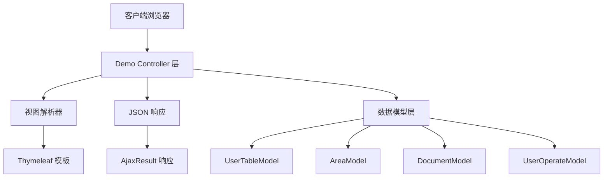
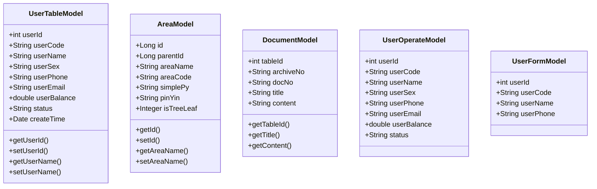
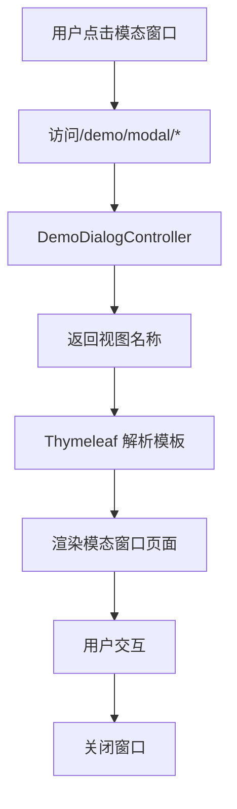
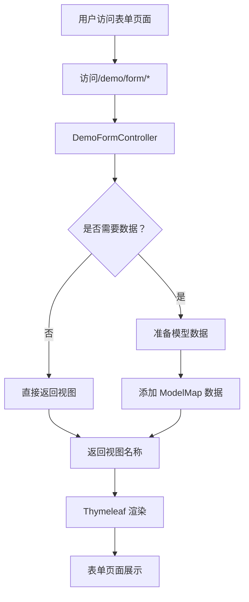

# 演示 API

**本文档中引用的文件**
- [DemoDialogController.java](../../../../ruoyi-admin/src/main/java/com/ruoyi/web/controller/demo/controller/DemoDialogController.java)
- [DemoFormController.java](../../../../ruoyi-admin/src/main/java/com/ruoyi/web/controller/demo/controller/DemoFormController.java)
- [DemoTableController.java](../../../../ruoyi-admin/src/main/java/com/ruoyi/web/controller/demo/controller/DemoTableController.java)
- [DemoIconController.java](../../../../ruoyi-admin/src/main/java/com/ruoyi/web/controller/demo/controller/DemoIconController.java)
- [DemoOperateController.java](../../../../ruoyi-admin/src/main/java/com/ruoyi/web/controller/demo/controller/DemoOperateController.java)
- [DemoReportController.java](../../../../ruoyi-admin/src/main/java/com/ruoyi/web/controller/demo/controller/DemoReportController.java)

## 目录
1. [简介](#简介)
2. [项目架构概览](#项目架构概览)
3. [核心数据模型](#核心数据模型)
4. [API 端点](#api 端点)
5. [模态窗口功能](#模态窗口功能)
6. [表单相关功能](#表单相关功能)
7. [表格相关功能](#表格相关功能)
8. [图标相关功能](#图标相关功能)
9. [操作控制功能](#操作控制功能)
10. [报表相关功能](#报表相关功能)
11. [总结](#总结)

## 简介

- **系统描述**: 演示 API 模块是 RuoYi 框架提供的示例功能集合，用于展示框架的前端组件能力和后端接口设计规范。该模块主要用于教学演示、功能测试和开发参考，帮助开发者快速了解框架的各项特性。
- **核心功能**: 
  - 模态窗口展示（对话框、弹层、表单窗口等）
  - 表单组件（下拉框、时间轴、进度条、表单校验、文件上传等）
  - 表格组件（搜索、导出、分页、拖拽、编辑等）
  - 图标展示（FontAwesome、Glyphicons）
  - 操作控制（增删改查、导入导出）
  - 报表图表（ECharts、Peity、Sparkline）
- **技术架构**: 采用 Spring MVC 架构，Controller 层负责路由转发和数据处理，返回视图名称或 JSON 数据
- **用户角色**: 主要面向开发人员和测试人员，用于学习框架特性和验证功能

## 项目架构概览



**图表来源**
- [DemoTableController.java](../../../../ruoyi-admin/src/main/java/com/ruoyi/web/controller/demo/controller/DemoTableController.java)(L33-L648)
- [DemoOperateController.java](../../../../ruoyi-admin/src/main/java/com/ruoyi/web/controller/demo/controller/DemoOperateController.java)(L32-L326)

## 核心数据模型



**关键属性说明**
- `UserTableModel`: 表格演示用用户数据模型，包含用户 ID、编号、姓名、性别、手机、邮箱、余额、状态和创建时间
- `AreaModel`: 行政区划数据模型，支持树形结构（通过 parentId 关联），包含区域名称、代码、拼音缩写等
- `DocumentModel`: 文档数据模型，用于全文索引演示，包含档号、文件编号、标题、内容
- `UserOperateModel`: 操作控制用用户模型，支持增删改查、导入导出等操作演示
- `UserFormModel`: 表单演示用用户模型，包含基本信息字段

**章节来源**
- [DemoTableController.java](../../../../ruoyi-admin/src/main/java/com/ruoyi/web/controller/demo/controller/DemoTableController.java)(L689-L1044)
- [DemoOperateController.java](../../../../ruoyi-admin/src/main/java/com/ruoyi/web/controller/demo/controller/DemoOperateController.java)(L24-L66 引入 domain 类)

## API 端点

### 按功能模块分组

#### 1. 模态窗口端点 (`/demo/modal`)

| 端点 | HTTP 方法 | 描述 | 返回值 |
|------|----------|------|--------|
| `/dialog` | GET | 模态窗口展示 | 视图：demo/modal/dialog |
| `/layer` | GET | 弹层组件展示 | 视图：demo/modal/layer |
| `/form` | GET | 模态表单窗口 | 视图：demo/modal/form |
| `/table` | GET | 模态表格窗口 | 视图：demo/modal/table |
| `/check` | GET | 表格复选框模式 | 视图：demo/modal/table/check |
| `/radio` | GET | 表格单选框模式 | 视图：demo/modal/table/radio |
| `/parent` | GET | 表格回传父窗体 | 视图：demo/modal/table/parent |
| `/frame1` | GET | 多层窗口 frame1 | 视图：demo/modal/table/frame1 |
| `/frame2` | GET | 多层窗口 frame2 | 视图：demo/modal/table/frame2 |

**章节来源**
- [DemoDialogController.java](../../../../ruoyi-admin/src/main/java/com/ruoyi/web/controller/demo/controller/DemoDialogController.java)(L12-L98)

#### 2. 表单相关端点 (`/demo/form`)

| 端点 | HTTP 方法 | 描述 | 返回值 |
|------|----------|------|--------|
| `/button` | GET | 按钮页 | 视图：demo/form/button |
| `/select` | GET | 下拉框 | 视图：demo/form/select |
| `/timeline` | GET | 时间轴 | 视图：demo/form/timeline |
| `/progress_bars` | GET | 进度条 | 视图：demo/form/progress_bars |
| `/validate` | GET | 表单校验 | 视图：demo/form/validate |
| `/jasny` | GET | 功能扩展（含文件上传） | 视图：demo/form/jasny |
| `/sortable` | GET | 拖动排序 | 视图：demo/form/sortable |
| `/invoice` | GET | 单据打印 | 视图：demo/form/invoice |
| `/labels_tips` | GET | 标签 & 提示 | 视图：demo/form/labels_tips |
| `/tabs_panels` | GET | 选项卡 & 面板 | 视图：demo/form/tabs_panels |
| `/grid` | GET | 栅格布局 | 视图：demo/form/grid |
| `/wizard` | GET | 表单向导 | 视图：demo/form/wizard |
| `/upload` | GET | 文件上传 | 视图：demo/form/upload |
| `/datetime` | GET | 日期和时间 | 视图：demo/form/datetime |
| `/duallistbox` | GET | 左右互选组件 | 视图：demo/form/duallistbox |
| `/basic` | GET | 基本表单 | 视图：demo/form/basic |
| `/cards` | GET | 卡片列表 | 视图：demo/form/cards |
| `/summernote` | GET | 富文本编辑器 | 视图：demo/form/summernote |
| `/autocomplete` | GET | 搜索自动补全 | 视图：demo/form/autocomplete |
| `/cxselect` | GET | 多级联动下拉 | 视图：demo/form/cxselect + 模型数据 |
| `/localrefresh` | GET | 局部刷新 | 视图：demo/form/localrefresh + 模型数据 |
| `/localrefresh/task` | POST | 局部刷新 - 添加任务 | 视图：demo/form/localrefresh::fragment-tasklist |
| `/cityData` | GET | 模拟城市数据 | JSON 字符串 |
| `/userModel` | GET | 获取用户数据 | AjaxResult (JSON) |
| `/collection` | GET | 获取数据集合 | AjaxResult (JSON) |

**请求示例**
```http
GET /demo/form/userModel
Accept: application/json
```

**响应示例**
```json
{
  "code": 200,
  "value": [
    {
      "userId": 1,
      "userCode": "1000001",
      "userName": "测试 1",
      "userPhone": "15888888888"
    },
    {
      "userId": 2,
      "userCode": "1000002",
      "userName": "测试 2",
      "userPhone": "15666666666"
    }
  ]
}
```

**章节来源**
- [DemoFormController.java](../../../../ruoyi-admin/src/main/java/com/ruoyi/web/controller/demo/controller/DemoFormController.java)(L23-L398)

#### 3. 表格相关端点 (`/demo/table`)

| 端点 | HTTP 方法 | 描述 | 返回值 |
|------|----------|------|--------|
| `/search` | GET | 搜索相关 | 视图：demo/table/search |
| `/footer` | GET | 数据汇总 | 视图：demo/table/footer |
| `/groupHeader` | GET | 组合表头 | 视图：demo/table/groupHeader |
| `/export` | GET | 表格导出 | 视图：demo/table/export |
| `/exportSelected` | GET | 表格导出选择列 | 视图：demo/table/exportSelected |
| `/exportData` | POST | 导出数据 | Excel 文件流 |
| `/remember` | GET | 翻页记住选择 | 视图：demo/table/remember |
| `/cookie` | GET | 表格保存状态 | 视图：demo/table/cookie |
| `/pageGo` | GET | 跳转至指定页 | 视图：demo/table/pageGo |
| `/params` | GET | 自定义查询参数 | 视图：demo/table/params |
| `/multi` | GET | 多表格 | 视图：demo/table/multi |
| `/button` | GET | 点击按钮加载表格 | 视图：demo/table/button |
| `/data` | GET | 直接加载表格数据 | 视图：demo/table/data + 模型数据 |
| `/fixedColumns` | GET | 表格冻结列 | 视图：demo/table/fixedColumns |
| `/event` | GET | 自定义触发事件 | 视图：demo/table/event |
| `/detail` | GET | 表格细节视图 | 视图：demo/table/detail |
| `/child` | GET | 表格父子视图 | 视图：demo/table/child |
| `/image` | GET | 表格图片预览 | 视图：demo/table/image |
| `/curd` | GET | 动态增删改查 | 视图：demo/table/curd |
| `/reorderRows` | GET | 表格行拖拽操作 | 视图：demo/table/reorderRows |
| `/reorderColumns` | GET | 表格列拖拽操作 | 视图：demo/table/reorderColumns |
| `/resizable` | GET | 表格列宽拖动 | 视图：demo/table/resizable |
| `/editable` | GET | 表格行内编辑操作 | 视图：demo/table/editable |
| `/subdata` | GET | 主子表提交 | 视图：demo/table/subdata |
| `/refresh` | GET | 表格自动刷新 | 视图：demo/table/refresh |
| `/print` | GET | 表格打印配置 | 视图：demo/table/print |
| `/headerStyle` | GET | 表格标题格式化 | 视图：demo/table/headerStyle |
| `/dynamicColumns` | GET | 表格动态列 | 视图：demo/table/dynamicColumns |
| `/virtualScroll` | GET | 表格虚拟滚动 | 视图：demo/table/virtualScroll |
| `/customView` | GET | 自定义视图分页 | 视图：demo/table/customView |
| `/textSearch` | GET | 全文索引 | 视图：demo/table/textSearch |
| `/asynTree` | GET | 异步加载表格树 | 视图：demo/table/asynTree |
| `/other` | GET | 表格其他操作 | 视图：demo/table/other |
| `/ajaxColumns` | POST | 动态获取列 | AjaxResult (JSON 列集合) |
| `/list` | POST | 查询数据 | TableDataInfo (JSON) |
| `/text/list` | POST | 查询全文索引数据 | TableDataInfo (JSON) |
| `/tree/list` | POST | 查询树表数据 | TableDataInfo (JSON) |
| `/tree/listChild` | POST | 查询树表子节点数据 | List<AreaModel> (JSON) |

**请求示例（查询数据）**
```http
POST /demo/table/list
Content-Type: application/x-www-form-urlencoded

userName=测试 1&pageNum=1&pageSize=10
```

**响应示例**
```json
{
  "total": 26,
  "rows": [
    {
      "userId": 1,
      "userCode": "1000001",
      "userName": "测试 1",
      "userSex": "0",
      "userPhone": "15888888888",
      "userEmail": "ry@qq.com",
      "userBalance": 150.0,
      "status": "0",
      "createTime": "2024-01-01 12:00:00"
    }
  ]
}
```

**章节来源**
- [DemoTableController.java](../../../../ruoyi-admin/src/main/java/com/ruoyi/web/controller/demo/controller/DemoTableController.java)(L33-L648)

#### 4. 图标相关端点 (`/demo/icon`)

| 端点 | HTTP 方法 | 描述 | 返回值 |
|------|----------|------|--------|
| `/fontawesome` | GET | FontAwesome 图标 | 视图：demo/icon/fontawesome |
| `/glyphicons` | GET | Glyphicons 图标 | 视图：demo/icon/glyphicons |

**章节来源**
- [DemoIconController.java](../../../../ruoyi-admin/src/main/java/com/ruoyi/web/controller/demo/controller/DemoIconController.java)(L12-L35)

#### 5. 操作控制端点 (`/demo/operate`)

| 端点 | HTTP 方法 | 描述 | 返回值 |
|------|----------|------|--------|
| `/table` | GET | 表格展示 | 视图：demo/operate/table |
| `/other` | GET | 其他操作 | 视图：demo/operate/other |
| `/list` | POST | 查询数据 | TableDataInfo (JSON) |
| `/add` | GET | 新增用户页面 | 视图：demo/operate/add |
| `/add` | POST | 新增保存用户 | AjaxResult (JSON) |
| `/edit/{userId}` | GET | 修改用户页面 | 视图：demo/operate/edit + 模型数据 |
| `/edit` | POST | 修改保存用户 | AjaxResult (JSON) |
| `/customer/add` | POST | 新增保存主子表信息 | AjaxResult (JSON) |
| `/export` | POST | 导出 | Excel 文件流 |
| `/importTemplate` | GET | 下载模板 | Excel 模板文件流 |
| `/importData` | POST | 导入数据 | AjaxResult (JSON) |
| `/remove` | POST | 删除用户 | AjaxResult (JSON) |
| `/detail/{userId}` | GET | 查看详细 | 视图：demo/operate/detail + 模型数据 |
| `/clean` | POST | 清空数据 | AjaxResult (JSON) |

**请求示例（新增用户）**
```http
POST /demo/operate/add
Content-Type: application/x-www-form-urlencoded

userCode=1000027&userName=测试 27&userSex=0&userPhone=13800138000&userEmail=test27@qq.com&userBalance=100.0&status=0
```

**响应示例**
```json
{
  "code": 200,
  "msg": "操作成功"
}
```

**请求示例（删除用户）**
```http
POST /demo/operate/remove
Content-Type: application/x-www-form-urlencoded

ids=1,2,3
```

**响应示例**
```json
{
  "code": 200,
  "msg": "删除成功"
}
```

**章节来源**
- [DemoOperateController.java](../../../../ruoyi-admin/src/main/java/com/ruoyi/web/controller/demo/controller/DemoOperateController.java)(L32-L326)

#### 6. 报表相关端点 (`/demo/report`)

| 端点 | HTTP 方法 | 描述 | 返回值 |
|------|----------|------|--------|
| `/echarts` | GET | 百度 ECharts | 视图：demo/report/echarts |
| `/peity` | GET | 图表插件 | 视图：demo/report/peity |
| `/sparkline` | GET | 线状图插件 | 视图：demo/report/sparkline |
| `/metrics` | GET | 图表组合 | 视图：demo/report/metrics |

**章节来源**
- [DemoReportController.java](../../../../ruoyi-admin/src/main/java/com/ruoyi/web/controller/demo/controller/DemoReportController.java)(L12-L53)

## 模态窗口功能



**功能特性列表**
- 基础模态对话框展示
- 弹层组件（支持多种弹窗类型）
- 模态表单窗口（数据录入）
- 模态表格窗口（数据展示）
- 表格复选框/单选框模式
- 表格数据回传父窗体
- 多层窗口嵌套（frame1、frame2）

**章节来源**
- [DemoDialogController.java](../../../../ruoyi-admin/src/main/java/com/ruoyi/web/controller/demo/controller/DemoDialogController.java)

## 表单相关功能



**功能特性列表**
- 按钮样式展示
- 下拉框选择（单级/多级联动）
- 时间轴展示
- 进度条动画
- 表单验证（前端校验规则）
- 文件上传（支持图片预览）
- 拖动排序
- 单据打印
- 标签和提示信息
- 选项卡和面板切换
- 栅格布局
- 表单向导（分步表单）
- 日期时间选择器
- 左右互选组件
- 富文本编辑器（Summernote）
- 搜索自动补全
- 局部刷新（Ajax 无刷新更新）

**配置说明**
- 文件上传路径配置在应用配置文件中
- 富文本编辑器支持图片上传和格式化
- 多级联动下拉数据通过 JSON 格式传递

**章节来源**
- [DemoFormController.java](../../../../ruoyi-admin/src/main/java/com/ruoyi/web/controller/demo/controller/DemoFormController.java)

## 示例请求与响应

### 1. 获取表单模型数据
```http
GET /demo/form/userModel HTTP/1.1
Accept: application/json
```

响应示例：
```json
{
  "code": 200,
  "value": [
    {
      "userId": 1,
      "userCode": "1000001",
      "userName": "测试 1",
      "userPhone": "15888888888"
    }
  ]
}
```

### 2. 查询表格数据
```http
POST /demo/table/list HTTP/1.1
Content-Type: application/x-www-form-urlencoded

userName=测试&pageNum=1&pageSize=10
```

响应示例：
```json
{
  "total": 26,
  "rows": [
    {
      "userId": 1,
      "userCode": "1000001",
      "userName": "测试 1",
      "userPhone": "15888888888",
      "userEmail": "ry@qq.com",
      "userBalance": 150.0,
      "status": "0"
    }
  ]
}
```

## 表格相关功能

```mermaid
flowchart TD
    A[用户访问表格页面] --> B[访问/demo/table/*]
    B --> C[DemoTableController]
    C --> D{操作类型}
    D -->|查询 | E[/list 接口]
    D -->|导出 | F[/exportData 接口]
    D -->|动态列 | G[/ajaxColumns 接口]
    D -->|树表 | H[/tree/list 接口]
    E --> I[返回 TableDataInfo]
    F --> J[返回 Excel 流]
    G --> K[返回列集合]
    H --> L[返回树形数据]
    I --> M[Bootstrap Table 渲染]
    J --> N[浏览器下载]
    K --> O[动态更新表格列]
    L --> P[树形表格展示]
```

**功能特性列表**
- 搜索功能（关键字过滤）
- 数据汇总（页脚统计）
- 组合表头（多级表头）
- 表格导出（Excel 格式）
- 选择列导出
- 翻页记住选择
- Cookie 保存状态
- 跳转至指定页
- 自定义查询参数
- 多表格同时展示
- 按钮触发加载
- 直接加载数据
- 冻结列（固定左右侧）
- 自定义触发事件
- 细节视图（展开详情）
- 父子视图（树形展开）
- 图片预览
- 动态增删改查
- 行拖拽排序
- 列拖拽排序
- 列宽拖动调整
- 行内编辑
- 主子表提交
- 自动刷新
- 打印配置
- 标题格式化
- 动态列显示/隐藏
- 虚拟滚动（大数据优化）
- 自定义视图分页
- 全文索引搜索
- 异步加载表格树

**性能考虑**
- 分页大小默认 10 条/页
- 大数据量使用虚拟滚动优化
- 导出功能支持全量或选择导出

**章节来源**
- [DemoTableController.java](../../../../ruoyi-admin/src/main/java/com/ruoyi/web/controller/demo/controller/DemoTableController.java)

## 图标相关功能

**功能特性列表**
- FontAwesome 图标库展示
- Glyphicons 图标库展示

**章节来源**
- [DemoIconController.java](../../../../ruoyi-admin/src/main/java/com/ruoyi/web/controller/demo/controller/DemoIconController.java)

## 操作控制功能

```mermaid
flowchart TD
    A[用户操作] --> B{操作类型}
    B -->|新增 | C[GET /add 页面]
    B -->|修改 | D[GET /edit/{userId} 页面]
    B -->|删除 | E[POST /remove]
    B -->|查询 | F[POST /list]
    B -->|导出 | G[POST /export]
    B -->|导入 | H[POST /importData]
    C --> I[POST /add 保存]
    D --> J[POST /edit 保存]
    E --> K[删除成功]
    F --> L[返回数据列表]
    G --> M[下载 Excel 文件]
    H --> N[上传 Excel 文件]
    N --> O[解析并导入数据]
    O --> P[返回导入结果]
    I --> Q[保存成功]
    J --> Q
```

**功能特性列表**
- 表格数据展示
- 新增用户（页面 + 保存）
- 修改用户（页面 + 保存）
- 删除用户（批量删除）
- 查询用户（条件过滤）
- 导出 Excel
- 导入 Excel（支持更新已存在数据）
- 下载导入模板
- 查看详细
- 主子表数据提交
- 清空所有数据

**权限要求说明**
- 所有操作无需特殊权限（演示环境）
- 生产环境需配置相应权限控制

**错误处理**
- 导入数据格式错误时返回详细错误信息
- 数据已存在时提示是否覆盖

**章节来源**
- [DemoOperateController.java](../../../../ruoyi-admin/src/main/java/com/ruoyi/web/controller/demo/controller/DemoOperateController.java)

## 报表相关功能

**功能特性列表**
- 百度 ECharts 图表库集成
- Peity 图表插件（饼图、条形图、折线图）
- Sparkline 线状图插件
- 图表组合展示（Metrics 页面）

**章节来源**
- [DemoReportController.java](../../../../ruoyi-admin/src/main/java/com/ruoyi/web/controller/demo/controller/DemoReportController.java)

## 权限控制与角色管理

演示 API 模块为示例功能，**不设置权限控制**，所有用户均可访问。生产环境中应通过框架的权限管理系统进行控制。

## 错误处理与异常管理

**异常类型分类**
- 数据格式异常：导入数据时格式不正确
- 数据重复异常：导入已存在的数据
- 空数据异常：导入空数据列表
- IO 异常：文件上传下载失败

**错误响应格式**
```json
{
  "code": 500,
  "msg": "错误信息描述"
}
```

**状态码说明**
- `200`: 操作成功
- `302`: 重定向
- `404`: 资源未找到
- `500`: 服务器内部错误

## 性能考虑

**缓存策略**
- 演示数据在内存中缓存（静态 List/Map 集合）
- 重启后数据重置

**分页优化**
- 默认分页大小：10 条/页
- 支持自定义分页参数
- 大数据量使用虚拟滚动

**并发控制**
- 演示环境为单用户模式
- 生产环境需添加同步控制

## 故障排除指南

**常见问题及解决方案**

1. **页面无法加载**
   - 检查应用是否启动
   - 确认端口配置正确
   - 查看浏览器控制台错误日志

2. **数据不显示**
   - 检查数据源是否正确
   - 确认前端模板路径正确
   - 查看后端日志是否有异常

3. **导入失败**
   - 检查 Excel 文件格式是否符合模板
   - 确认文件未损坏
   - 查看错误提示信息

4. **导出失败**
   - 检查浏览器是否允许下载
   - 确认内存充足
   - 查看服务器日志

**监控指标**
- 请求响应时间
- 内存使用情况
- 数据集合大小

## 总结

**主要特点**
1. 功能全面：涵盖模态窗口、表单、表格、图标、报表等多种前端组件
2. 示例丰富：每个功能点都有对应的示例页面
3. 代码规范：遵循 Spring MVC 最佳实践
4. 易于扩展：结构清晰，便于二次开发
5. 教学价值：适合新手学习框架使用

**技术亮点**
1. RESTful API 设计规范
2. 统一响应格式（AjaxResult、TableDataInfo）
3. 支持多种数据导出格式（Excel）
4. 前端后端分离架构
5. 完善的增删改查示例

**业务价值**
- 为开发人员提供快速上手的示例代码
- 减少学习成本，提高开发效率
- 提供标准化的开发参考
- 支持功能测试和演示展示

---

**文档生成时间**: 2024 年
**文档维护者**: RuoYi 团队
