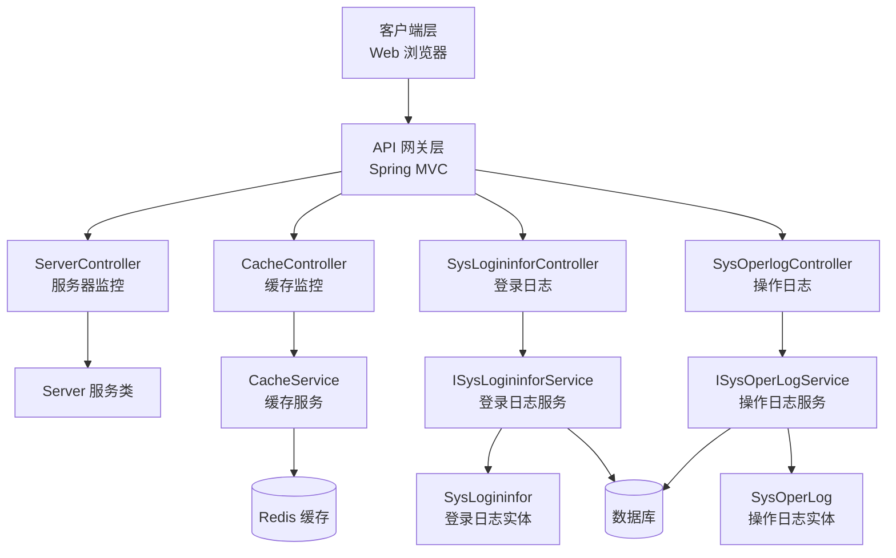
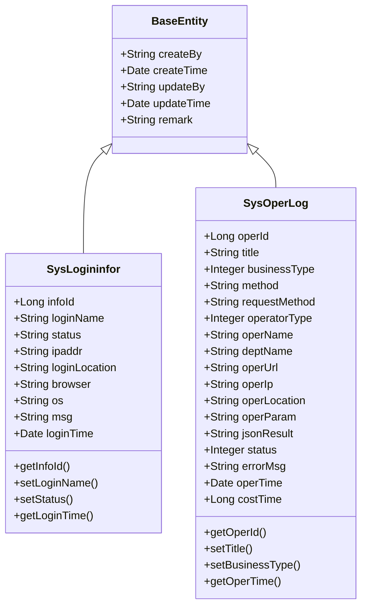
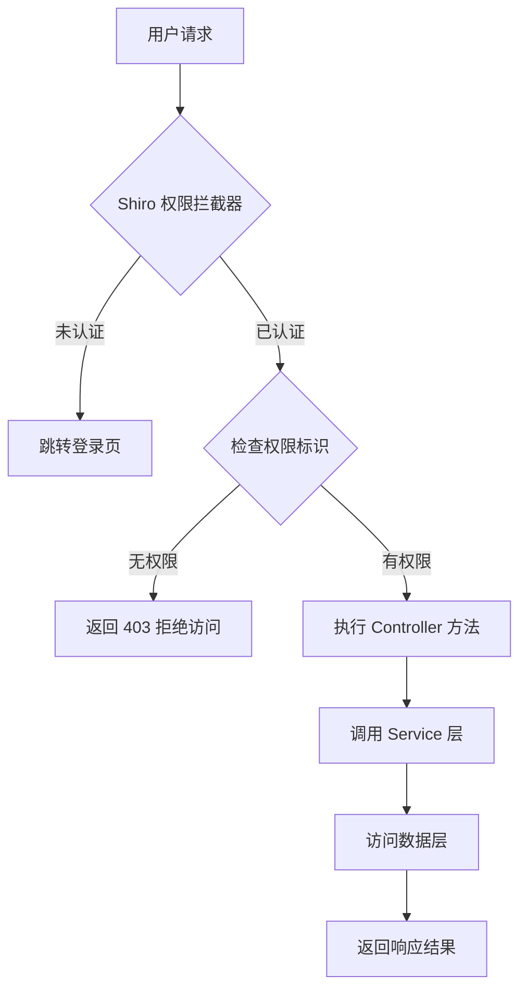

# 监控管理 API

**本文档中引用的文件**
- [ServerController.java](../../../../ruoyi-admin/src/main/java/com/ruoyi/web/controller/monitor/ServerController.java)
- [CacheController.java](../../../../ruoyi-admin/src/main/java/com/ruoyi/web/controller/monitor/CacheController.java)
- [SysLogininforController.java](../../../../ruoyi-admin/src/main/java/com/ruoyi/web/controller/monitor/SysLogininforController.java)
- [SysOperlogController.java](../../../../ruoyi-admin/src/main/java/com/ruoyi/web/controller/monitor/SysOperlogController.java)
- [SysLogininfor.java](../../../../ruoyi-system/src/main/java/com/ruoyi/system/domain/SysLogininfor.java)
- [SysOperLog.java](../../../../ruoyi-system/src/main/java/com/ruoyi/system/domain/SysOperLog.java)
- [README.md](../../../../README.md)

## 目录
1. [简介](#简介)
2. [项目架构概览](#项目架构概览)
3. [核心数据模型](#核心数据模型)
4. [API 端点](#api 端点)
5. [权限控制与角色管理](#权限控制与角色管理)
6. [错误处理与异常管理](#错误处理与异常管理)
7. [总结](#总结)

## 简介

- **系统描述**: 监控管理模块是 RuoYi 快速开发框架的核心组成部分，负责系统运行状态的实时监控与日志管理。该模块提供服务器监控、缓存监控、登录日志、操作日志等功能，帮助管理员全面掌握系统运行状况，保障系统稳定运行。
- **核心功能**:
  - 服务器监控：实时监测 CPU、内存、磁盘、JVM 堆栈等系统资源
  - 缓存监控：管理 Redis 缓存，支持查看、删除缓存数据
  - 登录日志：记录用户登录行为，包含成功/失败状态、IP 地址、浏览器信息等
  - 操作日志：记录系统操作行为，支持业务类型分类与操作详情追溯
- **技术架构**: 基于 Spring Boot + Shiro 权限框架，采用 MVC 分层架构，Controller 层负责请求路由，Service 层处理业务逻辑，Domain 层定义数据模型
- **用户角色**: 系统管理员、运维人员、安全审计人员

## 项目架构概览



**图表来源**: [ServerController.java](../../../../ruoyi-admin/src/main/java/com/ruoyi/web/controller/monitor/ServerController.java)、[CacheController.java](../../../../ruoyi-admin/src/main/java/com/ruoyi/web/controller/monitor/CacheController.java)、[SysLogininforController.java](../../../../ruoyi-admin/src/main/java/com/ruoyi/web/controller/monitor/SysLogininforController.java)、[SysOperlogController.java](../../../../ruoyi-admin/src/main/java/com/ruoyi/web/controller/monitor/SysOperlogController.java)

## 核心数据模型



### 关键属性说明

**SysLogininfor（登录日志实体）**
| 字段名 | 类型 | 说明 | Excel 导出 |
|--------|------|------|-----------|
| infoId | Long | 日志主键 ID | 序号 |
| loginName | String | 用户账号 | 用户账号 |
| status | String | 登录状态（0 成功 1 失败） | 登录状态 |
| ipaddr | String | 登录 IP 地址 | 登录地址 |
| loginLocation | String | 登录地点 | 登录地点 |
| browser | String | 浏览器类型 | 浏览器 |
| os | String | 操作系统 | 操作系统 |
| msg | String | 提示消息 | 提示消息 |
| loginTime | Date | 访问时间 | 访问时间 |

**SysOperLog（操作日志实体）**
| 字段名 | 类型 | 说明 | Excel 导出 |
|--------|------|------|-----------|
| operId | Long | 操作主键 ID | 操作序号 |
| title | String | 操作模块标题 | 操作模块 |
| businessType | Integer | 业务类型（0 其它 1 新增 2 修改 3 删除...） | 业务类型 |
| method | String | 请求方法 | 请求方法 |
| requestMethod | String | 请求方式（GET/POST） | 请求方式 |
| operatorType | Integer | 操作类别（0 其它 1 后台用户 2 手机端用户） | 操作类别 |
| operName | String | 操作人员姓名 | 操作人员 |
| deptName | String | 部门名称 | 部门名称 |
| operUrl | String | 请求 URL 地址 | 请求地址 |
| operIp | String | 操作 IP 地址 | 操作地址 |
| operLocation | String | 操作地点 | 操作地点 |
| operParam | String | 请求参数 | 请求参数 |
| jsonResult | String | 返回参数 | 返回参数 |
| status | Integer | 操作状态（0 正常 1 异常） | 状态 |
| errorMsg | String | 错误消息 | 错误消息 |
| operTime | Date | 操作时间 | 操作时间 |
| costTime | Long | 消耗时间（毫秒） | 消耗时间 |

**章节来源**: [SysLogininfor.java](../../../../ruoyi-system/src/main/java/com/ruoyi/system/domain/SysLogininfor.java)、[SysOperLog.java](../../../../ruoyi-system/src/main/java/com/ruoyi/system/domain/SysOperLog.java)

## API 端点

### 服务器监控

**端点路径**: `/monitor/server`

| HTTP 方法 | 路径 | 权限要求 | 功能描述 |
|-----------|------|----------|----------|
| GET | /monitor/server | monitor:server:view | 获取服务器监控页面，展示 CPU、内存、磁盘、JVM 信息 |

**请求示例**:
```http
GET /monitor/server HTTP/1.1
Host: localhost:8080
Cookie: JSESSIONID=***
```

**响应**: 返回服务器监控视图模板，包含 Server 对象的监控数据

**章节来源**: [ServerController.java](../../../../ruoyi-admin/src/main/java/com/ruoyi/web/controller/monitor/ServerController.java)

### 缓存监控

**端点路径**: `/monitor/cache`

| HTTP 方法 | 路径 | 权限要求 | 功能描述 |
|-----------|------|----------|----------|
| GET | /monitor/cache | monitor:cache:view | 获取缓存监控页面，展示所有缓存名称 |
| POST | /monitor/cache/getNames | monitor:cache:view | 获取缓存名称列表（局部刷新） |
| POST | /monitor/cache/getKeys | monitor:cache:view | 根据缓存名称获取键列表 |
| POST | /monitor/cache/getValue | monitor:cache:view | 根据缓存名称和键获取值 |
| POST | /monitor/cache/clearCacheName | monitor:cache:view | 清除指定缓存名称下的所有数据 |
| POST | /monitor/cache/clearCacheKey | monitor:cache:view | 清除指定缓存名称下的指定键 |
| GET | /monitor/cache/clearAll | monitor:cache:view | 清除所有缓存数据 |

**请求示例 - 获取缓存键**:
```http
POST /monitor/cache/getKeys HTTP/1.1
Host: localhost:8080
Content-Type: application/x-www-form-urlencoded

cacheName=sys-config
```

**响应示例 - 获取缓存值**:
```json
{
  "cacheName": "sys-config",
  "cacheKey": "sys-config:sys.account.initPassword",
  "cacheValue": "123456"
}
```

**清除缓存响应**:
```json
{
  "code": 200,
  "msg": "操作成功"
}
```

**章节来源**: [CacheController.java](../../../../ruoyi-admin/src/main/java/com/ruoyi/web/controller/monitor/CacheController.java)

### 登录日志

**端点路径**: `/monitor/logininfor`

| HTTP 方法 | 路径 | 权限要求 | 功能描述 |
|-----------|------|----------|----------|
| GET | /monitor/logininfor | monitor:logininfor:view | 获取登录日志页面 |
| POST | /monitor/logininfor/list | monitor:logininfor:list | 分页查询登录日志列表 |
| POST | /monitor/logininfor/export | monitor:logininfor:export | 导出登录日志为 Excel 文件 |
| POST | /monitor/logininfor/remove | monitor:logininfor:remove | 批量删除登录日志 |
| POST | /monitor/logininfor/clean | monitor:logininfor:remove | 清空所有登录日志 |
| POST | /monitor/logininfor/unlock | monitor:logininfor:unlock | 解锁指定账户（清除登录失败记录） |

**请求示例 - 查询登录日志**:
```http
POST /monitor/logininfor/list HTTP/1.1
Host: localhost:8080
Content-Type: application/x-www-form-urlencoded

loginName=admin&status=0&pageNum=1&pageSize=10
```

**响应示例 - 登录日志列表**:
```json
{
  "total": 100,
  "rows": [
    {
      "infoId": 1,
      "loginName": "admin",
      "status": "0",
      "ipaddr": "192.168.1.100",
      "loginLocation": "内网 IP",
      "browser": "Chrome",
      "os": "Windows 10",
      "msg": "登录成功",
      "loginTime": "2026-07-17 10:30:00"
    }
  ]
}
```

**解锁账户响应**:
```json
{
  "code": 200,
  "msg": "操作成功"
}
```

**章节来源**: [SysLogininforController.java](../../../../ruoyi-admin/src/main/java/com/ruoyi/web/controller/monitor/SysLogininforController.java)

## 示例请求与响应

### 1. 服务器监控
```http
GET /monitor/server HTTP/1.1
```

响应：返回服务器监控视图模板，包含 CPU、内存、磁盘和 JVM 信息

### 2. 查询缓存键
```http
POST /monitor/cache/getKeys HTTP/1.1
Content-Type: application/x-www-form-urlencoded

cacheName=sys-config
```

响应示例：
```json
{
  "code": 200,
  "msg": "操作成功",
  "data": {
    "cacheName": "sys-config",
    "keys": ["sys-config:sys.account.initPassword"]
  }
}
```

### 3. 查询登录日志
```http
POST /monitor/logininfor/list HTTP/1.1
Content-Type: application/x-www-form-urlencoded

loginName=admin&status=0&pageNum=1&pageSize=10
```

响应示例：
```json
{
  "total": 100,
  "rows": [
    {
      "infoId": 1,
      "loginName": "admin",
      "status": "0",
      "ipaddr": "192.168.1.100",
      "loginTime": "2026-07-17 10:30:00"
    }
  ]
}
```

### 4. 查询操作日志
```http
POST /monitor/operlog/list HTTP/1.1
Content-Type: application/x-www-form-urlencoded

title=用户管理&pageNum=1&pageSize=10
```

响应示例：
```json
{
  "total": 1,
  "rows": [
    {
      "operId": 1,
      "title": "用户管理",
      "operName": "admin",
      "status": 0,
      "operTime": "2026-07-17 11:00:00"
    }
  ]
}
```

### 5. 强制下线在线用户
```http
POST /monitor/online/forceLogout/{tokenId} HTTP/1.1
```

响应示例：
```json
{
  "code": 200,
  "msg": "操作成功"
}
```

### 操作日志

**端点路径**: `/monitor/operlog`

| HTTP 方法 | 路径 | 权限要求 | 功能描述 |
|-----------|------|----------|----------|
| GET | /monitor/operlog | monitor:operlog:view | 获取操作日志页面 |
| POST | /monitor/operlog/list | monitor:operlog:list | 分页查询操作日志列表 |
| POST | /monitor/operlog/export | monitor:operlog:export | 导出操作日志为 Excel 文件 |
| POST | /monitor/operlog/remove | monitor:operlog:remove | 批量删除操作日志 |
| GET | /monitor/operlog/detail/{operId} | monitor:operlog:detail | 查看操作日志详情 |
| POST | /monitor/operlog/clean | monitor:operlog:remove | 清空所有操作日志 |

**请求示例 - 查询操作日志**:
```http
POST /monitor/operlog/list HTTP/1.1
Host: localhost:8080
Content-Type: application/x-www-form-urlencoded

title=用户管理&businessType=2&operName=admin&pageNum=1&pageSize=10
```

**响应示例 - 操作日志列表**:
```json
{
  "total": 50,
  "rows": [
    {
      "operId": 1,
      "title": "用户管理",
      "businessType": 2,
      "method": "com.ruoyi.web.controller.system.SysUserController.edit",
      "requestMethod": "POST",
      "operatorType": 1,
      "operName": "admin",
      "deptName": "研发部",
      "operUrl": "/system/user/edit",
      "operIp": "192.168.1.100",
      "operLocation": "内网 IP",
      "operParam": "{\"userId\":1,\"userName\":\"admin\"}",
      "jsonResult": "{\"code\":200,\"msg\":\"操作成功\"}",
      "status": 0,
      "errorMsg": "",
      "operTime": "2026-07-17 11:00:00",
      "costTime": 150
    }
  ]
}
```

**操作日志详情响应**:
```json
{
  "operId": 1,
  "title": "用户管理",
  "businessType": 2,
  "method": "com.ruoyi.web.controller.system.SysUserController.edit",
  "requestMethod": "POST",
  "operatorType": 1,
  "operName": "admin",
  "deptName": "研发部",
  "operUrl": "/system/user/edit",
  "operIp": "192.168.1.100",
  "operLocation": "内网 IP",
  "operParam": "{\"userId\":1,\"userName\":\"admin\"}",
  "jsonResult": "{\"code\":200,\"msg\":\"操作成功\"}",
  "status": 0,
  "errorMsg": "",
  "operTime": "2026-07-17 11:00:00",
  "costTime": 150
}
```

**章节来源**: [SysOperlogController.java](../../../../ruoyi-admin/src/main/java/com/ruoyi/web/controller/monitor/SysOperlogController.java)

## 权限控制与角色管理

### 角色权限矩阵

| 权限标识 | 说明 | 涉及端点 |
|----------|------|----------|
| monitor:server:view | 查看服务器监控 | /monitor/server |
| monitor:cache:view | 查看缓存监控 | /monitor/cache/* |
| monitor:logininfor:view | 查看登录日志页面 | /monitor/logininfor |
| monitor:logininfor:list | 查询登录日志列表 | /monitor/logininfor/list |
| monitor:logininfor:export | 导出登录日志 | /monitor/logininfor/export |
| monitor:logininfor:remove | 删除/清空登录日志 | /monitor/logininfor/remove, /monitor/logininfor/clean |
| monitor:logininfor:unlock | 解锁账户 | /monitor/logininfor/unlock |
| monitor:operlog:view | 查看操作日志页面 | /monitor/operlog |
| monitor:operlog:list | 查询操作日志列表 | /monitor/operlog/list |
| monitor:operlog:export | 导出操作日志 | /monitor/operlog/export |
| monitor:operlog:remove | 删除/清空操作日志 | /monitor/operlog/remove, /monitor/operlog/clean |
| monitor:operlog:detail | 查看操作日志详情 | /monitor/operlog/detail/{operId} |

### 权限验证流程



**章节来源**: [ServerController.java](../../../../ruoyi-admin/src/main/java/com/ruoyi/web/controller/monitor/ServerController.java)(L22-L23)、[CacheController.java](../../../../ruoyi-admin/src/main/java/com/ruoyi/web/controller/monitor/CacheController.java)(L29-L88)、[SysLogininforController.java](../../../../ruoyi-admin/src/main/java/com/ruoyi/web/controller/monitor/SysLogininforController.java)(L38-L93)、[SysOperlogController.java](../../../../ruoyi-admin/src/main/java/com/ruoyi/web/controller/monitor/SysOperlogController.java)(L36-L89)

## 错误处理与异常管理

### 异常类型分类

| 异常场景 | 触发条件 | 处理方式 |
|----------|----------|----------|
| 权限不足 | 用户未登录或无对应权限标识 | Shiro 拦截器拦截，返回 403 或跳转登录页 |
| 缓存不存在 | 查询不存在的缓存名称或键 | CacheService 返回 null 或空列表 |
| 数据删除失败 | 数据库约束冲突或记录不存在 | Service 层抛出异常，Controller 捕获返回错误信息 |
| 服务异常 | Service 层业务逻辑异常 | 全局异常处理器捕获，返回统一错误格式 |

### 错误响应格式

```json
{
  "code": 500,
  "msg": "错误消息描述",
  "data": null
}
```

### 状态码说明

| HTTP 状态码 | 含义 | 场景 |
|-------------|------|------|
| 200 | 成功 | 请求正常处理完成 |
| 302 | 重定向 | 未登录跳转登录页 |
| 403 | 禁止访问 | 无权限访问资源 |
| 404 | 未找到 | 请求的资源不存在 |
| 500 | 服务器内部错误 | 业务逻辑异常或系统错误 |

## 总结

### 主要特点

1. **全面监控**: 覆盖服务器资源、缓存状态、用户行为等多维度监控
2. **权限严格控制**: 基于 Shiro 框架实现细粒度权限控制，每个端点都有明确的权限标识
3. **日志完整追溯**: 登录日志和操作日志记录详尽，支持导出 Excel 便于审计
4. **实时性强**: 服务器监控和缓存监控数据实时更新，帮助管理员快速响应问题
5. **易于扩展**: 采用标准 MVC 架构，新增监控功能只需添加对应的 Controller 和 Service

### 技术亮点

1. **AOP 日志切面**: 使用自定义注解 `@Log` 自动记录操作日志，无需手动编写日志代码
2. **Excel 导出封装**: 基于注解的 Excel 导出工具，自动映射实体字段
3. **分页查询优化**: 统一分页处理，支持多条件组合查询
4. **缓存服务抽象**: CacheService 封装 Redis 操作，提供统一的缓存管理接口
5. **异常统一处理**: 全局异常处理器统一捕获并格式化错误响应

### 业务价值

监控管理模块是 RuoYi 框架的运维保障核心，通过实时监控和日志追溯，帮助企业和开发团队：
- 快速定位系统性能瓶颈和异常问题
- 审计用户操作行为，满足合规要求
- 分析用户登录模式，优化安全策略
- 监控系统资源使用，提前预警容量风险

**项目来源**: [README.md](../../../../README.md)
