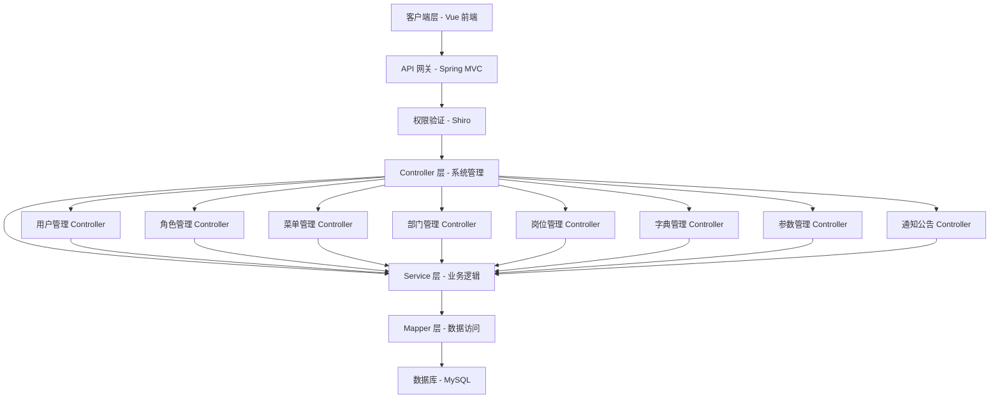
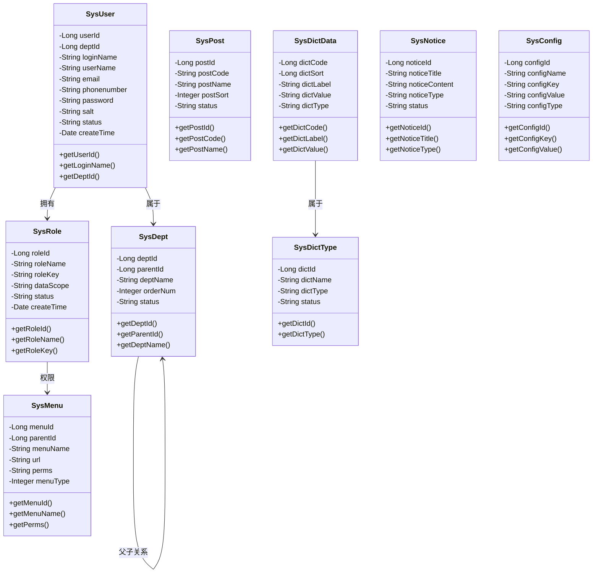

# 系统管理 API

**本文档引用的文件**
- [SysUserController.java](../../../../ruoyi-admin/src/main/java/com/ruoyi/web/controller/system/SysUserController.java)
- [SysRoleController.java](../../../../ruoyi-admin/src/main/java/com/ruoyi/web/controller/system/SysRoleController.java)
- [SysMenuController.java](../../../../ruoyi-admin/src/main/java/com/ruoyi/web/controller/system/SysMenuController.java)
- [SysDeptController.java](../../../../ruoyi-admin/src/main/java/com/ruoyi/web/controller/system/SysDeptController.java)
- [SysPostController.java](../../../../ruoyi-admin/src/main/java/com/ruoyi/web/controller/system/SysPostController.java)
- [SysDictTypeController.java](../../../../ruoyi-admin/src/main/java/com/ruoyi/web/controller/system/SysDictTypeController.java)
- [SysDictDataController.java](../../../../ruoyi-admin/src/main/java/com/ruoyi/web/controller/system/SysDictDataController.java)
- [SysNoticeController.java](../../../../ruoyi-admin/src/main/java/com/ruoyi/web/controller/system/SysNoticeController.java)
- [SysConfigController.java](../../../../ruoyi-admin/src/main/java/com/ruoyi/web/controller/system/SysConfigController.java)

## 目录
1. [简介](#简介)
2. [项目架构概览](#项目架构概览)
3. [核心数据模型](#核心数据模型)
4. [API 端点](#api 端点)
5. [权限控制与角色管理](#权限控制与角色管理)
6. [错误处理与异常管理](#错误处理与异常管理)
7. [总结](#总结)

## 简介

- **系统描述**: 系统管理模块是 RuoYi 框架的核心基础模块，负责系统的组织架构、用户权限、基础数据配置等核心功能。该模块提供了完整的 RBAC（基于角色的访问控制）权限管理体系，支持多部门、多岗位、多角色的复杂组织架构管理。

- **核心功能**: 
  - 用户管理：系统用户的增删改查、角色分配、状态管理
  - 部门管理：树形组织机构管理，支持数据权限控制
  - 岗位管理：用户职务配置与管理
  - 菜单管理：系统菜单、操作权限、按钮权限配置
  - 角色管理：角色权限分配、数据范围权限划分
  - 字典管理：系统固定数据维护（字典类型与字典数据）
  - 参数管理：系统动态参数配置
  - 通知公告：系统公告发布与已读状态管理

- **技术架构**: 采用 Spring Boot + Shiro 权限框架 + MyBatis 的分层架构设计
  - Controller 层：处理 HTTP 请求，权限验证
  - Service 层：业务逻辑处理
  - Mapper 层：数据访问
  - Domain 层：实体类定义

- **用户角色**: 系统管理员、部门管理员、普通用户

**图表来源**
- [README.md](../../../../README.md)

## 项目架构概览



**图表来源**
- [SysUserController.java](../../../../ruoyi-admin/src/main/java/com/ruoyi/web/controller/system/SysUserController.java)(L43-L44)
- [SysRoleController.java](../../../../ruoyi-admin/src/main/java/com/ruoyi/web/controller/system/SysRoleController.java)(L36-L37)
- [SysMenuController.java](../../../../ruoyi-admin/src/main/java/com/ruoyi/web/controller/system/SysMenuController.java)(L31-L32)
- [SysDeptController.java](../../../../ruoyi-admin/src/main/java/com/ruoyi/web/controller/system/SysDeptController.java)(L30-L31)

## 核心数据模型



**图表来源**
- 领域模型文件引用：根据 controller 层依赖的实体类推断

## API 端点

### 用户管理 API

**基础路径**: `/system/user`

| 方法 | 路径 | 说明 | 权限标识 |
|------|------|------|----------|
| GET | `/system/user` | 用户管理页面 | system:user:view |
| POST | `/system/user/list` | 查询用户列表 | system:user:list |
| POST | `/system/user/export` | 导出用户数据 | system:user:export |
| POST | `/system/user/importData` | 导入用户数据 | system:user:import |
| GET | `/system/user/importTemplate` | 下载导入模板 | system:user:view |
| GET | `/system/user/add` | 新增用户页面 | system:user:add |
| POST | `/system/user/add` | 新增保存用户 | system:user:add |
| GET | `/system/user/edit/{userId}` | 修改用户页面 | system:user:edit |
| POST | `/system/user/edit` | 修改保存用户 | system:user:edit |
| GET | `/system/user/view/{userId}` | 查询用户详细 | system:user:list |
| GET | `/system/user/resetPwd/{userId}` | 重置密码页面 | system:user:resetPwd |
| POST | `/system/user/resetPwd` | 重置密码保存 | system:user:resetPwd |
| GET | `/system/user/authRole/{userId}` | 授权角色页面 | system:user:edit |
| POST | `/system/user/authRole/insertAuthRole` | 用户授权角色 | system:user:edit |
| POST | `/system/user/remove` | 删除用户 | system:user:remove |
| POST | `/system/user/checkLoginNameUnique` | 校验用户名 | - |
| POST | `/system/user/checkPhoneUnique` | 校验手机号码 | - |
| POST | `/system/user/checkEmailUnique` | 校验邮箱 | - |
| POST | `/system/user/changeStatus` | 用户状态修改 | system:user:edit |
| GET | `/system/user/deptTreeData` | 加载部门列表树 | system:user:list |
| GET | `/system/user/selectDeptTree/{deptId}` | 选择部门树 | system:user:list |

**请求示例 - 查询用户列表**
```json
POST /system/user/list
{
  "loginName": "admin",
  "phonenumber": "13800138000",
  "status": "0"
}
```

**响应示例**
```json
{
  "total": 1,
  "rows": [
    {
      "userId": 1,
      "deptId": 103,
      "loginName": "admin",
      "userName": "管理员",
      "email": "admin@ruoyi.com",
      "phonenumber": "13800138000",
      "status": "0"
    }
  ]
}
```

**章节来源**
- [SysUserController.java](../../../../ruoyi-admin/src/main/java/com/ruoyi/web/controller/system/SysUserController.java)(L64-L356)

### 角色管理 API

**基础路径**: `/system/role`

| 方法 | 路径 | 说明 | 权限标识 |
|------|------|------|----------|
| GET | `/system/role` | 角色管理页面 | system:role:view |
| POST | `/system/role/list` | 查询角色列表 | system:role:list |
| POST | `/system/role/export` | 导出角色数据 | system:role:export |
| GET | `/system/role/add` | 新增角色页面 | system:role:add |
| POST | `/system/role/add` | 新增保存角色 | system:role:add |
| GET | `/system/role/edit/{roleId}` | 修改角色页面 | system:role:edit |
| POST | `/system/role/edit` | 修改保存角色 | system:role:edit |
| GET | `/system/role/authDataScope/{roleId}` | 角色数据权限页面 | - |
| POST | `/system/role/authDataScope` | 保存角色数据权限 | system:role:edit |
| POST | `/system/role/remove` | 删除角色 | system:role:remove |
| POST | `/system/role/checkRoleNameUnique` | 校验角色名称 | - |
| POST | `/system/role/checkRoleKeyUnique` | 校验角色权限 | - |
| GET | `/system/role/selectMenuTree` | 选择菜单树 | - |
| POST | `/system/role/changeStatus` | 角色状态修改 | system:role:edit |
| GET | `/system/role/authUser/{roleId}` | 分配用户页面 | system:role:edit |
| POST | `/system/role/authUser/allocatedList` | 查询已分配用户列表 | system:role:list |
| POST | `/system/role/authUser/cancel` | 取消授权 | system:role:edit |
| POST | `/system/role/authUser/cancelAll` | 批量取消授权 | system:role:edit |
| GET | `/system/role/authUser/selectUser/{roleId}` | 选择用户页面 | system:role:list |
| POST | `/system/role/authUser/unallocatedList` | 查询未分配用户列表 | system:role:list |
| POST | `/system/role/authUser/selectAll` | 批量选择用户授权 | system:role:edit |
| GET | `/system/role/deptTreeData` | 加载角色部门列表树 | system:role:edit |
| GET | `/system/role/view/{roleId}` | 查看角色详情 | system:role:list |

**请求示例 - 新增角色**
```json
POST /system/role/add
{
  "roleName": "测试角色",
  "roleKey": "test",
  "dataScope": "1",
  "status": "0"
}
```

**章节来源**
- [SysRoleController.java](../../../../ruoyi-admin/src/main/java/com/ruoyi/web/controller/system/SysRoleController.java)(L54-L353)

### 菜单管理 API

**基础路径**: `/system/menu`

| 方法 | 路径 | 说明 | 权限标识 |
|------|------|------|----------|
| GET | `/system/menu` | 菜单管理页面 | system:menu:view |
| POST | `/system/menu/list` | 查询菜单列表 | system:menu:list |
| GET | `/system/menu/remove/{menuId}` | 删除菜单 | system:menu:remove |
| GET | `/system/menu/add/{parentId}` | 新增菜单页面 | system:menu:add |
| POST | `/system/menu/add` | 新增保存菜单 | system:menu:add |
| GET | `/system/menu/edit/{menuId}` | 修改菜单页面 | system:menu:edit |
| POST | `/system/menu/edit` | 修改保存菜单 | system:menu:edit |
| POST | `/system/menu/updateSort` | 保存菜单排序 | system:menu:edit |
| GET | `/system/menu/icon` | 选择菜单图标 | - |
| POST | `/system/menu/checkMenuNameUnique` | 校验菜单名称 | - |
| GET | `/system/menu/roleMenuTreeData` | 加载角色菜单列表树 | - |
| GET | `/system/menu/menuTreeData` | 加载所有菜单列表树 | - |
| GET | `/system/menu/selectMenuTree/{menuId}` | 选择菜单树 | - |

**章节来源**
- [SysMenuController.java](../../../../ruoyi-admin/src/main/java/com/ruoyi/web/controller/system/SysMenuController.java)(L40-L211)

### 部门管理 API

**基础路径**: `/system/dept`

| 方法 | 路径 | 说明 | 权限标识 |
|------|------|------|----------|
| GET | `/system/dept` | 部门管理页面 | system:dept:view |
| POST | `/system/dept/list` | 查询部门列表 | system:dept:list |
| GET | `/system/dept/add/{parentId}` | 新增部门页面 | system:dept:add |
| POST | `/system/dept/add` | 新增保存部门 | system:dept:add |
| GET | `/system/dept/edit/{deptId}` | 修改部门页面 | system:dept:edit |
| POST | `/system/dept/edit` | 修改保存部门 | system:dept:edit |
| POST | `/system/dept/updateSort` | 保存部门排序 | system:dept:edit |
| GET | `/system/dept/remove/{deptId}` | 删除部门 | system:dept:remove |
| POST | `/system/dept/checkDeptNameUnique` | 校验部门名称 | - |
| GET | `/system/dept/selectDeptTree/{deptId}` | 选择部门树 | system:dept:list |
| GET | `/system/dept/treeData/{excludeId}` | 加载部门列表树 | system:dept:list |

**章节来源**
- [SysDeptController.java](../../../../ruoyi-admin/src/main/java/com/ruoyi/web/controller/system/SysDeptController.java)(L39-L202)

### 岗位管理 API

**基础路径**: `/system/post`

| 方法 | 路径 | 说明 | 权限标识 |
|------|------|------|----------|
| GET | `/system/post` | 岗位管理页面 | system:post:view |
| POST | `/system/post/list` | 查询岗位列表 | system:post:list |
| POST | `/system/post/export` | 导出岗位数据 | system:post:export |
| POST | `/system/post/remove` | 删除岗位 | system:post:remove |
| GET | `/system/post/add` | 新增岗位页面 | system:post:add |
| POST | `/system/post/add` | 新增保存岗位 | system:post:add |
| GET | `/system/post/edit/{postId}` | 修改岗位页面 | system:post:edit |
| POST | `/system/post/edit` | 修改保存岗位 | system:post:edit |
| POST | `/system/post/checkPostNameUnique` | 校验岗位名称 | - |
| POST | `/system/post/checkPostCodeUnique` | 校验岗位编码 | - |

**章节来源**
- [SysPostController.java](../../../../ruoyi-admin/src/main/java/com/ruoyi/web/controller/system/SysPostController.java)(L37-L155)

### 字典管理 API

**字典类型基础路径**: `/system/dict`

| 方法 | 路径 | 说明 | 权限标识 |
|------|------|------|----------|
| GET | `/system/dict` | 字典类型页面 | system:dict:view |
| POST | `/system/dict/list` | 查询字典类型列表 | system:dict:list |
| POST | `/system/dict/export` | 导出字典类型 | system:dict:export |
| GET | `/system/dict/add` | 新增字典类型页面 | system:dict:add |
| POST | `/system/dict/add` | 新增保存字典类型 | system:dict:add |
| GET | `/system/dict/edit/{dictId}` | 修改字典类型页面 | system:dict:edit |
| POST | `/system/dict/edit` | 修改保存字典类型 | system:dict:edit |
| POST | `/system/dict/remove` | 删除字典类型 | system:dict:remove |
| GET | `/system/dict/refreshCache` | 刷新字典缓存 | system:dict:remove |
| GET | `/system/dict/detail/{dictId}` | 查询字典详细 | system:dict:list |
| POST | `/system/dict/checkDictTypeUnique` | 校验字典类型 | - |
| GET | `/system/dict/selectDictTree/{columnId}/{dictType}` | 选择字典树 | - |
| GET | `/system/dict/treeData` | 加载字典列表树 | - |

**字典数据基础路径**: `/system/dict/data`

| 方法 | 路径 | 说明 | 权限标识 |
|------|------|------|----------|
| GET | `/system/dict/data` | 字典数据页面 | system:dict:view |
| POST | `/system/dict/data/list` | 查询字典数据列表 | system:dict:list |
| POST | `/system/dict/data/export` | 导出字典数据 | system:dict:export |
| GET | `/system/dict/data/add/{dictType}` | 新增字典数据页面 | system:dict:add |
| POST | `/system/dict/data/add` | 新增保存字典数据 | system:dict:add |
| GET | `/system/dict/data/edit/{dictCode}` | 修改字典数据页面 | system:dict:edit |
| POST | `/system/dict/data/edit` | 修改保存字典数据 | system:dict:edit |
| POST | `/system/dict/data/remove` | 删除字典数据 | system:dict:remove |

**章节来源**
- [SysDictTypeController.java](../../../../ruoyi-admin/src/main/java/com/ruoyi/web/controller/system/SysDictTypeController.java)(L38-L187)
- [SysDictDataController.java](../../../../ruoyi-admin/src/main/java/com/ruoyi/web/controller/system/SysDictDataController.java)(L37-L121)

### 参数管理 API

**基础路径**: `/system/config`

| 方法 | 路径 | 说明 | 权限标识 |
|------|------|------|----------|
| GET | `/system/config` | 参数配置页面 | system:config:view |
| POST | `/system/config/list` | 查询参数配置列表 | system:config:list |
| POST | `/system/config/export` | 导出参数数据 | system:config:export |
| GET | `/system/config/add` | 新增参数配置页面 | system:config:add |
| POST | `/system/config/add` | 新增保存参数配置 | system:config:add |
| GET | `/system/config/edit/{configId}` | 修改参数配置页面 | system:config:edit |
| POST | `/system/config/edit` | 修改保存参数配置 | system:config:edit |
| POST | `/system/config/remove` | 删除参数配置 | system:config:remove |
| GET | `/system/config/refreshCache` | 刷新参数缓存 | system:config:remove |
| POST | `/system/config/checkConfigKeyUnique` | 校验参数键名 | - |

**章节来源**
- [SysConfigController.java](../../../../ruoyi-admin/src/main/java/com/ruoyi/web/controller/system/SysConfigController.java)(L37-L157)

### 通知公告 API

**基础路径**: `/system/notice`

| 方法 | 路径 | 说明 | 权限标识 |
|------|------|------|----------|
| GET | `/system/notice` | 公告管理页面 | system:notice:view |
| POST | `/system/notice/list` | 查询公告列表 | system:notice:list |
| GET | `/system/notice/add` | 新增公告页面 | system:notice:add |
| POST | `/system/notice/add` | 新增保存公告 | system:notice:add |
| GET | `/system/notice/edit/{noticeId}` | 修改公告页面 | system:notice:edit |
| POST | `/system/notice/edit` | 修改保存公告 | system:notice:edit |
| GET | `/system/notice/view/{noticeId}` | 查询公告详细 | - |
| GET | `/system/notice/listTop` | 首页顶部公告列表 | - |
| POST | `/system/notice/markRead` | 标记公告已读 | - |
| POST | `/system/notice/markReadAll` | 批量标记已读 | - |
| GET | `/system/notice/readUsers/{noticeId}` | 已读用户页面 | system:notice:list |
| POST | `/system/notice/readUsers/list` | 已读用户列表数据 | system:notice:list |
| POST | `/system/notice/remove` | 删除公告 | system:notice:remove |

**章节来源**
- [SysNoticeController.java](../../../../ruoyi-admin/src/main/java/com/ruoyi/web/controller/system/SysNoticeController.java)(L42-L194)

## API 示例

### 示例 1：查询用户列表
```http
POST /system/user/list HTTP/1.1
Content-Type: application/x-www-form-urlencoded

loginName=admin&status=0&pageNum=1&pageSize=10
```

响应示例：
```json
{
  "code": 200,
  "msg": "操作成功",
  "rows": [
    {
      "userId": 1,
      "loginName": "admin",
      "userName": "管理员",
      "status": "0"
    }
  ],
  "total": 1
}
```

### 示例 2：新增角色
```http
POST /system/role/add HTTP/1.1
Content-Type: application/json

{
  "roleName": "测试角色",
  "roleKey": "test_role",
  "dataScope": "1",
  "status": "0"
}
```

响应示例：
```json
{
  "code": 200,
  "msg": "新增成功",
  "data": null
}
```

### 示例 3：新增菜单
```http
POST /system/menu/add HTTP/1.1
Content-Type: application/x-www-form-urlencoded

menuName=测试菜单&menuType=1&url=/test/menu&perms=test:menu:view&status=0
```

响应示例：
```json
{
  "code": 200,
  "msg": "操作成功"
}
```

## 权限控制与角色管理

### 权限验证流程

```mermaid
flowchart TD
    A[客户端请求] --> B{Shiro 权限拦截}
    B -->|未登录 | C[返回登录页面]
    B -->|已登录 | D{检查@RequiresPermissions}
    D -->|无注解 | E[执行 Controller 方法]
    D -->|有注解 | F{验证权限标识}
    F -->|权限不足 | G[返回 403 错误]
    F -->|权限通过 | E
    E --> H[返回响应结果]
```

### 权限标识规范

系统管理模块的权限标识采用 `模块：功能：操作` 的格式：

| 模块 | 功能 | 操作 | 权限标识示例 |
|------|------|------|-------------|
| system | user | view/list/add/edit/remove | system:user:view |
| system | role | view/list/add/edit/remove/export | system:role:list |
| system | menu | view/list/add/edit/remove | system:menu:add |
| system | dept | view/list/add/edit/remove | system:dept:edit |
| system | post | view/list/add/edit/remove/export | system:post:list |
| system | dict | view/list/add/edit/remove/export | system:dict:add |
| system | config | view/list/add/edit/remove/export | system:config:edit |
| system | notice | view/list/add/edit/remove | system:notice:list |

**章节来源**
- 根据各 Controller 的 `@RequiresPermissions` 注解推断

## 错误处理与异常管理

### 异常类型分类

| 异常类型 | 说明 | 处理方式 |
|----------|------|----------|
| 业务异常 | 如用户名已存在、手机号重复等 | 返回错误提示信息 |
| 权限异常 | 无权限访问 | Shiro 拦截返回 403 |
| 数据验证异常 | 参数校验失败 | 返回验证错误信息 |
| 系统异常 | 数据库异常、空指针等 | 全局异常处理器捕获 |

### 错误响应格式

```json
{
  "code": 500,
  "msg": "错误提示信息",
  "success": false
}
```

### 常见错误码

| 错误码 | 说明 |
|--------|------|
| 200 | 操作成功 |
| 500 | 系统错误 |
| 403 | 权限不足 |

### 业务校验示例

**用户管理校验规则**:
- 登录账号唯一性校验
- 手机号码唯一性校验
- 邮箱唯一性校验
- 当前用户不能删除自己
- 用户数据权限范围校验

**角色管理校验规则**:
- 角色名称唯一性校验
- 角色权限标识唯一性校验
- 超级管理员角色不能删除
- 角色数据权限范围校验

**部门管理校验规则**:
- 部门名称唯一性校验
- 上级部门不能是自己
- 存在下级部门不能删除
- 部门存在用户不能删除

**章节来源**
- [SysUserController.java](../../../../ruoyi-admin/src/main/java/com/ruoyi/web/controller/system/SysUserController.java)(L133-L152)
- [SysRoleController.java](../../../../ruoyi-admin/src/main/java/com/ruoyi/web/controller/system/SysRoleController.java)(L100-L111)
- [SysDeptController.java](../../../../ruoyi-admin/src/main/java/com/ruoyi/web/controller/system/SysDeptController.java)(L78-L84)

## 总结

- **主要特点**:
  1. 完整的 RBAC 权限管理体系
  2. 树形组织架构支持（部门、菜单）
  3. 细粒度的权限控制（按钮级权限）
  4. 数据权限范围控制
  5. 支持 Excel 导入导出功能

- **技术亮点**:
  1. Shiro 权限框架集成
  2. 自定义注解实现操作日志记录
  3. 统一响应格式封装（AjaxResult）
  4. 分页查询支持（TableDataInfo）
  5. 数据校验与唯一性检查

- **业务价值**: 
  系统管理模块为企业级应用提供了完整的组织架构与权限管理解决方案，支持复杂的多部门、多角色业务场景，通过细粒度的权限控制确保系统数据安全，通过字典、参数等配置功能提升系统灵活性与可维护性。

**图表来源**
- [README.md](../../../../README.md)
- 各 Controller 源码文件
