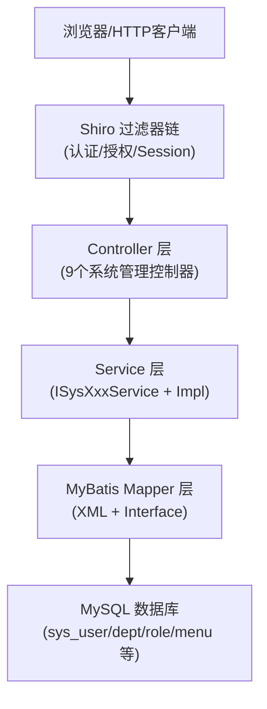

# 系统管理API

**本文档引用的文件**
- [SysUserController.java](../../../src/main/java/com/ruoyi/web/controller/system/SysUserController.java)
- [SysDeptController.java](../../../src/main/java/com/ruoyi/web/controller/system/SysDeptController.java)
- [SysRoleController.java](../../../src/main/java/com/ruoyi/web/controller/system/SysRoleController.java)
- [SysMenuController.java](../../../src/main/java/com/ruoyi/web/controller/system/SysMenuController.java)
- [SysPostController.java](../../../src/main/java/com/ruoyi/web/controller/system/SysPostController.java)
- [SysConfigController.java](../../../src/main/java/com/ruoyi/web/controller/system/SysConfigController.java)
- [SysDictTypeController.java](../../../src/main/java/com/ruoyi/web/controller/system/SysDictTypeController.java)
- [SysDictDataController.java](../../../src/main/java/com/ruoyi/web/controller/system/SysDictDataController.java)
- [SysNoticeController.java](../../../src/main/java/com/ruoyi/web/controller/system/SysNoticeController.java)
- [BaseController.java](../../../ruoyi-common/src/main/java/com/ruoyi/common/core/controller/BaseController.java)
- [AjaxResult.java](../../../ruoyi-common/src/main/java/com/ruoyi/common/core/domain/AjaxResult.java)
- [TableDataInfo.java](../../../ruoyi-common/src/main/java/com/ruoyi/common/core/page/TableDataInfo.java)
- [SysUser.java](../../../ruoyi-common/src/main/java/com/ruoyi/common/core/domain/entity/SysUser.java)
- [SysDept.java](../../../ruoyi-common/src/main/java/com/ruoyi/common/core/domain/entity/SysDept.java)

## 目录

1. [简介](#简介)
2. [架构概览](#架构概览)
3. [通用响应模型](#通用响应模型)
4. [API端点](#api端点)
5. [权限控制](#权限控制)
6. [错误处理](#错误处理)

---

## 简介

系统管理模块是 RuoYi 框架的核心管理功能集合，提供对系统基础数据的 CRUD 操作，包括用户、部门、角色、菜单、岗位、字典、参数配置和通知公告等管理功能。所有控制器均继承自 `BaseController`，统一使用 Shiro 进行权限校验。

**核心功能模块**：

| 模块 | 基础路径 | 主要职责 |
|------|----------|----------|
| 用户管理 | `/system/user` | 用户账号增删改查、密码重置、授权角色、导入导出 |
| 部门管理 | `/system/dept` | 部门树结构管理、排序 |
| 角色管理 | `/system/role` | 角色增删改查、数据权限分配、用户授权 |
| 菜单管理 | `/system/menu` | 菜单树管理、排序、图标选择 |
| 岗位管理 | `/system/post` | 岗位增删改查、编码校验 |
| 字典管理 | `/system/dict` | 字典类型与字典数据管理、缓存刷新 |
| 参数配置 | `/system/config` | 系统参数配置管理、缓存刷新 |
| 通知公告 | `/system/notice` | 公告增删改查、已读标记管理 |

---

## 架构概览

系统管理模块采用典型的 MVC 分层架构，所有 Controller 继承 `BaseController`，通过 Shiro `@RequiresPermissions` 注解进行权限控制，通过 `@Log` 注解记录操作日志。



**图表来源**：
- [SysUserController.java](../../../src/main/java/com/ruoyi/web/controller/system/SysUserController.java)
- [BaseController.java](../../../ruoyi-common/src/main/java/com/ruoyi/common/core/controller/BaseController.java)

---

## 通用响应模型

### AjaxResult（单条操作响应）

所有写操作（增/删/改）及部分查询操作返回 `AjaxResult`，继承自 `HashMap<String, Object>`，包含三个固定字段：

| 字段 | 类型 | 说明 |
|------|------|------|
| `code` | int | 状态码：0 成功，301 警告，500 错误 |
| `msg` | String | 提示消息 |
| `data` | Object | 返回数据（可选） |

成功示例：
```json
{"code": 0, "msg": "操作成功", "data": null}
```

错误示例：
```json
{"code": 500, "msg": "新增用户'admin'失败，登录账号已存在"}
```

> 来源：[AjaxResult.java](../../../ruoyi-common/src/main/java/com/ruoyi/common/core/domain/AjaxResult.java)

### TableDataInfo（分页列表响应）

所有分页列表查询返回 `TableDataInfo`：

| 字段 | 类型 | 说明 |
|------|------|------|
| `code` | int | 状态码：0 表示成功 |
| `msg` | String | 消息内容 |
| `total` | long | 总记录数 |
| `rows` | List | 当前页数据列表 |

> 来源：[TableDataInfo.java](../../../ruoyi-common/src/main/java/com/ruoyi/common/core/page/TableDataInfo.java)

---

## API端点

### 用户管理 (`/system/user`)

**基础路径**：`/system/user` | **Controller**：[SysUserController.java](../../../src/main/java/com/ruoyi/web/controller/system/SysUserController.java)

| 端点 | 方法 | 权限标识 | 说明 |
|------|------|----------|------|
| `/system/user` | GET | `system:user:view` | 用户管理页面 |
| `/system/user/list` | POST | `system:user:list` | 分页查询用户列表 |
| `/system/user/export` | POST | `system:user:export` | 导出用户 Excel |
| `/system/user/importData` | POST | `system:user:import` | 导入用户数据 |
| `/system/user/importTemplate` | GET | `system:user:view` | 下载导入模板 |
| `/system/user/add` | GET | `system:user:add` | 新增用户页面 |
| `/system/user/add` | POST | `system:user:add` | 新增保存用户 |
| `/system/user/edit/{userId}` | GET | `system:user:edit` | 修改用户页面 |
| `/system/user/edit` | POST | `system:user:edit` | 修改保存用户 |
| `/system/user/view/{userId}` | GET | `system:user:list` | 用户详情页面 |
| `/system/user/remove` | POST | `system:user:remove` | 批量删除用户 |
| `/system/user/resetPwd/{userId}` | GET | `system:user:resetPwd` | 重置密码页面 |
| `/system/user/resetPwd` | POST | `system:user:resetPwd` | 保存重置密码 |
| `/system/user/changeStatus` | POST | `system:user:edit` | 修改用户状态 |
| `/system/user/authRole/{userId}` | GET | `system:user:edit` | 授权角色页面 |
| `/system/user/authRole/insertAuthRole` | POST | `system:user:edit` | 保存授权角色 |
| `/system/user/checkLoginNameUnique` | POST | 无 | 校验登录名唯一性 |
| `/system/user/checkPhoneUnique` | POST | 无 | 校验手机号唯一性 |
| `/system/user/checkEmailUnique` | POST | 无 | 校验邮箱唯一性 |
| `/system/user/deptTreeData` | GET | `system:user:list` | 加载部门列表树 |

**核心数据模型 - SysUser**

| 字段 | 类型 | 说明 |
|------|------|------|
| `userId` | Long | 用户ID |
| `deptId` | Long | 部门ID |
| `loginName` | String | 登录账号 |
| `userName` | String | 用户姓名 |
| `email` | String | 邮箱 |
| `phonenumber` | String | 手机号码 |
| `sex` | String | 性别（0男 1女 2未知） |
| `status` | String | 状态（0正常 1停用） |
| `password` | String | 密码（MD5+salt 加密） |

> 来源：[SysUser.java](../../../ruoyi-common/src/main/java/com/ruoyi/common/core/domain/entity/SysUser.java)

---

### 部门管理 (`/system/dept`)

**基础路径**：`/system/dept` | **Controller**：[SysDeptController.java](../../../src/main/java/com/ruoyi/web/controller/system/SysDeptController.java)

| 端点 | 方法 | 权限标识 | 说明 |
|------|------|----------|------|
| `/system/dept` | GET | `system:dept:view` | 部门管理页面 |
| `/system/dept/list` | POST | `system:dept:list` | 查询部门列表（树结构） |
| `/system/dept/add/{parentId}` | GET | `system:dept:add` | 新增部门页面 |
| `/system/dept/add` | POST | `system:dept:add` | 新增保存部门 |
| `/system/dept/edit/{deptId}` | GET | `system:dept:edit` | 修改部门页面 |
| `/system/dept/edit` | POST | `system:dept:edit` | 修改保存部门 |
| `/system/dept/remove/{deptId}` | GET | `system:dept:remove` | 删除部门 |
| `/system/dept/updateSort` | POST | `system:dept:edit` | 保存部门排序 |
| `/system/dept/checkDeptNameUnique` | POST | 无 | 校验部门名称唯一性 |
| `/system/dept/selectDeptTree/{deptId}` | GET | `system:dept:list` | 选择部门树 |
| `/system/dept/treeData/{excludeId}` | GET | `system:dept:list` | 加载部门列表树（排除下级） |

**核心数据模型 - SysDept**

SysDept 继承 `TreeEntity`，支持树形结构：

| 字段 | 类型 | 说明 |
|------|------|------|
| `deptId` | Long | 部门ID |
| `parentId` | Long | 父部门ID |
| `ancestors` | String | 祖级列表 |
| `deptName` | String | 部门名称 |
| `orderNum` | Integer | 显示顺序 |
| `leader` | String | 负责人 |
| `phone` | String | 联系电话 |
| `email` | String | 邮箱 |
| `status` | String | 状态（0正常 1停用） |

> 来源：[SysDept.java](../../../ruoyi-common/src/main/java/com/ruoyi/common/core/domain/entity/SysDept.java)

---

### 角色管理 (`/system/role`)

**基础路径**：`/system/role` | **Controller**：[SysRoleController.java](../../../src/main/java/com/ruoyi/web/controller/system/SysRoleController.java)

| 端点 | 方法 | 权限标识 | 说明 |
|------|------|----------|------|
| `/system/role` | GET | `system:role:view` | 角色管理页面 |
| `/system/role/list` | POST | `system:role:list` | 分页查询角色列表 |
| `/system/role/export` | POST | `system:role:export` | 导出角色 Excel |
| `/system/role/add` | GET | `system:role:add` | 新增角色页面 |
| `/system/role/add` | POST | `system:role:add` | 新增保存角色 |
| `/system/role/edit/{roleId}` | GET | `system:role:edit` | 修改角色页面 |
| `/system/role/edit` | POST | `system:role:edit` | 修改保存角色 |
| `/system/role/remove` | POST | `system:role:remove` | 批量删除角色 |
| `/system/role/changeStatus` | POST | `system:role:edit` | 修改角色状态 |
| `/system/role/authDataScope/{roleId}` | GET | 无 | 数据权限分配页面 |
| `/system/role/authDataScope` | POST | `system:role:edit` | 保存数据权限分配 |
| `/system/role/authUser/{roleId}` | GET | `system:role:edit` | 分配用户页面 |
| `/system/role/authUser/allocatedList` | POST | `system:role:list` | 已分配用户列表 |
| `/system/role/authUser/unallocatedList` | POST | `system:role:list` | 未分配用户列表 |
| `/system/role/authUser/selectAll` | POST | `system:role:edit` | 批量选择用户授权 |
| `/system/role/authUser/cancel` | POST | `system:role:edit` | 取消用户授权 |
| `/system/role/authUser/cancelAll` | POST | `system:role:edit` | 批量取消授权 |
| `/system/role/selectMenuTree` | GET | 无 | 选择菜单树页面 |
| `/system/role/deptTreeData` | GET | `system:role:edit` | 加载角色部门树 |
| `/system/role/checkRoleNameUnique` | POST | 无 | 校验角色名称唯一性 |
| `/system/role/checkRoleKeyUnique` | POST | 无 | 校验角色权限唯一性 |
| `/system/role/view/{roleId}` | GET | `system:role:list` | 角色详情页面 |

---

### 菜单管理 (`/system/menu`)

**基础路径**：`/system/menu` | **Controller**：[SysMenuController.java](../../../src/main/java/com/ruoyi/web/controller/system/SysMenuController.java)

| 端点 | 方法 | 权限标识 | 说明 |
|------|------|----------|------|
| `/system/menu` | GET | `system:menu:view` | 菜单管理页面 |
| `/system/menu/list` | POST | `system:menu:list` | 查询菜单列表（树结构） |
| `/system/menu/add/{parentId}` | GET | `system:menu:add` | 新增菜单页面 |
| `/system/menu/add` | POST | `system:menu:add` | 新增保存菜单 |
| `/system/menu/edit/{menuId}` | GET | `system:menu:edit` | 修改菜单页面 |
| `/system/menu/edit` | POST | `system:menu:edit` | 修改保存菜单 |
| `/system/menu/remove/{menuId}` | GET | `system:menu:remove` | 删除菜单 |
| `/system/menu/updateSort` | POST | `system:menu:edit` | 保存菜单排序 |
| `/system/menu/icon` | GET | 无 | 选择菜单图标页面 |
| `/system/menu/checkMenuNameUnique` | POST | 无 | 校验菜单名称唯一性 |
| `/system/menu/roleMenuTreeData` | GET | 无 | 加载角色菜单列表树 |
| `/system/menu/menuTreeData` | GET | 无 | 加载所有菜单列表树 |
| `/system/menu/selectMenuTree/{menuId}` | GET | 无 | 选择菜单树 |

---

### 岗位管理 (`/system/post`)

**基础路径**：`/system/post` | **Controller**：[SysPostController.java](../../../src/main/java/com/ruoyi/web/controller/system/SysPostController.java)

| 端点 | 方法 | 权限标识 | 说明 |
|------|------|----------|------|
| `/system/post` | GET | `system:post:view` | 岗位管理页面 |
| `/system/post/list` | POST | `system:post:list` | 分页查询岗位列表 |
| `/system/post/export` | POST | `system:post:export` | 导出岗位 Excel |
| `/system/post/add` | GET | `system:post:add` | 新增岗位页面 |
| `/system/post/add` | POST | `system:post:add` | 新增保存岗位 |
| `/system/post/edit/{postId}` | GET | `system:post:edit` | 修改岗位页面 |
| `/system/post/edit` | POST | `system:post:edit` | 修改保存岗位 |
| `/system/post/remove` | POST | `system:post:remove` | 批量删除岗位 |
| `/system/post/checkPostNameUnique` | POST | 无 | 校验岗位名称唯一性 |
| `/system/post/checkPostCodeUnique` | POST | 无 | 校验岗位编码唯一性 |

---

### 参数配置 (`/system/config`)

**基础路径**：`/system/config` | **Controller**：[SysConfigController.java](../../../src/main/java/com/ruoyi/web/controller/system/SysConfigController.java)

| 端点 | 方法 | 权限标识 | 说明 |
|------|------|----------|------|
| `/system/config` | GET | `system:config:view` | 参数配置页面 |
| `/system/config/list` | POST | `system:config:list` | 分页查询参数列表 |
| `/system/config/export` | POST | `system:config:export` | 导出参数 Excel |
| `/system/config/add` | GET | `system:config:add` | 新增参数页面 |
| `/system/config/add` | POST | `system:config:add` | 新增保存参数 |
| `/system/config/edit/{configId}` | GET | `system:config:edit` | 修改参数页面 |
| `/system/config/edit` | POST | `system:config:edit` | 修改保存参数 |
| `/system/config/remove` | POST | `system:config:remove` | 批量删除参数 |
| `/system/config/refreshCache` | GET | `system:config:remove` | 刷新参数缓存 |
| `/system/config/checkConfigKeyUnique` | POST | 无 | 校验参数键名唯一性 |

---

### 字典管理

字典管理分为字典类型和字典数据两个 Controller，共用 `/system/dict` 基础路径。

#### 字典类型 (`/system/dict`)

**基础路径**：`/system/dict` | **Controller**：[SysDictTypeController.java](../../../src/main/java/com/ruoyi/web/controller/system/SysDictTypeController.java)

| 端点 | 方法 | 权限标识 | 说明 |
|------|------|----------|------|
| `/system/dict` | GET | `system:dict:view` | 字典管理页面 |
| `/system/dict/list` | POST | `system:dict:list` | 分页查询字典类型列表 |
| `/system/dict/export` | POST | `system:dict:export` | 导出字典类型 Excel |
| `/system/dict/add` | GET | `system:dict:add` | 新增字典类型页面 |
| `/system/dict/add` | POST | `system:dict:add` | 新增保存字典类型 |
| `/system/dict/edit/{dictId}` | GET | `system:dict:edit` | 修改字典类型页面 |
| `/system/dict/edit` | POST | `system:dict:edit` | 修改保存字典类型 |
| `/system/dict/remove` | POST | `system:dict:remove` | 批量删除字典类型 |
| `/system/dict/refreshCache` | GET | `system:dict:remove` | 刷新字典缓存 |
| `/system/dict/detail/{dictId}` | GET | `system:dict:list` | 字典详情页面 |
| `/system/dict/checkDictTypeUnique` | POST | 无 | 校验字典类型唯一性 |
| `/system/dict/selectDictTree/{columnId}/{dictType}` | GET | 无 | 选择字典树 |
| `/system/dict/treeData` | GET | 无 | 加载字典列表树 |

#### 字典数据 (`/system/dict/data`)

**基础路径**：`/system/dict/data` | **Controller**：[SysDictDataController.java](../../../src/main/java/com/ruoyi/web/controller/system/SysDictDataController.java)

| 端点 | 方法 | 权限标识 | 说明 |
|------|------|----------|------|
| `/system/dict/data` | GET | `system:dict:view` | 字典数据页面 |
| `/system/dict/data/list` | POST | `system:dict:list` | 分页查询字典数据列表 |
| `/system/dict/data/export` | POST | `system:dict:export` | 导出字典数据 Excel |
| `/system/dict/data/add/{dictType}` | GET | `system:dict:add` | 新增字典数据页面 |
| `/system/dict/data/add` | POST | `system:dict:add` | 新增保存字典数据 |
| `/system/dict/data/edit/{dictCode}` | GET | `system:dict:edit` | 修改字典数据页面 |
| `/system/dict/data/edit` | POST | `system:dict:edit` | 修改保存字典数据 |
| `/system/dict/data/remove` | POST | `system:dict:remove` | 批量删除字典数据 |

---

### 通知公告 (`/system/notice`)

**基础路径**：`/system/notice` | **Controller**：[SysNoticeController.java](../../../src/main/java/com/ruoyi/web/controller/system/SysNoticeController.java)

通知公告模块除标准 CRUD 外，额外支持已读标记追踪功能。

| 端点 | 方法 | 权限标识 | 说明 |
|------|------|----------|------|
| `/system/notice` | GET | `system:notice:view` | 公告管理页面 |
| `/system/notice/list` | POST | `system:notice:list` | 分页查询公告列表 |
| `/system/notice/add` | GET | `system:notice:add` | 新增公告页面 |
| `/system/notice/add` | POST | `system:notice:add` | 新增保存公告 |
| `/system/notice/edit/{noticeId}` | GET | `system:notice:edit` | 修改公告页面 |
| `/system/notice/edit` | POST | `system:notice:edit` | 修改保存公告 |
| `/system/notice/view/{noticeId}` | GET | 无 | 公告详情页面 |
| `/system/notice/remove` | POST | `system:notice:remove` | 批量删除公告 |
| `/system/notice/listTop` | GET | 无 | 首页顶部公告列表（最多5条，带已读标记） |
| `/system/notice/markRead` | POST | 无 | 标记单条公告已读 |
| `/system/notice/markReadAll` | POST | 无 | 批量标记公告已读 |
| `/system/notice/readUsers/{noticeId}` | GET | `system:notice:list` | 已读用户页面 |
| `/system/notice/readUsers/list` | POST | `system:notice:list` | 已读用户列表数据 |

---

## 权限控制

所有系统管理端点均通过 Shiro `@RequiresPermissions` 注解进行细粒度权限控制。权限标识符格式为 `system:{模块}:{操作}`，其中操作类型包括：

| 操作标识 | 说明 |
|----------|------|
| `view` | 查看页面 |
| `list` | 查询列表 |
| `add` | 新增 |
| `edit` | 修改 |
| `remove` | 删除 |
| `export` | 导出 Excel |
| `import` | 导入数据 |
| `resetPwd` | 重置密码（仅用户管理） |

> 来源：各 Controller 中 `@RequiresPermissions` 注解声明。

---

## 错误处理

### 通用错误场景

| 场景 | HTTP 状态 | AjaxResult code | 说明 |
|------|-----------|-----------------|------|
| 操作成功 | 200 | 0 | 正常返回 |
| 业务警告 | 200 | 301 | 如"存在子部门，不允许删除" |
| 业务错误 | 200 | 500 | 如"登录账号已存在" |
| 未认证 | 401 | - | Shiro 拦截 |
| 无权限 | 403 | - | `@RequiresPermissions` 拦截 |
| 演示模式 | 200 | 500 | 写操作被禁止 |

### 业务校验示例

各 Controller 在新增/修改操作前会执行唯一性校验，校验失败返回 `code=500` 的错误响应。典型校验包括：

- **用户管理**：登录名、手机号、邮箱唯一性校验（`SysUserController.checkLoginNameUnique/checkPhoneUnique/checkEmailUnique`）
- **角色管理**：角色名称、角色权限字符串唯一性校验（`SysRoleController.checkRoleNameUnique/checkRoleKeyUnique`）
- **部门管理**：部门名称唯一性校验，禁止上级部门设为自身（`SysDeptController.checkDeptNameUnique`）
- **菜单管理**：菜单名称唯一性校验（`SysMenuController.checkMenuNameUnique`）
- **岗位管理**：岗位名称、岗位编码唯一性校验（`SysPostController.checkPostNameUnique/checkPostCodeUnique`）
- **参数配置**：参数键名唯一性校验（`SysConfigController.checkConfigKeyUnique`）
- **字典管理**：字典类型唯一性校验（`SysDictTypeController.checkDictTypeUnique`）

### 删除保护

部分模块在删除操作前会检查关联数据，防止误删：

- **部门管理**：存在下级部门或部门下有用户时不允许删除
- **菜单管理**：存在子菜单或菜单已分配给角色时不允许删除
- **用户管理**：禁止删除当前登录用户自身

---

## 总结

系统管理 API 模块提供了一套完整的后台管理功能，具有以下特点：

1. **统一架构**：所有 Controller 继承 `BaseController`，统一分页、响应格式和异常处理
2. **细粒度权限**：通过 Shiro `@RequiresPermissions` 实现按钮级权限控制
3. **操作审计**：通过 `@Log` 注解自动记录所有重要操作日志
4. **数据安全**：密码使用 MD5+salt 加密存储，关键操作有数据范围校验
5. **导入导出**：基于 `ExcelUtil` 的统一 Excel 导入导出能力
6. **缓存管理**：字典和参数配置支持缓存，提供手动刷新接口
7. **已读追踪**：通知公告模块支持用户已读状态管理