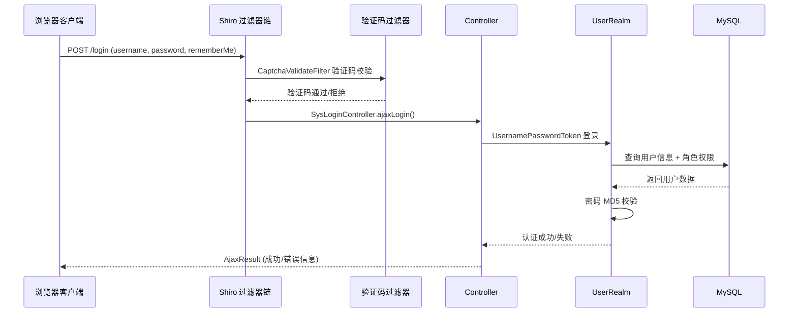
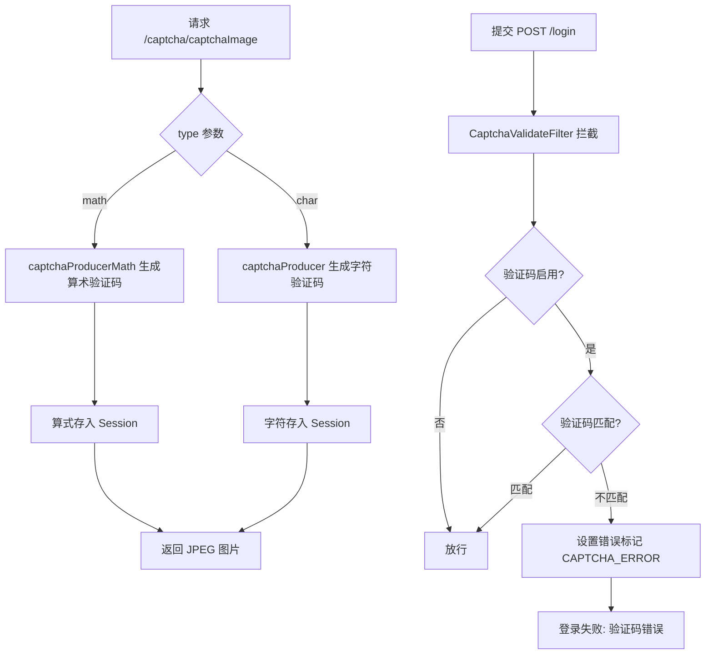

# 认证与账户 API

**本文档中引用的文件**
- [SysLoginController.java](../../../../ruoyi-admin/src/main/java/com/ruoyi/web/controller/system/SysLoginController.java)
- [SysRegisterController.java](../../../../ruoyi-admin/src/main/java/com/ruoyi/web/controller/system/SysRegisterController.java)
- [SysCaptchaController.java](../../../../ruoyi-admin/src/main/java/com/ruoyi/web/controller/system/SysCaptchaController.java)
- [SysProfileController.java](../../../../ruoyi-admin/src/main/java/com/ruoyi/web/controller/system/SysProfileController.java)
- [SysRegisterService.java](../../../../ruoyi-framework/src/main/java/com/ruoyi/framework/shiro/service/SysRegisterService.java)
- [SysPasswordService.java](../../../../ruoyi-framework/src/main/java/com/ruoyi/framework/shiro/service/SysPasswordService.java)
- [CaptchaConfig.java](../../../../ruoyi-framework/src/main/java/com/ruoyi/framework/config/CaptchaConfig.java)
- [CaptchaValidateFilter.java](../../../../ruoyi-framework/src/main/java/com/ruoyi/framework/shiro/web/filter/captcha/CaptchaValidateFilter.java)
- [ShiroConfig.java](../../../../ruoyi-framework/src/main/java/com/ruoyi/framework/config/ShiroConfig.java)
- [application.yml](../../../../ruoyi-admin/src/main/resources/application.yml)
- [PermitAllUrlProperties.java](../../../../ruoyi-framework/src/main/java/com/ruoyi/framework/config/properties/PermitAllUrlProperties.java)
- [Anonymous.java](../../../../ruoyi-common/src/main/java/com/ruoyi/common/annotation/Anonymous.java)

## 目录

1. [简介](#简介)
2. [认证与授权流程](#认证与授权流程)
3. [API 端点](#api-端点)
4. [验证码机制](#验证码机制)
5. [密码策略](#密码策略)
6. [会话管理](#会话管理)
7. [错误处理](#错误处理)

## 简介

认证与账户模块是 RuoYi 系统的安全入口，负责用户登录验证、注册、验证码生成、个人信息管理等核心身份认证功能。系统基于 Apache Shiro 2.2.0 实现认证与授权，支持表单登录、记住我、验证码校验、密码错误次数锁定等安全机制。

**核心功能**

- 用户登录（用户名 + 密码 + 验证码）
- 用户注册（受开关控制）
- 验证码生成（字符型/算术型）
- 个人信息查看与修改
- 密码重置与头像更新
- 会话管理（并发控制、踢出）

> 来源：[SysLoginController.java](../../../../ruoyi-admin/src/main/java/com/ruoyi/web/controller/system/SysLoginController.java)、[ShiroConfig.java](../../../../ruoyi-framework/src/main/java/com/ruoyi/framework/config/ShiroConfig.java)

## 认证与授权流程



**过滤器链顺序**

根据 [ShiroConfig.java](../../../../ruoyi-framework/src/main/java/com/ruoyi/framework/config/ShiroConfig.java) 配置，Shiro 过滤器链按以下顺序执行：

1. `user` — 用户身份验证过滤器
2. `kickout` — 会话并发控制（踢出）
3. `onlineSession` — 在线会话记录
4. `syncOnlineSession` — 同步在线会话
5. `captchaValidate` — 验证码校验（POST 表单提交时生效）
6. `csrfValidate` — CSRF 校验（默认关闭）

**匿名访问**

通过 `@Anonymous` 注解标记的方法或控制器可以免登录访问。[PermitAllUrlProperties.java](../../../../ruoyi-framework/src/main/java/com/ruoyi/framework/config/properties/PermitAllUrlProperties.java) 在启动时自动扫描所有 `@Controller` 类，收集带有 `@Anonymous` 注解的 URL 并注入 Shiro 过滤链。

> 来源：[ShiroConfig.java](../../../../ruoyi-framework/src/main/java/com/ruoyi/framework/config/ShiroConfig.java)、[PermitAllUrlProperties.java](../../../../ruoyi-framework/src/main/java/com/ruoyi/framework/config/properties/PermitAllUrlProperties.java)

## API 端点

### 登录

| 方法 | 路径 | 说明 | 认证要求 |
|------|------|------|----------|
| GET | `/login` | 登录页面 | 匿名 |
| POST | `/login` | 登录提交 | 匿名（需验证码） |
| GET | `/unauth` | 未授权页面 | 匿名 |

**GET /login** — 返回登录页面视图。如果是 Ajax 请求，返回 JSON 字符串 `{"code":"1","msg":"未登录或登录超时。请重新登录"}`。页面携带两个属性：
- `isRemembered` — 是否开启"记住我"功能（配置项 `shiro.rememberMe.enabled`）
- `isAllowRegister` — 是否允许用户注册（配置项 `sys.account.registerUser`）

**POST /login** — 登录提交接口。

请求参数：

| 参数 | 类型 | 说明 |
|------|------|------|
| `username` | String | 登录名 |
| `password` | String | 密码 |
| `rememberMe` | Boolean | 是否记住我 |

成功响应：

```json
{
  "code": 0,
  "msg": "操作成功"
}
```

失败响应：

```json
{
  "code": 1,
  "msg": "用户或密码错误"
}
```

> 来源：[SysLoginController.java](../../../../ruoyi-admin/src/main/java/com/ruoyi/web/controller/system/SysLoginController.java)

### 注册

| 方法 | 路径 | 说明 | 认证要求 |
|------|------|------|----------|
| GET | `/register` | 注册页面 | 匿名 |
| POST | `/register` | 注册提交 | 匿名 |

注册功能受配置项 `sys.account.registerUser` 控制，仅当值为 `"true"` 时开放注册。

注册校验规则（来自 [SysRegisterService.java](../../../../ruoyi-framework/src/main/java/com/ruoyi/framework/shiro/service/SysRegisterService.java)）：

| 条件 | 提示信息 |
|------|----------|
| 验证码错误 | "验证码错误" |
| 用户名为空 | "用户名不能为空" |
| 密码为空 | "用户密码不能为空" |
| 密码长度不在 5–20 之间 | "密码长度必须在5到20个字符之间" |
| 账户长度不在 2–20 之间 | "账户长度必须在2到20个字符之间" |
| 注册账号已存在 | "保存用户'{loginName}'失败，注册账号已存在" |
| 注册失败 | "注册失败,请联系系统管理人员" |

注册成功后异步记录操作日志（`AsyncFactory.recordLogininfor`）。

> 来源：[SysRegisterController.java](../../../../ruoyi-admin/src/main/java/com/ruoyi/web/controller/system/SysRegisterController.java)、[SysRegisterService.java](../../../../ruoyi-framework/src/main/java/com/ruoyi/framework/shiro/service/SysRegisterService.java)

### 验证码

| 方法 | 路径 | 说明 | 认证要求 |
|------|------|------|----------|
| GET | `/captcha/captchaImage` | 生成验证码图片 | 匿名 |

**GET /captcha/captchaImage?type=math|char** — 生成验证码图片，返回 `image/jpeg` 格式。

请求参数：

| 参数 | 类型 | 说明 | 默认值 |
|------|------|------|--------|
| `type` | String | 验证码类型：`math`（算术）或 `char`（字符） | 由配置 `shiro.user.captchaType` 决定 |

验证码类型说明：

| 类型 | 说明 | 生成方式 |
|------|------|----------|
| `math` | 算术验证码 | 显示算式（如 `1+2=?`），Session 中保存计算结果 |
| `char` | 字符验证码 | 显示随机字符，Session 中保存原文 |

验证码存储在 Session 中，键为 `Constants.KAPTCHA_SESSION_KEY`。验证码过滤器 [CaptchaValidateFilter.java](../../../../ruoyi-framework/src/main/java/com/ruoyi/framework/shiro/web/filter/captcha/CaptchaValidateFilter.java) 在登录提交时校验验证码，校验后立即从 Session 中移除（防止重复使用）。

Kaptcha 生产者配置见 [CaptchaConfig.java](../../../../ruoyi-framework/src/main/java/com/ruoyi/framework/config/CaptchaConfig.java)：
- `captchaProducer` — 字符验证码，4 位字符，阴影样式
- `captchaProducerMath` — 算术验证码，6 位字符（含算式符号），自定义文本生成器 `KaptchaTextCreator`

> 来源：[SysCaptchaController.java](../../../../ruoyi-admin/src/main/java/com/ruoyi/web/controller/system/SysCaptchaController.java)、[CaptchaConfig.java](../../../../ruoyi-framework/src/main/java/com/ruoyi/framework/config/CaptchaConfig.java)

### 个人信息

前缀 `/system/user/profile`。

| 方法 | 路径 | 说明 | 认证要求 |
|------|------|------|----------|
| GET | `/system/user/profile` | 个人信息页面 | 登录 |
| GET | `/system/user/profile/checkPassword` | 校验密码 | 登录 |
| GET | `/system/user/profile/resetPwd` | 密码重置页面 | 登录 |
| POST | `/system/user/profile/resetPwd` | 提交密码重置 | 登录 |
| GET | `/system/user/profile/edit` | 编辑信息页面 | 登录 |
| POST | `/system/user/profile/update` | 更新个人信息 | 登录 |
| GET | `/system/user/profile/avatar` | 头像修改页面 | 登录 |
| POST | `/system/user/profile/updateAvatar` | 上传头像 | 登录 |

**POST /system/user/profile/resetPwd** — 重置密码。

请求参数：

| 参数 | 类型 | 说明 |
|------|------|------|
| `oldPassword` | String | 旧密码 |
| `newPassword` | String | 新密码 |

校验规则：
- 旧密码错误 → "修改密码失败，旧密码错误"
- 新密码与旧密码相同 → "新密码不能与旧密码相同"
- 成功后使用新 salt 重新加密密码并更新

**POST /system/user/profile/update** — 更新个人信息。

请求参数：

| 参数 | 类型 | 说明 |
|------|------|------|
| `userName` | String | 用户昵称 |
| `email` | String | 邮箱 |
| `phonenumber` | String | 手机号码 |
| `sex` | String | 性别 |

校验规则：
- 手机号已存在 → "修改用户'{loginName}'失败，手机号码已存在"
- 邮箱已存在 → "修改用户'{loginName}'失败，邮箱账号已存在"

**POST /system/user/profile/updateAvatar** — 上传头像。

请求参数：

| 参数 | 类型 | 说明 |
|------|------|------|
| `avatarfile` | MultipartFile | 头像文件 |

限制：仅允许图片类型（通过 `MimeTypeUtils.IMAGE_EXTENSION` 限定），上传路径由 `RuoYiConfig.getAvatarPath()` 指定。上传成功后自动删除旧头像文件。

> 来源：[SysProfileController.java](../../../../ruoyi-admin/src/main/java/com/ruoyi/web/controller/system/SysProfileController.java)

## 验证码机制



验证码开关与类型通过 `application.yml` 配置（`shiro.user.captchaEnabled`、`shiro.user.captchaType`）。验证码校验由 [CaptchaValidateFilter.java](../../../../ruoyi-framework/src/main/java/com/ruoyi/framework/shiro/web/filter/captcha/CaptchaValidateFilter.java) 在 Shiro 过滤器链中完成，仅在 POST 表单提交时校验，GET 请求直接放行。

> 来源：[application.yml](../../../../ruoyi-admin/src/main/resources/application.yml)(L96-L98)、[CaptchaValidateFilter.java](../../../../ruoyi-framework/src/main/java/com/ruoyi/framework/shiro/web/filter/captcha/CaptchaValidateFilter.java)

## 密码策略

**加密方式**

密码使用 MD5 加盐哈希，公式为：

```
MD5(loginName + password + salt)
```

salt 通过 `ShiroUtils.randomSalt()` 随机生成。

**密码错误锁定**

通过 [SysPasswordService.java](../../../../ruoyi-framework/src/main/java/com/ruoyi/framework/shiro/service/SysPasswordService.java) 实现：

| 配置项 | 默认值 | 说明 |
|--------|--------|------|
| `user.password.maxRetryCount` | 5 | 最大密码错误次数 |

- 使用 EhCache 缓存 `loginRecordCache`，以用户名为键记录错误次数（`AtomicInteger`）
- 错误次数超过 `maxRetryCount` 时抛出 `UserPasswordRetryLimitExceedException`，并记录操作日志
- 登录成功后清除该用户的错误计数缓存
- 缓存过期时间由 ehcache-shiro.xml 配置决定（默认锁定 10 分钟）

> 来源：[SysPasswordService.java](../../../../ruoyi-framework/src/main/java/com/ruoyi/framework/shiro/service/SysPasswordService.java)、[application.yml](../../../../ruoyi-admin/src/main/resources/application.yml)(L41-L44)

## 会话管理

**Session 配置**（来自 [application.yml](../../../../ruoyi-admin/src/main/resources/application.yml) 和 [ShiroConfig.java](../../../../ruoyi-framework/src/main/java/com/ruoyi/framework/config/ShiroConfig.java)）：

| 配置项 | 默认值 | 说明 |
|--------|--------|------|
| `shiro.session.expireTime` | 30 | Session 超时时间（分钟） |
| `shiro.session.validationInterval` | 10 | Session 有效性检查间隔（分钟） |
| `shiro.session.maxSession` | -1 | 同一用户最大会话数（-1 为不限制） |
| `shiro.session.kickoutAfter` | false | 是否踢出之后登录的用户 |
| `shiro.rememberMe.enabled` | true | 是否开启"记住我" |
| `shiro.cookie.maxAge` | 30 | Cookie 过期时间（天） |

**记住我（RememberMe）**

通过 [CustomCookieRememberMeManager](../../../../ruoyi-framework/src/main/java/com/ruoyi/framework/shiro/rememberMe/CustomCookieRememberMeManager.java) 实现，使用 AES 加密。`cipherKey` 可在配置中指定固定密钥（生产环境建议设置固定值），否则每次启动生成随机密钥导致之前客户端的 RememberMe Cookie 失效。

**并发登录控制**

通过 `KickoutSessionFilter` 实现，支持两种模式：
- `kickoutAfter=false`（默认）：踢出之前登录的用户
- `kickoutAfter=true`：踢出之后登录的用户

> 来源：[ShiroConfig.java](../../../../ruoyi-framework/src/main/java/com/ruoyi/framework/config/ShiroConfig.java)、[application.yml](../../../../ruoyi-admin/src/main/resources/application.yml)(L86-L123)

## 错误处理

**认证异常类型**

| 异常类 | 触发条件 |
|--------|----------|
| `UserPasswordNotMatchException` | 密码不匹配 |
| `UserPasswordRetryLimitExceedException` | 密码错误次数超限 |
| `CaptchaException` | 验证码错误 |
| `AuthenticationException` | Shiro 通用认证异常 |

**错误响应格式**

所有认证接口统一返回 `AjaxResult` JSON 格式：

```json
{
  "code": 1,
  "msg": "用户或密码错误"
}
```

**登录失败场景**

| 场景 | 错误提示 |
|------|----------|
| 用户名或密码错误 | "用户或密码错误"（默认）或具体异常消息 |
| 密码错误超限 | "密码错误次数超限，请 10 分钟后再试" |
| 验证码错误 | "验证码错误" |
| 注册未开启 | "当前系统没有开启注册功能！" |
| Ajax 请求超时 | `{"code":"1","msg":"未登录或登录超时。请重新登录"}` |

> 来源：[SysLoginController.java](../../../../ruoyi-admin/src/main/java/com/ruoyi/web/controller/system/SysLoginController.java)、[SysPasswordService.java](../../../../ruoyi-framework/src/main/java/com/ruoyi/framework/shiro/service/SysPasswordService.java)