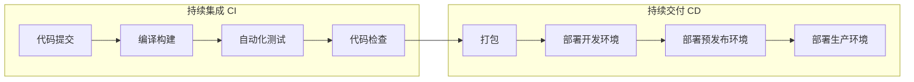
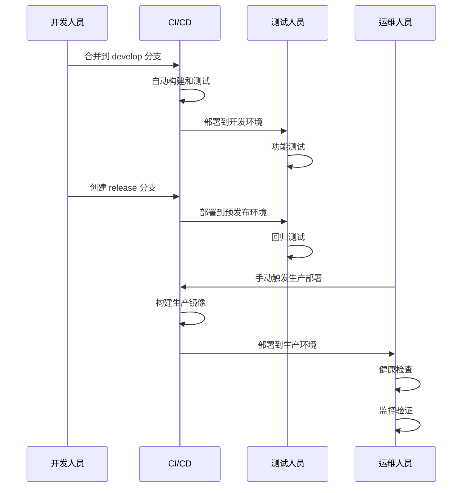

# CI/CD 配置文档

**本文档中引用的文件**
- [pom.xml](../../../pom.xml)
- [application.yml](../../../ruoyi-admin/src/main/resources/application.yml)
- [部署与运维.md](./部署与运维.md)

## 目录
1. [CI/CD 概述](#cicd-概述)
2. [GitHub Actions 配置](#github-actions-配置)
3. [Jenkins 流水线](#jenkins-流水线)
4. [Docker 部署配置](#docker-部署配置)
5. [自动化测试集成](#自动化测试集成)
6. [代码质量检查](#代码质量检查)
7. [发布管理](#发布管理)
8. [回滚策略](#回滚策略)

## CI/CD 概述

### 流水线架构



### 环境定义

| 环境 | 用途 | 分支 | 部署方式 |
|------|------|------|----------|
| 开发环境 (dev) | 日常开发测试 | feature/* | 自动部署 |
| 预发布环境 (staging) | 集成测试 | develop | 自动部署 |
| 生产环境 (prod) | 正式上线 | main/master | 手动触发 |

## GitHub Actions 配置

### 目录结构

```
.github/
└── workflows/
    ├── ci.yml              # 持续集成
    ├── cd-dev.yml          # 开发环境部署
    ├── cd-staging.yml      # 预发布环境部署
    ├── cd-prod.yml         # 生产环境部署
    └── code-quality.yml    # 代码质量检查
```

### 持续集成配置 (ci.yml)

```yaml
name: CI

on:
  push:
    branches: [ main, develop ]
  pull_request:
    branches: [ main, develop ]

permissions:
  contents: read

jobs:
  build:
    runs-on: ubuntu-latest
    
    steps:
      - name: 检出代码
        uses: actions/checkout@v4
        
      - name: 设置 JDK 17
        uses: actions/setup-java@v4
        with:
          java-version: '17'
          distribution: 'corretto'
          cache: maven
          
      - name: 缓存 Maven 依赖
        uses: actions/cache@v4
        with:
          path: ~/.m2/repository
          key: ${{ runner.os }}-maven-${{ hashFiles('**/pom.xml') }}
          restore-keys: |
            ${{ runner.os }}-maven-
            
      - name: 编译项目
        run: mvn compile -B
        
      - name: 运行单元测试
        run: mvn test -B
        
      - name: 运行集成测试
        run: mvn verify -B -P integration-test
        
      - name: 上传测试报告
        if: always()
        uses: actions/upload-artifact@v4
        with:
          name: test-reports
          path: '**/target/surefire-reports/'
          retention-days: 7
          
      - name: 代码覆盖率检查
        run: mvn jacoco:report -B
        
      - name: 上传覆盖率报告
        if: always()
        uses: actions/upload-artifact@v4
        with:
          name: coverage-reports
          path: '**/target/site/jacoco/'
          retention-days: 7
```

### 开发环境部署 (cd-dev.yml)

```yaml
name: CD - Dev

on:
  push:
    branches: [ develop ]

jobs:
  deploy-dev:
    runs-on: ubuntu-latest
    environment: dev
    
    steps:
      - name: 检出代码
        uses: actions/checkout@v4
        
      - name: 设置 JDK 17
        uses: actions/setup-java@v4
        with:
          java-version: '17'
          distribution: 'corretto'
          cache: maven
          
      - name: 构建项目
        run: mvn clean package -DskipTests -B
        
      - name: 构建 Docker 镜像
        run: |
          docker build -t ruoyi-admin:dev-${{ github.sha }} .
          docker tag ruoyi-admin:dev-${{ github.sha }} ruoyi-admin:dev-latest
          
      - name: 登录容器仓库
        uses: docker/login-action@v3
        with:
          registry: ${{ secrets.DOCKER_REGISTRY }}
          username: ${{ secrets.DOCKER_USERNAME }}
          password: ${{ secrets.DOCKER_PASSWORD }}
          
      - name: 推送镜像
        run: |
          docker push ${{ secrets.DOCKER_REGISTRY }}/ruoyi-admin:dev-${{ github.sha }}
          docker push ${{ secrets.DOCKER_REGISTRY }}/ruoyi-admin:dev-latest
          
      - name: 部署到开发环境
        uses: appleboy/ssh-action@v1
        with:
          host: ${{ secrets.DEV_HOST }}
          username: ${{ secrets.DEV_USERNAME }}
          key: ${{ secrets.DEV_SSH_KEY }}
          script: |
            docker pull ${{ secrets.DOCKER_REGISTRY }}/ruoyi-admin:dev-latest
            docker stop ruoyi-admin || true
            docker rm ruoyi-admin || true
            docker run -d --name ruoyi-admin \
              -p 8080:80 \
              -v /data/upload:/data/upload \
              -v /data/logs:/data/logs \
              --env SPRING_PROFILES_ACTIVE=dev \
              ${{ secrets.DOCKER_REGISTRY }}/ruoyi-admin:dev-latest
```

### 生产环境部署 (cd-prod.yml)

```yaml
name: CD - Production

on:
  workflow_dispatch:
    inputs:
      version:
        description: '发布版本号'
        required: true
        type: string
      environment:
        description: '部署环境'
        required: true
        default: 'production'
        type: choice
        options:
          - production
          - staging

jobs:
  deploy-prod:
    runs-on: ubuntu-latest
    environment: production
    
    steps:
      - name: 检出代码
        uses: actions/checkout@v4
        with:
          ref: v${{ inputs.version }}
          
      - name: 设置 JDK 17
        uses: actions/setup-java@v4
        with:
          java-version: '17'
          distribution: 'corretto'
          cache: maven
          
      - name: 构建项目
        run: mvn clean package -DskipTests -B
        
      - name: 构建 Docker 镜像
        run: |
          docker build -t ruoyi-admin:${{ inputs.version }} .
          docker tag ruoyi-admin:${{ inputs.version }} ruoyi-admin:prod-latest
          
      - name: 登录容器仓库
        uses: docker/login-action@v3
        with:
          registry: ${{ secrets.DOCKER_REGISTRY }}
          username: ${{ secrets.DOCKER_USERNAME }}
          password: ${{ secrets.DOCKER_PASSWORD }}
          
      - name: 推送镜像
        run: |
          docker push ${{ secrets.DOCKER_REGISTRY }}/ruoyi-admin:${{ inputs.version }}
          docker push ${{ secrets.DOCKER_REGISTRY }}/ruoyi-admin:prod-latest
          
      - name: 部署到生产环境
        uses: appleboy/ssh-action@v1
        with:
          host: ${{ secrets.PROD_HOST }}
          username: ${{ secrets.PROD_USERNAME }}
          key: ${{ secrets.PROD_SSH_KEY }}
          script: |
            docker pull ${{ secrets.DOCKER_REGISTRY }}/ruoyi-admin:${{ inputs.version }}
            docker stop ruoyi-admin || true
            docker rm ruoyi-admin || true
            docker run -d --name ruoyi-admin \
              -p 80:80 \
              -v /data/upload:/data/upload \
              -v /data/logs:/data/logs \
              --env SPRING_PROFILES_ACTIVE=prod \
              --restart=always \
              ${{ secrets.DOCKER_REGISTRY }}/ruoyi-admin:${{ inputs.version }}
              
      - name: 健康检查
        run: |
          sleep 30
          curl -f http://${{ secrets.PROD_HOST }}/actuator/health || exit 1
          
      - name: 通知部署结果
        if: always()
        run: |
          echo "部署版本: ${{ inputs.version }}"
          echo "部署环境: ${{ inputs.environment }}"
          echo "部署状态: ${{ job.status }}"
```

### 代码质量检查 (code-quality.yml)

```yaml
name: Code Quality

on:
  push:
    branches: [ main, develop ]
  pull_request:
    branches: [ main, develop ]

jobs:
  code-quality:
    runs-on: ubuntu-latest
    
    steps:
      - name: 检出代码
        uses: actions/checkout@v4
        
      - name: 设置 JDK 17
        uses: actions/setup-java@v4
        with:
          java-version: '17'
          distribution: 'corretto'
          cache: maven
          
      - name: Checkstyle 检查
        run: mvn checkstyle:check -B
        
      - name: PMD 检查
        run: mvn pmd:check -B
        
      - name: SpotBugs 检查
        run: mvn spotbugs:check -B
        
      - name: SonarQube 扫描
        run: mvn sonar:sonar -B
        env:
          SONAR_TOKEN: ${{ secrets.SONAR_TOKEN }}
          SONAR_HOST_URL: ${{ secrets.SONAR_HOST_URL }}
```

## Jenkins 流水线

### Jenkinsfile

```groovy
pipeline {
    agent any
    
    environment {
        DOCKER_REGISTRY = credentials('docker-registry')
        MAVEN_HOME = tool 'Maven'
        JAVA_HOME = tool 'JDK17'
    }
    
    tools {
        maven 'Maven'
        jdk 'JDK17'
    }
    
    stages {
        stage('检出代码') {
            steps {
                checkout scm
            }
        }
        
        stage('编译构建') {
            steps {
                sh 'mvn clean compile -B'
            }
        }
        
        stage('单元测试') {
            steps {
                sh 'mvn test -B'
            }
            post {
                always {
                    junit '**/target/surefire-reports/*.xml'
                }
            }
        }
        
        stage('代码质量检查') {
            steps {
                sh 'mvn checkstyle:check pmd:check -B'
            }
        }
        
        stage('打包') {
            steps {
                sh 'mvn package -DskipTests -B'
            }
        }
        
        stage('构建镜像') {
            steps {
                sh """
                    docker build -t ruoyi-admin:${BUILD_NUMBER} .
                    docker tag ruoyi-admin:${BUILD_NUMBER} ${DOCKER_REGISTRY}/ruoyi-admin:${BUILD_NUMBER}
                """
            }
        }
        
        stage('推送镜像') {
            steps {
                sh "docker push ${DOCKER_REGISTRY}/ruoyi-admin:${BUILD_NUMBER}"
            }
        }
        
        stage('部署') {
            when {
                anyOf {
                    branch 'main'
                    branch 'develop'
                }
            }
            steps {
                sh """
                    ssh deploy@target-host "
                        docker pull ${DOCKER_REGISTRY}/ruoyi-admin:${BUILD_NUMBER}
                        docker stop ruoyi-admin || true
                        docker rm ruoyi-admin || true
                        docker run -d --name ruoyi-admin \
                            -p 80:80 \
                            -v /data/upload:/data/upload \
                            -v /data/logs:/data/logs \
                            --restart=always \
                            ${DOCKER_REGISTRY}/ruoyi-admin:${BUILD_NUMBER}
                    "
                """
            }
        }
    }
    
    post {
        success {
            echo '部署成功！'
        }
        failure {
            echo '部署失败！'
        }
        always {
            cleanWs()
        }
    }
}
```

## Docker 部署配置

### Dockerfile

```dockerfile
# 构建阶段
FROM eclipse-temurin:17-jdk-jammy AS builder
WORKDIR /app
COPY pom.xml .
COPY ruoyi-admin/pom.xml ruoyi-admin/
COPY ruoyi-common/pom.xml ruoyi-common/
COPY ruoyi-framework/pom.xml ruoyi-framework/
COPY ruoyi-system/pom.xml ruoyi-system/
COPY ruoyi-quartz/pom.xml ruoyi-quartz/
COPY ruoyi-generator/pom.xml ruoyi-generator/
RUN mvn dependency:go-offline -B

COPY . .
RUN mvn clean package -DskipTests -B

# 运行阶段
FROM eclipse-temurin:17-jre-jammy
WORKDIR /app

# 安装必要工具
RUN apt-get update && apt-get install -y curl && rm -rf /var/lib/apt/lists/*

# 创建非 root 用户
RUN groupadd -r appuser && useradd -r -g appuser appuser

# 复制构建产物
COPY --from=builder /app/ruoyi-admin/target/ruoyi-admin.jar app.jar

# 创建数据目录
RUN mkdir -p /data/upload /data/logs && chown -R appuser:appuser /data

# 切换到非 root 用户
USER appuser

# 暴露端口
EXPOSE 8080

# 健康检查
HEALTHCHECK --interval=30s --timeout=10s --start-period=60s --retries=3 \
    CMD curl -f http://localhost:8080/actuator/health || exit 1

# JVM 参数
ENV JAVA_OPTS="-Xms512m -Xmx1024m -XX:+UseG1GC -XX:MaxGCPauseMillis=200"

# 启动命令
ENTRYPOINT ["sh", "-c", "java ${JAVA_OPTS} -jar app.jar"]
```

### Docker Compose

```yaml
version: '3.8'

services:
  ruoyi-admin:
    build:
      context: .
      dockerfile: Dockerfile
    container_name: ruoyi-admin
    ports:
      - "8080:8080"
    environment:
      - SPRING_PROFILES_ACTIVE=prod
      - JAVA_OPTS=-Xms512m -Xmx1024m -XX:+UseG1GC
      - SPRING_DATASOURCE_URL=jdbc:mysql://mysql:3306/ry-spring?useUnicode=true&characterEncoding=utf8
      - SPRING_DATASOURCE_USERNAME=root
      - SPRING_DATASOURCE_PASSWORD=${DB_PASSWORD}
      - SPRING_REDIS_HOST=redis
      - SPRING_REDIS_PORT=6379
    volumes:
      - upload-data:/data/upload
      - log-data:/data/logs
    depends_on:
      mysql:
        condition: service_healthy
      redis:
        condition: service_healthy
    restart: always
    networks:
      - ruoyi-network
    
  mysql:
    image: mysql:8.0
    container_name: ruoyi-mysql
    environment:
      - MYSQL_ROOT_PASSWORD=${DB_PASSWORD}
      - MYSQL_DATABASE=ry-spring
      - MYSQL_CHARACTER_SET_SERVER=utf8mb4
      - MYSQL_COLLATION_SERVER=utf8mb4_unicode_ci
    volumes:
      - mysql-data:/var/lib/mysql
      - ./sql:/docker-entrypoint-initdb.d
    ports:
      - "3306:3306"
    healthcheck:
      test: ["CMD", "mysqladmin", "ping", "-h", "localhost"]
      interval: 10s
      timeout: 5s
      retries: 5
    restart: always
    networks:
      - ruoyi-network
    
  redis:
    image: redis:7-alpine
    container_name: ruoyi-redis
    ports:
      - "6379:6379"
    volumes:
      - redis-data:/data
    healthcheck:
      test: ["CMD", "redis-cli", "ping"]
      interval: 10s
      timeout: 5s
      retries: 5
    restart: always
    networks:
      - ruoyi-network
    
  nginx:
    image: nginx:alpine
    container_name: ruoyi-nginx
    ports:
      - "80:80"
    volumes:
      - ./nginx/nginx.conf:/etc/nginx/nginx.conf
      - ./nginx/conf.d:/etc/nginx/conf.d
    depends_on:
      - ruoyi-admin
    restart: always
    networks:
      - ruoyi-network

volumes:
  mysql-data:
  redis-data:
  upload-data:
  log-data:

networks:
  ruoyi-network:
    driver: bridge
```

### 环境变量文件 (.env)

```bash
# 数据库配置
DB_PASSWORD=your_strong_password

# Docker 仓库
DOCKER_REGISTRY=registry.example.com

# 应用配置
SPRING_PROFILES_ACTIVE=prod
```

## 自动化测试集成

### Maven 测试配置

```xml
<!-- pom.xml 测试相关配置 -->
<plugins>
    <!-- Surefire 插件 - 单元测试 -->
    <plugin>
        <groupId>org.apache.maven.plugins</groupId>
        <artifactId>maven-surefire-plugin</artifactId>
        <version>3.2.5</version>
        <configuration>
            <includes>
                <include>**/*Test.java</include>
            </includes>
            <excludes>
                <exclude>**/*IntegrationTest.java</exclude>
            </excludes>
        </configuration>
    </plugin>
    
    <!-- Failsafe 插件 - 集成测试 -->
    <plugin>
        <groupId>org.apache.maven.plugins</groupId>
        <artifactId>maven-failsafe-plugin</artifactId>
        <version>3.2.5</version>
        <configuration>
            <includes>
                <include>**/*IntegrationTest.java</include>
            </includes>
        </configuration>
        <executions>
            <execution>
                <goals>
                    <goal>integration-test</goal>
                    <goal>verify</goal>
                </goals>
            </execution>
        </executions>
    </plugin>
    
    <!-- JaCoCo 插件 - 代码覆盖率 -->
    <plugin>
        <groupId>org.jacoco</groupId>
        <artifactId>jacoco-maven-plugin</artifactId>
        <version>0.8.11</version>
        <executions>
            <execution>
                <goals>
                    <goal>prepare-agent</goal>
                </goals>
            </execution>
            <execution>
                <id>report</id>
                <phase>test</phase>
                <goals>
                    <goal>report</goal>
                </goals>
            </execution>
            <execution>
                <id>check</id>
                <goals>
                    <goal>check</goal>
                </goals>
                <configuration>
                    <rules>
                        <rule>
                            <element>BUNDLE</element>
                            <limits>
                                <limit>
                                    <counter>LINE</counter>
                                    <value>COVEREDRATIO</value>
                                    <minimum>0.60</minimum>
                                </limit>
                            </limits>
                        </rule>
                    </rules>
                </configuration>
            </execution>
        </executions>
    </plugin>
</plugins>
```

## 代码质量检查

### Checkstyle 配置

```xml
<!-- checkstyle.xml 关键规则 -->
<module name="Checker">
    <module name="TreeWalker">
        <!-- 命名规范 -->
        <module name="ConstantName"/>
        <module name="LocalVariableName"/>
        <module name="MemberName"/>
        <module name="MethodName"/>
        <module name="PackageName"/>
        <module name="ParameterName"/>
        <module name="TypeName"/>
        
        <!-- 代码风格 -->
        <module name="AvoidStarImport"/>
        <module name="RedundantImport"/>
        <module name="UnusedImports"/>
        <module name="LineLength">
            <property name="max" value="120"/>
        </module>
        <module name="Indentation">
            <property name="basicOffset" value="4"/>
        </module>
        
        <!-- 代码质量 -->
        <module name="EmptyBlock"/>
        <module name="LeftCurly"/>
        <module name="RightCurly"/>
        <module name="SimplifyBooleanExpression"/>
        <module name="SimplifyBooleanReturn"/>
    </module>
</module>
```

### PMD 配置

```xml
<!-- pmd.xml 关键规则 -->
<ruleset name="RuoYi PMD Rules">
    <rule ref="category/java/bestpractices.xml">
        <exclude name="JUnitTestContainsTooManyAsserts"/>
    </rule>
    <rule ref="category/java/codestyle.xml">
        <exclude name="LongVariable"/>
    </rule>
    <rule ref="category/java/design.xml">
        <exclude name="LawOfDemeter"/>
    </rule>
    <rule ref="category/java/errorprone.xml"/>
    <rule ref="category/java/security.xml"/>
    
    <!-- 自定义规则 -->
    <rule ref="category/java/design.xml/TooManyMethods">
        <properties>
            <property name="maxmethods" value="20"/>
        </properties>
    </rule>
</ruleset>
```

### SonarQube 配置

```properties
# sonar-project.properties
sonar.projectKey=ruoyi
sonar.projectName=RuoYi
sonar.projectVersion=4.8.3

sonar.sources=ruoyi-admin/src/main/java,ruoyi-common/src/main/java,ruoyi-framework/src/main/java,ruoyi-system/src/main/java
sonar.tests=ruoyi-admin/src/test/java,ruoyi-system/src/test/java
sonar.java.binaries=target/classes
sonar.java.libraries=target/*.jar

sonar.exclusions=**/generated/**,**/target/**
sonar.test.exclusions=**/test/**

# 质量门禁
sonar.qualitygate.wait=true

# 覆盖率排除
sonar.coverage.exclusions=**/config/**,**/domain/**,**/mapper/**
```

## 发布管理

### 版本号规范

遵循语义化版本（Semantic Versioning）：

```
主版本号.次版本号.修订号
MAJOR.MINOR.PATCH

示例：
4.8.3  -> 4: 主版本, 8: 次版本, 3: 修订号
```

- **MAJOR**：不兼容的 API 变更
- **MINOR**：向下兼容的功能新增
- **PATCH**：向下兼容的问题修复

### Git 分支策略

```
main (生产分支)
├── develop (开发分支)
│   ├── feature/user-management (功能分支)
│   ├── feature/project-management (功能分支)
│   └── feature/notification (功能分支)
├── hotfix/security-patch (热修复分支)
└── release/4.9.0 (发布分支)
```

**分支命名规范**：
- 功能分支：`feature/<功能名称>`
- 修复分支：`bugfix/<问题描述>`
- 热修复分支：`hotfix/<紧急修复>`
- 发布分支：`release/<版本号>`

### 发布流程



### Git Tag 管理

```bash
# 创建发布标签
git tag -a v4.9.0 -m "Release version 4.9.0"

# 推送标签
git push origin v4.9.0

# 查看所有标签
git tag -l

# 删除标签（仅在错误时使用）
git tag -d v4.9.0
git push origin :refs/tags/v4.9.0
```

## 回滚策略

### Docker 回滚

```bash
#!/bin/bash
# rollback.sh - 回滚脚本

VERSION=$1
if [ -z "$VERSION" ]; then
    echo "用法: ./rollback.sh <版本号>"
    exit 1
fi

echo "回滚到版本: $VERSION"

# 拉取指定版本镜像
docker pull ${DOCKER_REGISTRY}/ruoyi-admin:${VERSION}

# 停止当前容器
docker stop ruoyi-admin
docker rm ruoyi-admin

# 启动指定版本容器
docker run -d --name ruoyi-admin \
    -p 80:80 \
    -v /data/upload:/data/upload \
    -v /data/logs:/data/logs \
    --restart=always \
    ${DOCKER_REGISTRY}/ruoyi-admin:${VERSION}

# 健康检查
sleep 30
curl -f http://localhost/actuator/health || {
    echo "回滚失败！"
    exit 1
}

echo "回滚成功！"
```

### 数据库回滚

```bash
#!/bin/bash
# db-rollback.sh - 数据库回滚脚本

BACKUP_FILE=$1
if [ -z "$BACKUP_FILE" ]; then
    echo "用法: ./db-rollback.sh <备份文件路径>"
    exit 1
fi

echo "回滚数据库到: $BACKUP_FILE"

# 备份当前数据库
CURRENT_BACKUP="/data/backup/ry-spring_$(date +%Y%m%d%H%M%S).sql"
mysqldump -u root -p ry-spring > "$CURRENT_BACKUP"
echo "当前数据库已备份到: $CURRENT_BACKUP"

# 执行回滚
mysql -u root -p ry-spring < "$BACKUP_FILE"

echo "数据库回滚完成"
```

### 回滚检查清单

- [ ] 确认回滚版本号
- [ ] 备份当前数据库
- [ ] 通知相关人员
- [ ] 执行回滚操作
- [ ] 健康检查
- [ ] 功能验证
- [ ] 监控验证
- [ ] 记录回滚原因

## 参考文档
- [pom.xml](../../../pom.xml) - 依赖配置
- [部署与运维.md](./部署与运维.md) - 部署配置
- [测试策略.md](./测试策略.md) - 测试策略
- [性能优化指南.md](./性能优化指南.md) - 性能优化
