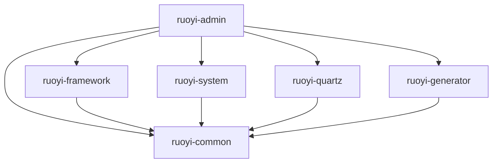
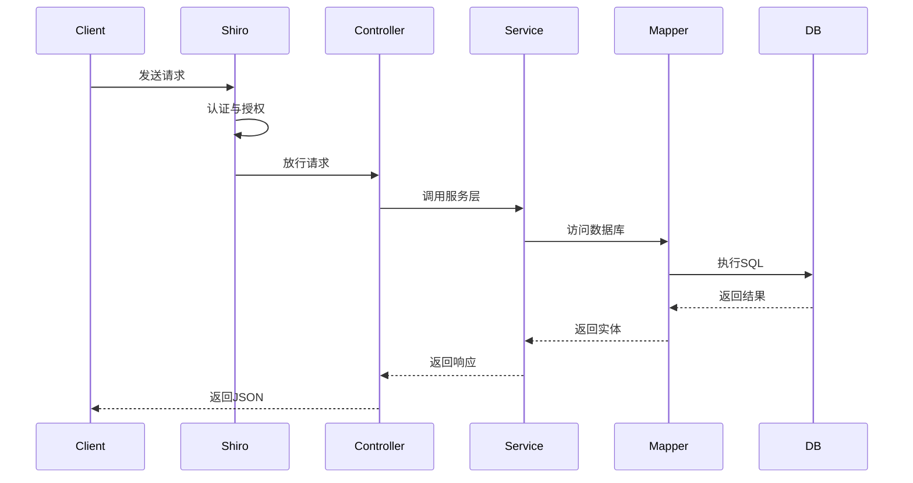

# Harness Engineering L2

## 目标

- 深化工程级文档，说明项目模块、技术栈、部署配置和关键业务链路。
- 将架构设计与代码实现之间的关系明确记录。
- 为 `Harness L` 提供完整的技术支撑与运维入口。

## 模块依赖

本项目采用多模块 Maven 架构，根 `pom.xml` 定义了以下模块：

- `ruoyi-admin`：Web 应用入口，包含控制器、前端模板、资源与 application.yml
- `ruoyi-framework`：框架核心配置，负责 Shiro、MyBatis、数据源、AOP、异常处理
- `ruoyi-system`：系统业务模块，负责用户、角色、菜单、部门、岗位、字典等业务逻辑
- `ruoyi-quartz`：定时任务模块，提供在线调度、任务执行与日志记录
- `ruoyi-generator`：代码生成模块，支持基于数据库表生成 CRUD 前后端代码
- `ruoyi-common`：通用工具与基础模型模块，被其他模块共同依赖

### 依赖关系



## 核心技术栈

- Java 17
- Spring Boot 3.5.14
- Apache Shiro 2.2.0（Jakarta 版）
- MyBatis 3.0.5
- Druid 1.2.28
- SpringDoc 2.8.17
- Velocity 2.3
- PageHelper 2.1.1
- FastJSON 1.2.83
- Oshi 7.3.0

## 关键配置与运行时

### 运行端口与上下文

- 服务器端口：`80`
- 上下文路径：`/`
- SpringDoc UI：`/swagger-ui.html`
- OpenAPI JSON：`/v3/api-docs`

### 数据源与连接池

- 驱动：`com.mysql.cj.jdbc.Driver`
- 数据库 URL：`jdbc:mysql://localhost:3306/ry-spring`
- 连接池：Druid
- 最小空闲：10
- 最大活跃：20
- 最大等待：60000ms

### Shiro 安全与会话

- 登录地址：`/login`
- 未授权重定向：`/unauth`
- 首页地址：`/index`
- 验证码：启用，类型 `math`
- Session 过期时间：30 分钟
- RememberMe：启用

### API 文档扫描

- `springdoc.group-configs` 定义默认组 `default`
- 扫描包：`com.ruoyi.web.controller.tool`
- 路径匹配：`/**`

## 关键业务链路

### 1. HTTP 请求处理



### 2. 权限与数据权限

- 用户角色通过 `sys_user_role` 关联
- 角色菜单权限通过 `sys_role_menu` 关联
- 角色数据权限通过 `sys_role_dept` 与 `sys_dept` 关联
- 用户部门通过 `sys_user.dept_id` 关联

## 运行与构建步骤

### 代码构建

```bash
cd d:/giencoder/RuoYi-Vue
mvn clean package -DskipTests
```

或者使用项目脚本：

```bash
cd d:/giencoder/RuoYi-Vue
yw.bat
```

### 启动应用

本地启动脚本：

```bash
cd d:/giencoder/RuoYi-Vue
./ry.sh start
```

Windows 启动：

```powershell
cd d:/giencoder/RuoYi-Vue
bin\run.bat
```

### 关键访问点

- 后台主页：`http://localhost/`
- Swagger 文档：`http://localhost/swagger-ui.html`
- OpenAPI JSON：`http://localhost/v3/api-docs`
- Druid 监控：`http://localhost/druid/`

## 参考文档

- `ruoyi-admin/.gientech/wiki/架构总览.md`
- `ruoyi-admin/.gientech/wiki/项目概述.md`
- `ruoyi-admin/.gientech/wiki/部署与运维.md`
