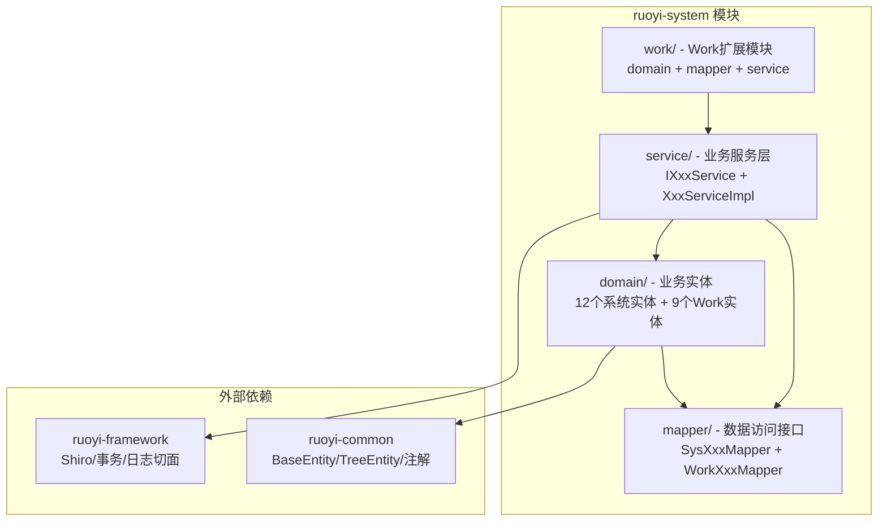
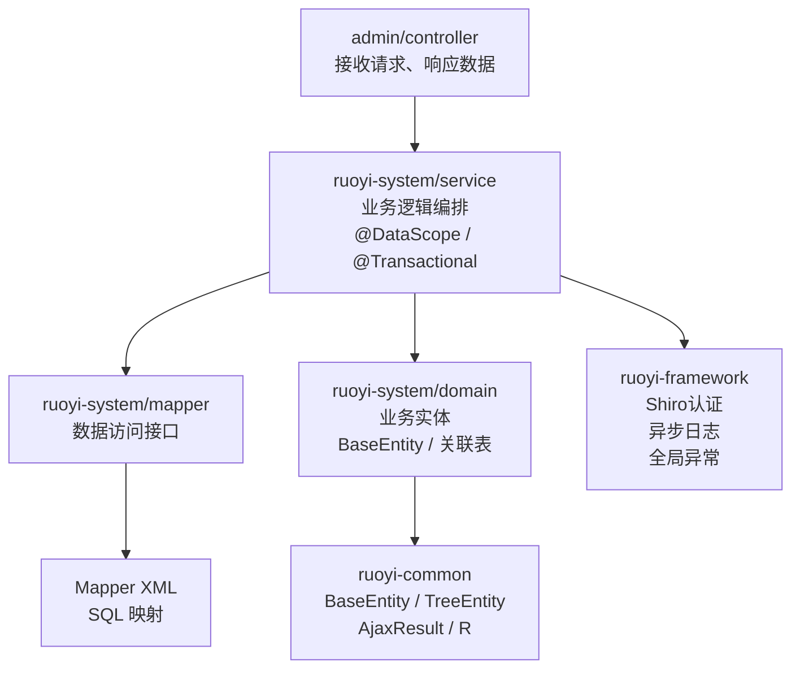
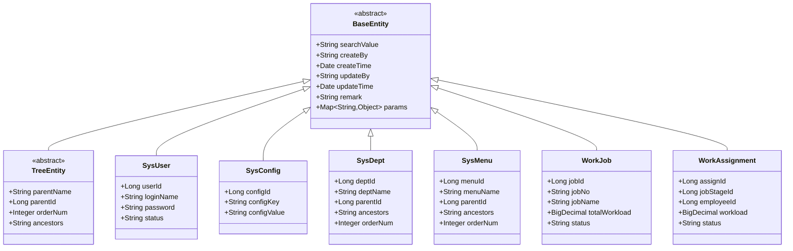
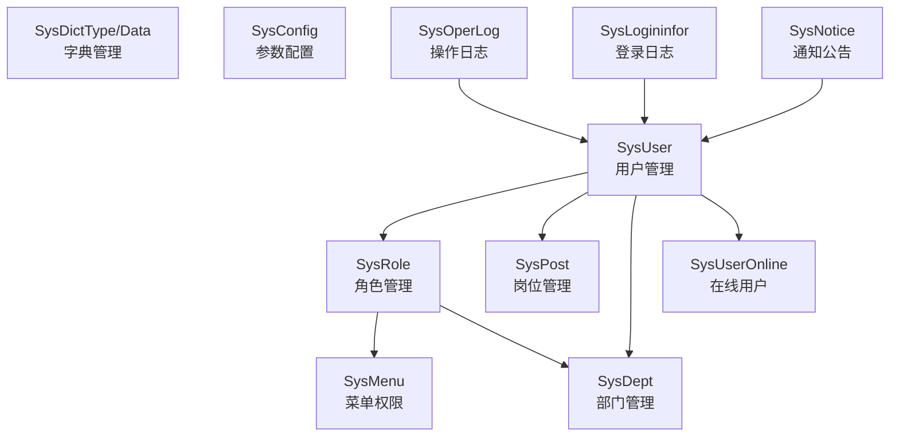
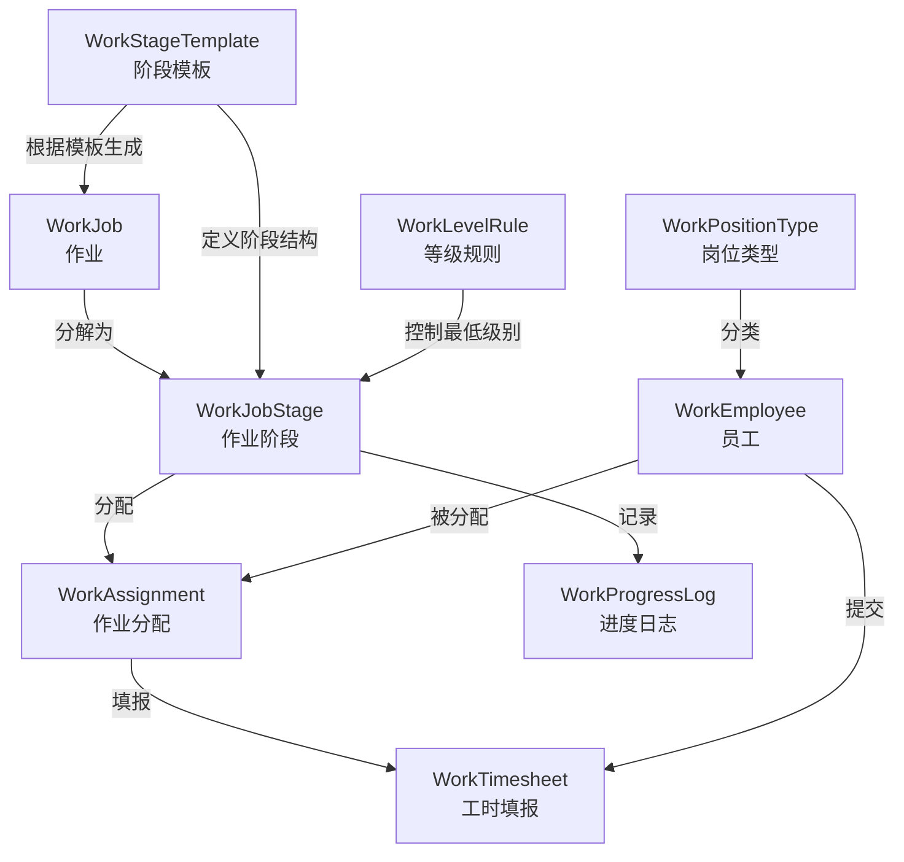
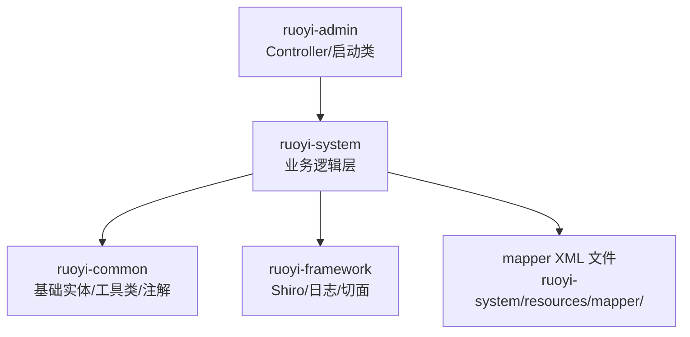

# 业务逻辑层

**本文档中引用的文件**

- [BaseEntity.java](../../../ruoyi-common/src/main/java/com/ruoyi/common/core/domain/BaseEntity.java)
- [TreeEntity.java](../../../ruoyi-common/src/main/java/com/ruoyi/common/core/domain/TreeEntity.java)
- [ISysUserService.java](../../../ruoyi-system/src/main/java/com/ruoyi/system/service/ISysUserService.java)
- [SysUserServiceImpl.java](../../../ruoyi-system/src/main/java/com/ruoyi/system/service/impl/SysUserServiceImpl.java)
- [WorkJobServiceImpl.java](../../../ruoyi-system/src/main/java/com/ruoyi/system/work/service/impl/WorkJobServiceImpl.java)
- [WorkAssignmentServiceImpl.java](../../../ruoyi-system/src/main/java/com/ruoyi/system/work/service/impl/WorkAssignmentServiceImpl.java)

## 目录

1. [简介](#简介)
2. [项目结构概述](#项目结构概述)
3. [核心应用服务](#核心应用服务)
4. [架构概览](#架构概览)
5. [详细组件分析](#详细组件分析)
6. [依赖关系分析](#依赖关系分析)
7. [性能考虑](#性能考虑)
8. [结论](#结论)

## 简介

业务逻辑层是 RuoYi-Vue 的核心业务处理层，对应 `ruoyi-system` 模块。该层负责封装系统管理的全部业务逻辑，包括用户管理、角色权限、部门组织、字典配置、操作日志等 12 个系统管理子模块，以及基于领域驱动设计的 Work 扩展模块（9 个领域模型）。该层遵循标准的 Service-Mapper 分层架构，通过 **接口（`IXxxService`）** + **实现（`XxxServiceImpl`）** 模式解耦，并在框架层面注入 `@DataScope`（数据权限过滤）、`@Transactional`（事务管理）等横切关注点。

**核心设计模式：**

- **服务接口模式**：每个业务模块定义 `IXxxService` 接口与 `XxxServiceImpl` 实现
- **实体继承体系**：业务实体统一继承 `BaseEntity`（审计字段）或 `TreeEntity`（树形结构）
- **数据权限切面**：通过 `@DataScope` 注解自动拼接 SQL 过滤条件

**业务价值：** 提供可复用的业务能力层，支撑前端管理界面与 API 调用的所有业务操作，同时通过数据权限、操作日志等机制保障安全与可追溯性。

## 项目结构概述

`ruoyi-system` 模块按包结构分为 domain（实体层）、mapper（数据访问层）、service（业务服务层）、work（Work 扩展模块）四大区域：



**图表来源**

- [ruoyi-system 包结构](../../../ruoyi-system/src/main/java/com/ruoyi/system/)
- [ruoyi-common 基础类](../../../ruoyi-common/src/main/java/com/ruoyi/common/core/domain/)

## 核心应用服务

### 1. 系统管理服务（system 包）

系统管理模块以 12 个服务接口覆盖完整的后台管理业务，每个服务对应一个数据库表或关联关系：

| 服务接口 | 对应实体 | 核心职责 |
|---------|---------|---------|
| `ISysUserService` | `SysUser` | 用户 CRUD、角色授权、密码重置、登录信息更新 |
| `ISysRoleService` | `SysRole` | 角色 CRUD、数据权限分配、用户授权/取消 |
| `ISysMenuService` | `SysMenu` | 菜单树管理、权限标识查询 |
| `ISysDeptService` | `SysDept` | 部门树管理、部门排序 |
| `ISysPostService` | `SysPost` | 岗位 CRUD、唯一性校验 |
| `ISysConfigService` | `SysConfig` | 参数配置 CRUD、缓存管理 |
| `ISysDictTypeService` | `SysDictType` | 字典类型管理、字典缓存 |
| `ISysDictDataService` | `SysDictData` | 字典数据管理 |
| `ISysOperLogService` | `SysOperLog` | 操作日志记录与查询 |
| `ISysLogininforService` | `SysLogininfor` | 登录日志记录与清理 |
| `ISysUserOnlineService` | `SysUserOnline` | 在线用户监控、强制下线 |
| `ISysNoticeService` | `SysNotice` | 通知公告 CRUD |
| `ISysNoticeReadService` | `SysNoticeRead` | 通知已读状态管理 |

**用户服务核心逻辑示例：**

```java
// SysUserServiceImpl 中的用户新增方法
@Override
@Transactional
public int insertUser(SysUser user) {
    // 1. 校验登录名唯一性
    if (!checkLoginNameUnique(user)) {
        throw new ServiceException("新增用户'" + user.getLoginName() + "'失败，登录账号已存在");
    }
    // 2. 校验手机号唯一性
    if (!checkPhoneUnique(user)) {
        throw new ServiceException("新增用户'" + user.getLoginName() + "'失败，手机号码已存在");
    }
    // 3. MD5 加密密码（salt = loginName + password）
    user.setPassword(Md5Utils.hash(user.getLoginName() + user.getPassword()));
    // 4. 插入用户主表
    int result = userMapper.insertUser(user);
    // 5. 插入用户-岗位关联
    insertUserPost(user);
    // 6. 插入用户-角色关联
    insertUserRole(user);
    return result;
}
```

- 使用 `@Transactional` 保证用户、角色、岗位关联数据的原子性
- 通过 `@DataScope(deptAlias = "d", userAlias = "u")` 自动过滤数据权限
- 密码使用 `Md5Utils.hash(loginName + password + salt)` 加盐加密

**章节来源**

- [ISysUserService.java](../../../ruoyi-system/src/main/java/com/ruoyi/system/service/ISysUserService.java)
- [SysUserServiceImpl.java](../../../ruoyi-system/src/main/java/com/ruoyi/system/service/impl/SysUserServiceImpl.java)
- [ISysRoleService.java](../../../ruoyi-system/src/main/java/com/ruoyi/system/service/ISysRoleService.java)
- [ISysMenuService.java](../../../ruoyi-system/src/main/java/com/ruoyi/system/service/ISysMenuService.java)

### 2. Work 扩展服务（work 包）

Work 模块提供 9 个领域模型，覆盖作业管理、员工管理、工时分配、进度跟踪等业务场景：

| 服务接口 | 对应实体 | 核心职责 |
|---------|---------|---------|
| `IWorkJobService` | `WorkJob` | 作业 CRUD、基于模板生成阶段、编号自动生成 |
| `IWorkJobStageService` | `WorkJobStage` | 作业阶段管理、阶段状态流转 |
| `IWorkAssignmentService` | `WorkAssignment` | 作业分配、智能分配算法、工时统计 |
| `IWorkEmployeeService` | `WorkEmployee` | 员工管理、负载状态计算 |
| `IWorkTimesheetService` | `WorkTimesheet` | 工时填报、审核工作流 |
| `IWorkProgressLogService` | `WorkProgressLog` | 进度变更记录、最新进度查询 |
| `IWorkStageTemplateService` | `WorkStageTemplate` | 阶段模板管理、模板复制 |
| `IWorkLevelRuleService` | `WorkLevelRule` | 等级规则、阶段范围校验 |
| `IWorkPositionTypeService` | `WorkPositionType` | 岗位类型字典 |

**作业创建与阶段生成逻辑：**

```java
// WorkJobServiceImpl 中的 insertJob 方法
@Override
@Transactional
public int insertJob(WorkJob workJob) {
    // 1. 校验作业编号唯一性
    if (!checkJobNoUnique(workJob)) {
        throw new ServiceException("新增作业'" + workJob.getJobName() + "'失败，作业编号已存在");
    }
    // 2. 自动生成作业编号（格式：JOB + yyyyMMdd + 部门ID + 序号）
    if (StringUtils.isEmpty(workJob.getJobNo())) {
        workJob.setJobNo(generateJobNo(workJob.getDeptId()));
    }
    // 3. 插入作业主表
    int result = jobMapper.insertJob(workJob);
    // 4. 根据模板创建阶段（解析 JSON 配置的 stagesConfig）
    if (workJob.getTemplateId() != null) {
        createJobStagesFromTemplate(workJob.getJobId(), workJob.getTemplateId(), workJob.getTotalWorkload());
    }
    return result;
}
```

**智能分配算法：**

```java
// WorkAssignmentServiceImpl.smartAssign - 根据员工负载和技能自动分配
public List<Long> smartAssign(Long jobStageId, List<Long> employeeIds, Double workloadPerEmployee) {
    // 1. 获取阶段的最低级别要求
    WorkJobStage stage = jobStageMapper.selectJobStageById(jobStageId);
    // 2. 查询等级规则，确认可参与该阶段的员工级别范围
    WorkLevelRule rule = levelRuleService.selectLevelRuleById(stage.getMinLevel().longValue());
    // 3. 按员工当前负载排序（低负载优先）
    List<Long> assigned = new ArrayList<>();
    employeeIds.stream()
        .map(employeeService::selectEmployeeById)
        .filter(emp -> emp.getCurrentWorkload().doubleValue() < emp.getMaxWorkload().doubleValue())
        .sorted(Comparator.comparing(WorkEmployee::getCurrentWorkload))
        .forEach(emp -> {
            // 4. 创建分配记录
            WorkAssignment assignment = new WorkAssignment();
            assignment.setJobStageId(jobStageId);
            assignment.setEmployeeId(emp.getEmployeeId());
            assignment.setWorkload(BigDecimal.valueOf(workloadPerEmployee));
            assignment.setStatus("0"); // 进行中
            assignmentMapper.insertAssignment(assignment);
            assigned.add(emp.getEmployeeId());
        });
    return assigned;
}
```

**章节来源**

- [IWorkJobService.java](../../../ruoyi-system/src/main/java/com/ruoyi/system/work/service/IWorkJobService.java)
- [WorkJobServiceImpl.java](../../../ruoyi-system/src/main/java/com/ruoyi/system/work/service/impl/WorkJobServiceImpl.java)
- [IWorkAssignmentService.java](../../../ruoyi-system/src/main/java/com/ruoyi/system/work/service/IWorkAssignmentService.java)
- [WorkAssignmentServiceImpl.java](../../../ruoyi-system/src/main/java/com/ruoyi/system/work/service/impl/WorkAssignmentServiceImpl.java)

## 架构概览



**架构说明：**

1. **Controller 层**（`ruoyi-admin`）接收 HTTP 请求，调用 Service 接口
2. **Service 层**（`ruoyi-system`）编排业务逻辑，通过 `@DataScope` 注入数据权限 SQL
3. **Mapper 层**（`ruoyi-system`）定义数据访问接口，由 XML 文件实现 SQL
4. **Domain 层**（`ruoyi-system/domain`）继承 `BaseEntity` 获得审计字段

**图表来源**

- [ruoyi-system 模块结构](../../../ruoyi-system/src/main/java/com/ruoyi/system/)
- [ruoyi-framework 配置](../../../ruoyi-framework/src/main/java/com/ruoyi/framework/)

## 详细组件分析

### 实体继承体系

所有业务实体统一继承自 `ruoyi-common` 的基础实体类，构成清晰的继承链：



- `BaseEntity` 提供 6 个审计字段（createBy/createTime/updateBy/updateTime/remark/params）和 1 个搜索字段
- `TreeEntity` 扩展 `BaseEntity`，增加 parentId/ancestors/orderNum/parentName 四个树形结构字段
- `SysDept` 和 `SysMenu` 虽具有树形特征（含 parentId/orderNum），但直接继承 `BaseEntity`，在自身类中定义树形字段
- 关联表实体（`SysUserRole`、`SysUserPost`、`SysRoleMenu`、`SysRoleDept`）不继承任何实体基类，仅含两个 ID 字段
- Work 模块所有 9 个领域模型均继承 `BaseEntity`，并增加 `delFlag`（逻辑删除标志）

**章节来源**

- [BaseEntity.java](../../../ruoyi-common/src/main/java/com/ruoyi/common/core/domain/BaseEntity.java)
- [TreeEntity.java](../../../ruoyi-common/src/main/java/com/ruoyi/common/core/domain/TreeEntity.java)
- [SysConfig.java](../../../ruoyi-system/src/main/java/com/ruoyi/system/domain/SysConfig.java)
- [WorkAssignment.java](../../../ruoyi-system/src/main/java/com/ruoyi/system/work/domain/WorkAssignment.java)

### 系统管理模块业务关系



**各模块功能要点：**

1. **用户管理**：支持按部门/登录名分页查询，包含角色授权、岗位分配、密码重置、状态修改、数据导入导出
2. **角色管理**：支持数据权限范围控制（全部/自定义/本部门/本部门及以下/仅本人），角色-菜单-部门三级关联
3. **菜单管理**：树形结构，支持按钮级权限标识，提供 zTree 数据接口
4. **部门管理**：树形结构，支持排序调整和祖级关系维护
5. **字典管理**：支持字典类型与字典数据两级缓存，通过 `loadingDictCache()`/`resetDictCache()` 管理
6. **参数配置**：支持缓存配置键值对，通过 `@Excel` 注解支持批量导出
7. **操作日志**：通过 `@Log` 注解切面异步写入 `sys_oper_log` 表
8. **在线用户**：基于 Shiro Session 管理，支持强制下线

**章节来源**

- [ISysUserService.java](../../../ruoyi-system/src/main/java/com/ruoyi/system/service/ISysUserService.java)
- [ISysRoleService.java](../../../ruoyi-system/src/main/java/com/ruoyi/system/service/ISysRoleService.java)
- [ISysDeptService.java](../../../ruoyi-system/src/main/java/com/ruoyi/system/service/ISysDeptService.java)
- [ISysDictTypeService.java](../../../ruoyi-system/src/main/java/com/ruoyi/system/service/ISysDictTypeService.java)

### Work 扩展模块业务流程



**Work 模块业务流转说明：**

1. **作业创建**：新建作业时可以选择阶段模板，系统自动根据模板 JSON 配置（`stagesConfig`）解析生成多个作业阶段，每个阶段包含阶段名称、工时比例、最低级别要求、技能要求
2. **智能分配**：根据作业阶段的最低级别要求和员工当前负载率，自动筛选符合条件的空闲员工进行分配
3. **工时管理**：员工提交工时填报单，经审核后生效，系统汇总各员工的实际工时
4. **进度跟踪**：通过 `WorkProgressLog` 记录每次进度变更，支持查询最新进度和历史变更记录
5. **等级规则**：`WorkLevelRule` 定义每个级别可参与的阶段范围（minStage/maxStage），用于分配时校验

**章节来源**

- [IWorkJobService.java](../../../ruoyi-system/src/main/java/com/ruoyi/system/work/service/IWorkJobService.java)
- [IWorkAssignmentService.java](../../../ruoyi-system/src/main/java/com/ruoyi/system/work/service/IWorkAssignmentService.java)
- [IWorkTimesheetService.java](../../../ruoyi-system/src/main/java/com/ruoyi/system/work/service/IWorkTimesheetService.java)
- [WorkJobServiceImpl.java](../../../ruoyi-system/src/main/java/com/ruoyi/system/work/service/impl/WorkJobServiceImpl.java)(L268-L315)

## 依赖关系分析



**依赖特点：**

- `ruoyi-system` 仅依赖 `ruoyi-common` 和 `ruoyi-framework`，不反向依赖上层模块
- Service 实现类通过 `@Autowired` 注入 Mapper 接口和其他 Service
- 数据访问 SQL 定义在 `resources/mapper/system/` 和 `resources/mapper/work/` 目录下的 XML 文件中
- Work 模块的 Service 实现类可调用系统管理 Service（如 `WorkAssignmentServiceImpl` 调用 `IWorkEmployeeService`）
- 所有业务实体依赖 `ruoyi-common` 的 `BaseEntity` 和 `TreeEntity` 基类

**图表来源**

- [ruoyi-system pom.xml](../../../ruoyi-system/pom.xml)
- [ruoyi-system Mapper XML 目录](../../../ruoyi-system/src/main/resources/mapper/)

## 性能考虑

### 缓存策略

- **字典缓存**：`ISysDictTypeService` 提供 `loadingDictCache()` / `clearDictCache()` / `resetDictCache()` 三个缓存管理方法，字典数据在系统启动时加载到 EhCache
- **参数配置缓存**：`ISysConfigService` 提供同名缓存管理方法，参数键值对缓存在 EhCache 中，减少数据库查询

### 并发控制

- 用户密码错误次数使用 EhCache 计数，错 5 次锁定 10 分钟
- 在线用户会话管理通过 Shiro Session 监听器同步状态

### 数据访问优化

- Mapper XML 中使用 `PageHelper` 实现物理分页，避免全表查询
- 关联表查询（如 `SysUserRole`）使用简单连接，Mapper 层只返回必要字段
- `@DataScope` 注解通过 AOP 在 SQL 执行前拼接数据权限过滤条件，减少应用层过滤

**章节来源**

- [ISysConfigService.java](../../../ruoyi-system/src/main/java/com/ruoyi/system/service/ISysConfigService.java)
- [ISysDictTypeService.java](../../../ruoyi-system/src/main/java/com/ruoyi/system/service/ISysDictTypeService.java)

## 故障排除指南

### 常见问题及解决方案

| 问题 | 可能原因 | 解决方案 |
|------|---------|---------|
| 用户密码错误次数超限 | EhCache 中计数器累积 | 等待 10 分钟自动解锁，或通过 SQL 清除缓存记录 |
| 数据权限过滤异常 | `@DataScope` 注解参数错误 | 检查 `deptAlias` 和 `userAlias` 是否与 SQL 中表别名一致 |
| Work 模块智能分配无结果 | 员工负载已满或技能不匹配 | 检查 `WorkLevelRule` 中等级范围配置，确认员工 `currentWorkload` 未超限 |
| 字典数据未刷新 | EhCache 未清除 | 调用字典管理页面的"刷新缓存"功能触发 `resetDictCache()` |
| 操作日志写入失败 | 异步线程池满或数据库异常 | 检查 `AsyncManager` 线程池配置和 `sys_oper_log` 表空间 |

**章节来源**

- [SysUserServiceImpl.java](../../../ruoyi-system/src/main/java/com/ruoyi/system/service/impl/SysUserServiceImpl.java)
- [WorkAssignmentServiceImpl.java](../../../ruoyi-system/src/main/java/com/ruoyi/system/work/service/impl/WorkAssignmentServiceImpl.java)

## 结论

### 设计优势

- **清晰的模块划分**：系统管理 12 个子模块职责单一，每个 Service 接口方法不超过 30 个
- **统一实体基类**：所有业务实体继承 `BaseEntity`，审计字段自动继承，减少重复代码
- **数据权限内置**：通过 `@DataScope` 注解在 Service 层声明式控制数据可见范围
- **Work 模块领域驱动**：9 个领域模型覆盖完整的作业管理生命周期，智能分配算法降低人工调度成本

### 最佳实践

- 新增业务时，遵循 Domain → Mapper(接口+XML) → Service(IXxxService+Impl) 的顺序开发
- Service 层使用 `@Transactional` 保证关联数据的一致性
- 使用 `@DataScope(deptAlias = "d", userAlias = "u")` 声明数据权限，无需在 SQL 中手动拼接
- 对于需要缓存的数据，实现 `loadingCache()` / `clearCache()` / `resetCache()` 三件套方法
- Work 模块中的业务校验逻辑（如编号唯一性、员工负载校验）应在 Service 层完成，避免穿透到 Mapper 层

### 技术特色

- 采用 **Jakarta EE**（原 Java EE）规范，适配 Spring Boot 3.x
- 数据权限支持五种范围（全部/自定义/本部门/本部门及以下/仅本人）
- 操作日志通过 `@Log` 注解 + `AsyncManager` 异步写入，不阻塞主业务
- Work 模块的阶段模板使用 JSON 配置 `stagesConfig`，支持灵活的阶段结构定义