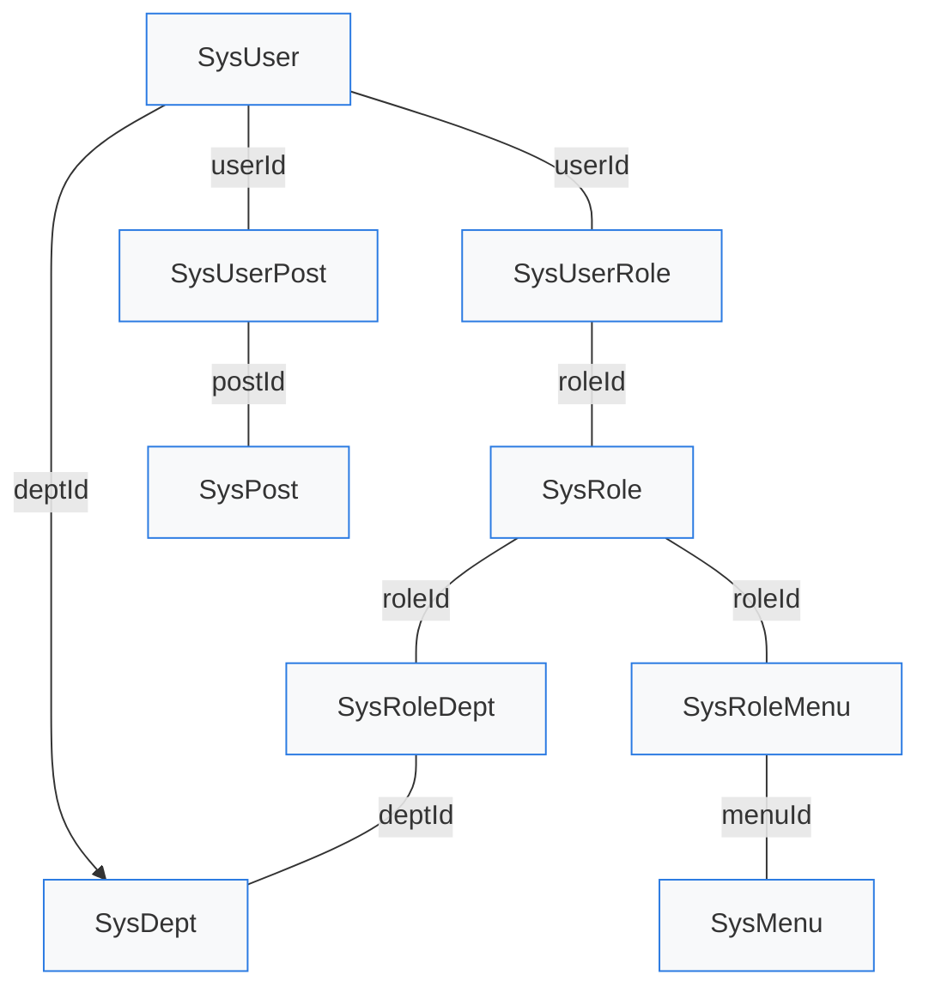

# 关联关系模型

## 文档说明
本文件描述 RuoYi 项目中核心业务实体的关联关系模型，重点关注用户、角色、菜单、部门、岗位等系统管理基础数据之间的关联。

## 主要实体

- `SysUser`：用户对象，映射数据库表 `sys_user`
- `SysRole`：角色对象，映射数据库表 `sys_role`
- `SysMenu`：菜单/权限对象，映射数据库表 `sys_menu`
- `SysDept`：部门对象，映射数据库表 `sys_dept`
- `SysPost`：岗位对象，映射数据库表 `sys_post`
- `SysConfig`：系统参数对象，映射数据库表 `sys_config`
- `SysNotice`：通知公告对象，映射数据库表 `sys_notice`

## 关联关系概览

### 1. 用户与部门

- `SysUser.deptId` 指向 `SysDept.deptId`
- 关系类型：多对一（Many-to-One）
- 含义：每个用户属于一个部门，部门下可以包含多个用户

### 2. 用户与角色

- 关联表：`SysUserRole` (`sys_user_role`)
- 关键字段：`userId`, `roleId`
- 关系类型：多对多（Many-to-Many）
- 含义：用户可以拥有多个角色，角色可以被多个用户使用

### 3. 用户与岗位

- 关联表：`SysUserPost` (`sys_user_post`)
- 关键字段：`userId`, `postId`
- 关系类型：多对多（Many-to-Many）
- 含义：用户可分配多个岗位，岗位可分配给多个用户

### 4. 角色与菜单

- 关联表：`SysRoleMenu` (`sys_role_menu`)
- 关键字段：`roleId`, `menuId`
- 关系类型：多对多（Many-to-Many）
- 含义：角色与菜单权限关联，决定角色可访问的菜单和操作权限

### 5. 角色与部门

- 关联表：`SysRoleDept` (`sys_role_dept`)
- 关键字段：`roleId`, `deptId`
- 关系类型：多对多（Many-to-Many）
- 含义：角色与部门维度关联，用于数据权限控制或部门权限分配

## 关系模型图



## 关联实体详细说明

### SysUser

- `userId`：主键
- `deptId`：部门外键
- `roleIds`：角色数组，通常用于前端页面角色分配
- `postIds`：岗位数组，通常用于前端页面岗位分配
- `dept`：部门对象映射，包含 `deptName`、`leader` 等信息
- `roles`：角色对象列表

### SysRole

- `roleId`：主键
- `roleKey`：角色权限字符串
- `roleName`：角色名称
- `roleSort`：排序字段
- `menuCheckStrictly`：菜单权限是否父子关联

### SysMenu

- `menuId`：主键
- `parentId`：父菜单 ID
- `menuName`：菜单名称
- `perms`：权限标识字符串
- `menuType`：菜单类型（目录、菜单、按钮）

### SysDept

- `deptId`：主键
- `parentId`：上级部门 ID
- `deptName`：部门名称
- `leader`：部门负责人
- `status`：部门状态

### SysPost

- `postId`：主键
- `postCode`：岗位编码
- `postName`：岗位名称
- `postSort`：岗位排序
- `status`：岗位状态

### 其他基础实体

- `SysConfig`：系统参数配置，映射 `sys_config`，用于应用运行时参数管理
- `SysNotice`：通知公告记录，映射 `sys_notice`，用于发布系统公告和消息

## 数据库表结构与关联字段

- `sys_user`
  - 主键：`user_id`
  - 外键：`dept_id`
- `sys_role`
  - 主键：`role_id`
- `sys_menu`
  - 主键：`menu_id`
  - 父级：`parent_id`
- `sys_dept`
  - 主键：`dept_id`
  - 父级：`parent_id`
- `sys_post`
  - 主键：`post_id`
- `sys_user_role`
  - 复合主键：`user_id`, `role_id`
- `sys_user_post`
  - 复合主键：`user_id`, `post_id`
- `sys_role_menu`
  - 复合主键：`role_id`, `menu_id`
- `sys_role_dept`
  - 复合主键：`role_id`, `dept_id`

## 权限与数据权限链路

- 用户登录后，系统通过 `sys_user_role` 获取用户所属角色
- 角色权限通过 `sys_role_menu` 转换为菜单与操作权限
- 角色数据范围通过 `sys_role_dept` 与 `sys_dept` 关联，用于过滤部门级数据访问
- 用户岗位信息通过 `sys_user_post` 记录，用于岗位相关权限、组织身份、审批流等场景

## 典型关联查询

1. 查询某用户所有菜单权限：

```sql
SELECT m.*
FROM sys_menu m
JOIN sys_role_menu rm ON m.menu_id = rm.menu_id
JOIN sys_user_role ur ON rm.role_id = ur.role_id
WHERE ur.user_id = #{userId}
```

2. 查询某用户所属部门与岗位：

```sql
SELECT u.user_id, u.login_name, d.dept_name, p.post_name
FROM sys_user u
LEFT JOIN sys_dept d ON u.dept_id = d.dept_id
LEFT JOIN sys_user_post up ON u.user_id = up.user_id
LEFT JOIN sys_post p ON up.post_id = p.post_id
WHERE u.user_id = #{userId}
```

3. 查询某角色可管理部门范围：

```sql
SELECT d.*
FROM sys_dept d
JOIN sys_role_dept rd ON d.dept_id = rd.dept_id
WHERE rd.role_id = #{roleId}
```

## 业务意义

- `SysUser` 与 `SysDept` 的关联决定用户的组织归属
- `SysUserRole` 和 `SysRoleMenu` 联合确定用户可访问的菜单权限
- `SysUserPost` 用于定义用户在组织中的岗位身份
- `SysRoleDept` 典型用于基于角色的数据权限或部门权限控制

## 典型查询模式

1. 查询用户权限
   - 通过 `sys_user_role` 获取用户角色
   - 通过 `sys_role_menu` 获取角色菜单权限

2. 查询用户组织信息
   - 通过 `sys_user.dept_id` 关联 `sys_dept`
   - 通过 `sys_user_post` 获取岗位信息

3. 查询角色部门范围
   - 通过 `sys_role_dept` 获取角色关联部门，用于数据权限过滤

## 参考文件

- `ruoyi-common/src/main/java/com/ruoyi/common/core/domain/entity/SysUser.java`
- `ruoyi-system/src/main/java/com/ruoyi/system/domain/SysUserRole.java`
- `ruoyi-system/src/main/java/com/ruoyi/system/domain/SysUserPost.java`
- `ruoyi-system/src/main/java/com/ruoyi/system/domain/SysRoleMenu.java`
- `ruoyi-system/src/main/java/com/ruoyi/system/domain/SysRoleDept.java`
- `ruoyi-system/src/main/java/com/ruoyi/system/domain/SysPost.java`
