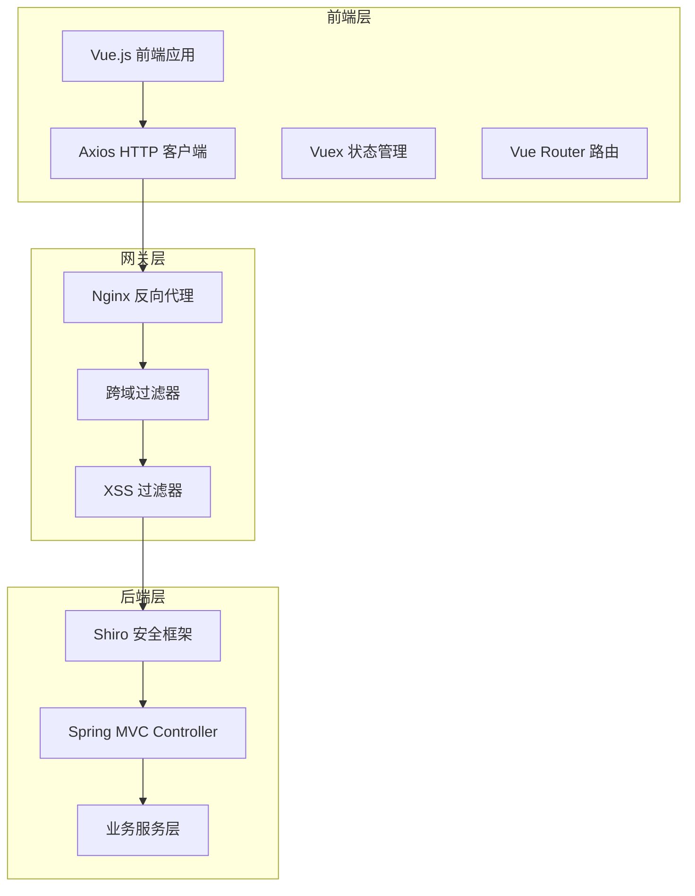
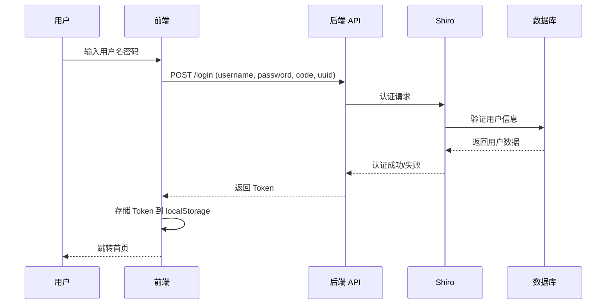

# 前端集成指南

**本文档中引用的文件**
- [application.yml](../../../ruoyi-admin/src/main/resources/application.yml)
- [RuoYiApplication.java](../../../ruoyi-admin/src/main/java/com/ruoyi/RuoYiApplication.java)
- [pom.xml](../../../pom.xml)

## 目录
1. [前后端分离架构概述](#前后端分离架构概述)
2. [API 接口规范](#api 接口规范)
3. [认证与授权流程](#认证与授权流程)
4.跨域配置
5. [前端项目结构](#前端项目结构)
6. [接口调用示例](#接口调用示例)
7. [文件上传下载](#文件上传下载)
8. [错误处理](#错误处理)
9. [前端部署配置](#前端部署配置)

## 前后端分离架构概述

### 架构设计



### 技术栈

**前端技术栈**（RuoYi-Vue）：
- Vue 2.x / Vue 3.x
- Vuex 状态管理
- Vue Router 路由
- Element UI / Element Plus 组件库
- Axios HTTP 客户端
- Sass 预处理器
- Webpack / Vite 构建工具

**后端技术栈**：
- Spring Boot 3.5.14
- Spring MVC
- Shiro 2.2.0（权限控制）
- MyBatis（数据访问）
- Swagger / SpringDoc（API 文档）

### 通信协议

| 项目 | 配置 |
|------|------|
| 协议 | HTTP/HTTPS |
| 数据格式 | JSON |
| 字符编码 | UTF-8 |
| 认证方式 | Session + Token |
| API 路径前缀 | `/api`（可配置） |

## API 接口规范

### 统一响应格式

所有 API 接口返回统一的数据格式：

```json
{
  "code": 200,
  "msg": "操作成功",
  "data": {}
}
```

**字段说明**：
- `code`：状态码（200 成功，500 失败，401 未授权，403 禁止访问）
- `msg`：响应消息
- `data`：响应数据（对象或数组）

### 分页响应格式

```json
{
  "code": 200,
  "msg": "查询成功",
  "data": {
    "rows": [],
    "total": 100
  }
}
```

**字段说明**：
- `rows`：数据列表
- `total`：总记录数

### 请求参数规范

#### GET 请求参数

```javascript
// 查询用户列表
GET /system/user/list?pageNum=1&pageSize=10&userName=admin&status=0
```

#### POST 请求参数

```javascript
// 新增用户
POST /system/user
Content-Type: application/json

{
  "userName": "test",
  "nickName": "测试用户",
  "email": "test@example.com",
  "phonenumber": "13800138000",
  "sex": "0",
  "deptId": 103,
  "postIds": [1, 2],
  "roleId": 2,
  "status": "0",
  "remark": "备注"
}
```

### 常用状态码

| 状态码 | 含义 | 说明 |
|--------|------|------|
| 200 | 成功 | 请求成功 |
| 500 | 系统错误 | 服务器内部错误 |
| 401 | 未授权 | 用户未登录或 Token 过期 |
| 403 | 禁止访问 | 无权限访问 |
| 404 | 资源不存在 | 请求的资源不存在 |

## 认证与授权流程

### 登录流程



### 登录接口

**请求**：
```http
POST /login
Content-Type: application/json

{
  "username": "admin",
  "password": "admin123",
  "code": "1234",
  "uuid": "xxx-xxx-xxx"
}
```

**响应**：
```json
{
  "code": 200,
  "msg": "操作成功",
  "token": "eyJhbGciOiJIUzI1NiIsInR5cCI6IkpXVCJ9..."
}
```

### Token 机制

前端将 Token 存储在 `localStorage` 中，每次请求时通过请求头传递：

```javascript
// Axios 请求拦截器配置
axios.interceptors.request.use(config => {
  const token = localStorage.getItem('token')
  if (token) {
    config.headers['Authorization'] = `Bearer ${token}`
  }
  return config
})
```

### 权限控制

#### 菜单权限

后端返回用户可访问的菜单列表，前端动态生成路由：

```javascript
// 获取用户菜单
GET /system/menu/getMenu
```

**响应**：
```json
{
  "code": 200,
  "msg": "操作成功",
  "data": [
    {
      "menuId": 1,
      "menuName": "系统管理",
      "icon": "fa fa-gear",
      "children": [
        {
          "menuId": 100,
          "menuName": "用户管理",
          "path": "/system/user",
          "component": "system/user/index"
        }
      ]
    }
  ]
}
```

#### 按钮权限

通过权限标识控制按钮显示：

```javascript
// 前端权限指令
<el-button v-hasPermi="['system:user:add']">新增用户</el-button>
```

后端通过 `@PreAuthorize` 注解控制接口权限：

```java
@PreAuthorize("@ss.hasPermi('system:user:add')")
@PostMapping
public AjaxResult add(@RequestBody SysUser user) {
    return toAjax(userService.insertUser(user));
}
```

## 跨域配置

### 后端跨域配置

参考 [application.yml](../../../ruoyi-admin/src/main/resources/application.yml)：

```yaml
# 跨域配置
cors:
  allowedOrigins: "*"
  allowedMethods: "GET,HEAD,POST,PUT,DELETE,OPTIONS"
  allowedHeaders: "*"
  allowCredentials: true
  maxAge: 3600
```

### 开发环境跨域代理

Vue 项目 `vue.config.js` 配置：

```javascript
module.exports = {
  devServer: {
    port: 80,
    open: true,
    proxy: {
      '/api': {
        target: 'http://localhost:8080',
        changeOrigin: true,
        pathRewrite: {
          '^/api': ''
        }
      }
    }
  }
}
```

### 生产环境 Nginx 配置

```nginx
server {
    listen       80;
    server_name  localhost;
    
    # 前端静态文件
    location / {
        root   /usr/share/nginx/html;
        index  index.html index.htm;
        try_files $uri $uri/ /index.html;
    }
    
    # 后端 API 代理
    location /api {
        proxy_set_header Host $http_host;
        proxy_set_header X-Real-IP $remote_addr;
        proxy_set_header REMOTE-HOST $remote_addr;
        proxy_set_header X-Forwarded-For $proxy_add_x_forwarded_for;
        proxy_pass http://backend:8080;
    }
}
```

## 前端项目结构

```
ruoyi-vue/
├── public/                      # 静态资源
│   └── index.html
├── src/
│   ├── api/                     # API 接口
│   │   ├── system/
│   │   │   ├── user.js
│   │   │   ├── role.js
│   │   │   └── menu.js
│   │   └── login.js
│   ├── assets/                  # 静态资源
│   ├── components/              # 公共组件
│   ├── directive/               # 自定义指令
│   │   └── permission.js
│   ├── layout/                  # 布局组件
│   ├── router/                  # 路由配置
│   ├── store/                   # 状态管理
│   │   ├── modules/
│   │   │   ├── app.js
│   │   │   └── user.js
│   │   └── index.js
│   ├── utils/                   # 工具函数
│   │   ├── auth.js
│   │   ├── request.js
│   │   └── index.js
│   ├── views/                   # 页面组件
│   │   ├── system/
│   │   │   ├── user/
│   │   │   ├── role/
│   │   │   └── menu/
│   │   └── login/
│   ├── App.vue
│   └── main.js
├── .env.development             # 开发环境变量
├── .env.production              # 生产环境变量
├── vue.config.js                # Vue 配置
└── package.json
```

## 接口调用示例

### 用户管理接口

#### 1. 获取用户列表

```javascript
// api/system/user.js
import request from '@/utils/request'

export function listUser(query) {
  return request({
    url: '/system/user/list',
    method: 'get',
    params: query
  })
}

// 组件中使用
this.listUser({
  pageNum: 1,
  pageSize: 10,
  userName: 'admin',
  status: '0'
}).then(response => {
  this.userList = response.data.rows
  this.total = response.data.total
})
```

#### 2. 获取用户详情

```javascript
export function getUser(userId) {
  return request({
    url: `/system/user/${userId}`,
    method: 'get'
  })
}
```

#### 3. 新增用户

```javascript
export function addUser(data) {
  return request({
    url: '/system/user',
    method: 'post',
    data: data
  })
}
```

#### 4. 修改用户

```javascript
export function updateUser(data) {
  return request({
    url: '/system/user',
    method: 'put',
    data: data
  })
}
```

#### 5. 删除用户

```javascript
export function delUser(userId) {
  return request({
    url: `/system/user/${userId}`,
    method: 'delete'
  })
}
```

### 角色管理接口

```javascript
// api/system/role.js
import request from '@/utils/request'

// 查询角色列表
export function listRole(query) {
  return request({
    url: '/system/role/list',
    method: 'get',
    params: query
  })
}

// 查询角色详情
export function getRole(roleId) {
  return request({
    url: `/system/role/${roleId}`,
    method: 'get'
  })
}

// 新增角色
export function addRole(data) {
  return request({
    url: '/system/role',
    method: 'post',
    data: data
  })
}

// 修改角色
export function updateRole(data) {
  return request({
    url: '/system/role',
    method: 'put',
    data: data
  })
}

// 删除角色
export function delRole(roleId) {
  return request({
    url: `/system/role/${roleId}`,
    method: 'delete'
  })
}

// 获取角色菜单权限
export function getRoleMenuTree(roleId) {
  return request({
    url: `/system/menu/roleMenuTreeselect/${roleId}`,
    method: 'get'
  })
}

// 分配菜单权限
export function updateRoleMenu(roleId, menuIds) {
  return request({
    url: '/system/role/authMenu',
    method: 'put',
    params: { roleId, menuIds }
  })
}
```

## 文件上传下载

### 文件上传

```javascript
// 上传单个文件
export function uploadFile(data) {
  return request({
    url: '/common/upload',
    method: 'post',
    data: data,
    headers: {
      'Content-Type': 'multipart/form-data'
    }
  })
}

// 组件中使用
<el-upload
  action="/common/upload"
  :headers="headers"
  :on-success="handleFileSuccess"
>
  <el-button type="primary">点击上传</el-button>
</el-upload>
```

**响应**：
```json
{
  "code": 200,
  "msg": "操作成功",
  "fileName": "2024/01/17/test_20240117153045.pdf",
  "url": "/profile/upload/2024/01/17/test_20240117153045.pdf"
}
```

### 文件下载

```javascript
// 下载文件
export function downloadFile(filePath) {
  return request({
    url: '/common/download',
    method: 'get',
    params: { fileName: filePath },
    responseType: 'blob'
  }).then(response => {
    const blob = new Blob([response.data])
    const link = document.createElement('a')
    link.href = window.URL.createObjectURL(blob)
    link.download = filePath.substring(filePath.lastIndexOf('/') + 1)
    link.click()
    window.URL.revokeObjectURL(link.href)
  })
}
```

### 文件上传配置

参考 [application.yml](../../../ruoyi-admin/src/main/resources/application.yml)：

```yaml
spring:
  servlet:
    multipart:
      max-file-size: 10MB       # 单个文件最大大小
      max-request-size: 20MB    # 总上传大小限制
```

## 错误处理

### 全局错误拦截

```javascript
// utils/request.js
import { Message } from 'element-ui'

// 响应拦截器
service.interceptors.response.use(
  response => {
    const res = response.data
    
    // 如果返回的状态码不是 200，则认为是错误情况
    if (res.code !== 200) {
      Message({
        message: res.msg || '系统错误',
        type: 'error',
        duration: 5 * 1000
      })
      
      // 401: 未授权，需要重新登录
      if (res.code === 401) {
        store.dispatch('user/logout').then(() => {
          location.reload()
        })
      }
      
      return Promise.reject(new Error(res.msg || '系统错误'))
    } else {
      return res
    }
  },
  error => {
    console.error('请求错误:', error)
    Message({
      message: error.message || '网络错误',
      type: 'error',
      duration: 5 * 1000
    })
    return Promise.reject(error)
  }
)
```

### 业务错误处理

```javascript
// 组件中处理业务错误
this.addUser(this.form).then(response => {
  this.$message.success('新增成功')
  this.$emit('ok')
}).catch(error => {
  // 错误已在拦截器中处理
  console.error('新增失败:', error)
})
```

## 前端部署配置

### 环境变量配置

**.env.development**（开发环境）：
```bash
# 开发环境
NODE_ENV = 'development'
VUE_APP_BASE_API = 'http://localhost:8080'
```

**.env.production**（生产环境）：
```bash
# 生产环境
NODE_ENV = 'production'
VUE_APP_BASE_API = 'http://api.example.com'
```

### 构建命令

```bash
# 安装依赖
npm install

# 开发模式运行
npm run dev

# 构建生产环境
npm run build

# 预览构建结果
npm run preview
```

### Nginx 部署配置

```nginx
server {
    listen       80;
    server_name  localhost;
    
    # 前端静态文件
    location / {
        root   /usr/share/nginx/html;
        index  index.html index.htm;
        try_files $uri $uri/ /index.html;
    }
    
    # 后端 API 代理
    location /prod-api/ {
        proxy_set_header Host $http_host;
        proxy_set_header X-Real-IP $remote_addr;
        proxy_set_header REMOTE-HOST $remote_addr;
        proxy_set_header X-Forwarded-For $proxy_add_x_forwarded_for;
        proxy_pass http://backend:8080/;
    }
    
    # 静态资源缓存
    location ~* \.(jpg|jpeg|png|gif|ico|css|js|svg|woff|woff2|ttf|eot)$ {
        expires 30d;
        add_header Cache-Control "public, immutable";
    }
}
```

### Docker 部署

```dockerfile
# Dockerfile
FROM nginx:alpine
COPY dist/ /usr/share/nginx/html/
COPY nginx.conf /etc/nginx/conf.d/default.conf
EXPOSE 80
CMD ["nginx", "-g", "daemon off;"]
```

```bash
# 构建镜像
docker build -t ruoyi-vue .

# 运行容器
docker run -d -p 80:80 ruoyi-vue
```

## 参考文档
- [application.yml](../../../ruoyi-admin/src/main/resources/application.yml) - 后端配置
- [API 参考总览](./API 参考/API 参考.md) - API 接口文档
- [编码指引.md](./编码指引.md) - 后端编码规范
