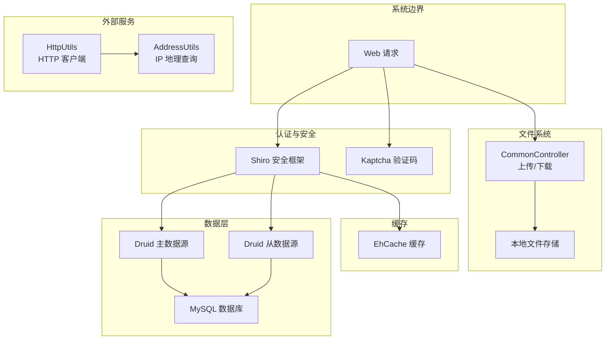
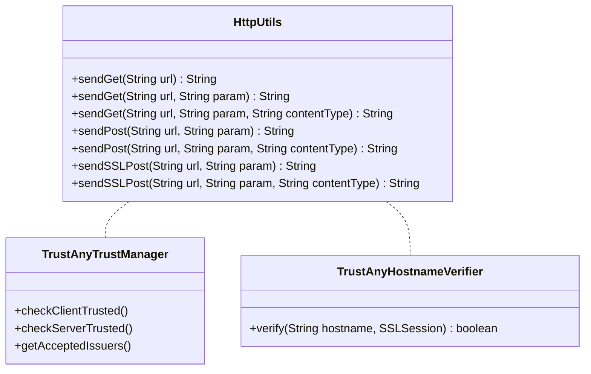
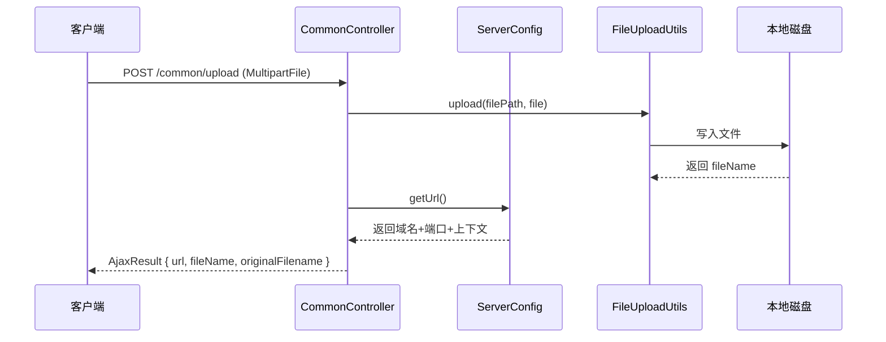
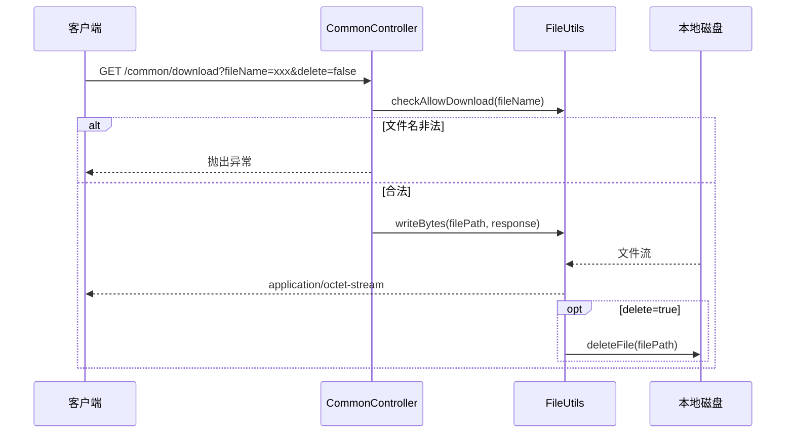
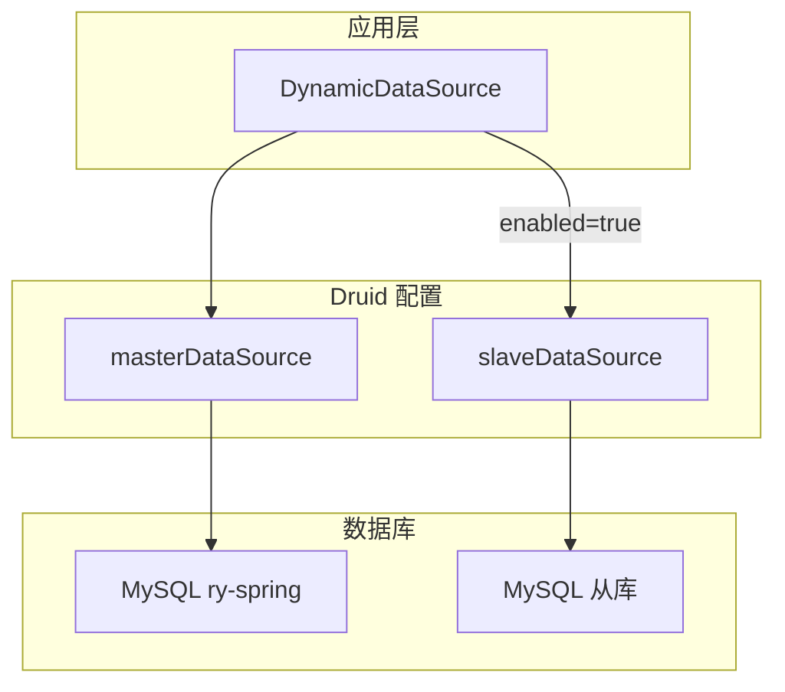
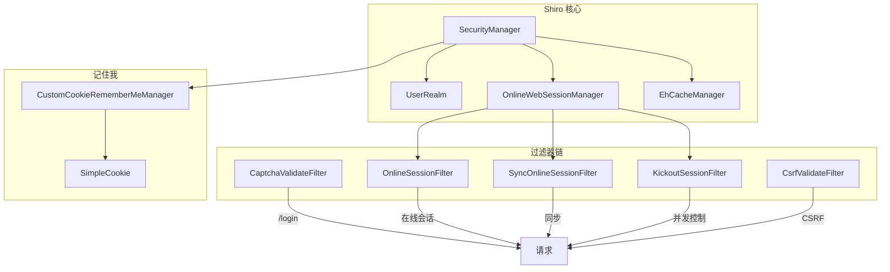

# 外部系统集成

**本文档引用文件**
- [HttpUtils.java](../../../ruoyi-common/src/main/java/com/ruoyi/common/utils/http/HttpUtils.java)
- [AddressUtils.java](../../../ruoyi-common/src/main/java/com/ruoyi/common/utils/AddressUtils.java)
- [ServerConfig.java](../../../ruoyi-common/src/main/java/com/ruoyi/common/config/ServerConfig.java)
- [CommonController.java](../../../ruoyi-admin/src/main/java/com/ruoyi/web/controller/common/CommonController.java)
- [CaptchaConfig.java](../../../ruoyi-framework/src/main/java/com/ruoyi/framework/config/CaptchaConfig.java)
- [DruidConfig.java](../../../ruoyi-framework/src/main/java/com/ruoyi/framework/config/DruidConfig.java)
- [ShiroConfig.java](../../../ruoyi-framework/src/main/java/com/ruoyi/framework/config/ShiroConfig.java)
- [application.yml](../../../ruoyi-admin/src/main/resources/application.yml)
- [application-druid.yml](../../../ruoyi-admin/src/main/resources/application-druid.yml)

## 目录

1. [简介](#简介)
2. [集成架构](#集成架构)
3. [HTTP 外部调用](#http-外部调用)
4. [文件存储系统](#文件存储系统)
5. [数据库集成](#数据库集成)
6. [第三方库集成](#第三方库集成)
7. [配置管理](#配置管理)
8. [总结](#总结)

## 简介

RuoYi-Vue 作为企业级快速开发框架，集成了多种外部系统与第三方服务，涵盖 HTTP 外部 API 调用、文件上传下载存储、MySQL 数据库（多数据源）、验证码生成、权限认证（Shiro）、缓存（EhCache）等。各集成模块以配置化方式管理，通过 Spring Boot 自动装配与条件注解实现按需加载。

## 集成架构



**Diagram sources**
- [ShiroConfig.java](../../../ruoyi-framework/src/main/java/com/ruoyi/framework/config/ShiroConfig.java)
- [DruidConfig.java](../../../ruoyi-framework/src/main/java/com/ruoyi/framework/config/DruidConfig.java)
- [CommonController.java](../../../ruoyi-admin/src/main/java/com/ruoyi/web/controller/common/CommonController.java)
- [HttpUtils.java](../../../ruoyi-common/src/main/java/com/ruoyi/common/utils/http/HttpUtils.java)
- [CaptchaConfig.java](../../../ruoyi-framework/src/main/java/com/ruoyi/framework/config/CaptchaConfig.java)

## HTTP 外部调用

系统通过 `HttpUtils` 工具类提供 HTTP 客户端能力，并通过 `AddressUtils` 实现 IP 地理查询；`ServerConfig` 负责动态获取当前服务的完整 URL，供文件上传等场景生成访问地址。

### HttpUtils 通用 HTTP 客户端

`HttpUtils` 位于 common 模块，基于 JDK 原生 `URLConnection` 实现，不依赖第三方 HTTP 库，支持 GET/POST/SSL POST 三种请求方式。



**Diagram sources**
- [HttpUtils.java](../../../ruoyi-common/src/main/java/com/ruoyi/common/utils/http/HttpUtils.java)

核心方法说明：

| 方法 | 说明 |
|------|------|
| `sendGet(url)` | 发送 GET 请求，无参数 |
| `sendGet(url, param)` | 发送 GET 请求，拼接参数到 URL |
| `sendGet(url, param, contentType)` | 发送 GET 请求，指定编码类型 |
| `sendPost(url, param)` | 发送 POST 请求，默认 `application/x-www-form-urlencoded` |
| `sendPost(url, param, contentType)` | 发送 POST 请求，指定 Content-Type |
| `sendSSLPost(url, param)` | 发送 HTTPS POST 请求，信任所有证书 |

异常处理方面，`HttpUtils` 分别捕获 `ConnectException`（连接异常）、`SocketTimeoutException`（超时）、`IOException`（IO 异常），记录错误日志但不抛出异常，调用方需自行判断返回值是否为空。

**Section sources**
- [HttpUtils.java](../../../ruoyi-common/src/main/java/com/ruoyi/common/utils/http/HttpUtils.java)

### AddressUtils IP 地理查询

`AddressUtils` 通过调用第三方 IP 地理查询服务（`whois.pconline.com.cn`）获取客户端 IP 的归属地信息。

```mermaid
flowchart TD
    A[输入 IP 地址] --> B{内网 IP?}
    B -->|是| C[返回 "内网IP"]
    B -->|否| D{addressEnabled?}
    D -->|否| E[返回 "XX XX"]
    D -->|是| F[HttpUtils.sendGet<br/>whois.pconline.com.cn]
    F --> G{解析成功?}
    G -->|是| H[返回 "省份 城市"]
    G -->|否| I[返回 "XX XX"]
```

**Diagram sources**
- [AddressUtils.java](../../../ruoyi-common/src/main/java/com/ruoyi/common/utils/AddressUtils.java)

核心逻辑：
- 通过 `IpUtils.internalIp(ip)` 判断是否为内网 IP，内网直接返回"内网IP"
- 通过 `RuoYiConfig.isAddressEnabled()` 开关控制是否启用地址查询
- 使用 `HttpUtils.sendGet` 请求 `https://whois.pconline.com.cn/ipJson.jsp`，参数为 `ip={ip}&json=true`，编码为 GBK
- 返回 JSON 中提取 `pro`（省份）和 `city`（城市）字段

**Section sources**
- [AddressUtils.java](../../../ruoyi-common/src/main/java/com/ruoyi/common/utils/AddressUtils.java)

### ServerConfig 服务地址获取

`ServerConfig` 是一个 Spring 组件，用于动态获取当前服务的完整访问 URL（域名 + 端口 + 上下文路径），主要供文件上传后的 URL 拼接使用。

**Section sources**
- [ServerConfig.java](../../../ruoyi-common/src/main/java/com/ruoyi/common/config/ServerConfig.java)

## 文件存储系统

文件系统通过 `CommonController` 提供统一的上传和下载端点，文件存储在本地磁盘，路径由 `RuoYiConfig` 配置。

### CommonController 通用文件控制器

`CommonController` 位于 `ruoyi-admin` 模块的 `web.controller.common` 包，映射路径 `/common`，提供四个端点：

| 端点 | 方法 | 说明 |
|------|------|------|
| `/common/download` | GET | 通用文件下载，支持下载后删除 |
| `/common/upload` | POST | 单文件上传 |
| `/common/uploads` | POST | 多文件上传 |
| `/common/download/resource` | GET | 本地资源下载 |

**上传流程**：



**Diagram sources**
- [CommonController.java](../../../ruoyi-admin/src/main/java/com/ruoyi/web/controller/common/CommonController.java)

**下载流程**：



**Diagram sources**
- [CommonController.java](../../../ruoyi-admin/src/main/java/com/ruoyi/web/controller/common/CommonController.java)

关键配置（`application.yml`）：

```yaml
ruoyi:
  # 文件路径（Windows: D:/ruoyi/uploadPath, Linux: /home/ruoyi/uploadPath）
  profile: D:/giencoder/RuoYi-springboot3
spring:
  servlet:
    multipart:
      max-file-size: 10MB      # 单个文件大小限制
      max-request-size: 20MB    # 总上传大小限制
```

`RuoYiConfig` 根据 `profile` 配置派生四个路径：
- `getUploadPath()` → 上传目录
- `getAvatarPath()` → 头像目录
- `getDownloadPath()` → 下载目录
- `getImportPath()` → 导入目录

**Section sources**
- [CommonController.java](../../../ruoyi-admin/src/main/java/com/ruoyi/web/controller/common/CommonController.java)
- [application.yml](../../../ruoyi-admin/src/main/resources/application.yml)

## 数据库集成

系统使用 Druid 连接池连接 MySQL 数据库，支持主从多数据源架构。

### Druid 多数据源配置

`DruidConfig` 配置类定义主从双数据源，基于 `@ConditionalOnProperty` 条件注解控制从库启用。



**Diagram sources**
- [DruidConfig.java](../../../ruoyi-framework/src/main/java/com/ruoyi/framework/config/DruidConfig.java)

**主数据源配置**（`application-druid.yml`）：

```yaml
spring:
  datasource:
    druid:
      master:
        url: jdbc:mysql://localhost:3306/ry-spring?useUnicode=true&characterEncoding=utf8&zeroDateTimeBehavior=convertToNull&useSSL=true&serverTimezone=GMT%2B8
        username: root
        password: ***  # 已脱敏
      slave:
        enabled: false  # 从库默认关闭
```

连接池参数：

| 参数 | 值 | 说明 |
|------|-----|------|
| `initialSize` | 5 | 初始连接数 |
| `minIdle` | 10 | 最小空闲连接数 |
| `maxActive` | 20 | 最大活跃连接数 |
| `maxWait` | 60000ms | 获取连接等待超时 |
| `connectTimeout` | 30000ms | 连接超时 |
| `socketTimeout` | 60000ms | 网络超时 |
| `validationQuery` | SELECT 1 FROM DUAL | 连接有效性检测 SQL |
| `timeBetweenEvictionRunsMillis` | 60000ms | 空闲连接检测间隔 |

**监控与统计**：

Druid 内置监控页面，通过 `statViewServlet` 配置：

| 配置项 | 值 |
|--------|-----|
| 访问路径 | `/druid/*` |
| 登录用户 | `ruoyi` |
| 登录密码 | `***`（已脱敏） |
| 慢 SQL 记录 | 开启，阈值 1000ms |

`DruidConfig` 还通过 Filter 去除监控页面底部广告，通过正则替换 `common.js` 中的广告内容。

**Section sources**
- [application-druid.yml](../../../ruoyi-admin/src/main/resources/application-druid.yml)
- [DruidConfig.java](../../../ruoyi-framework/src/main/java/com/ruoyi/framework/config/DruidConfig.java)
- [DruidProperties.java](../../../ruoyi-framework/src/main/java/com/ruoyi/framework/config/properties/DruidProperties.java)

## 第三方库集成

### Kaptcha 验证码

`CaptchaConfig` 基于 Google Kaptcha 库配置两种验证码生成器，通过 `@Bean` 分别命名为 `captchaProducer`（字符验证码）和 `captchaProducerMath`（数学运算验证码）。

**字符验证码** (`captchaProducer`)：

| 参数 | 值 |
|------|-----|
| 边框 | 有 |
| 宽度×高度 | 160×60 |
| 字符长度 | 4 |
| 字体 | Arial, Courier |
| 干扰样式 | ShadowGimpy |

**数学验证码** (`captchaProducerMath`)：

| 参数 | 值 |
|------|-----|
| 边框 | 有 (颜色: 105,179,90) |
| 宽度×高度 | 160×60 |
| 字符长度 | 6 |
| 字体颜色 | blue |
| 文本生成器 | `KaptchaTextCreator`（自定义实现） |

验证码类型通过 `application.yml` 配置：

```yaml
shiro:
  user:
    captchaEnabled: true   # 验证码开关
    captchaType: math      # 验证码类型: math/char
```

**Section sources**
- [CaptchaConfig.java](../../../ruoyi-framework/src/main/java/com/ruoyi/framework/config/CaptchaConfig.java)
- [application.yml](../../../ruoyi-admin/src/main/resources/application.yml)

### Shiro 安全框架

系统集成 Apache Shiro 实现认证与授权，通过 `ShiroConfig` 配置完整的 SecurityManager 体系。



**Diagram sources**
- [ShiroConfig.java](../../../ruoyi-framework/src/main/java/com/ruoyi/framework/config/ShiroConfig.java)

**过滤器链定义**（`shiroFilterFactoryBean` 配置）：

| URL 模式 | 过滤器 |
|----------|--------|
| `/favicon.ico`, `/css/**`, `/js/**` 等静态资源 | `anon` |
| `/captcha/captchaImage` | `anon` |
| `/login`, `/register` | `anon,captchaValidate` |
| `/**` | `user,kickout,onlineSession,syncOnlineSession,csrfValidateFilter` |

**@Anonymous 注解支持**：

`PermitAllUrlProperties` 通过扫描所有 `@Controller` 注解的类，收集标注了 `@Anonymous` 注解的方法的 URL 映射，自动注入到 Shiro 的 `anon` 过滤链。

**Session 管理**：

| 参数 | 默认值 | 说明 |
|------|--------|------|
| `expireTime` | 30 分钟 | Session 超时时间 |
| `validationInterval` | 10 分钟 | Session 有效性检查间隔 |
| `maxSession` | -1（不限） | 同一用户最大会话数 |
| `kickoutAfter` | false | 踢出之前登录的用户 |

**RememberMe 记住我**：

使用 `CustomCookieRememberMeManager`，基于 AES 加密的 Cookie 实现。`cipherKey` 可通过配置指定固定值，保证重启后记住我 Cookie 仍然有效。

**Section sources**
- [ShiroConfig.java](../../../ruoyi-framework/src/main/java/com/ruoyi/framework/config/ShiroConfig.java)
- [PermitAllUrlProperties.java](../../../ruoyi-framework/src/main/java/com/ruoyi/framework/config/properties/PermitAllUrlProperties.java)
- [application.yml](../../../ruoyi-admin/src/main/resources/application.yml)

### EhCache 缓存

系统通过 EhCache 实现 Shiro 的认证缓存、授权缓存以及密码重试次数计数。`ShiroConfig` 中 `getEhCacheManager()` 方法加载 `classpath:ehcache/ehcache-shiro.xml` 配置文件。

主要缓存用途：
- **认证缓存**：缓存用户认证信息，减少数据库查询
- **授权缓存**：缓存用户权限数据，提升授权效率
- **密码重试计数**：记录密码错误次数，5 次错误后锁定 10 分钟

## 配置管理

### 配置项汇总

| 配置项 | 说明 | 默认值 | 配置位置 |
|--------|------|--------|----------|
| `ruoyi.profile` | 文件存储路径 | `D:/giencoder/RuoYi-springboot3` | application.yml |
| `ruoyi.addressEnabled` | IP 地理查询开关 | `false` | application.yml |
| `ruoyi.demoEnabled` | 演示模式开关 | `true` | application.yml |
| `spring.servlet.multipart.max-file-size` | 单文件上传上限 | `10MB` | application.yml |
| `spring.servlet.multipart.max-request-size` | 总上传大小上限 | `20MB` | application.yml |
| `spring.datasource.druid.master.*` | 主数据源配置 | — | application-druid.yml |
| `spring.datasource.druid.slave.enabled` | 从数据源开关 | `false` | application-druid.yml |
| `shiro.user.captchaEnabled` | 验证码开关 | `true` | application.yml |
| `shiro.user.captchaType` | 验证码类型 | `math` | application.yml |
| `shiro.session.expireTime` | Session 超时（分钟） | `30` | application.yml |
| `shiro.cookie.cipherKey` | RememberMe 加密密钥 | （随机生成） | application.yml |

### 配置加载方式

所有外部集成相关的配置均通过 Spring Boot 的 `@ConfigurationProperties` 和 `@Value` 注解加载：

- **RuoYiConfig**：`@ConfigurationProperties(prefix="ruoyi")`，集中管理文件路径、演示模式、地址查询等
- **DruidProperties**：`@Value` 逐字段绑定连接池参数
- **ShiroConfig**：`@Value("${shiro.*}")` 绑定 Shiro 相关配置
- **PermitAllUrlProperties**：实现 `InitializingBean`，启动时自动扫描 `@Anonymous` 注解

**Section sources**
- [application.yml](../../../ruoyi-admin/src/main/resources/application.yml)
- [application-druid.yml](../../../ruoyi-admin/src/main/resources/application-druid.yml)

## 总结

RuoYi-Vue 的外部系统集成以模块化、配置化为设计原则，主要技术特点：

- **轻量 HTTP 客户端**：基于 JDK 原生 `URLConnection`，零额外依赖，支持 SSL 通信
- **文件系统本地化**：通过 `RuoYiConfig` 统一管理存储路径，上传下载流程完整，支持安全校验
- **数据库高可用**：Druid 连接池 + 主从架构，从库通过条件注解按需启用，内置监控与慢 SQL 分析
- **安全体系完备**：Shiro 认证授权 + Kaptcha 验证码 + EhCache 缓存 + CSRF/XSS 防护，形成多层次安全防线
- **配置驱动**：所有集成模块的开关与参数均通过 `application.yml` 集中管理，便于环境切换