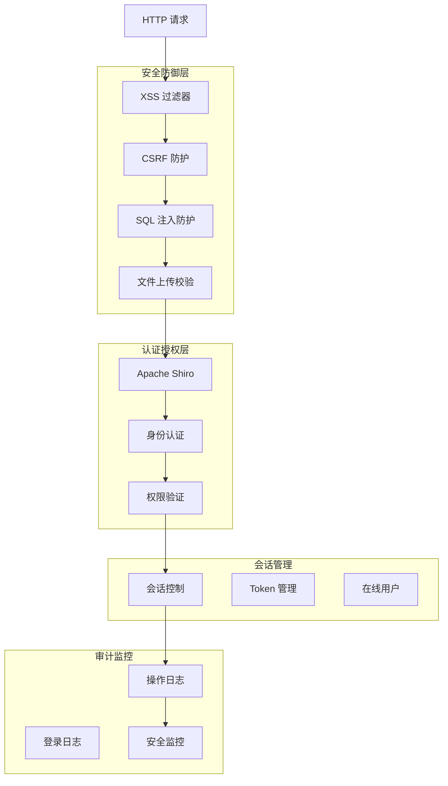

# 安全配置手册

**本文档中引用的文件**
- [application.yml](../../../ruoyi-admin/src/main/resources/application.yml)
- [pom.xml](../../../pom.xml)
- [编码指引.md](./编码指引.md)

## 目录
1. [安全架构概述](#安全架构概述)
2. [Shiro 安全配置](#shiro 安全配置)
3. [认证配置](#认证配置)
4. [授权配置](#授权配置)
5. [会话管理](#会话管理)
6. [密码策略](#密码策略)
7. [XSS 防护](#xss 防护)
8. [SQL 注入防护](#sql 注入防护)
9. [CSRF 防护](#csrf 防护)
10. [文件上传安全](#文件上传安全)
11. [审计日志](#审计日志)
12. [安全加固建议](#安全加固建议)

## 安全架构概述

### 安全体系结构



### 安全特性清单

| 特性 | 状态 | 配置位置 |
|------|------|----------|
| 身份认证 | ✅ 启用 | Shiro 配置 |
| 权限控制 | ✅ 启用 | @PreAuthorize |
| 会话管理 | ✅ 启用 | SessionConfig |
| 密码加密 | ✅ 启用 | BCrypt/MD5 |
| XSS 防护 | ✅ 启用 | XSS 过滤器 |
| SQL 注入防护 | ✅ 启用 | MyBatis 预编译 |
| CSRF 防护 | ⚠️ 可选 | Shiro 配置 |
| 文件上传校验 | ✅ 启用 | 文件类型限制 |
| 登录失败锁定 | ✅ 启用 | 5 次失败锁定 10 分钟 |
| 操作日志 | ✅ 启用 | AOP 日志切面 |

## Shiro 安全配置

### 依赖配置

参考 [pom.xml](../../../pom.xml)：

```xml
<!-- Apache Shiro -->
<dependency>
    <groupId>org.apache.shiro</groupId>
    <artifactId>shiro-spring-boot-starter-jakarta</artifactId>
    <version>2.2.0</version>
</dependency>
```

### Shiro 配置类

```java
@Configuration
public class ShiroConfig {
    
    @Bean
    public SecurityManager securityManager() {
        DefaultWebSecurityManager securityManager = new DefaultWebSecurityManager();
        securityManager.setRealm(userRealm());
        securityManager.setCacheManager(new MemoryConstrainedCacheManager());
        securityManager.setSessionManager(sessionManager());
        return securityManager;
    }
    
    @Bean
    public ShiroFilterFactoryBean shiroFilter(SecurityManager securityManager) {
        ShiroFilterFactoryBean shiroFilter = new ShiroFilterFactoryBean();
        shiroFilter.setSecurityManager(securityManager);
        
        // 配置登录 URL
        shiroFilter.setLoginUrl("/login");
        
        // 配置未授权 URL
        shiroFilter.setUnauthorizedUrl("/unauth");
        
        // 配置拦截规则
        Map<String, String> filterChainDefinitionMap = new LinkedHashMap<>();
        
        // 放行静态资源和公开接口
        filterChainDefinitionMap.put("/css/**", "anon");
        filterChainDefinitionMap.put("/js/**", "anon");
        filterChainDefinitionMap.put("/img/**", "anon");
        filterChainDefinitionMap.put("/druid/**", "anon");
        filterChainDefinitionMap.put("/swagger-ui/**", "anon");
        filterChainDefinitionMap.put("/api/**", "anon");
        
        // 登录接口放行
        filterChainDefinitionMap.put("/login", "anon");
        
        // 其他接口需要认证
        filterChainDefinitionMap.put("/**", "authc");
        
        shiroFilter.setFilterChainDefinitionMap(filterChainDefinitionMap);
        return shiroFilter;
    }
}
```

### 自定义 Realm

```java
@Component
public class UserRealm extends AuthorizingRealm {
    
    @Autowired
    private ISysUserService userService;
    
    @Autowired
    private ISysMenuService menuService;
    
    /**
     * 授权验证
     */
    @Override
    protected AuthorizationInfo doGetAuthorizationInfo(PrincipalCollection principals) {
        SysUser user = (SysUser) principals.getPrimaryPrincipal();
        SimpleAuthorizationInfo info = new SimpleAuthorizationInfo();
        
        // 设置用户角色
        Set<String> roles = userService.selectUserRoleSet(user.getLoginName());
        info.setRoles(roles);
        
        // 设置用户权限
        Set<String> perms = menuService.selectMenuPermsByUserId(user.getUserId());
        info.setStringPermissions(perms);
        
        return info;
    }
    
    /**
     * 登录验证
     */
    @Override
    protected AuthenticationInfo doGetAuthenticationInfo(AuthenticationToken token) 
            throws AuthenticationException {
        UsernamePasswordToken upToken = (UsernamePasswordToken) token;
        String username = upToken.getUsername();
        
        SysUser user = userService.selectUserByLoginName(username);
        if (user == null) {
            throw new UnknownAccountException("用户名或密码错误");
        }
        
        if (!"0".equals(user.getStatus())) {
            throw new LockedAccountException("账号已被停用");
        }
        
        return new SimpleAuthenticationInfo(user, user.getPassword(), getName());
    }
}
```

## 认证配置

### 登录接口

```java
@RestController
public class SysLoginController {
    
    @Autowired
    private SysLoginService loginService;
    
    @PostMapping("/login")
    public AjaxResult login(@RequestBody LoginBody loginBody) {
        // 验证码校验
        if (captchaEnabled) {
            captchaService.validateCaptcha(loginBody.getUsername(), 
                                          loginBody.getCode(), 
                                          loginBody.getUuid());
        }
        
        // 登录验证
        loginService.login(loginBody.getUsername(), loginBody.getPassword());
        
        // 生成 Token
        String token = loginService.createToken(loginBody.getUsername());
        
        Map<String, Object> result = new HashMap<>();
        result.put("token", token);
        return AjaxResult.success(result);
    }
    
    @PostMapping("/logout")
    public AjaxResult logout() {
        SecurityUtils.getSubject().logout();
        return AjaxResult.success();
    }
}
```

### 验证码配置

参考 [application.yml](../../../ruoyi-admin/src/main/resources/application.yml)：

```yaml
# 验证码配置
captcha:
  enabled: true           # 是否开启验证码
  type: math              # 验证码类型（math 数学计算 char 字符验证）
  expiration: 300         # 验证码有效期（秒）
  retry-limit: 5          # 最大重试次数
```

### 登录失败锁定

```java
@Service
public class SysLoginService {
    
    @Autowired
    private PasswordService passwordService;
    
    // 登录失败次数缓存
    private Cache<String, Integer> loginFailedCache;
    
    public void login(String username, String password) {
        // 检查登录失败次数
        Integer failedCount = loginFailedCache.get(username);
        if (failedCount != null && failedCount >= 5) {
            throw new UserPasswordRetryLimitExceededException(10);
        }
        
        try {
            // 登录验证
            Subject subject = SecurityUtils.getSubject();
            UsernamePasswordToken token = new UsernamePasswordToken(username, password);
            subject.login(token);
            
            // 登录成功，清除失败记录
            loginFailedCache.remove(username);
        } catch (AuthenticationException e) {
            // 登录失败，记录失败次数
            failedCount = failedCount == null ? 1 : failedCount + 1;
            loginFailedCache.put(username, failedCount);
            throw e;
        }
    }
}
```

## 授权配置

### 权限注解

```java
/**
 * 权限注解
 */
@Target({ElementType.METHOD, ElementType.TYPE})
@Retention(RetentionPolicy.RUNTIME)
public @interface PreAuthorize {
    /**
     * 权限标识
     */
    String value();
}
```

### 权限表达式

| 表达式 | 说明 | 示例 |
|--------|------|------|
| `@ss.hasPermi()` | 验证是否拥有权限 | `@ss.hasPermi('system:user:add')` |
| `@ss.noPermi()` | 验证是否不拥有权限 | `@ss.noPermi('system:user:add')` |
| `@ss.hasRole()` | 验证是否拥有角色 | `@ss.hasRole('admin')` |
| `@ss.noRole()` | 验证是否不拥有角色 | `@ss.noRole('admin')` |
| `@ss.hasLogin()` | 验证是否已登录 | `@ss.hasLogin()` |

### 使用示例

```java
@RestController
@RequestMapping("/system/user")
public class SysUserController {
    
    /**
     * 查询用户列表
     */
    @PreAuthorize("@ss.hasPermi('system:user:list')")
    @GetMapping("/list")
    public TableDataInfo list(SysUser user) {
        startPage();
        List<SysUser> list = userService.selectUserList(user);
        return getDataTable(list);
    }
    
    /**
     * 新增用户
     */
    @PreAuthorize("@ss.hasPermi('system:user:add')")
    @PostMapping
    public AjaxResult add(@RequestBody SysUser user) {
        return toAjax(userService.insertUser(user));
    }
    
    /**
     * 修改用户
     */
    @PreAuthorize("@ss.hasPermi('system:user:edit')")
    @PutMapping
    public AjaxResult edit(@RequestBody SysUser user) {
        return toAjax(userService.updateUser(user));
    }
    
    /**
     * 删除用户
     */
    @PreAuthorize("@ss.hasPermi('system:user:remove')")
    @DeleteMapping("/{userIds}")
    public AjaxResult remove(@PathVariable Long[] userIds) {
        return toAjax(userService.deleteUserByIds(userIds));
    }
}
```

## 会话管理

### Session 配置

参考 [application.yml](../../../ruoyi-admin/src/main/resources/application.yml)：

```yaml
# Session 配置
server:
  servlet:
    session:
      timeout: 1800           # Session 超时时间（秒）= 30 分钟
      
# Shiro 会话配置
shiro:
  session:
    timeout: 1800000          # Session 超时时间（毫秒）= 30 分钟
    validate-interval: 600000 # Session 验证间隔（毫秒）= 10 分钟
    max-sessions: 10          # 同一用户最大会话数
```

### 会话管理器

```java
@Configuration
public class SessionConfig {
    
    @Bean
    public SessionManager sessionManager() {
        DefaultWebSessionManager sessionManager = new DefaultWebSessionManager();
        sessionManager.setSessionTimeout(1800000); // 30 分钟
        sessionManager.setGlobalSessionTimeout(1800000);
        sessionManager.setDeleteInvalidSessions(true);
        sessionManager.setSessionValidationSchedulerEnabled(true);
        
        // 配置 Session ID 生成器
        sessionManager.setSessionIdGenerator(new JavaUuidSessionIdGenerator());
        
        // 配置 Session 验证调度器
        SessionValidationScheduler scheduler = new DefaultSessionValidationScheduler();
        scheduler.setSessionValidationInterval(600000); // 10 分钟
        sessionManager.setSessionValidationScheduler(scheduler);
        
        return sessionManager;
    }
}
```

### 在线用户管理

```java
@RestController
@RequestMapping("/monitor/online")
public class SysUserOnlineController {
    
    @Autowired
    private SysUserOnlineService userOnlineService;
    
    /**
     * 查询在线用户列表
     */
    @PreAuthorize("@ss.hasPermi('monitor:online:list')")
    @GetMapping("/list")
    public TableDataInfo list(String ipaddr, String userName) {
        Collection<Session> sessions = sessionDAO.getActiveSessions();
        List<SysUserOnline> userOnlineList = new ArrayList<>();
        
        for (Session session : sessions) {
            SysUserOnline userOnline = new SysUserOnline();
            Object attribute = session.getAttribute(DefaultSubjectContext.PRINCIPALS_SESSION_KEY);
            
            if (attribute != null) {
                SysUser user = ((SimplePrincipalCollection) attribute).getPrimaryPrincipal();
                userOnline.setSessionId(session.getId().toString());
                userOnline.setLoginName(user.getLoginName());
                userOnline.setDeptName(user.getDept().getDeptName());
                userOnline.setIpaddr(session.getHost());
                userOnline.setStartTimestamp(session.getStartTimestamp());
                userOnline.setLastAccessTime(session.getLastAccessTime());
                
                if (StringUtils.isEmpty(ipaddr) || session.getHost().contains(ipaddr)) {
                    if (StringUtils.isEmpty(userName) || user.getLoginName().contains(userName)) {
                        userOnlineList.add(userOnline);
                    }
                }
            }
        }
        
        return getDataTable(userOnlineList);
    }
    
    /**
     * 强退用户
     */
    @PreAuthorize("@ss.hasPermi('monitor:online:force')")
    @DeleteMapping("/{sessionId}")
    public AjaxResult forceLogout(@PathVariable String sessionId) {
        sessionDAO.delete(sessionDAO.readSession(sessionId));
        return AjaxResult.success();
    }
}
```

## 密码策略

### 密码加密

```java
@Service
public class PasswordService {
    
    // 使用 BCrypt 加密
    private BCryptPasswordEncoder passwordEncoder = new BCryptPasswordEncoder();
    
    /**
     * 加密密码
     */
    public String encodePassword(String rawPassword) {
        return passwordEncoder.encode(rawPassword);
    }
    
    /**
     * 验证密码
     */
    public boolean matches(String rawPassword, String encodedPassword) {
        return passwordEncoder.matches(rawPassword, encodedPassword);
    }
}
```

### 密码复杂度策略

```java
@Service
public class PasswordValidator {
    
    // 最小密码长度
    private static final int MIN_LENGTH = 6;
    
    // 是否包含数字
    private static final boolean REQUIRE_DIGIT = true;
    
    // 是否包含大写字母
    private static final boolean REQUIRE_UPPERCASE = false;
    
    // 是否包含小写字母
    private static final boolean REQUIRE_LOWERCASE = true;
    
    // 是否包含特殊字符
    private static final boolean REQUIRE_SPECIAL_CHAR = false;
    
    /**
     * 验证密码复杂度
     */
    public ValidationResult validate(String password) {
        if (password == null || password.length() < MIN_LENGTH) {
            return ValidationResult.error("密码长度不能少于" + MIN_LENGTH + "位");
        }
        
        if (REQUIRE_DIGIT && !containsDigit(password)) {
            return ValidationResult.error("密码必须包含数字");
        }
        
        if (REQUIRE_LOWERCASE && !containsLowercase(password)) {
            return ValidationResult.error("密码必须包含小写字母");
        }
        
        if (REQUIRE_UPPERCASE && !containsUppercase(password)) {
            return ValidationResult.error("密码必须包含大写字母");
        }
        
        if (REQUIRE_SPECIAL_CHAR && !containsSpecialChar(password)) {
            return ValidationResult.error("密码必须包含特殊字符");
        }
        
        return ValidationResult.success();
    }
    
    private boolean containsDigit(String password) {
        return password.matches(".*\\d.*");
    }
    
    private boolean containsLowercase(String password) {
        return password.matches(".*[a-z].*");
    }
    
    private boolean containsUppercase(String password) {
        return password.matches(".*[A-Z].*");
    }
    
    private boolean containsSpecialChar(String password) {
        return password.matches(".*[!@#$%^&*(),.?\":{}|<>].*");
    }
}
```

### 密码更新策略

参考 [application.yml](../../../ruoyi-admin/src/main/resources/application.yml)：

```yaml
# 密码策略
password:
  min-length: 6               # 最小密码长度
  require-digit: true         # 必须包含数字
  require-lowercase: true     # 必须包含小写字母
  require-uppercase: false    # 必须包含大写字母
  require-special: false      # 必须包含特殊字符
  max-age: 90                 # 密码最大有效期（天）
  history-size: 5             # 密码历史记录数量（不能与历史密码重复）
```

## XSS 防护

### XSS 过滤器配置

参考 [application.yml](../../../ruoyi-admin/src/main/resources/application.yml)：

```yaml
# 防止 XSS 攻击
xss:
  enabled: true               # 过滤开关
  excludes: /system/notice/*  # 排除链接（多个用逗号分隔）
  urlPatterns: /system/*,/monitor/*,/tool/*  # 匹配链接
```

### XSS 过滤器实现

```java
@Component
@Order(1)
public class XssFilter implements Filter {
    
    @Override
    public void doFilter(ServletRequest request, ServletResponse response, 
                        FilterChain chain) throws IOException, ServletException {
        chain.doFilter(new XssHttpServletRequestWrapper((HttpServletRequest) request), 
                      response);
    }
}
```

### XSS 请求包装器

```java
public class XssHttpServletRequestWrapper extends HttpServletRequestWrapper {
    
    public XssHttpServletRequestWrapper(HttpServletRequest request) {
        super(request);
    }
    
    @Override
    public String[] getParameterValues(String name) {
        String[] values = super.getParameterValues(name);
        if (values != null) {
            int length = values.length;
            String[] escapesValues = new String[length];
            for (int i = 0; i < length; i++) {
                // 防 xss 脚本过滤
                escapesValues[i] = escapeXss(values[i]);
            }
            return escapesValues;
        }
        return super.getParameterValues(name);
    }
    
    private String escapeXss(String value) {
        if (value != null) {
            // HTML 特殊字符转义
            value = value.replaceAll("<", "<")
                        .replaceAll(">", ">")
                        .replaceAll("\"", """)
                        .replaceAll("'", "&#x27;")
                        .replaceAll("/", "&#x2F;")
                        .replaceAll("script", "");
        }
        return value;
    }
}
```

## SQL 注入防护

### MyBatis 预编译

使用 `#{}` 而不是 `${}` 进行参数绑定：

```java
// 推荐：使用预编译参数
@Select("SELECT * FROM sys_user WHERE user_id = #{userId}")
SysUser selectUserById(Long userId);

// 不推荐：直接拼接 SQL（有注入风险）
@Select("SELECT * FROM sys_user WHERE user_id = ${userId}")
SysUser selectUserById(Long userId);
```

### 动态 SQL 防护

```xml
<!-- 推荐：使用 MyBatis 动态 SQL -->
<select id="selectUserList" resultType="SysUser">
    SELECT * FROM sys_user
    <where>
        <if test="userName != null and userName != ''">
            AND login_name LIKE CONCAT('%', #{userName}, '%')
        </if>
        <if test="status != null">
            AND status = #{status}
        </if>
    </where>
</select>

<!-- 不推荐：直接拼接 SQL -->
<select id="selectUserList" resultType="SysUser">
    SELECT * FROM sys_user
    WHERE 1=1
    ${sql}  <!-- 风险：SQL 注入 -->
</select>
```

### 排序字段防护

```java
// 推荐：白名单验证排序字段
public List<SysUser> selectUserList(String orderByColumn, String isAsc) {
    // 验证排序字段
    if (!isValidOrderByColumn(orderByColumn)) {
        orderByColumn = "user_id"; // 默认排序字段
    }
    
    // 验证排序方向
    if (!"asc".equalsIgnoreCase(isAsc) && !"desc".equalsIgnoreCase(isAsc)) {
        isAsc = "asc"; // 默认排序方向
    }
    
    return userMapper.selectUserList(orderByColumn, isAsc);
}

private boolean isValidOrderByColumn(String column) {
    String[] allowedColumns = {"user_id", "login_name", "user_name", "create_time"};
    return Arrays.asList(allowedColumns).contains(column);
}
```

## CSRF 防护

### CSRF Token 配置

```java
@Configuration
public class ShiroConfig {
    
    @Bean
    public ShiroFilterFactoryBean shiroFilter(SecurityManager securityManager) {
        ShiroFilterFactoryBean shiroFilter = new ShiroFilterFactoryBean();
        shiroFilter.setSecurityManager(securityManager);
        
        // 启用 CSRF Token
        Map<String, Filter> filters = new HashMap<>();
        filters.put("csrf", new CsrfFilter());
        shiroFilter.setFilters(filters);
        
        Map<String, String> filterChainDefinitionMap = new LinkedHashMap<>();
        filterChainDefinitionMap.put("/api/**", "authc, csrf");
        shiroFilter.setFilterChainDefinitionMap(filterChainDefinitionMap);
        
        return shiroFilter;
    }
}
```

### 前端 CSRF Token 处理

```javascript
// Axios 请求拦截器
axios.interceptors.request.use(config => {
  // 获取 CSRF Token
  const csrfToken = getCookie('XSRF-TOKEN')
  if (csrfToken) {
    config.headers['X-XSRF-TOKEN'] = csrfToken
  }
  return config
})
```

## 文件上传安全

### 文件类型校验

```java
@Service
public class FileUploadService {
    
    // 允许上传的文件类型
    private static final Set<String> ALLOWED_EXTENSIONS = Set.of(
        "jpg", "jpeg", "png", "gif", "bmp",
        "pdf", "doc", "docx", "xls", "xlsx",
        "txt", "zip", "rar"
    );
    
    // 最大文件大小（10MB）
    private static final long MAX_FILE_SIZE = 10 * 1024 * 1024;
    
    /**
     * 上传文件
     */
    public String uploadFile(MultipartFile file) throws IOException {
        // 校验文件大小
        if (file.getSize() > MAX_FILE_SIZE) {
            throw new FileSizeLimitExceededException("文件大小超过 10MB");
        }
        
        // 校验文件类型
        String fileName = file.getOriginalFilename();
        String extension = getExtension(fileName);
        if (!isAllowedExtension(extension)) {
            throw new InvalidExtensionException("不允许上传的文件类型：" + extension);
        }
        
        // 生成安全的文件名
        String safeFileName = generateSafeFileName(fileName);
        
        // 保存到安全目录
        String filePath = getUploadPath() + safeFileName;
        file.transferTo(new File(filePath));
        
        return safeFileName;
    }
    
    private boolean isAllowedExtension(String extension) {
        return ALLOWED_EXTENSIONS.contains(extension.toLowerCase());
    }
    
    private String generateSafeFileName(String fileName) {
        String timestamp = new SimpleDateFormat("yyyyMMddHHmmss").format(new Date());
        String extension = getExtension(fileName);
        return timestamp + "_" + UUID.randomUUID().toString() + "." + extension;
    }
}
```

### 文件上传配置

参考 [application.yml](../../../ruoyi-admin/src/main/resources/application.yml)：

```yaml
spring:
  servlet:
    multipart:
      enabled: true
      max-file-size: 10MB       # 单个文件最大大小
      max-request-size: 20MB    # 总上传大小限制
      file-size-threshold: 2MB  # 文件写入磁盘的阈值
      
# 文件上传路径
ruoyi:
  profile: /data/upload         # 上传文件保存路径
```

## 审计日志

### 操作日志切面

```java
@Aspect
@Component
public class LogAspect {
    
    @Autowired
    private ISysOperLogService operLogService;
    
    /**
     * 处理操作日志
     */
    @Around("@annotation(log)")
    public Object around(ProceedingJoinPoint point, Log log) throws Throwable {
        long startTime = System.currentTimeMillis();
        
        // 构建操作日志对象
        SysOperLog operLog = new SysOperLog();
        operLog.setOperTime(new Date());
        
        // 设置请求信息
        HttpServletRequest request = getRequest();
        operLog.setOperUrl(request.getRequestURI());
        operLog.setOperIp(getIpAddr(request));
        
        // 设置操作人员
        String loginName = ShiroUtils.getLoginName();
        operLog.setOperName(loginName);
        
        // 设置模块标题
        operLog.setTitle(log.title());
        
        // 设置业务类型
        operLog.setBusinessType(log.businessType().ordinal());
        
        try {
            // 执行方法
            Object result = point.proceed();
            operLog.setStatus(0); // 正常状态
            
            // 记录执行时间
            long endTime = System.currentTimeMillis();
            operLog.setOperTime(endTime - startTime);
            
            // 保存操作日志
            operLogService.insertOperlog(operLog);
            
            return result;
        } catch (Exception e) {
            operLog.setStatus(1); // 异常状态
            operLog.setErrorMsg(e.getMessage());
            
            // 保存异常日志
            operLogService.insertOperlog(operLog);
            throw e;
        }
    }
}
```

### 使用示例

```java
@RestController
@RequestMapping("/system/user")
public class SysUserController {
    
    /**
     * 新增用户
     */
    @Log(title = "用户管理", businessType = BusinessType.INSERT)
    @PreAuthorize("@ss.hasPermi('system:user:add')")
    @PostMapping
    public AjaxResult add(@RequestBody SysUser user) {
        return toAjax(userService.insertUser(user));
    }
    
    /**
     * 修改用户
     */
    @Log(title = "用户管理", businessType = BusinessType.UPDATE)
    @PreAuthorize("@ss.hasPermi('system:user:edit')")
    @PutMapping
    public AjaxResult edit(@RequestBody SysUser user) {
        return toAjax(userService.updateUser(user));
    }
    
    /**
     * 删除用户
     */
    @Log(title = "用户管理", businessType = BusinessType.DELETE)
    @PreAuthorize("@ss.hasPermi('system:user:remove')")
    @DeleteMapping("/{userIds}")
    public AjaxResult remove(@PathVariable Long[] userIds) {
        return toAjax(userService.deleteUserByIds(userIds));
    }
}
```

## 安全加固建议

### 生产环境配置清单

#### 1. 数据库安全
- [ ] 修改默认数据库名（不使用 ry-spring）
- [ ] 使用强密码（至少 12 位，包含大小写字母、数字、特殊字符）
- [ ] 限制数据库远程访问
- [ ] 启用数据库审计日志
- [ ] 定期备份数据库

#### 2. 应用安全
- [ ] 修改默认管理员账号（admin）
- [ ] 启用 HTTPS（SSL 证书）
- [ ] 配置防火墙规则
- [ ] 隐藏服务器版本信息
- [ ] 关闭调试模式

#### 3. 会话安全
- [ ] 配置 Session 超时时间（建议 30 分钟）
- [ ] 启用 Session 绑定 IP
- [ ] 配置最大会话数限制
- [ ] 启用登录失败锁定

#### 4. 文件安全
- [ ] 限制文件上传类型
- [ ] 限制文件上传大小
- [ ] 文件存储到独立服务器
- [ ] 禁止上传目录执行权限

#### 5. 日志安全
- [ ] 启用操作日志
- [ ] 启用登录日志
- [ ] 配置日志轮转
- [ ] 敏感信息脱敏

### 安全配置检查脚本

```bash
#!/bin/bash
# 安全检查脚本

echo "=== RuoYi 安全检查 ==="

# 检查默认密码
echo "检查默认账号..."
mysql -u root -p -e "SELECT login_name, password FROM sys_user WHERE login_name='admin'"

# 检查 Session 配置
echo "检查 Session 配置..."
grep -r "session.timeout" application.yml

# 检查 XSS 配置
echo "检查 XSS 配置..."
grep -r "xss.enabled" application.yml

# 检查文件上传配置
echo "检查文件上传配置..."
grep -r "max-file-size" application.yml

echo "=== 检查完成 ==="
```

### 安全漏洞扫描

推荐使用以下工具进行安全扫描：
- OWASP ZAP
- Burp Suite
- SonarQube
- FindSecBugs

## 参考文档
- [application.yml](../../../ruoyi-admin/src/main/resources/application.yml) - 配置文件
- [编码指引.md](./编码指引.md) - 安全编码规范
- [部署与运维.md](./部署与运维.md) - 生产环境部署
