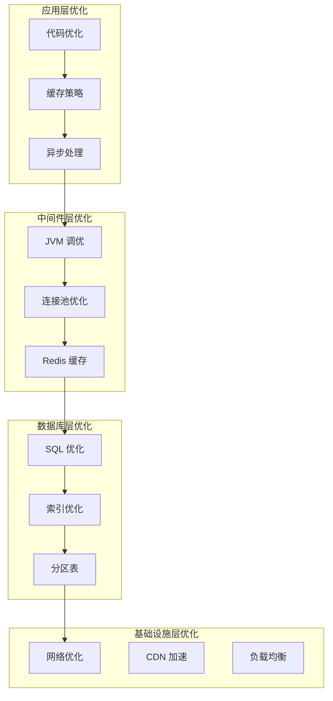

# 性能优化指南

**本文档中引用的文件**
- [application.yml](../../../ruoyi-admin/src/main/resources/application.yml)
- [application-druid.yml](../../../ruoyi-admin/src/main/resources/application-druid.yml)
- [pom.xml](../../../pom.xml)

## 目录
1. [性能优化概述](#性能优化概述)
2. [JVM 调优](#jvm 调优)
3. [数据库连接池优化](#数据库连接池优化)
4. [SQL 优化](#sql 优化)
5. [缓存优化](#缓存优化)
6. [接口性能优化](#接口性能优化)
7. [前端性能优化](#前端性能优化)
8. [并发处理优化](#并发处理优化)
9. [性能监控](#性能监控)
10. [性能测试](#性能测试)

## 性能优化概述

### 性能指标

| 指标 | 目标值 | 说明 |
|------|--------|------|
| 响应时间 | < 200ms | 普通接口响应时间 |
| 复杂接口响应时间 | < 2s | 复杂查询/统计接口 |
| 吞吐量 | > 1000 TPS | 每秒事务处理数 |
| CPU 使用率 | < 70% | 正常运行时 |
| 内存使用率 | < 80% | 正常运行时 |
| 数据库连接池使用率 | < 80% | 活跃连接占比 |
| 错误率 | < 0.1% | 请求失败率 |

### 优化层次



## JVM 调优

### JVM 参数配置

参考 [application.yml](../../../ruoyi-admin/src/main/resources/application.yml)：

```yaml
# JVM 启动参数（生产环境推荐）
# -Xms512m -Xmx1024m -Xmn256m
# -XX:MetaspaceSize=128m -XX:MaxMetaspaceSize=256m
# -XX:+HeapDumpOnOutOfMemoryError -XX:HeapDumpPath=/data/logs/heapdump.hprof
# -XX:+UseG1GC -XX:MaxGCPauseMillis=200
# -XX:+PrintGCDetails -XX:+PrintGCDateStamps -Xloggc:/data/logs/gc.log
```

### 推荐 JVM 配置

#### 开发环境
```bash
-Xms512m -Xmx512m -Xmn256m
-XX:MetaspaceSize=128m -XX:MaxMetaspaceSize=256m
-XX:+UseG1GC
```

#### 生产环境（2GB 内存）
```bash
-Xms1024m -Xmx1024m -Xmn512m
-XX:MetaspaceSize=256m -XX:MaxMetaspaceSize=512m
-XX:+UseG1GC -XX:MaxGCPauseMillis=200
-XX:+HeapDumpOnOutOfMemoryError
-XX:HeapDumpPath=/data/logs/heapdump.hprof
-XX:+PrintGCDetails -XX:+PrintGCDateStamps
-Xloggc:/data/logs/gc.log
-XX:+UseGCLogFileRotation
-XX:NumberOfGCLogFiles=10
-XX:GCLogFileSize=100M
```

#### 生产环境（4GB 内存）
```bash
-Xms2048m -Xmx2048m -Xmn1024m
-XX:MetaspaceSize=512m -XX:MaxMetaspaceSize=1024m
-XX:+UseG1GC -XX:MaxGCPauseMillis=200
-XX:InitiatingHeapOccupancyPercent=45
-XX:+HeapDumpOnOutOfMemoryError
-XX:HeapDumpPath=/data/logs/heapdump.hprof
-XX:+PrintGCDetails -XX:+PrintGCDateStamps
-Xloggc:/data/logs/gc.log
```

### G1 GC 调优参数

```bash
# G1 GC 关键参数
-XX:+UseG1GC                      # 启用 G1 垃圾收集器
-XX:MaxGCPauseMillis=200          # 最大 GC 暂停时间（毫秒）
-XX:InitiatingHeapOccupancyPercent=45  # 触发并发 GC 的堆占用百分比
-XX:G1ReservePercent=10           # 预留堆内存百分比
-XX:G1HeapRegionSize=4m           # Region 大小
-XX:G1NewSizePercent=60           # 新生代占比
-XX:G1MaxNewSizePercent=60        # 新生代最大占比
```

### GC 日志分析

```bash
# 查看 GC 日志
tail -f /data/logs/gc.log

# 使用 GCViewer 分析 GC 日志
java -jar gcviewer.jar gc.log

# 关键指标
# - GC 频率：Young GC 每 5-10 分钟一次，Full GC 每天不超过 1 次
# - GC 暂停时间：Young GC < 50ms，Full GC < 500ms
# - GC 效率：95% 以上的 GC 时间应该回收 90% 以上的对象
```

### 内存泄漏排查

```bash
# 1. 查看堆内存使用情况
jmap -heap <pid>

# 2. 导出堆转储文件
jmap -dump:format=b,file=heapdump.hprof <pid>

# 3. 使用 MAT 分析堆转储
# 下载 Eclipse MAT: https://www.eclipse.org/mat/
# 打开 heapdump.hprof 文件，查看 Histogram 和 Dominator Tree

# 4. 查找内存泄漏可疑对象
# - 查看占用内存最大的对象
# - 查看对象引用链
# - 定位泄漏代码位置
```

## 数据库连接池优化

### Druid 连接池配置

参考 [application-druid.yml](../../../ruoyi-admin/src/main/resources/application-druid.yml)：

```yaml
spring:
  datasource:
    type: com.alibaba.druid.pool.DruidDataSource
    druid:
      # 基本配置
      initialSize: 5              # 初始连接数
      minIdle: 10                 # 最小空闲连接数
      maxActive: 20               # 最大活跃连接数
      
      # 连接等待配置
      maxWait: 60000              # 连接获取超时时间（毫秒）
      
      # 连接检测配置
      timeBetweenEvictionRunsMillis: 60000      # 空闲连接检测周期
      minEvictableIdleTimeMillis: 300000        # 连接最小生存时间
      maxEvictableIdleTimeMillis: 900000        # 连接最大生存时间
      
      # 连接验证配置
      validationQuery: SELECT 1
      testWhileIdle: true         # 获取连接时检测
      testOnBorrow: false         # 借出连接时不检测（影响性能）
      testOnReturn: false         # 归还连接时不检测
      
      # PooledStatement 配置
      poolPreparedStatements: true
      maxPoolPreparedStatementPerConnectionSize: 20
      
      # 过滤器配置
      filters: stat,wall,slf4j
    
      # 监控统计配置
      stat:
        enabled: true
        db-type: mysql
        log-slow-sql: true
        slow-sql-millis: 1000
        merge-sql: true
      
      # Wall 防火墙配置
      wall:
        enabled: true
        config:
          delete-where-none-check: true
          update-where-none-check: true
      
      # 监控页面配置
      stat-view-servlet:
        enabled: true
        url-pattern: /druid/*
        login-username: ruoyi
        login-password: ruoyi123
        reset-enable: false
        allow: 127.0.0.1
```

### 连接池调优建议

#### 高并发场景
```yaml
spring:
  datasource:
    druid:
      initialSize: 20             # 增加初始连接数
      minIdle: 20                 # 增加最小空闲连接
      maxActive: 50               # 增加最大活跃连接
      maxWait: 30000              # 减少等待时间（快速失败）
```

#### 低并发场景
```yaml
spring:
  datasource:
    druid:
      initialSize: 2              # 减少初始连接
      minIdle: 5                  # 减少最小空闲连接
      maxActive: 10               # 减少最大活跃连接
```

### 连接池监控

访问 Druid 监控台：`http://localhost/druid/`

**关键监控指标**：
- 活跃连接数：应 < maxActive * 0.8
- 等待连接数：应接近 0
- 连接获取时间：应 < 10ms
- SQL 执行时间：应 < 100ms
- 慢 SQL 数量：应接近 0

## SQL 优化

### 索引优化

#### 创建索引的原则
1. 频繁查询的字段应该建立索引
2. 作为 WHERE 子句条件的字段
3. 作为 JOIN 连接条件的字段
4. 作为 ORDER BY 排序的字段
5. 作为 GROUP BY 分组的字段

#### 避免索引失效

```sql
-- 不推荐：对索引列使用函数
SELECT * FROM sys_user WHERE YEAR(create_time) = 2024;

-- 推荐：使用范围查询
SELECT * FROM sys_user 
WHERE create_time >= '2024-01-01' AND create_time < '2025-01-01';

-- 不推荐：对索引列进行计算
SELECT * FROM sys_user WHERE user_id + 1 = 100;

-- 推荐：直接比较
SELECT * FROM sys_user WHERE user_id = 99;

-- 不推荐：模糊查询以%开头
SELECT * FROM sys_user WHERE login_name LIKE '%admin%';

-- 推荐：使用全文索引或搜索引擎
SELECT * FROM sys_user WHERE login_name LIKE 'admin%';

-- 不推荐：使用 OR 连接非索引列
SELECT * FROM sys_user WHERE user_id = 1 OR remark = 'test';

-- 推荐：使用 UNION
SELECT * FROM sys_user WHERE user_id = 1
UNION
SELECT * FROM sys_user WHERE remark = 'test';
```

### 查询优化

#### 避免 SELECT *

```sql
-- 不推荐
SELECT * FROM sys_user;

-- 推荐
SELECT user_id, login_name, user_name, email FROM sys_user;
```

#### 使用分页查询

```sql
-- 不推荐：查询所有数据
SELECT * FROM sys_user;

-- 推荐：分页查询
SELECT user_id, login_name, user_name 
FROM sys_user 
LIMIT 0, 10;
```

#### 优化 JOIN 查询

```sql
-- 不推荐：多表关联无索引
SELECT u.*, d.dept_name 
FROM sys_user u, sys_dept d 
WHERE u.dept_id = d.dept_id;

-- 推荐：使用 INNER JOIN 并确保关联字段有索引
SELECT u.user_id, u.login_name, u.user_name, d.dept_name
FROM sys_user u
INNER JOIN sys_dept d ON u.dept_id = d.dept_id
WHERE u.status = '0';
```

#### 使用 EXISTS 代替 IN

```sql
-- 不推荐：使用 IN（子查询）
SELECT * FROM sys_user 
WHERE user_id IN (SELECT user_id FROM sys_user_role WHERE role_id = 1);

-- 推荐：使用 EXISTS
SELECT * FROM sys_user u
WHERE EXISTS (
    SELECT 1 FROM sys_user_role ur 
    WHERE ur.user_id = u.user_id AND ur.role_id = 1
);
```

### 慢 SQL 分析

#### 开启慢 SQL 日志

```yaml
spring:
  datasource:
    druid:
      stat:
        log-slow-sql: true
        slow-sql-millis: 1000
```

#### 查看慢 SQL

```sql
-- 查看 MySQL 慢查询日志
SHOW VARIABLES LIKE 'slow_query%';
SHOW VARIABLES LIKE 'long_query_time';

-- 查看当前正在执行的 SQL
SHOW PROCESSLIST;

-- 查看 Druid 监控台的 SQL 监控
-- 访问 http://localhost/druid/sql.html
```

#### 使用 EXPLAIN 分析

```sql
-- 分析 SQL 执行计划
EXPLAIN SELECT * FROM sys_user WHERE login_name = 'admin';

-- 执行计划字段说明
-- id: 查询的序列号
-- select_type: 查询类型（SIMPLE, PRIMARY, SUBQUERY, DERIVED 等）
-- table: 输出的表
-- type: 连接类型（ALL, index, range, ref, eq_ref, const, system）
-- possible_keys: 可能用到的索引
-- key: 实际使用的索引
-- key_len: 使用索引的长度
-- ref: 显示哪个字段或常数与 key 一起被使用
-- rows: 预计要扫描的行数
-- Extra: 额外信息
```

## 缓存优化

### Redis 缓存配置

```yaml
spring:
  redis:
    host: localhost
    port: 6379
    password: 
    database: 0
    timeout: 5000ms
    lettuce:
      pool:
        max-active: 8           # 最大连接数
        max-idle: 8             # 最大空闲连接
        min-idle: 0             # 最小空闲连接
        max-wait: -1ms          # 连接超时时间
```

### 缓存使用策略

#### 缓存热点数据

```java
@Service
public class SysUserServiceImpl implements ISysUserService {
    
    @Autowired
    private RedisTemplate<String, Object> redisTemplate;
    
    @Override
    public SysUser selectUserById(Long userId) {
        // 1. 先查缓存
        String key = "user:" + userId;
        SysUser user = (SysUser) redisTemplate.opsForValue().get(key);
        
        if (user != null) {
            return user;
        }
        
        // 2. 缓存未命中，查数据库
        user = userMapper.selectUserById(userId);
        
        if (user != null) {
            // 3. 写入缓存，设置过期时间 30 分钟
            redisTemplate.opsForValue().set(key, user, 30, TimeUnit.MINUTES);
        }
        
        return user;
    }
    
    @Override
    public int updateUser(SysUser user) {
        // 1. 更新数据库
        int result = userMapper.updateUser(user);
        
        if (result > 0) {
            // 2. 删除缓存（缓存一致性）
            String key = "user:" + user.getUserId();
            redisTemplate.delete(key);
        }
        
        return result;
    }
}
```

#### 使用 Spring Cache

```java
@Service
public class SysUserServiceImpl implements ISysUserService {
    
    /**
     * 缓存用户信息
     */
    @Cacheable(value = "user", key = "#userId", unless = "#result == null")
    @Override
    public SysUser selectUserById(Long userId) {
        return userMapper.selectUserById(userId);
    }
    
    /**
     * 更新用户并清除缓存
     */
    @CacheEvict(value = "user", key = "#user.userId")
    @Override
    public int updateUser(SysUser user) {
        return userMapper.updateUser(user);
    }
    
    /**
     * 缓存用户列表
     */
    @Cacheable(value = "userList", key = "#root.methodName")
    @Override
    public List<SysUser> selectUserList(SysUser user) {
        return userMapper.selectUserList(user);
    }
    
    /**
     * 清除所有用户列表缓存
     */
    @CacheEvict(value = "userList", allEntries = true)
    @Override
    public int insertUser(SysUser user) {
        return userMapper.insertUser(user);
    }
}
```

### 缓存配置

```java
@Configuration
@EnableCaching
public class CacheConfig {
    
    @Bean
    public CacheManager cacheManager(RedisConnectionFactory factory) {
        RedisCacheConfiguration config = RedisCacheConfiguration.defaultCacheConfig()
            .entryTtl(Duration.ofMinutes(30))           // 默认过期时间 30 分钟
            .serializeKeysWith(RedisSerializationContext.SerializationPair
                .fromSerializer(new StringRedisSerializer()))
            .serializeValuesWith(RedisSerializationContext.SerializationPair
                .fromSerializer(new GenericJackson2JsonRedisSerializer()))
            .disableCachingNullValues();                // 不缓存空值
        
        // 配置不同缓存的过期时间
        Map<String, RedisCacheConfiguration> cacheConfigMap = new HashMap<>();
        cacheConfigMap.put("user", config.entryTtl(Duration.ofMinutes(30)));
        cacheConfigMap.put("role", config.entryTtl(Duration.ofMinutes(60)));
        cacheConfigMap.put("menu", config.entryTtl(Duration.ofMinutes(60)));
        cacheConfigMap.put("dict", config.entryTtl(Duration.ofMinutes(120)));
        
        return RedisCacheManager.builder(factory)
            .cacheDefaults(config)
            .withInitialCacheConfig(cacheConfigMap)
            .build();
    }
}
```

## 接口性能优化

### 批量操作

```java
/**
 * 批量插入用户（不推荐：循环插入）
 */
public void batchInsertUserWrong(List<SysUser> users) {
    for (SysUser user : users) {
        userMapper.insertUser(user);  // 每次插入都访问数据库
    }
}

/**
 * 批量插入用户（推荐：批量操作）
 */
@Transactional
public void batchInsertUser(List<SysUser> users) {
    // 一次性批量插入
    userMapper.batchInsertUser(users);
}
```

**Mapper 批量插入**：
```xml
<insert id="batchInsertUser">
    INSERT INTO sys_user (
        dept_id, login_name, user_name, user_type, email, 
        phonenumber, sex, avatar, password, salt, status
    ) VALUES
    <foreach collection="list" item="user" separator=",">
        (
            #{user.deptId}, #{user.loginName}, #{user.userName}, 
            #{user.userType}, #{user.email}, #{user.phonenumber}, 
            #{user.sex}, #{user.avatar}, #{user.password}, 
            #{user.salt}, #{user.status}
        )
    </foreach>
</insert>
```

### 异步处理

```java
@Service
public class AsyncService {
    
    @Autowired
    private TaskExecutor taskExecutor;
    
    /**
     * 异步执行任务
     */
    public void asyncExecute() {
        taskExecutor.execute(() -> {
            // 异步处理逻辑
            logger.info("异步任务执行中...");
        });
    }
    
    /**
     * 使用 CompletableFuture 异步处理
     */
    public CompletableFuture<String> asyncProcess() {
        return CompletableFuture.supplyAsync(() -> {
            // 处理逻辑
            return "处理结果";
        }, taskExecutor);
    }
}

@Configuration
@EnableAsync
public class AsyncConfig implements AsyncConfigurer {
    
    @Override
    @Bean(name = "taskExecutor")
    public Executor getAsyncExecutor() {
        ThreadPoolTaskExecutor executor = new ThreadPoolTaskExecutor();
        executor.setCorePoolSize(10);           // 核心线程数
        executor.setMaxPoolSize(20);            // 最大线程数
        executor.setQueueCapacity(200);         // 队列容量
        executor.setThreadNamePrefix("async-"); // 线程名前缀
        executor.setRejectedExecutionHandler(new ThreadPoolExecutor.CallerRunsPolicy());
        executor.initialize();
        return executor;
    }
}
```

### 接口限流

```java
@Service
public class RateLimiterService {
    
    // 使用 Guava RateLimiter
    private RateLimiter rateLimiter = RateLimiter.create(100); // 每秒 100 个请求
    
    /**
     * 限流处理
     */
    public void handleRequest() {
        if (!rateLimiter.tryAcquire()) {
            throw new BusinessException("请求过于频繁，请稍后再试");
        }
        
        // 处理业务逻辑
    }
}
```

## 前端性能优化

### 资源优化

#### 1. 使用 CDN 加速

```javascript
// vue.config.js
module.exports = {
  chainWebpack: config => {
    // 配置 CDN
    config.externals({
      'vue': 'Vue',
      'vue-router': 'VueRouter',
      'vuex': 'Vuex',
      'axios': 'axios',
      'element-ui': 'ELEMENT'
    })
  }
}
```

#### 2. 代码分割

```javascript
// router/index.js
const routes = [
  {
    path: '/system/user',
    component: () => import('@/views/system/user/index') // 懒加载
  },
  {
    path: '/system/role',
    component: () => import('@/views/system/role/index') // 懒加载
  }
]
```

#### 3. 图片优化

```javascript
// 使用 WebP 格式
// 图片压缩
// 使用图片懒加载
<el-image :src="imageUrl" lazy />
```

### 接口请求优化

#### 1. 请求防抖

```javascript
// 防抖函数
function debounce(func, wait) {
  let timeout
  return function() {
    clearTimeout(timeout)
    timeout = setTimeout(() => func.apply(this, arguments), wait)
  }
}

// 使用
const handleSearch = debounce(() => {
  this.handleQuery()
}, 500)
```

#### 2. 请求取消

```javascript
// 使用 Axios CancelToken
const CancelToken = axios.CancelToken
const source = CancelToken.source()

axios.get('/api/user/list', {
  cancelToken: source.token
}).catch(thrown => {
  if (axios.isCancel(thrown)) {
    console.log('请求已取消', thrown.message)
  }
})

// 取消请求
source.cancel('取消操作')
```

#### 3. 请求合并

```javascript
// 使用 Promise.all 合并请求
Promise.all([
  this.getUserList(),
  this.getRoleList(),
  this.getDeptList()
]).then(([userRes, roleRes, deptRes]) => {
  this.userList = userRes.data.rows
  this.roleList = roleRes.data.rows
  this.deptList = deptRes.data.rows
})
```

## 并发处理优化

### 线程池配置

```java
@Configuration
public class ThreadPoolConfig {
    
    @Bean(name = "commonThreadPool")
    public ThreadPoolExecutor commonThreadPool() {
        return new ThreadPoolExecutor(
            10,                                 // 核心线程数
            20,                                 // 最大线程数
            60L, TimeUnit.SECONDS,              // 空闲线程存活时间
            new ArrayBlockingQueue<>(100),      // 队列容量
            new ThreadFactoryBuilder()
                .setNameFormat("common-%d")
                .setDaemon(true)
                .build(),
            new ThreadPoolExecutor.CallerRunsPolicy() // 拒绝策略
        );
    }
}
```

### 并行处理

```java
@Service
public class DataProcessService {
    
    @Autowired
    @Qualifier("commonThreadPool")
    private ThreadPoolExecutor executor;
    
    /**
     * 并行处理数据
     */
    public List<Result> parallelProcess(List<Data> dataList) {
        List<CompletableFuture<Result>> futures = dataList.stream()
            .map(data -> CompletableFuture.supplyAsync(
                () -> processSingle(data), executor))
            .collect(Collectors.toList());
        
        // 等待所有任务完成
        CompletableFuture<Void> allFutures = CompletableFuture.allOf(
            futures.toArray(new CompletableFuture[0]));
        
        // 获取结果
        return futures.stream()
            .map(CompletableFuture::join)
            .collect(Collectors.toList());
    }
    
    private Result processSingle(Data data) {
        // 单个数据处理逻辑
        return new Result();
    }
}
```

## 性能监控

### Spring Boot Actuator

```xml
<!-- pom.xml -->
<dependency>
    <groupId>org.springframework.boot</groupId>
    <artifactId>spring-boot-starter-actuator</artifactId>
</dependency>
```

```yaml
# application.yml
management:
  endpoints:
    web:
      exposure:
        include: health,info,metrics,prometheus
  endpoint:
    health:
      show-details: always
  metrics:
    export:
      prometheus:
        enabled: true
```

### 监控指标

访问：`http://localhost/actuator/metrics`

**关键指标**：
- `jvm.memory.used`：JVM 内存使用
- `jvm.gc.pause`：GC 暂停时间
- `http.server.requests`：HTTP 请求统计
- `tomcat.threads.active`：Tomcat 活跃线程数
- `hikaricp.connections.active`：数据库活跃连接数

### APM 工具

推荐使用以下 APM 工具进行性能监控：
- Prometheus + Grafana
- SkyWalking
- Pinpoint
- Zipkin

## 性能测试

### JMeter 压测

#### 1. 安装 JMeter

下载：https://jmeter.apache.org/download_jmeter.cgi

#### 2. 创建测试计划

```
测试计划
├── 线程组
│   ├── HTTP 请求默认值
│   ├── HTTP 请求头管理器
│   └── HTTP 请求
├── 监听器
│   ├── 察看结果树
│   ├── 聚合报告
│   └── 响应时间图
└── 配置元件
    └── CSV 数据文件
```

#### 3. 压测脚本示例

```xml
<!-- jmeter_test_plan.jmx -->
<jmeterTestPlan>
  <hashTree>
    <TestPlan>
      <stringProp name="TestPlan.name">RuoYi 性能测试</stringProp>
    </TestPlan>
    <ThreadGroup>
      <stringProp name="ThreadGroup.name">用户登录</stringProp>
      <intProp name="ThreadGroup.num_threads">100</intProp>
      <intProp name="ThreadGroup.ramp_time">10</intProp>
      <intProp name="ThreadGroup.loop_count">10</intProp>
    </ThreadGroup>
    <HTTPSamplerProxy>
      <stringProp name="HTTPSampler.domain">localhost</stringProp>
      <stringProp name="HTTPSampler.port">80</stringProp>
      <stringProp name="HTTPSampler.path">/login</stringProp>
      <stringProp name="HTTPSampler.method">POST</stringProp>
    </HTTPSamplerProxy>
  </hashTree>
</jmeterTestPlan>
```

### 压测指标

| 指标 | 目标值 | 说明 |
|------|--------|------|
| 平均响应时间 | < 200ms | 所有请求的平均响应时间 |
| 90% 响应时间 | < 500ms | 90% 请求的响应时间 |
| 95% 响应时间 | < 1s | 95% 请求的响应时间 |
| 错误率 | < 0.1% | 失败请求占比 |
| 吞吐量 | > 1000 TPS | 每秒处理事务数 |

### 压测报告

```
=== 性能测试报告 ===

测试场景：用户登录接口
并发用户数：100
测试持续时间：10 分钟

测试结果：
- 总请求数：60000
- 成功请求数：59980
- 失败请求数：20
- 错误率：0.03%

响应时间：
- 平均响应时间：156ms
- 最小响应时间：45ms
- 最大响应时间：2340ms
- 90% 响应时间：320ms
- 95% 响应时间：450ms

吞吐量：
- TPS: 100
- 网络吞吐量：5.2 MB/s

资源使用：
- CPU 使用率：65%
- 内存使用率：72%
- 数据库连接池使用率：45%

结论：
系统性能满足要求，可以上线。
```

## 参考文档
- [application.yml](../../../ruoyi-admin/src/main/resources/application.yml) - 应用配置
- [application-druid.yml](../../../ruoyi-admin/src/main/resources/application-druid.yml) - 数据库配置
- [部署与运维.md](./部署与运维.md) - 部署配置
- [监控告警配置.md](./监控告警配置.md) - 性能监控
