# 扩展开发指南

**本文档中引用的文件**
- [README.md](../../../README.md)
- [pom.xml](../../../pom.xml)
- [application.yml](../../../ruoyi-admin/src/main/resources/application.yml)

## 目录
1. [扩展开发概述](#扩展开发概述)
2. [新增业务模块](#新增业务模块)
3. [自定义注解](#自定义注解)
4. [工具类扩展](#工具类扩展)
5. [国际化配置](#国际化配置)
6. [主题定制](#主题定制)
7. [第三方集成](#第三方集成)
8. [插件化开发](#插件化开发)
9. [最佳实践](#最佳实践)

## 扩展开发概述

### 扩展原则

1. **开闭原则**：对扩展开放，对修改关闭
2. **单一职责**：每个类只负责一个职责
3. **依赖倒置**：依赖抽象，不依赖具体实现
4. **接口隔离**：使用多个专门的接口
5. **配置优先**：优先使用配置而非硬编码

### 扩展层次

```mermaid
graph TB
    subgraph "业务层扩展"
        Module[新增业务模块]
        Service[服务扩展]
        Controller[控制器扩展]
    end
    
    subgraph "框架层扩展"
        Annotation[自定义注解]
        Aspect[AOP 切面]
        Interceptor[拦截器]
    end
    
    subgraph "工具层扩展"
        Util[工具类扩展]
        Config[配置扩展]
        I18n[国际化]
    end
    
    subgraph "表现层扩展"
        Theme[主题定制]
        Template[模板扩展]
        Component[组件扩展]
    end
    
    Module --> Service
    Service --> Controller
    Annotation --> Aspect
    Aspect --> Interceptor
    Util --> Config
    Config --> I18n
    Theme --> Template
    Template --> Component
```



## 新增业务模块

### 1. 创建数据库表

```sql
-- 示例：创建项目管理表
DROP TABLE IF EXISTS sys_project;
CREATE TABLE sys_project (
  project_id      bigint(20)      not null auto_increment    comment '项目 ID',
  project_name    varchar(100)    not null                   comment '项目名称',
  project_code    varchar(50)     not null                   comment '项目编码',
  project_type    char(1)         default '1'                comment '项目类型（1 研发 2 实施 3 运维）',
  status          char(1)         default '0'                comment '状态（0 进行中 1 已完成 2 已暂停）',
  start_date      datetime                                   comment '开始日期',
  end_date        datetime                                     comment '结束日期',
  budget          decimal(10,2)   default 0                  comment '预算',
  manager_id      bigint(20)      default null               comment '负责人 ID',
  remark          varchar(500)    default null               comment '备注',
  create_by       varchar(64)     default ''                 comment '创建者',
  create_time     datetime                                   comment '创建时间',
  update_by       varchar(64)     default ''                 comment '更新者',
  update_time     datetime                                   comment '更新时间',
  del_flag        char(1)         default '0'                comment '删除标志',
  PRIMARY KEY (project_id)
) ENGINE=InnoDB comment = '项目管理表';
```

### 2. 生成代码

使用代码生成器生成基础代码：
1. 访问：`http://localhost/tool/gen`
2. 导入表：`sys_project`
3. 编辑生成配置
4. 生成代码并下载

### 3. 创建模块结构

```
ruoyi-system/
└── src/main/java/com/ruoyi/system/
    ├── domain/
    │   └── SysProject.java          # 实体类
    ├── mapper/
    │   ├── SysProjectMapper.java    # Mapper 接口
    │   └── SysProjectMapper.xml     # Mapper XML
    ├── service/
    │   ├── ISysProjectService.java  # Service 接口
    │   └── impl/
    │       └── SysProjectServiceImpl.java  # Service 实现
    └── controller/
        └── SysProjectController.java       # Controller
```

### 4. 编写实体类

```java
@Data
@TableName("sys_project")
public class SysProject extends BaseEntity {
    
    /** 项目 ID */
    @TableId(type = IdType.AUTO)
    private Long projectId;
    
    /** 项目名称 */
    @NotBlank(message = "项目名称不能为空")
    @Size(min = 2, max = 100, message = "项目名称长度必须在 2 到 100 个字符之间")
    private String projectName;
    
    /** 项目编码 */
    @NotBlank(message = "项目编码不能为空")
    @Size(min = 2, max = 50, message = "项目编码长度必须在 2 到 50 个字符之间")
    private String projectCode;
    
    /** 项目类型 */
    @Dict(type = "project_type")
    private String projectType;
    
    /** 状态 */
    @Dict(type = "project_status")
    private String status;
    
    /** 开始日期 */
    @JsonFormat(pattern = "yyyy-MM-dd")
    private Date startDate;
    
    /** 结束日期 */
    @JsonFormat(pattern = "yyyy-MM-dd")
    private Date endDate;
    
    /** 预算 */
    private BigDecimal budget;
    
    /** 负责人 ID */
    private Long managerId;
    
    /** 负责人信息 */
    @TableField(exist = false)
    private SysUser manager;
    
    /** 备注 */
    private String remark;
}
```

### 5. 编写 Mapper

```java
public interface SysProjectMapper extends BaseMapper<SysProject> {
    
    /**
     * 查询项目列表
     */
    List<SysProject> selectProjectList(SysProject project);
    
    /**
     * 查询项目详情
     */
    SysProject selectProjectById(Long projectId);
    
    /**
     * 新增项目
     */
    int insertProject(SysProject project);
    
    /**
     * 修改项目
     */
    int updateProject(SysProject project);
    
    /**
     * 删除项目
     */
    int deleteProjectById(Long projectId);
    
    /**
     * 批量删除项目
     */
    int deleteProjectByIds(Long[] projectIds);
}
```

**Mapper XML**：
```xml
<?xml version="1.0" encoding="UTF-8" ?>
<!DOCTYPE mapper PUBLIC "-//mybatis.org//DTD Mapper 3.0//EN" "http://mybatis.org/dtd/mybatis-3-mapper.dtd">
<mapper namespace="com.ruoyi.system.mapper.SysProjectMapper">
    
    <resultMap type="SysProject" id="SysProjectResult">
        <id property="projectId" column="project_id" />
        <result property="projectName" column="project_name" />
        <result property="projectCode" column="project_code" />
        <result property="projectType" column="project_type" />
        <result property="status" column="status" />
        <result property="startDate" column="start_date" />
        <result property="endDate" column="end_date" />
        <result property="budget" column="budget" />
        <result property="managerId" column="manager_id" />
        <result property="remark" column="remark" />
    </resultMap>
    
    <select id="selectProjectList" parameterType="SysProject" resultMap="SysProjectResult">
        SELECT p.*, u.user_name as manager_name
        FROM sys_project p
        LEFT JOIN sys_user u ON p.manager_id = u.user_id
        <where>
            p.del_flag = '0'
            <if test="projectName != null and projectName != ''">
                AND p.project_name LIKE CONCAT('%', #{projectName}, '%')
            </if>
            <if test="projectCode != null and projectCode != ''">
                AND p.project_code = #{projectCode}
            </if>
            <if test="projectType != null and projectType != ''">
                AND p.project_type = #{projectType}
            </if>
            <if test="status != null and status != ''">
                AND p.status = #{status}
            </if>
        </where>
        ORDER BY p.create_time DESC
    </select>
</mapper>
```

### 6. 编写 Service

```java
public interface ISysProjectService extends IService<SysProject> {
    
    /**
     * 查询项目列表
     */
    List<SysProject> selectProjectList(SysProject project);
    
    /**
     * 查询项目详情
     */
    SysProject selectProjectById(Long projectId);
    
    /**
     * 新增项目
     */
    int insertProject(SysProject project);
    
    /**
     * 修改项目
     */
    int updateProject(SysProject project);
    
    /**
     * 删除项目
     */
    int deleteProjectById(Long projectId);
    
    /**
     * 批量删除项目
     */
    int deleteProjectByIds(Long[] projectIds);
}

@Service
public class SysProjectServiceImpl extends ServiceImpl<SysProjectMapper, SysProject> 
        implements ISysProjectService {
    
    @Override
    public List<SysProject> selectProjectList(SysProject project) {
        return baseMapper.selectProjectList(project);
    }
    
    @Override
    public SysProject selectProjectById(Long projectId) {
        return baseMapper.selectProjectById(projectId);
    }
    
    @Override
    @Transactional
    public int insertProject(SysProject project) {
        // 生成项目编码
        project.setProjectCode(generateProjectCode());
        return baseMapper.insertProject(project);
    }
    
    @Override
    @Transactional
    public int updateProject(SysProject project) {
        return baseMapper.updateProject(project);
    }
    
    @Override
    @Transactional
    public int deleteProjectById(Long projectId) {
        return baseMapper.deleteProjectById(projectId);
    }
    
    @Override
    @Transactional
    public int deleteProjectByIds(Long[] projectIds) {
        return baseMapper.deleteProjectByIds(projectIds);
    }
    
    /**
     * 生成项目编码
     */
    private String generateProjectCode() {
        String date = new SimpleDateFormat("yyyyMMdd").format(new Date());
        String seq = String.format("%04d", new Random().nextInt(10000));
        return "PRJ" + date + seq;
    }
}
```

### 7. 编写 Controller

```java
@RestController
@RequestMapping("/system/project")
public class SysProjectController extends BaseController {
    
    @Autowired
    private ISysProjectService projectService;
    
    /**
     * 查询项目列表
     */
    @PreAuthorize("@ss.hasPermi('system:project:list')")
    @GetMapping("/list")
    public TableDataInfo list(SysProject project) {
        startPage();
        List<SysProject> list = projectService.selectProjectList(project);
        return getDataTable(list);
    }
    
    /**
     * 查询项目详情
     */
    @PreAuthorize("@ss.hasPermi('system:project:query')")
    @GetMapping("/{projectId}")
    public AjaxResult getInfo(@PathVariable("projectId") Long projectId) {
        return success(projectService.selectProjectById(projectId));
    }
    
    /**
     * 新增项目
     */
    @PreAuthorize("@ss.hasPermi('system:project:add')")
    @Log(title = "项目管理", businessType = BusinessType.INSERT)
    @PostMapping
    public AjaxResult add(@RequestBody SysProject project) {
        return toAjax(projectService.insertProject(project));
    }
    
    /**
     * 修改项目
     */
    @PreAuthorize("@ss.hasPermi('system:project:edit')")
    @Log(title = "项目管理", businessType = BusinessType.UPDATE)
    @PutMapping
    public AjaxResult edit(@RequestBody SysProject project) {
        return toAjax(projectService.updateProject(project));
    }
    
    /**
     * 删除项目
     */
    @PreAuthorize("@ss.hasPermi('system:project:remove')")
    @Log(title = "项目管理", businessType = BusinessType.DELETE)
    @DeleteMapping("/{projectIds}")
    public AjaxResult remove(@PathVariable Long[] projectIds) {
        return toAjax(projectService.deleteProjectByIds(projectIds));
    }
}
```

### 8. 配置菜单权限

```sql
-- 新增菜单
INSERT INTO sys_menu VALUES (2000, '项目管理', '1', 10, '/system/project', '', 'C', '0', '1', '', 'fa fa-folder', 'admin', sysdate(), '', null, '项目管理菜单');

-- 新增按钮权限
INSERT INTO sys_menu VALUES (2001, '项目查询', '2000', 1, '#', '', 'F', '0', '1', 'system:project:list', '#', 'admin', sysdate(), '', null, '');
INSERT INTO sys_menu VALUES (2002, '项目新增', '2000', 2, '#', '', 'F', '0', '1', 'system:project:add', '#', 'admin', sysdate(), '', null, '');
INSERT INTO sys_menu VALUES (2003, '项目修改', '2000', 3, '#', '', 'F', '0', '1', 'system:project:edit', '#', 'admin', sysdate(), '', null, '');
INSERT INTO sys_menu VALUES (2004, '项目删除', '2000', 4, '#', '', 'F', '0', '1', 'system:project:remove', '#', 'admin', sysdate(), '', null, '');

-- 分配给角色
INSERT INTO sys_role_menu (role_id, menu_id) VALUES (1, 2000);
INSERT INTO sys_role_menu (role_id, menu_id) VALUES (1, 2001);
INSERT INTO sys_role_menu (role_id, menu_id) VALUES (1, 2002);
INSERT INTO sys_role_menu (role_id, menu_id) VALUES (1, 2003);
INSERT INTO sys_role_menu (role_id, menu_id) VALUES (1, 2004);
```

## 自定义注解

### 1. 创建注解

```java
/**
 * 数据权限注解
 */
@Target({ElementType.METHOD, ElementType.TYPE})
@Retention(RetentionPolicy.RUNTIME)
@Documented
public @interface DataScope {
    
    /**
     * 部门别名
     */
    String deptAlias() default "";
    
    /**
     * 用户别名
     */
    String userAlias() default "";
    
    /**
     * 权限类型
     */
    ScopeType scopeType() default ScopeType.ALL;
}

/**
 * 权限类型枚举
 */
public enum ScopeType {
    ALL,           // 全部数据
    CUSTOM,        // 自定义数据
    DEPT,          // 本部门
    DEPT_AND_CHILD // 本部门及以下
}
```

### 2. 创建切面

```java
@Aspect
@Component
public class DataScopeAspect {
    
    @Around("@annotation(dataScope)")
    public Object around(ProceedingJoinPoint point, DataScope dataScope) throws Throwable {
        // 获取当前用户
        SysUser user = ShiroUtils.getSysUser();
        
        // 获取数据范围
        List<SysRole> roles = user.getRoles();
        String dataScopeSql = getDataScopeSql(roles, dataScope);
        
        // 将 SQL 注入到参数中
        Object[] args = point.getArgs();
        if (args.length > 0 && args[0] instanceof BaseEntity) {
            BaseEntity entity = (BaseEntity) args[0];
            entity.getParams().put("dataScope", dataScopeSql);
        }
        
        return point.proceed();
    }
    
    /**
     * 构建数据范围 SQL
     */
    private String getDataScopeSql(List<SysRole> roles, DataScope dataScope) {
        StringBuilder sql = new StringBuilder();
        
        for (SysRole role : roles) {
            String dataScope = role.getDataScope();
            
            if ("1".equals(dataScope)) {
                // 全部数据权限
                return "";
            } else if ("2".equals(dataScope)) {
                // 自定义数据权限
                sql.append(" OR d.dept_id IN (SELECT dept_id FROM sys_role_dept WHERE role_id = ")
                   .append(role.getRoleId()).append(")");
            } else if ("3".equals(dataScope)) {
                // 本部门数据权限
                sql.append(" OR d.dept_id = ").append(user.getDeptId());
            } else if ("4".equals(dataScope)) {
                // 本部门及以下数据权限
                sql.append(" OR d.dept_id IN (SELECT dept_id FROM sys_dept WHERE ancestors LIKE '%")
                   .append(user.getDeptId()).append("%')");
            }
        }
        
        if (sql.length() > 0) {
            return " AND (1=1 " + sql.toString() + ")";
        }
        
        return "";
    }
}
```

### 3. 使用注解

```java
@Service
public class SysProjectServiceImpl implements ISysProjectService {
    
    @Override
    @DataScope(deptAlias = "d", userAlias = "u")
    public List<SysProject> selectProjectList(SysProject project) {
        return baseMapper.selectProjectList(project);
    }
}
```

## 工具类扩展

### 1. 创建工具类

```java
/**
 * 项目工具类
 */
@Component
public class ProjectUtils {
    
    /**
     * 生成项目编号
     */
    public static String generateProjectCode() {
        String date = new SimpleDateFormat("yyyyMMdd").format(new Date());
        String seq = String.format("%04d", new Random().nextInt(10000));
        return "PRJ" + date + seq;
    }
    
    /**
     * 计算项目进度
     */
    public static BigDecimal calculateProgress(Date startDate, Date endDate) {
        if (startDate == null || endDate == null) {
            return BigDecimal.ZERO;
        }
        
        long totalDays = ChronoUnit.DAYS.between(startDate.toInstant(), endDate.toInstant());
        long elapsedDays = ChronoUnit.DAYS.between(startDate.toInstant(), Instant.now());
        
        if (totalDays <= 0) {
            return BigDecimal.ZERO;
        }
        
        BigDecimal progress = new BigDecimal(elapsedDays)
            .divide(new BigDecimal(totalDays), 2, RoundingMode.HALF_UP)
            .multiply(new BigDecimal("100"));
        
        return progress.min(new BigDecimal("100")).max(BigDecimal.ZERO);
    }
    
    /**
     * 判断项目是否延期
     */
    public static boolean isOverdue(Date endDate) {
        if (endDate == null) {
            return false;
        }
        return endDate.before(new Date());
    }
}
```

### 2. 扩展现有工具类

```java
/**
 * 字符串工具类扩展
 */
public class StringUtils extends org.apache.commons.lang3.StringUtils {
    
    /**
     * 格式化手机号：138****1234
     */
    public static String maskPhone(String phone) {
        if (isEmpty(phone)) {
            return phone;
        }
        return phone.replaceAll("(\\d{3})\\d{4}(\\d{4})", "$1****$2");
    }
    
    /**
     * 格式化身份证：110101********1234
     */
    public static String maskIdCard(String idCard) {
        if (isEmpty(idCard) || idCard.length() < 18) {
            return idCard;
        }
        return idCard.substring(0, 6) + "********" + idCard.substring(14);
    }
    
    /**
     * 转换为驼峰命名
     */
    public static String toCamelCase(String str) {
        if (isEmpty(str)) {
            return str;
        }
        
        StringBuilder result = new StringBuilder();
        boolean upperCase = false;
        
        for (char c : str.toCharArray()) {
            if (c == '_') {
                upperCase = true;
            } else if (upperCase) {
                result.append(Character.toUpperCase(c));
                upperCase = false;
            } else {
                result.append(c);
            }
        }
        
        return result.toString();
    }
}
```

## 国际化配置

### 1. 创建资源文件

```
resources/i18n/
├── messages.properties          # 默认（英文）
├── messages_zh_CN.properties    # 简体中文
├── messages_en_US.properties    # 英文
└── messages_ja_JP.properties    # 日文
```

**messages.properties**：
```properties
# 通用
success=Success
error=Error
warning=Warning
info=Info

# 项目管理
project.title=Project Management
project.add=Add Project
project.edit=Edit Project
project.delete=Delete Project
project.name=Project Name
project.code=Project Code
project.type=Project Type
project.status=Status
project.budget=Budget
project.manager=Manager
project.startDate=Start Date
project.endDate=End Date
```

**messages_zh_CN.properties**：
```properties
# 通用
success=成功
error=失败
warning=警告
info=提示

# 项目管理
project.title=项目管理
project.add=新增项目
project.edit=修改项目
project.delete=删除项目
project.name=项目名称
project.code=项目编码
project.type=项目类型
project.status=状态
project.budget=预算
project.manager=负责人
project.startDate=开始日期
project.endDate=结束日期
```

### 2. 配置国际化

```java
@Configuration
public class I18nConfig {
    
    @Bean
    public LocaleResolver localeResolver() {
        SessionLocaleResolver resolver = new SessionLocaleResolver();
        resolver.setDefaultLocale(Locale.CHINA);
        return resolver;
    }
    
    @Bean
    public LocaleChangeInterceptor localeChangeInterceptor() {
        LocaleChangeInterceptor interceptor = new LocaleChangeInterceptor();
        interceptor.setParamName("lang");
        return interceptor;
    }
    
    @Bean
    public ResourceBundleMessageSource messageSource() {
        ResourceBundleMessageSource source = new ResourceBundleMessageSource();
        source.setBasenames("i18n/messages");
        source.setDefaultEncoding("UTF-8");
        source.setCacheSeconds(3600);
        return source;
    }
}
```

### 3. 使用国际化

```java
@RestController
public class I18nController {
    
    @Autowired
    private MessageSource messageSource;
    
    @GetMapping("/message")
    public String getMessage(Locale locale) {
        return messageSource.getMessage("project.title", null, locale);
    }
}
```

## 主题定制

### 1. 创建自定义主题

```
ruoyi-admin/src/main/resources/static/css/themes/
├── default/          # 默认主题
├── dark/             # 深色主题
└── custom/           # 自定义主题
    └── index.css
```

**custom/index.css**：
```css
/* 自定义主题色 */
:root {
  --primary-color: #1890ff;
  --success-color: #52c41a;
  --warning-color: #faad14;
  --danger-color: #f5222d;
  --info-color: #13c2c2;
  
  --header-height: 60px;
  --sidebar-width: 200px;
}

/* 侧边栏样式 */
.sidebar {
  background: linear-gradient(180deg, #001529 0%, #002140 100%);
}

/* 头部样式 */
.header {
  background: #fff;
  box-shadow: 0 1px 4px rgba(0,21,41,.08);
}

/* 按钮样式 */
.ant-btn-primary {
  background: var(--primary-color);
  border-color: var(--primary-color);
}
```

### 2. 主题切换

```javascript
// utils/theme.js
export function setTheme(themeName) {
  localStorage.setItem('theme', themeName)
  const link = document.getElementById('theme-css')
  if (link) {
    link.href = `/css/themes/${themeName}/index.css`
  }
}

export function getTheme() {
  return localStorage.getItem('theme') || 'default'
}
```

## 第三方集成

### 1. 集成短信服务

```java
@Service
public class SmsService {
    
    @Value("${sms.aliyun.accessKeyId}")
    private String accessKeyId;
    
    @Value("${sms.aliyun.accessKeySecret}")
    private String accessKeySecret;
    
    @Value("${sms.aliyun.signName}")
    private String signName;
    
    /**
     * 发送验证码
     */
    public boolean sendSms(String phone, String code) {
        // 初始化阿里云 SDK
        Config config = new Config();
        config.accessKeyId = accessKeyId;
        config.accessKeySecret = accessKeySecret;
        config.endpoint = "dysmsapi.aliyuncs.com";
        
        Client client = new Client(config);
        
        // 发送短信
        SendSmsRequest request = new SendSmsRequest();
        request.setPhoneNumbers(phone);
        request.setSignName(signName);
        request.setTemplateCode("SMS_123456789");
        request.setTemplateParam("{\"code\":\"" + code + "\"}");
        
        try {
            SendSmsResponse response = client.sendSms(request);
            return "OK".equals(response.getBody().getCode());
        } catch (Exception e) {
            logger.error("发送短信失败", e);
            return false;
        }
    }
}
```

**配置**：
```yaml
sms:
  aliyun:
    accessKeyId: your_access_key_id
    accessKeySecret: your_access_key_secret
    signName: 你的签名
```

### 2. 集成邮件服务

```java
@Service
public class EmailService {
    
    @Autowired
    private JavaMailSender mailSender;
    
    @Value("${spring.mail.username}")
    private String from;
    
    /**
     * 发送简单邮件
     */
    public void sendSimpleEmail(String to, String subject, String content) {
        SimpleMailMessage message = new SimpleMailMessage();
        message.setFrom(from);
        message.setTo(to);
        message.setSubject(subject);
        message.setText(content);
        
        mailSender.send(message);
    }
    
    /**
     * 发送 HTML 邮件
     */
    public void sendHtmlEmail(String to, String subject, String htmlContent) {
        MimeMessage message = mailSender.createMimeMessage();
        
        try {
            MimeMessageHelper helper = new MimeMessageHelper(message, true);
            helper.setFrom(from);
            helper.setTo(to);
            helper.setSubject(subject);
            helper.setText(htmlContent, true);
            
            mailSender.send(message);
        } catch (MessagingException e) {
            logger.error("发送邮件失败", e);
        }
    }
}
```

## 插件化开发

### 1. 定义插件接口

```java
/**
 * 插件接口
 */
public interface Plugin {
    
    /**
     * 插件名称
     */
    String getName();
    
    /**
     * 插件版本
     */
    String getVersion();
    
    /**
     * 插件描述
     */
    String getDescription();
    
    /**
     * 初始化插件
     */
    void init();
    
    /**
     * 启动插件
     */
    void start();
    
    /**
     * 停止插件
     */
    void stop();
}
```

### 2. 实现插件

```java
@Component
public class DemoPlugin implements Plugin {
    
    @Override
    public String getName() {
        return "DemoPlugin";
    }
    
    @Override
    public String getVersion() {
        return "1.0.0";
    }
    
    @Override
    public String getDescription() {
        return "示例插件";
    }
    
    @Override
    public void init() {
        logger.info("初始化插件：{}", getName());
    }
    
    @Override
    public void start() {
        logger.info("启动插件：{}", getName());
    }
    
    @Override
    public void stop() {
        logger.info("停止插件：{}", getName());
    }
}
```

### 3. 插件管理器

```java
@Component
public class PluginManager {
    
    private List<Plugin> plugins = new ArrayList<>();
    
    @Autowired
    private ApplicationContext context;
    
    /**
     * 加载所有插件
     */
    public void loadPlugins() {
        Map<String, Plugin> pluginBeans = context.getBeansOfType(Plugin.class);
        plugins.addAll(pluginBeans.values());
        
        for (Plugin plugin : plugins) {
            plugin.init();
        }
    }
    
    /**
     * 启动所有插件
     */
    public void startPlugins() {
        for (Plugin plugin : plugins) {
            plugin.start();
        }
    }
    
    /**
     * 停止所有插件
     */
    public void stopPlugins() {
        for (Plugin plugin : plugins) {
            plugin.stop();
        }
    }
    
    /**
     * 获取指定插件
     */
    public Plugin getPlugin(String name) {
        return plugins.stream()
            .filter(p -> p.getName().equals(name))
            .findFirst()
            .orElse(null);
    }
}
```

## 最佳实践

### 1. 代码规范

- 遵循阿里巴巴 Java 开发手册
- 使用统一的命名规范
- 保持代码简洁，避免过度设计
- 编写充分的单元测试

### 2. 性能优化

- 使用缓存减少数据库访问
- 批量操作减少网络往返
- 异步处理耗时操作
- 使用连接池管理资源

### 3. 安全考虑

- 输入验证防止注入攻击
- 使用参数化查询
- 敏感信息加密存储
- 实现访问控制

### 4. 日志记录

- 使用合适的日志级别
- 记录关键业务操作
- 包含足够的上下文信息
- 避免记录敏感信息

### 5. 异常处理

- 使用自定义业务异常
- 提供友好的错误提示
- 记录异常堆栈
- 实现全局异常处理

## 参考文档
- [README.md](../../../README.md) - 项目概述
- [pom.xml](../../../pom.xml) - 依赖配置
- [application.yml](../../../ruoyi-admin/src/main/resources/application.yml) - 应用配置
- [编码指引.md](./编码指引.md) - 编码规范
