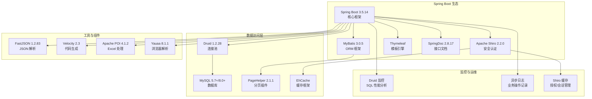
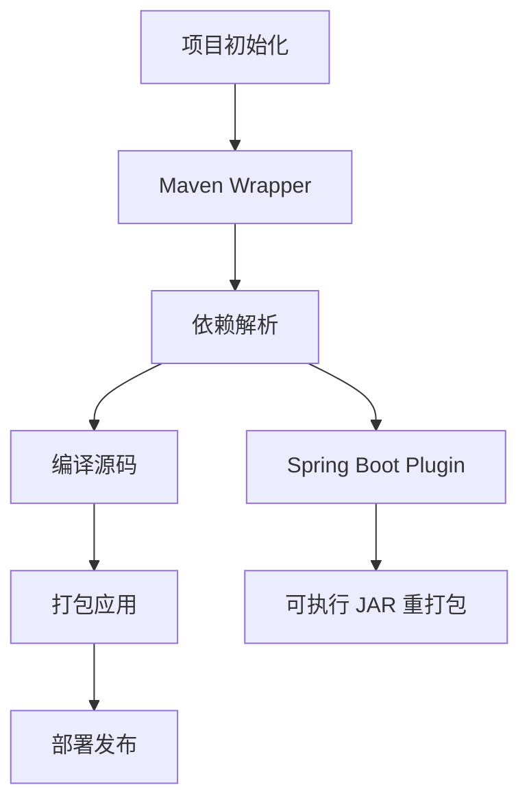
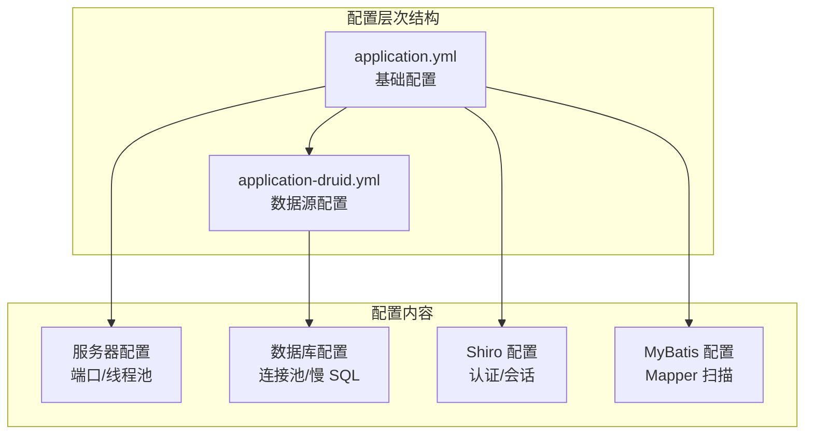
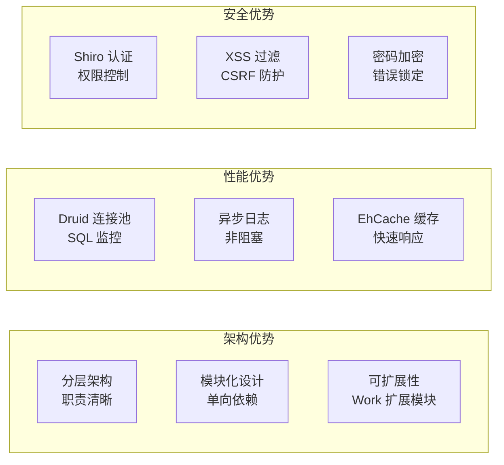
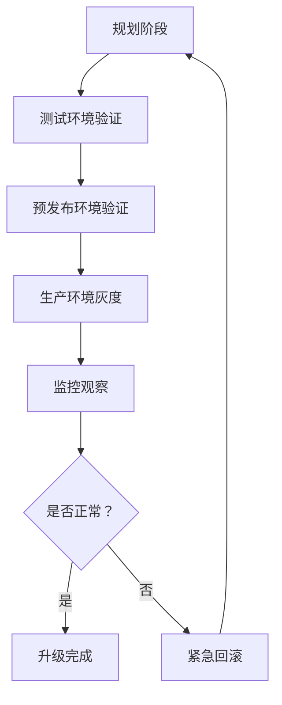

# 技术栈与依赖

**本文档引用的文件**
- [pom.xml](../../pom.xml)
- [application.yml](../../src/main/resources/application.yml)
- [application-druid.yml](../../src/main/resources/application-druid.yml)
- [RuoYiApplication.java](../../src/main/java/com/ruoyi/RuoYiApplication.java)
- [项目概述.md](./项目概述.md)
- [AGENTS.md](../../.gientech/AGENTS.md)

## 目录
1. [项目概述](#项目概述)
2. [核心技术栈](#核心技术栈)
3. [构建与依赖管理](#构建与依赖管理)
4. [配置管理](#配置管理)
5. [代码质量工具](#代码质量工具)
6. [安全扫描工具](#安全扫描工具)
7. [技术选型分析](#技术选型分析)
8. [依赖升级指导](#依赖升级指导)
9. [最佳实践建议](#最佳实践建议)

## 项目概述

本项目是一个基于 **Spring Boot 3** 的 **企业级快速开发框架**，版本为 **RuoYi v4.8.3**，专门为企业信息化应用开发设计。项目采用 **分层架构模式**，支持用户管理、权限控制、系统监控、代码生成等核心功能，具备 **模块化设计、安全加固、运维友好** 等技术特点。

### 核心特性
- 用户管理、部门管理、岗位管理、菜单管理、角色管理
- 字典管理、参数管理、通知公告、操作日志、登录日志
- 在线用户监控、定时任务调度、代码生成、系统接口文档
- 服务监控、缓存监控、在线构建器、连接池监视
- Work 扩展模块（9 个领域模型：员工、岗位、任务、阶段等）

## 核心技术栈

### Spring Boot 生态系统



**图表来源**
- [pom.xml](../../pom.xml)
- [application.yml](../../src/main/resources/application.yml)
- [AGENTS.md](../../.gientech/AGENTS.md)

### 技术选型详解

#### Spring Boot 3.5.14
- **版本选择原因**: 采用最新的 Spring Boot 3 系列，基于 Jakarta EE 规范，提供长期支持
- **核心功能**: 自动配置、起步依赖、内嵌容器、健康检查、外部化配置
- **应用场景**: 作为整个项目的核心框架，整合所有组件

#### Apache Shiro 2.2.0 (Jakarta)
- **认证授权**: 支持用户名密码认证、RememberMe、会话管理
- **安全控制**: 权限注解 `@RequiresPermissions`、角色注解 `@RequiresRoles`
- **会话管理**: 基于 EhCache 的 Session 管理，支持并发控制（maxSession）、踢出策略（kickoutAfter）

#### MyBatis 3.0.5
- **优势**: 轻量级 ORM、SQL 灵活可控、支持动态 SQL、与 Spring 无缝集成
- **使用场景**: 所有数据库操作均通过 MyBatis Mapper 接口 + XML 映射
- **配置特点**: 包扫描 `com.ruoyi.**.domain`、Mapper 扫描 `classpath*:mapper/**/*Mapper.xml`

#### EhCache 缓存
- **缓存策略**: Shiro 授权缓存、密码错误计数缓存（5 次锁定 10 分钟）
- **数据结构**: 基于内存的 Key-Value 存储
- **持久化**: 可选磁盘持久化（项目配置为纯内存模式）

#### Druid 1.2.28
- **连接池管理**: 初始 5、最小 10、最大 20 连接
- **监控功能**: SQL 性能监控、慢 SQL 记录（1000ms）、Web 监控台
- **安全性**: 支持 WallFilter 防御 SQL 注入

**章节来源**
- [pom.xml](../../pom.xml)
- [application.yml](../../src/main/resources/application.yml)
- [application-druid.yml](../../src/main/resources/application-druid.yml)

## 构建与依赖管理

### Maven 构建系统

项目采用 **Maven** 作为构建工具，配合 **Maven Wrapper** 确保构建环境的一致性。



**图表来源**
- [pom.xml](../../pom.xml)

### 依赖管理策略

#### 核心依赖版本
- **JDK**: 17+（Spring Boot 3 最低要求）
- **Spring Boot**: 3.5.14（最新 3.x 版本）
- **MyBatis**: 3.0.5（Spring Boot 适配版本）
- **Druid**: 1.2.28（最新稳定版）
- **Shiro**: 2.2.0（Jakarta 规范版本）
- **FastJSON**: 1.2.83（需注意安全漏洞）
- **PageHelper**: 2.1.1
- **SpringDoc**: 2.8.17
- **Velocity**: 2.3
- **Apache POI**: 4.1.2
- **Yauaa**: 8.1.1

#### 模块依赖关系
```
ruoyi-admin → ruoyi-framework → ruoyi-system → ruoyi-common
ruoyi-admin → ruoyi-quartz    → ruoyi-common
ruoyi-admin → ruoyi-generator → ruoyi-common
```

#### 依赖升级策略
1. **渐进式升级**: 先升级非核心依赖，验证通过后再升级核心框架
2. **向后兼容**: 确保升级不影响现有 API 和数据库结构
3. **性能评估**: 升级前后进行性能对比测试
4. **回滚计划**: 保留旧版本依赖备份，确保可快速回滚

**章节来源**
- [pom.xml](../../pom.xml)
- [memory/architecture.md](../../memory/architecture.md)

## 配置管理

### 配置文件结构

项目采用 **多环境配置管理** 风格：



**图表来源**
- [application.yml](../../src/main/resources/application.yml)
- [application-druid.yml](../../src/main/resources/application-druid.yml)

### 环境配置详解

#### 基础配置（application.yml）
- **服务器配置**: 端口 80、Context Path `/`、Tomcat 最大线程 800、最小空闲 100
- **文件上传**: 单个文件 10MB、总上传 20MB
- **日志级别**: `com.ruoyi: debug`、`org.springframework: warn`
- **Shiro 配置**: 登录地址 `/login`、会话超时 30 分钟、验证码类型 `math`
- **SpringDoc 配置**: 接口文档路径 `/swagger-ui.html`、API 文档 `/v3/api-docs`
- **XSS 防护**: 开启状态、排除 `/system/notice/*`、匹配 `/system/*,/monitor/*,/tool/*`

#### 数据源配置（application-druid.yml）
- **数据库连接**: `jdbc:mysql://localhost:3306/ry-spring`（账号 root/密码已脱敏）
- **连接池配置**: 初始 5、最小 10、最大 20、获取等待 60 秒
- **超时配置**: 连接超时 30 秒、网络超时 60 秒
- **检测配置**: 检测周期 60 秒、最小生存 300 秒、最大生存 900 秒
- **监控配置**: 慢 SQL 记录（1000ms）、Druid 控制台账号 `ruoyi/123456`

#### 配置加载优先级
1. 环境变量（最高优先级）
2. 环境特定配置文件（application-druid.yml）
3. 基础配置文件（application.yml）
4. 默认值（最低优先级）

**章节来源**
- [application.yml](../../src/main/resources/application.yml)
- [application-druid.yml](../../src/main/resources/application-druid.yml)

## 代码质量工具

### Checkstyle 配置

（该项目未集成 Checkstyle）

### FindBugs 静态分析

（该项目未集成 FindBugs）

### SonarQube 集成

（该项目未集成 SonarQube）

## 安全扫描工具

### 依赖漏洞扫描

（该项目未配置专门的依赖漏洞扫描工具）

### 安全配置要点

#### Shiro 安全配置
- **认证方式**: 用户名密码 + 验证码（数学计算/字符验证）
- **会话管理**: 30 分钟超时、同步周期 1 分钟、并发控制可配置
- **RememberMe**: AES 加密 Cookie（建议生产环境设置固定 cipherkey）
- **密码策略**: MD5+Salt 加密、5 次错误锁定 10 分钟

#### XSS 防护
- **过滤器**: XssFilter + XssValidator
- **匹配规则**: `/system/*,/monitor/*,/tool/*`
- **排除规则**: `/system/notice/*`

#### CSRF 防护
- **默认状态**: 关闭
- **白名单**: `/druid/*`

#### 数据权限
- **注解**: `@DataScope(deptAlias, userAlias)`
- **权限范围**: 全部数据、自定义数据、本部门数据、本部门及以下数据、仅本人数据

**章节来源**
- [application.yml](../../src/main/resources/application.yml)
- [AGENTS.md](../../.gientech/AGENTS.md)

## 技术选型分析

### 为什么选择这些技术？

#### Spring Boot 3 vs Spring Boot 2
- **Jakarta EE 规范**: 更现代化的 Java EE 替代方案
- **长期支持**: Spring Boot 3 提供长期维护支持
- **性能优化**: 更好的启动速度和内存占用

#### MyBatis vs JPA
- **灵活性**: SQL 完全可控，适合复杂查询场景
- **性能优化**: 可手动优化 SQL 语句
- **学习成本**: 对熟悉 SQL 的开发者友好

#### Shiro vs Spring Security
- **轻量级**: Shiro 更轻量，配置简单
- **易上手**: API 简洁，学习曲线平缓
- **功能足够**: 满足企业应用的认证授权需求

#### Druid vs 其他连接池
- **监控功能**: 内置强大的 SQL 监控和 Web 监控台
- **性能优秀**: 阿里巴巴出品，经过大规模生产验证
- **安全性**: 支持 WallFilter 防御 SQL 注入

#### EhCache vs Redis
- **简单部署**: 无需额外部署 Redis 服务
- **内存高效**: 适合单机应用场景
- **Shiro 集成**: 与 Shiro 无缝集成

### 技术组合的优势



## 依赖升级指导

### 升级策略

#### 版本兼容性检查
1. **API 兼容性**: 检查升级后 API 是否有破坏性变更
2. **配置变更**: 检查配置文件是否需要调整
3. **行为变更**: 测试升级后功能行为是否一致
4. **性能影响**: 对比升级前后的性能指标

#### 渐进式升级步骤



### 推荐升级路径

#### Spring Boot 升级
- **当前版本**: 3.5.14
- **目标版本**: 最新 3.x 版本
- **升级要点**:
  - 检查 Jakarta 规范兼容性
  - 验证自动配置是否生效
  - 测试所有 Starter 依赖

#### MyBatis 升级
- **当前版本**: 3.0.5
- **目标版本**: 最新稳定版
- **升级要点**:
  - 检查 XML 映射文件兼容性
  - 验证动态 SQL 语法
  - 测试分页插件

#### Druid 升级
- **当前版本**: 1.2.28
- **目标版本**: 最新 1.2.x 版本
- **升级要点**:
  - 检查连接池配置参数
  - 验证监控功能
  - 测试慢 SQL 记录

### 升级风险评估

#### 高风险升级
- **Spring Boot 大版本升级**: 可能涉及 Jakarta 规范变更
- **Shiro 大版本升级**: 认证流程可能变化
- **数据库版本升级**: 需验证 SQL 兼容性

#### 中风险升级
- **MyBatis 版本升级**: 需验证 Mapper XML
- **Druid 版本升级**: 需验证连接池配置
- **FastJSON 版本升级**: 需验证 JSON 序列化

#### 低风险升级
- **工具类库升级**: 如 POI、Yauaa
- **模板引擎升级**: Thymeleaf 小版本升级
- **分页插件升级**: PageHelper 小版本升级

## 最佳实践建议

### 开发最佳实践

#### 代码组织
- **模块化设计**: 遵循 `admin → framework → system → common` 依赖链
- **接口隔离**: Controller、Service、Mapper 分层明确
- **单一职责**: 每个类只负责一个职责

#### 配置管理
- **环境隔离**: 基础配置与数据源配置分离
- **敏感信息**: 密码等敏感信息不在代码中硬编码
- **配置热更新**: 支持通过配置文件动态调整

#### 测试策略
- **单元测试**: 为 Service 层编写单元测试
- **集成测试**: 测试 Controller 与数据库的集成
- **端到端测试**: 模拟完整业务流程

### 运维最佳实践

#### 监控告警
- **应用指标**: JVM 内存、线程数、GC 次数
- **业务指标**: 登录次数、操作日志、SQL 执行时间
- **基础设施**: CPU 使用率、内存使用率、磁盘空间

#### 日志管理
- **结构化日志**: 使用 Logback 配置日志格式
- **日志分级**: 生产环境使用 info 级别，开发环境使用 debug
- **日志轮转**: 配置日志文件大小和保留天数

#### 容灾备份
- **数据备份**: 定期备份 MySQL 数据库
- **异地容灾**: 重要数据异地备份
- **故障演练**: 定期进行故障恢复演练

### 性能优化建议

#### 数据库优化
- **索引设计**: 为常用查询字段添加索引
- **查询优化**: 避免 N+1 查询，使用 JOIN
- **连接池**: 根据业务量调整连接池大小

#### 缓存策略
- **热点数据**: 使用 EhCache 缓存热点数据
- **缓存失效**: 设置合理的缓存过期时间
- **缓存穿透**: 对空值也进行缓存

#### 系统调优
- **JVM 参数**: `-Xms512m -Xmx1024m -XX:MetaspaceSize=128m -XX:MaxMaxMetaspaceSize=512m`
- **线程池**: Tomcat 最大线程 800、最小空闲 100
- **网络调优**: 调整 TCP 参数、启用 Keep-Alive

### 安全最佳实践

#### 访问控制
- **最小权限**: 用户只授予必要的权限
- **定期审计**: 定期检查用户权限配置
- **双因素认证**: 重要操作启用二次验证

#### 数据保护
- **传输加密**: 使用 HTTPS 协议
- **存储加密**: 敏感数据加密存储
- **数据脱敏**: 日志中脱敏敏感信息

#### 安全监控
- **入侵检测**: 监控异常登录行为
- **漏洞扫描**: 定期进行依赖漏洞扫描
- **合规检查**: 确保符合安全合规要求

通过遵循这些最佳实践，可以确保系统的稳定性、安全性和可维护性，为业务发展提供坚实的技术基础。
