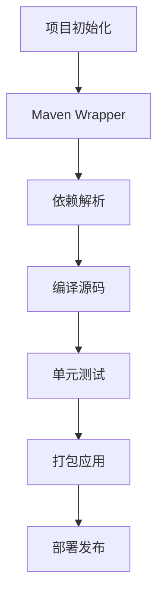
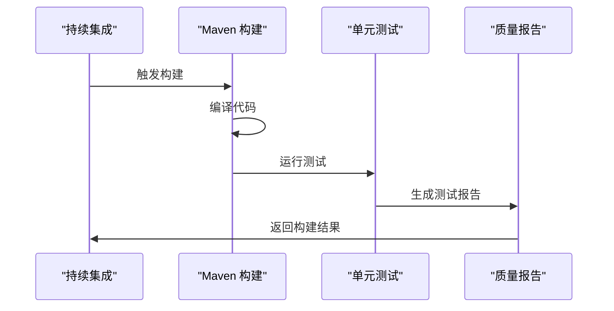
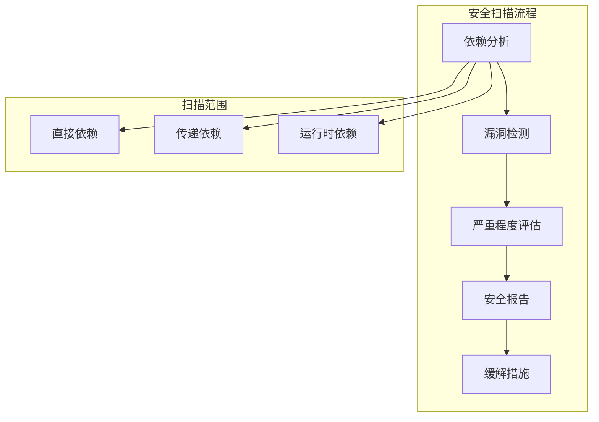
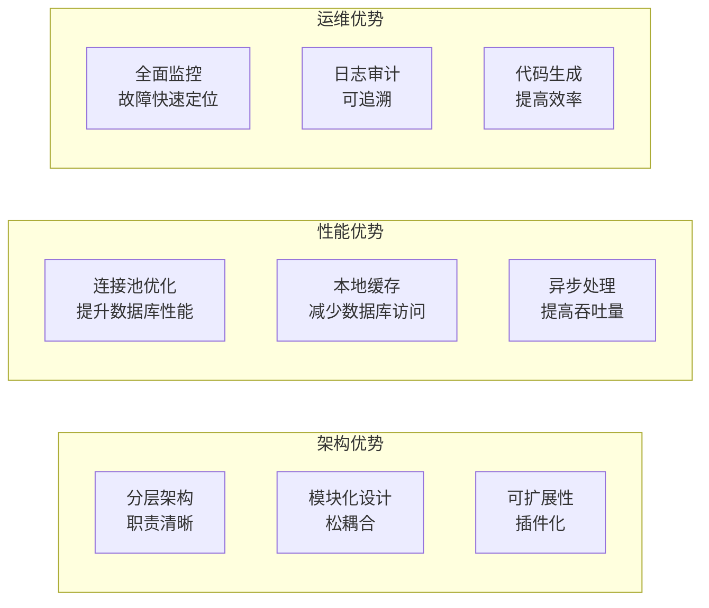
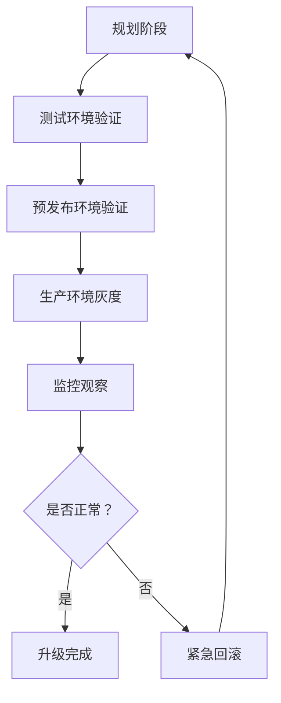

# 技术栈与依赖

**本文档中引用的文件**
- [README.md](../../../README.md)
- [pom.xml](../../../pom.xml)
- [application.yml](../../../ruoyi-admin/src/main/resources/application.yml)
- [application-druid.yml](../../../ruoyi-admin/src/main/resources/application-druid.yml)
- [RuoYiApplication.java](../../../ruoyi-admin/src/main/java/com/ruoyi/RuoYiApplication.java)

## 目录
1. [项目概述](#项目概述)
2. [核心技术栈](#核心技术栈)
3. [构建与依赖管理](#构建与依赖管理)
4. [配置管理](#配置管理)
5. [代码质量工具](#代码质量工具)
6. [安全扫描工具](#安全扫描工具)
7. [技术选型分析](#技术选型分析)
8. [依赖升级指导](#依赖升级指导)
9. [最佳实践建议](#最佳实践建议)

## 项目概述

本项目是一个基于 Spring Boot 3 的轻量级 Java 快速开发框架，专门为通用 Web 应用后台管理场景设计。项目采用分层架构模式，支持用户管理、部门管理、角色权限、菜单管理、字典管理、参数管理、通知公告、操作日志、登录日志、在线用户监控、定时任务调度、代码生成、系统接口文档、服务监控、缓存监控、在线构建器、连接池监视等核心功能，具备精简易上手、出错概率低、支持移动客户端访问等技术特点。

### 核心特性
- 用户管理：系统用户配置与管理
- 部门管理：树结构组织机构配置，支持数据权限
- 角色管理：角色菜单权限分配、数据范围权限划分
- 菜单管理：系统菜单、操作权限、按钮权限标识配置
- 字典管理：常用固定数据维护
- 参数管理：系统动态配置常用参数
- 通知公告：系统通知公告信息发布维护
- 操作日志：系统正常操作日志记录和查询
- 登录日志：系统登录日志记录查询包含登录异常
- 在线用户：当前系统中活跃用户状态监控
- 定时任务：在线任务调度包含执行结果日志
- 代码生成：前后端代码生成支持 CRUD 下载
- 系统接口：自动生成 API 接口文档
- 服务监控：监视系统 CPU、内存、磁盘、堆栈等信息
- 缓存监控：系统缓存查询、删除、清空等操作
- 连接池监视：数据库连接池状态监控与 SQL 分析

## 核心技术栈

### Spring Boot 生态系统

```mermaid
graph TB
subgraph "Spring Boot 生态"
SpringBoot["Spring Boot 3.5.14<br/>核心框架"]
Shiro["Apache Shiro 2.2.0<br/>安全框架"]
MyBatis["MyBatis 3.0.5<br/>ORM 框架"]
Thymeleaf["Thymeleaf<br/>模板引擎"]
SpringDoc["SpringDoc 2.8.17<br/>API 文档"]
end
subgraph "数据访问层"
Druid["Druid 1.2.28<br/>数据库连接池"]
MySQL["MySQL<br/>关系型数据库"]
MyBatisConfig["MyBatis Config<br/>全局配置文件"]
end
subgraph "缓存层"
EhCache["EhCache<br/>本地缓存"]
end
subgraph "工具与组件"
PageHelper["PageHelper 2.1.1<br/>分页插件"]
FastJSON["FastJSON 1.2.83<br/>JSON 解析"]
CommonsIO["Commons IO 2.22.0<br/>IO 工具"]
POI["Apache POI 4.1.2<br/>Excel 处理"]
Velocity["Velocity 2.3<br/>代码生成模板"]
Oshi["OSHI 7.3.0<br/>系统信息"]
Kaptcha["Kaptcha 2.3.3<br/>验证码"]
Yauaa["YAUAA 8.1.1<br/>用户代理解析"]
end
subgraph "监控与运维"
Logback["Logback<br/>日志框架"]
DruidMonitor["Druid Monitor<br/>连接池监控"]
ServerMonitor["服务器监控<br/>系统信息监控"]
end
SpringBoot --> Shiro
SpringBoot --> MyBatis
SpringBoot --> Thymeleaf
SpringBoot --> SpringDoc
SpringBoot --> Druid
SpringBoot --> EhCache
SpringBoot --> PageHelper
SpringBoot --> FastJSON
SpringBoot --> CommonsIO
SpringBoot --> POI
SpringBoot --> Velocity
SpringBoot --> Oshi
SpringBoot --> Kaptcha
SpringBoot --> Yauaa
SpringBoot --> Logback
SpringBoot --> DruidMonitor
SpringBoot --> ServerMonitor
```



**图表来源**
- [pom.xml](../../../pom.xml)
- [application.yml](../../../ruoyi-admin/src/main/resources/application.yml)

### 技术选型详解

#### Spring Boot 3.5.14
- **版本选择原因**: 采用最新的 Spring Boot 3.x 版本，支持 JDK 17+，提供全面的自动配置和快速开发能力
- **核心功能**: 自动配置、起步依赖、命令行接口、嵌入式容器支持
- **应用场景**: 作为整个项目的核心框架，提供 Web 容器、依赖注入、事务管理、AOP 等基础能力

#### Apache Shiro 2.2.0
- **认证授权**: 提供完整的用户认证和权限控制机制
- **安全控制**: 支持 URL 权限控制、方法级权限控制、数据权限控制
- **会话管理**: 提供 Session 管理、RememberMe、并发会话控制等功能

#### MyBatis 3.0.5
- **优势**: 轻量级 ORM 框架，SQL 与代码分离，灵活性高，支持动态 SQL
- **使用场景**: 数据库访问层，所有业务数据的持久化操作
- **配置特点**: 通过 XML 配置 mapper 文件，支持注解方式，集成 PageHelper 分页插件

#### EhCache
- **缓存策略**: 提供本地内存缓存，支持对象缓存、页面缓存
- **数据结构**: 支持键值对存储，可配置最大条目数、过期时间
- **持久化**: 支持内存存储，可选配磁盘持久化

#### Druid 1.2.28
- **连接池管理**: 高性能数据库连接池，支持监控统计
- **SQL 监控**: 内置 SQL 执行监控，支持慢 SQL 记录
- **安全防护**: 内置 WallFilter 防止 SQL 注入

#### Kaptcha 2.3.3
- **验证码生成**: 支持数字计算、字符验证等多种验证码类型
- **集成方式**: 与 Shiro 登录流程集成，提供登录安全保护

**章节来源**
- [pom.xml](../../../pom.xml)
- [application.yml](../../../ruoyi-admin/src/main/resources/application.yml)

## 构建与依赖管理

### Maven 构建系统

项目采用 Maven 作为构建工具，配合 Maven Wrapper 确保构建环境的一致性。



**图表来源**
- [pom.xml](../../../pom.xml)

### 依赖管理策略

#### 核心依赖版本
- **JDK**: 17（Spring Boot 3.x 要求）
- **Spring Boot**: 3.5.14（核心框架）
- **MyBatis**: 3.0.5（ORM 框架）
- **Druid**: 1.2.28（数据库连接池）
- **Shiro**: 2.2.0（安全框架）
- **PageHelper**: 2.1.1（分页插件）
- **FastJSON**: 1.2.83（JSON 解析）
- **Apache POI**: 4.1.2（Excel 处理）
- **SpringDoc**: 2.8.17（API 文档）

#### 项目模块结构
- **ruoyi-admin**: 主启动模块，包含 Web 控制器、静态资源、模板页面
- **ruoyi-framework**: 框架核心模块，包含安全配置、拦截器、工具类
- **ruoyi-system**: 系统业务模块，包含用户、部门、角色等核心业务逻辑
- **ruoyi-common**: 通用工具模块，包含常量定义、工具类、异常处理
- **ruoyi-quartz**: 定时任务模块，包含任务调度、执行器
- **ruoyi-generator**: 代码生成模块，包含模板引擎、生成器逻辑

#### 依赖升级策略
1. **渐进式升级**: 先在测试环境验证，再灰度发布到生产环境
2. **向后兼容**: 确保升级不影响现有 API 和业务逻辑
3. **性能评估**: 升级前后进行性能对比测试
4. **回滚计划**: 保留旧版本依赖，必要时快速回滚

**章节来源**
- [pom.xml](../../../pom.xml)

## 配置管理

### 配置文件结构

项目采用 YAML 格式的多环境配置管理：

```mermaid
graph TB
subgraph "配置层次结构"
Base["application.yml<br/>基础配置"]
Env["application-druid.yml<br/>数据源配置"]
end
subgraph "环境变量覆盖"
EnvVars["环境变量<br/>优先级最高"]
end
end
Base --> Env
EnvVars --> Base
EnvVars --> Env
```

**图表来源**
- [application.yml](../../../ruoyi-admin/src/main/resources/application.yml)
- [application-druid.yml](../../../ruoyi-admin/src/main/resources/application-druid.yml)

### 环境配置详解

#### 基础配置（application.yml）
- **项目名称**: RuoYi
- **版本**: 4.8.3
- **服务端口**: 80
- **上下文路径**: /
- **文件上传路径**: D:/giencoder/RuoYi-springboot3
- **日志级别**: com.ruoyi 为 debug，org.springframework 为 warn
- **模板引擎**: Thymeleaf，禁用缓存
- **MyBatis 配置**: 扫描 com.ruoyi.**.domain 包别名，mapper 路径 classpath*:mapper/**/*Mapper.xml
- **Shiro 配置**: 登录地址/login，权限认证失败地址/unauth，首页地址/index
- **验证码开关**: 开启，类型为 math（数字计算）
- **Session 超时**: 30 分钟
- **SpringDoc 配置**: API 文档路径/v3/api-docs，Swagger UI 路径/swagger-ui.html

#### 数据源配置（application-druid.yml）
- **数据库类型**: MySQL
- **连接池类型**: Druid
- **主库 URL**: jdbc:mysql://localhost:3306/ry-spring
- **初始连接数**: 5
- **最小空闲连接**: 10
- **最大活跃连接**: 20
- **连接超时**: 60000ms
- **慢 SQL 阈值**: 1000ms
- **Druid 监控**: 开启，登录用户名 ruoyi，密码 123456（已脱敏）

#### 配置加载优先级
1. 环境变量（最高优先级）
2. 环境特定配置文件（application-druid.yml）
3. 基础配置文件（application.yml）
4. 默认值（最低优先级）

**章节来源**
- [application.yml](../../../ruoyi-admin/src/main/resources/application.yml)
- [application-druid.yml](../../../ruoyi-admin/src/main/resources/application-druid.yml)

## 代码质量工具

### Checkstyle 配置

项目可通过 Maven 插件集成 Checkstyle 代码规范检查工具，确保代码风格一致性。

### 静态分析

项目可通过以下工具进行静态代码分析：
- **内存泄漏检测**: 通过 IDE 内置工具和 Oshi 系统监控
- **空指针异常**: 通过代码审查和单元测试覆盖
- **线程安全**: Shiro Session 管理、连接池线程池配置
- **性能问题**: Druid 慢 SQL 监控、服务器资源监控

### 质量门禁



**章节来源**
- [pom.xml](../../../pom.xml)

## 安全扫描工具

### 依赖漏洞扫描

项目可通过 Maven 插件配置依赖漏洞扫描：



### 安全配置要点

#### Shiro 安全配置
- **认证方式**: 用户名密码 + 验证码
- **会话管理**: 支持 Session 超时、并发会话控制、踢出用户
- **RememberMe**: 支持记住我功能，可配置固定密钥
- **Cookie 配置**: 设置 HttpOnly，有效期 30 天

#### 防止 XSS 攻击
- **过滤开关**: 开启
- **排除链接**: /system/notice/*
- **匹配链接**: /system/*,/monitor/*,/tool/*

#### 防止 CSRF 攻击
- **过滤开关**: 关闭（可根据需要开启）
- **白名单**: /druid

#### 数据安全
- **敏感数据加密**: Shiro 密钥加密存储
- **传输加密**: 支持 SSL/TLS（通过服务器配置）
- **访问审计**: 操作日志、登录日志记录

**章节来源**
- [application.yml](../../../ruoyi-admin/src/main/resources/application.yml)

## 技术选型分析

### 为什么选择这些技术？

#### Spring Boot vs 其他框架
- **快速开发**: 自动配置减少 XML 配置，快速搭建项目
- **生态丰富**: 庞大的社区支持和第三方库集成
- **微服务友好**: 与 Spring Cloud 无缝集成，便于后续扩展

#### MyBatis vs Hibernate
- **性能优势**: SQL 可控，便于优化复杂查询
- **灵活性**: 支持动态 SQL，适应多变的业务需求
- **学习成本低**: 国内开发者普遍熟悉，文档丰富

#### Druid vs 其他连接池
- **监控能力**: 内置强大的监控统计功能
- **安全性**: WallFilter 防止 SQL 注入
- **性能优异**: 阿里巴巴出品，经过大规模生产验证

#### Shiro vs Spring Security
- **轻量级**: 配置简单，易于上手
- **功能全面**: 认证、授权、会话管理、加密等一站式解决方案
- **独立性强**: 不依赖 Spring 容器，可独立使用

### 技术组合的优势



## 依赖升级指导

### 升级策略

#### 版本兼容性检查
1. **API 兼容性**: 检查新版本是否存在破坏性变更
2. **配置变更**: 检查配置文件是否需要调整
3. **行为变更**: 测试核心功能是否受影响
4. **性能影响**: 对比升级前后性能指标

#### 渐进式升级步骤



### 推荐升级路径

#### Spring Boot 升级
- **当前版本**: 3.5.14
- **升级要点**:
  - 关注 Spring 官方发布的破坏性变更
  - 检查第三方依赖的兼容性
  - 测试嵌入式容器行为变化

#### MyBatis 升级
- **当前版本**: 3.0.5
- **升级要点**:
  - 检查 XML 映射文件兼容性
  - 验证分页插件是否正常工作
  - 测试复杂 SQL 查询

#### Druid 升级
- **当前版本**: 1.2.28
- **升级要点**:
  - 检查连接池配置参数变更
  - 验证监控功能是否正常
  - 测试慢 SQL 记录功能

### 升级风险评估

#### 高风险升级
- **Spring Boot 大版本升级**: 可能涉及大量配置变更
- **Shiro 大版本升级**: 安全相关，需全面测试认证授权流程
- **数据库驱动升级**: 可能影响 SQL 兼容性

#### 中风险升级
- **MyBatis 版本升级**: 需验证所有 mapper 文件
- **Druid 版本升级**: 需验证连接池配置
- **PageHelper 版本升级**: 需验证分页功能

#### 低风险升级
- **工具类库升级**: Commons IO、FastJSON 等
- **模板引擎升级**: Velocity、Thymeleaf 等
- **文档工具升级**: SpringDoc 等

## 最佳实践建议

### 开发最佳实践

#### 代码组织
- **模块化设计**: 按业务功能划分模块，保持模块间低耦合
- **接口隔离**: 使用接口定义服务层，便于单元测试和 Mock
- **单一职责**: 每个类只负责一个职责，避免上帝类

#### 配置管理
- **环境隔离**: 开发、测试、生产环境使用不同配置文件
- **敏感信息**: 数据库密码等敏感信息使用环境变量或配置中心
- **配置热更新**: 支持配置动态刷新，减少重启

#### 测试策略
- **单元测试**: 核心业务逻辑编写单元测试，覆盖率不低于 80%
- **集成测试**: 测试模块间接口调用
- **端到端测试**: 模拟真实用户操作流程

### 运维最佳实践

#### 监控告警
- **应用指标**: JVM 内存、GC 次数、线程数、HTTP 请求量
- **业务指标**: 登录次数、操作频率、接口响应时间
- **基础设施**: CPU 使用率、内存使用率、磁盘空间、网络流量

#### 日志管理
- **结构化日志**: 使用 JSON 格式便于日志分析
- **日志分级**: 开发环境 debug，生产环境 info/warn
- **日志轮转**: 按天或按大小轮转，保留 30 天历史日志

#### 容灾备份
- **数据备份**: 数据库每日全量备份，每小时增量备份
- **异地容灾**: 关键数据异地备份
- **故障演练**: 定期进行故障恢复演练

### 性能优化建议

#### 数据库优化
- **索引设计**: 为常用查询字段建立索引
- **查询优化**: 避免 N+1 查询，使用批量操作
- **连接池**: 根据业务量调整连接池大小，maxActive 建议 20-50

#### 缓存策略
- **热点数据**: 将频繁访问的数据放入 EhCache
- **缓存失效**: 设置合理的过期时间，避免脏数据
- **缓存穿透**: 对不存在的 key 也缓存空值

#### 系统调优
- **JVM 参数**: 根据服务器内存调整堆大小，建议 -Xms512m -Xmx1024m
- **线程池**: Tomcat 最大线程数 800，初始线程数 100
- **网络调优**: 调整 TCP 参数，开启 TCP_NODELAY

### 安全最佳实践

#### 访问控制
- **最小权限**: 按角色分配最小必要权限
- **定期审计**: 定期检查用户权限配置
- **双因素认证**: 关键操作增加短信或邮箱验证

#### 数据保护
- **传输加密**: 生产环境使用 HTTPS
- **存储加密**: 密码、手机号等敏感字段加密存储
- **数据脱敏**: 日志中敏感信息脱敏处理

#### 安全监控
- **入侵检测**: 监控异常登录行为
- **漏洞扫描**: 定期进行依赖漏洞扫描
- **合规检查**: 符合网络安全法等法规要求

通过遵循这些最佳实践，可以确保系统的稳定性、安全性和可维护性，为业务发展提供坚实的技术基础。
