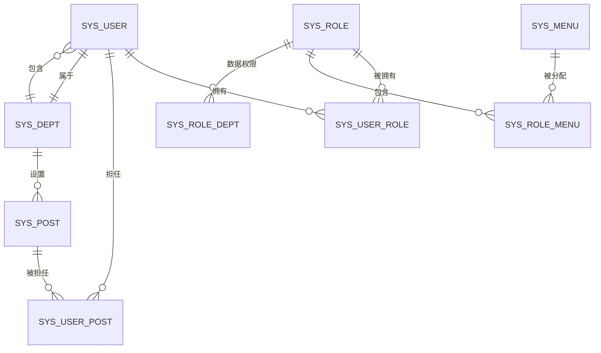

# 数据库设计文档

**本文档中引用的文件**
- [SQL 脚本](../../../sql/ry_20260319.sql)
- [application-druid.yml](../../../ruoyi-admin/src/main/resources/application-druid.yml)
- [SysUser.java](../../../ruoyi-common/src/main/java/com/ruoyi/common/core/domain/entity/SysUser.java)

## 目录
1. [数据库概述](#数据库概述)
2. [数据库 ER 图](#数据库 er 图)
3. [核心表结构](#核心表结构)
4. [关联关系表](#关联关系表)
5. [日志表](#日志表)
6. [其他业务表](#其他业务表)
7. [索引设计](#索引设计)
8. [数据字典](#数据字典)
9. [数据库配置](#数据库配置)

## 数据库概述

### 基本信息
- **数据库类型**：MySQL
- **数据库名称**：ry-spring
- **字符集**：UTF-8
- **存储引擎**：InnoDB
- **连接池**：Druid 1.2.28

### 设计原则
1. **规范化设计**：遵循第三范式（3NF），减少数据冗余
2. **逻辑删除**：使用 `del_flag` 字段实现逻辑删除
3. **审计字段**：所有表包含 `create_by`, `create_time`, `update_by`, `update_time`
4. **统一主键**：使用 BIGINT 自增主键
5. **状态标识**：使用 `status` 字段统一状态管理（0 正常，1 停用）

## 数据库 ER 图



### 核心实体关系说明
1. **用户 - 角色**：多对多关系，通过 `sys_user_role` 关联
2. **用户 - 岗位**：多对多关系，通过 `sys_user_post` 关联
3. **用户 - 部门**：多对一关系，用户属于单个部门
4. **角色 - 菜单**：多对多关系，通过 `sys_role_menu` 关联
5. **角色 - 部门**：多对多关系，通过 `sys_role_dept` 实现数据权限
6. **部门层级**：树形结构，通过 `parent_id` 和 `ancestors` 维护

## 核心表结构

### 1. 部门表 (sys_dept)

```sql
create table sys_dept (
  dept_id           bigint(20)      not null auto_increment    comment '部门 id',
  parent_id         bigint(20)      default 0                  comment '父部门 id',
  ancestors         varchar(50)     default ''                 comment '祖级列表',
  dept_name         varchar(30)     default ''                 comment '部门名称',
  order_num         int(4)          default 0                  comment '显示顺序',
  leader            varchar(20)     default null               comment '负责人',
  phone             varchar(11)     default null               comment '联系电话',
  email             varchar(50)     default null               comment '邮箱',
  status            char(1)         default '0'                comment '部门状态（0 正常 1 停用）',
  del_flag          char(1)         default '0'                comment '删除标志（0 代表存在 2 代表删除）',
  create_by         varchar(64)     default ''                 comment '创建者',
  create_time       datetime                                   comment '创建时间',
  update_by         varchar(64)     default ''                 comment '更新者',
  update_time       datetime                                   comment '更新时间',
  primary key (dept_id)
) engine=innodb comment = '部门表';
```

**字段说明**：
- `ancestors`：祖级列表，用于快速查询所有上级部门，如 "0,100,101"
- `order_num`：显示顺序，用于前端菜单排序
- `del_flag`：删除标志，0 代表存在，2 代表删除

### 2. 用户信息表 (sys_user)

```sql
create table sys_user (
  user_id           bigint(20)      not null auto_increment    comment '用户 ID',
  dept_id           bigint(20)      default null               comment '部门 ID',
  login_name        varchar(30)     not null                   comment '登录账号',
  user_name         varchar(30)     default ''                 comment '用户昵称',
  user_type         varchar(2)      default '00'               comment '用户类型（00 系统用户 01 注册用户）',
  email             varchar(50)     default ''                 comment '用户邮箱',
  phonenumber       varchar(11)     default ''                 comment '手机号码',
  sex               char(1)         default '0'                comment '用户性别（0 男 1 女 2 未知）',
  avatar            varchar(100)    default ''                 comment '头像路径',
  password          varchar(50)     default ''                 comment '密码',
  salt              varchar(20)     default ''                 comment '盐加密',
  status            char(1)         default '0'                comment '账号状态（0 正常 1 停用）',
  del_flag          char(1)         default '0'                comment '删除标志（0 代表存在 2 代表删除）',
  login_ip          varchar(128)    default ''                 comment '最后登录 IP',
  login_date        datetime                                   comment '最后登录时间',
  pwd_update_date   datetime                                   comment '密码最后更新时间',
  create_by         varchar(64)     default ''                 comment '创建者',
  create_time       datetime                                   comment '创建时间',
  update_by         varchar(64)     default ''                 comment '更新者',
  update_time       datetime                                   comment '更新时间',
  remark            varchar(500)    default null               comment '备注',
  primary key (user_id)
) engine=innodb comment = '用户信息表';
```

**字段说明**：
- `login_name`：登录账号，唯一，用于用户登录
- `user_name`：用户昵称，用于前端显示
- `password`：加密后的密码（BCrypt 或 MD5 加盐）
- `salt`：密码加密盐值
- `user_type`：00 系统用户（后台用户），01 注册用户（前台用户）

### 3. 岗位信息表 (sys_post)

```sql
create table sys_post (
  post_id       bigint(20)      not null auto_increment    comment '岗位 ID',
  post_code     varchar(64)     not null                   comment '岗位编码',
  post_name     varchar(50)     not null                   comment '岗位名称',
  post_sort     int(4)          not null                   comment '显示顺序',
  status        char(1)         not null                   comment '状态（0 正常 1 停用）',
  create_by     varchar(64)     default ''                 comment '创建者',
  create_time   datetime                                   comment '创建时间',
  update_by     varchar(64)     default ''                 comment '更新者',
  update_time   datetime                                   comment '更新时间',
  remark        varchar(500)    default null               comment '备注',
  primary key (post_id)
) engine=innodb comment = '岗位信息表';
```

**示例数据**：
- CEO（董事长）
- SE（项目经理）
- HR（人力资源）
- USER（普通员工）

### 4. 角色信息表 (sys_role)

```sql
create table sys_role (
  role_id           bigint(20)      not null auto_increment    comment '角色 ID',
  role_name         varchar(30)     not null                   comment '角色名称',
  role_key          varchar(100)    not null                   comment '角色权限字符串',
  role_sort         int(4)          not null                   comment '显示顺序',
  data_scope        char(1)         default '1'                comment '数据范围',
  status            char(1)         not null                   comment '角色状态（0 正常 1 停用）',
  del_flag          char(1)         default '0'                comment '删除标志（0 代表存在 2 代表删除）',
  create_by         varchar(64)     default ''                 comment '创建者',
  create_time       datetime                                   comment '创建时间',
  update_by         varchar(64)     default ''                 comment '更新者',
  update_time       datetime                                   comment '更新时间',
  remark            varchar(500)    default null               comment '备注',
  primary key (role_id)
) engine=innodb comment = '角色信息表';
```

**数据范围 (data_scope)**：
- `1`：全部数据权限
- `2`：自定义数据权限
- `3`：本部门数据权限
- `4`：本部门及以下数据权限

**示例数据**：
- 超级管理员（admin）
- 普通角色（common）

### 5. 菜单权限表 (sys_menu)

```sql
create table sys_menu (
  menu_id           bigint(20)      not null auto_increment    comment '菜单 ID',
  menu_name         varchar(50)     not null                   comment '菜单名称',
  parent_id         bigint(20)      default 0                  comment '父菜单 ID',
  order_num         int(4)          default 0                  comment '显示顺序',
  url               varchar(200)    default '#'                comment '请求地址',
  target            varchar(20)     default ''                 comment '打开方式',
  menu_type         char(1)         default ''                 comment '菜单类型（M 目录 C 菜单 F 按钮）',
  visible           char(1)         default 0                  comment '菜单状态（0 显示 1 隐藏）',
  is_refresh        char(1)         default 1                  comment '是否刷新（0 刷新 1 不刷新）',
  perms             varchar(100)    default null               comment '权限标识',
  icon              varchar(100)    default '#'                comment '菜单图标',
  create_by         varchar(64)     default ''                 comment '创建者',
  create_time       datetime                                   comment '创建时间',
  update_by         varchar(64)     default ''                 comment '更新者',
  update_time       datetime                                   comment '更新时间',
  remark            varchar(500)    default ''                 comment '备注',
  primary key (menu_id)
) engine=innodb comment = '菜单权限表';
```

**菜单类型 (menu_type)**：
- `M`：目录（一级菜单）
- `C`：菜单（二级菜单，可访问的页面）
- `F`：按钮（权限标识，用于控制按钮显示）

**权限标识 (perms)**：
- 格式：`模块：功能：操作`
- 示例：`system:user:list`（系统管理 - 用户管理 - 查询）

## 关联关系表

### 6. 用户和角色关联表 (sys_user_role)

```sql
create table sys_user_role (
  user_id   bigint(20) not null comment '用户 ID',
  role_id   bigint(20) not null comment '角色 ID',
  primary key (user_id, role_id)
) engine=innodb comment = '用户和角色关联表';
```

**说明**：用户与角色的多对多关联关系

### 7. 用户和岗位关联表 (sys_user_post)

```sql
create table sys_user_post (
  user_id   bigint(20) not null comment '用户 ID',
  post_id   bigint(20) not null comment '岗位 ID',
  primary key (user_id, post_id)
) engine=innodb comment = '用户与岗位关联表';
```

**说明**：用户与岗位的多对多关联关系

### 8. 角色和菜单关联表 (sys_role_menu)

```sql
create table sys_role_menu (
  role_id   bigint(20) not null comment '角色 ID',
  menu_id   bigint(20) not null comment '菜单 ID',
  primary key (role_id, menu_id)
) engine=innodb comment = '角色和菜单关联表';
```

**说明**：角色与菜单的多对多关联关系，用于权限控制

### 9. 角色和部门关联表 (sys_role_dept)

```sql
create table sys_role_dept (
  role_id   bigint(20) not null comment '角色 ID',
  dept_id   bigint(20) not null comment '部门 ID',
  primary key (role_id, dept_id)
) engine=innodb comment = '角色和部门关联表';
```

**说明**：角色数据权限与部门的关联关系，用于实现自定义数据权限

## 日志表

### 10. 系统访问记录表 (sys_logininfor)

```sql
create table sys_logininfor (
  info_id        bigint(20)   not null auto_increment    comment '访问 ID',
  login_name     varchar(50)  default ''                 comment '登录账号',
  ipaddr         varchar(128) default ''                 comment '登录 IP 地址',
  login_location varchar(255) default ''                 comment '登录地点',
  browser        varchar(50)  default ''                 comment '浏览器类型',
  os             varchar(50)  default ''                 comment '操作系统',
  status         char(1)      default '0'                comment '登录状态（0 成功 1 失败）',
  msg            varchar(255) default ''                 comment '提示消息',
  login_time     datetime                                comment '访问时间',
  primary key (info_id)
) engine=innodb comment = '系统访问记录表';
```

**说明**：记录用户登录日志，包括成功和失败的登录尝试

### 11. 操作日志记录 (sys_oper_log)

```sql
create table sys_oper_log (
  oper_id        bigint(20)   not null auto_increment    comment '日志主键',
  title          varchar(50)  default ''                 comment '模块标题',
  business_type  int(2)       default 0                  comment '业务类型（0 其它 1 新增 2 修改 3 删除）',
  method         varchar(100) default ''                 comment '方法名称',
  request_method varchar(10)  default ''                 comment '请求方式',
  operator_type  int(1)       default 0                  comment '操作类别（0 其它 1 后台用户 2 手机端用户）',
  oper_name      varchar(50)  default ''                 comment '操作人员',
  dept_name      varchar(50)  default ''                 comment '部门名称',
  oper_url       varchar(255) default ''                 comment '请求 URL',
  oper_ip        varchar(128) default ''                 comment '主机地址',
  oper_location  varchar(255) default ''                 comment '操作地点',
  oper_param     varchar(2000) default ''                comment '请求参数',
  json_result    varchar(2000) default ''                comment '返回参数',
  status         int(1)       default 0                  comment '操作状态（0 正常 1 异常）',
  error_msg      varchar(2000) default ''                comment '错误消息',
  oper_time      datetime                                comment '操作时间',
  primary key (oper_id)
) engine=innodb comment = '操作日志记录';
```

**业务类型 (business_type)**：
- `0`：其它
- `1`：新增
- `2`：修改
- `3`：删除
- `4`：授权
- `5`：导出
- `6`：导入
- `7`：强退
- `8`：生成代码
- `9`：清空数据

### 12. 通知公告表 (sys_notice)

```sql
create table sys_notice (
  notice_id         bigint(20)      not null auto_increment    comment '公告 ID',
  notice_title      varchar(50)     not null                   comment '公告标题',
  notice_type       char(1)         not null                   comment '公告类型（1 通知 2 公告）',
  notice_content    text            default null               comment '公告内容',
  status            char(1)         default '0'                comment '公告状态（0 正常 1 关闭）',
  create_by         varchar(64)     default ''                 comment '创建者',
  create_time       datetime                                   comment '创建时间',
  update_by         varchar(64)     default ''                 comment '更新者',
  update_time       datetime                                   comment '更新时间',
  remark            varchar(255)    default null               comment '备注',
  primary key (notice_id)
) engine=innodb comment = '通知公告表';
```

**公告类型 (notice_type)**：
- `1`：通知
- `2`：公告

### 13. 通知公告阅读记录表 (sys_notice_read)

```sql
create table sys_notice_read (
  notice_id   bigint(20) not null comment '公告 ID',
  user_id     bigint(20) not null comment '用户 ID',
  read_time   datetime   not null comment '阅读时间',
  primary key (notice_id, user_id)
) engine=innodb comment = '通知公告阅读记录表';
```

**说明**：记录用户已读公告的状态

## 其他业务表

### 14. 参数配置表 (sys_config)

```sql
create table sys_config (
  config_id         int(5)          not null auto_increment    comment '参数主键',
  config_name       varchar(100)    default ''                 comment '参数名称',
  config_key        varchar(100)    default ''                 comment '参数键名',
  config_value      varchar(500)    default ''                 comment '参数键值',
  config_type       char(1)         default 'N'                comment '系统内置（Y 是 N 否）',
  create_by         varchar(64)     default ''                 comment '创建者',
  create_time       datetime                                   comment '创建时间',
  update_by         varchar(64)     default ''                 comment '更新者',
  update_time       datetime                                   comment '更新时间',
  remark            varchar(500)    default null               comment '备注',
  primary key (config_id)
) engine=innodb comment = '参数配置表';
```

**系统内置 (config_type)**：
- `Y`：是（系统内置参数，不允许删除）
- `N`：否（用户自定义参数）

**示例数据**：
- `sys.user.initPassword`：用户初始密码
- `sys.account.captchaEnabled`：是否开启验证码
- `sys.account.registerUser`：是否允许注册用户

### 15. 在线用户记录表 (sys_user_online)

```sql
create table sys_user_online (
  session_id        varchar(50)    not null                   comment '会话 id',
  login_name        varchar(50)    default ''                 comment '登录账号',
  dept_name         varchar(50)    default ''                 comment '部门名称',
  ipaddr            varchar(128)   default ''                 comment '登录 IP 地址',
  login_location    varchar(255)   default ''                 comment '登录地点',
  browser           varchar(50)    default ''                 comment '浏览器类型',
  os                varchar(50)    default ''                 comment '操作系统',
  status            varchar(10)    default ''                 comment '在线状态（on_line 在线 offline 离线）',
  start_timestamp   datetime       default null               comment 'Session 创建时间',
  last_access_time  datetime       default null               comment 'Session 最后访问时间',
  expire_time       int(10)        default 0                  comment '超时时间（分钟）',
  primary key (session_id)
) engine=innodb comment = '在线用户记录表';
```

**说明**：记录当前在线用户信息，支持会话管理和强退功能

## 索引设计

### 主键索引
所有表均使用自增 BIGINT 作为主键

### 唯一索引
- `sys_user.login_name`：登录账号唯一
- `sys_post.post_code`：岗位编码唯一
- `sys_role.role_key`：角色权限字符串唯一
- `sys_config.config_key`：参数键名唯一

### 普通索引
- `sys_dept.parent_id`：父部门 id，用于查询子部门
- `sys_user.dept_id`：部门 id，用于按部门查询用户
- `sys_oper_log.oper_time`：操作时间，用于按时间范围查询日志
- `sys_logininfor.login_time`：登录时间，用于按时间范围查询日志

### 联合索引
- `sys_user_role(user_id, role_id)`：用户角色关联
- `sys_user_post(user_id, post_id)`：用户岗位关联
- `sys_role_menu(role_id, menu_id)`：角色菜单关联
- `sys_role_dept(role_id, dept_id)`：角色部门关联
- `sys_notice_read(notice_id, user_id)`：公告阅读记录

## 数据字典

### 状态字段通用定义

| 字段名 | 值 | 含义 |
|--------|-----|------|
| status | 0 | 正常 |
| status | 1 | 停用 |
| del_flag | 0 | 存在 |
| del_flag | 2 | 删除 |
| visible | 0 | 显示 |
| visible | 1 | 隐藏 |
| sex | 0 | 男 |
| sex | 1 | 女 |
| sex | 2 | 未知 |

### 用户类型

| 值 | 含义 | 说明 |
|----|------|------|
| 00 | 系统用户 | 后台管理系统用户 |
| 01 | 注册用户 | 前台注册用户 |

### 菜单类型

| 值 | 含义 | 说明 |
|----|------|------|
| M | 目录 | 一级菜单，可包含子菜单 |
| C | 菜单 | 二级菜单，可访问的页面 |
| F | 按钮 | 功能按钮，权限控制 |

### 业务类型（操作日志）

| 值 | 含义 |
|----|------|
| 0 | 其它 |
| 1 | 新增 |
| 2 | 修改 |
| 3 | 删除 |
| 4 | 授权 |
| 5 | 导出 |
| 6 | 导入 |
| 7 | 强退 |
| 8 | 生成代码 |
| 9 | 清空数据 |

### 公告类型

| 值 | 含义 |
|----|------|
| 1 | 通知 |
| 2 | 公告 |

### 数据范围

| 值 | 含义 |
|----|------|
| 1 | 全部数据权限 |
| 2 | 自定义数据权限 |
| 3 | 本部门数据权限 |
| 4 | 本部门及以下数据权限 |

## 数据库配置

### 连接配置

参考 [application-druid.yml](../../../ruoyi-admin/src/main/resources/application-druid.yml)：

```yaml
spring:
  datasource:
    type: com.alibaba.druid.pool.DruidDataSource
    driverClassName: com.mysql.cj.jdbc.Driver
    druid:
      master:
        url: jdbc:mysql://localhost:3306/ry-spring?useUnicode=true&characterEncoding=utf8&zeroDateTimeBehavior=convertToNull&useSSL=true&serverTimezone=GMT%2B8
        username: root
        password: password
```

### 连接池配置

```yaml
spring:
  datasource:
    druid:
      initialSize: 5              # 初始连接数
      minIdle: 10                 # 最小空闲连接
      maxActive: 20               # 最大活跃连接
      maxWait: 60000              # 连接获取超时时间（毫秒）
      timeBetweenEvictionRunsMillis: 60000  # 空闲连接检测周期
      minEvictableIdleTimeMillis: 300000    # 连接最小生存时间
      maxEvictableIdleTimeMillis: 900000
      validationQuery: SELECT 1
      testWhileIdle: true
      testOnBorrow: false
      testOnReturn: false
      poolPreparedStatements: true
      maxPoolPreparedStatementPerConnectionSize: 20
```

### 慢 SQL 监控

```yaml
spring:
  datasource:
    druid:
      filter:
        stat:
          enabled: true
          db-type: mysql
          log-slow-sql: true      # 开启慢 SQL 记录
          slow-sql-millis: 1000   # 慢 SQL 阈值（毫秒）
```

## 参考文档
- [SQL 脚本](../../../sql/ry_20260319.sql) - 完整数据库脚本
- [application-druid.yml](../../../ruoyi-admin/src/main/resources/application-druid.yml) - 数据库连接配置
- [关联关系模型.md](./关联关系模型.md) - 实体关系详细说明
