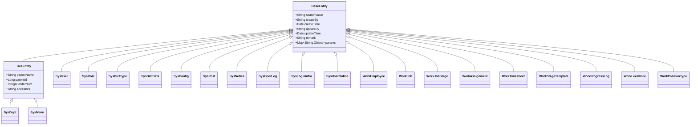
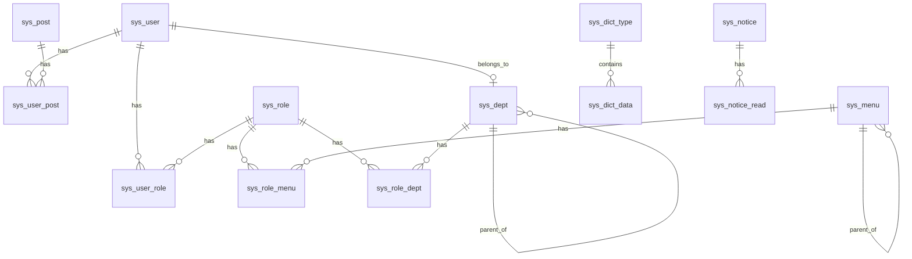
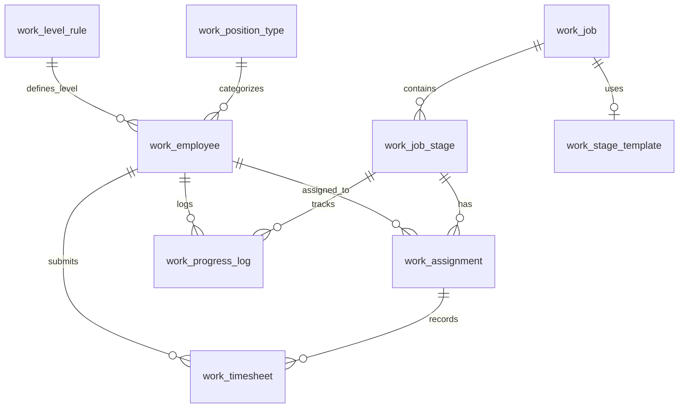

# 数据模型

**本文档引用的文件**
- [BaseEntity.java](../../../../ruoyi-common/src/main/java/com/ruoyi/common/core/domain/BaseEntity.java)
- [TreeEntity.java](../../../../ruoyi-common/src/main/java/com/ruoyi/common/core/domain/TreeEntity.java)
- [SysUser.java](../../../../ruoyi-common/src/main/java/com/ruoyi/common/core/domain/entity/SysUser.java)
- [SysRole.java](../../../../ruoyi-common/src/main/java/com/ruoyi/common/core/domain/entity/SysRole.java)
- [SysDept.java](../../../../ruoyi-common/src/main/java/com/ruoyi/common/core/domain/entity/SysDept.java)
- [SysMenu.java](../../../../ruoyi-common/src/main/java/com/ruoyi/common/core/domain/entity/SysMenu.java)
- [SysDictType.java](../../../../ruoyi-common/src/main/java/com/ruoyi/common/core/domain/entity/SysDictType.java)
- [SysDictData.java](../../../../ruoyi-common/src/main/java/com/ruoyi/common/core/domain/entity/SysDictData.java)
- [SysConfig.java](../../../../ruoyi-system/src/main/java/com/ruoyi/system/domain/SysConfig.java)
- [SysPost.java](../../../../ruoyi-system/src/main/java/com/ruoyi/system/domain/SysPost.java)
- [SysNotice.java](../../../../ruoyi-system/src/main/java/com/ruoyi/system/domain/SysNotice.java)
- [SysNoticeRead.java](../../../../ruoyi-system/src/main/java/com/ruoyi/system/domain/SysNoticeRead.java)
- [SysOperLog.java](../../../../ruoyi-system/src/main/java/com/ruoyi/system/domain/SysOperLog.java)
- [SysLogininfor.java](../../../../ruoyi-system/src/main/java/com/ruoyi/system/domain/SysLogininfor.java)
- [SysUserOnline.java](../../../../ruoyi-system/src/main/java/com/ruoyi/system/domain/SysUserOnline.java)
- [WorkEmployee.java](../../../../ruoyi-system/src/main/java/com/ruoyi/system/work/domain/WorkEmployee.java)
- [WorkJob.java](../../../../ruoyi-system/src/main/java/com/ruoyi/system/work/domain/WorkJob.java)
- [WorkJobStage.java](../../../../ruoyi-system/src/main/java/com/ruoyi/system/work/domain/WorkJobStage.java)
- [WorkAssignment.java](../../../../ruoyi-system/src/main/java/com/ruoyi/system/work/domain/WorkAssignment.java)
- [WorkTimesheet.java](../../../../ruoyi-system/src/main/java/com/ruoyi/system/work/domain/WorkTimesheet.java)
- [WorkStageTemplate.java](../../../../ruoyi-system/src/main/java/com/ruoyi/system/work/domain/WorkStageTemplate.java)
- [WorkProgressLog.java](../../../../ruoyi-system/src/main/java/com/ruoyi/system/work/domain/WorkProgressLog.java)
- [WorkLevelRule.java](../../../../ruoyi-system/src/main/java/com/ruoyi/system/work/domain/WorkLevelRule.java)
- [WorkPositionType.java](../../../../ruoyi-system/src/main/java/com/ruoyi/system/work/domain/WorkPositionType.java)
- [DataScope.java](../../../../ruoyi-common/src/main/java/com/ruoyi/common/annotation/DataScope.java)
- [ry_20260319.sql](../../../../sql/ry_20260319.sql)
- [work_management.sql](../../../../sql/work_management.sql)
- [SysDeptMapper.xml](../../../../ruoyi-system/src/main/resources/mapper/system/SysDeptMapper.xml)
- [SysUserMapper.xml](../../../../ruoyi-system/src/main/resources/mapper/system/SysUserMapper.xml)
- [WorkEmployeeMapper.xml](../../../../ruoyi-system/src/main/resources/mapper/work/WorkEmployeeMapper.xml)

## 目录

1. [引言](#引言)
2. [实体继承体系](#实体继承体系)
3. [系统管理数据模型](#系统管理数据模型)
4. [Work 扩展数据模型](#work-扩展数据模型)
5. [实体关系](#实体关系)
6. [数据库 Schema 概览](#数据库-schema-概览)
7. [数据权限模型](#数据权限模型)
8. [数据验证与业务规则](#数据验证与业务规则)
9. [数据访问模式](#数据访问模式)

## 引言

RuoYi-Vue 的数据模型分为三个层次：**实体基类层**（common 模块）、**系统管理层**（system 模块）和 **Work 业务扩展层**（system 模块下的 work 子包）。系统管理模块包含 17 张核心表（9 张业务实体表 + 8 张关联关系表），Work 扩展模块额外包含 9 张业务表，共同构成完整的数据存储体系。

所有业务实体均继承自 `BaseEntity`，树形结构实体（部门、菜单）继承自 `TreeEntity`。数据库采用 MySQL InnoDB 引擎，SQL 初始化脚本集中在项目根目录的 `sql/` 目录下。

## 实体继承体系

### BaseEntity

[BaseEntity.java](../../../../ruoyi-common/src/main/java/com/ruoyi/common/core/domain/BaseEntity.java) 是所有业务实体的基类，提供以下公共字段：

| 字段 | 类型 | 说明 |
|------|------|------|
| searchValue | String | 搜索值（@JsonIgnore，不参与序列化） |
| createBy | String | 创建者 |
| createTime | Date | 创建时间（格式：yyyy-MM-dd HH:mm:ss） |
| updateBy | String | 更新者 |
| updateTime | Date | 更新时间（格式：yyyy-MM-dd HH:mm:ss） |
| remark | String | 备注 |
| params | Map\<String, Object\> | 请求参数（@JsonInclude NON_EMPTY，仅非空时序列化） |

### TreeEntity

[TreeEntity.java](../../../../ruoyi-common/src/main/java/com/ruoyi/common/core/domain/TreeEntity.java) 继承自 BaseEntity，为树形结构实体（如 SysDept、SysMenu）提供额外的层级字段：

| 字段 | 类型 | 说明 |
|------|------|------|
| parentName | String | 父菜单/部门名称 |
| parentId | Long | 父菜单/部门 ID |
| orderNum | Integer | 显示顺序 |
| ancestors | String | 祖级列表（如 "0,100,101"） |

### 实体继承关系图

## 系统管理数据模型

系统管理模块共 17 张表，分为 **业务实体表**（9 张，位于 `com.ruoyi.common.core.domain.entity` 和 `com.ruoyi.system.domain`）和 **关联关系表**（8 张，位于 `com.ruoyi.system.domain`）。

### 业务实体表

#### SysUser — 用户信息表（sys_user）

[实体类](../../../../ruoyi-common/src/main/java/com/ruoyi/common/core/domain/entity/SysUser.java) | 对应 [SQL 建表](../../../../sql/ry_20260319.sql)(L41-L65)

| 字段 | 类型 | 约束 | 说明 |
|------|------|------|------|
| userId | Long | PK, AUTO_INCREMENT | 用户 ID |
| deptId | Long | FK → sys_dept.dept_id | 部门 ID |
| loginName | String | NOT NULL | 登录账号 |
| userName | String | | 用户昵称 |
| userType | String | 默认 '00' | 用户类型（00 系统用户 / 01 注册用户） |
| email | String | | 用户邮箱 |
| phonenumber | String | | 手机号码 |
| sex | Char(1) | 默认 '0' | 用户性别（0 男 / 1 女 / 2 未知） |
| avatar | String | | 头像路径 |
| password | String | | 密码（MD5 加密） |
| salt | String | | 盐加密 |
| status | Char(1) | 默认 '0' | 账号状态（0 正常 / 1 停用） |
| delFlag | Char(1) | 默认 '0' | 删除标志（0 存在 / 2 删除） |
| loginIp | String | | 最后登录 IP |
| loginDate | Date | | 最后登录时间 |
| pwdUpdateDate | Date | | 密码最后更新时间 |

**关联字段：** 持有 `SysDept dept` 对象和 `List\<SysRole\> roles` 列表，用于导出时显示部门和角色信息。

**索引：** 主键 `PRIMARY KEY (user_id)`

#### SysRole — 角色表（sys_role）

[实体类](../../../../ruoyi-common/src/main/java/com/ruoyi/common/core/domain/entity/SysRole.java)

| 字段 | 类型 | 约束 | 说明 |
|------|------|------|------|
| roleId | Long | PK | 角色 ID |
| roleName | String | NOT NULL | 角色名称 |
| roleKey | String | NOT NULL | 角色权限字符串 |
| roleSort | String | | 角色排序 |
| dataScope | Char(1) | 默认 '1' | 数据权限范围（1 全部 / 2 自定义 / 3 本部门 / 4 本部门及以下 / 5 仅本人） |
| status | Char(1) | 默认 '0' | 角色状态（0 正常 / 1 停用） |
| delFlag | Char(1) | 默认 '0' | 删除标志 |
| flag | boolean | 默认 false | 用户是否存在此角色标识 |

**关联字段：** `Long[] menuIds`（菜单组）、`Long[] deptIds`（部门组，数据权限）、`Set\<String\> permissions`（角色菜单权限）。

#### SysDept — 部门表（sys_dept）

[实体类](../../../../ruoyi-common/src/main/java/com/ruoyi/common/core/domain/entity/SysDept.java) | 对应 [SQL 建表](../../../../sql/ry_20260319.sql)(L4-L21)

继承自 `BaseEntity`（非 TreeEntity），但手动包含 parentId、ancestors、orderNum 等同名字段。

| 字段 | 类型 | 约束 | 说明 |
|------|------|------|------|
| deptId | Long | PK, AUTO_INCREMENT | 部门 ID |
| parentId | Long | 默认 0 | 父部门 ID |
| ancestors | String | 默认 '' | 祖级列表 |
| deptName | String | | 部门名称 |
| orderNum | Integer | 默认 0 | 显示顺序 |
| leader | String | | 负责人 |
| phone | String | | 联系电话 |
| email | String | | 邮箱 |
| status | Char(1) | 默认 '0' | 部门状态（0 正常 / 1 停用） |
| delFlag | Char(1) | 默认 '0' | 删除标志 |

**索引：** 主键 `PRIMARY KEY (dept_id)`

#### SysMenu — 菜单权限表（sys_menu）

[实体类](../../../../ruoyi-common/src/main/java/com/ruoyi/common/core/domain/entity/SysMenu.java)

继承自 BaseEntity，包含 parentId 等树形字段（非 TreeEntity）。

| 字段 | 类型 | 约束 | 说明 |
|------|------|------|------|
| menuId | Long | PK | 菜单 ID |
| menuName | String | NOT NULL, 最长 50 | 菜单名称 |
| parentId | Long | | 父菜单 ID |
| orderNum | String | | 显示顺序 |
| url | String | | 菜单 URL |
| target | String | | 打开方式（menuItem 页签 / menuBlank 新窗口） |
| menuType | String | | 类型（M 目录 / C 菜单 / F 按钮） |
| visible | String | 默认 '0' | 菜单状态（0 显示 / 1 隐藏） |
| isRefresh | String | 默认 '1' | 是否刷新（0 刷新 / 1 不刷新） |
| perms | String | | 权限字符串 |
| icon | String | | 菜单图标 |
| children | List\<SysMenu\> | | 子菜单列表 |

#### SysDictType — 字典类型表（sys_dict_type）

[实体类](../../../../ruoyi-common/src/main/java/com/ruoyi/common/core/domain/entity/SysDictType.java)

| 字段 | 类型 | 约束 | 说明 |
|------|------|------|------|
| dictId | Long | PK | 字典主键 |
| dictName | String | NOT NULL, 最长 100 | 字典名称 |
| dictType | String | NOT NULL, 最长 100, 正则 `^[a-z][a-z0-9_]*$` | 字典类型 |
| status | Char(1) | 默认 '0' | 状态（0 正常 / 1 停用） |

#### SysDictData — 字典数据表（sys_dict_data）

[实体类](../../../../ruoyi-common/src/main/java/com/ruoyi/common/core/domain/entity/SysDictData.java)

| 字段 | 类型 | 约束 | 说明 |
|------|------|------|------|
| dictCode | Long | PK | 字典编码 |
| dictSort | Long | | 字典排序 |
| dictLabel | String | | 字典标签 |
| dictValue | String | | 字典键值 |
| dictType | String | | 字典类型（关联 SysDictType） |
| cssClass | String | | 样式属性 |
| listClass | String | | 表格字典样式 |
| isDefault | Char(1) | 默认 'N' | 是否默认（Y 是 / N 否） |
| status | Char(1) | 默认 '0' | 状态（0 正常 / 1 停用） |

#### SysConfig — 参数配置表（sys_config）

[实体类](../../../../ruoyi-system/src/main/java/com/ruoyi/system/domain/SysConfig.java)

| 字段 | 类型 | 约束 | 说明 |
|------|------|------|------|
| configId | Long | PK | 参数主键 |
| configName | String | NOT NULL, 最长 100 | 参数名称 |
| configKey | String | | 参数键名 |
| configValue | String | | 参数键值 |
| configType | Char(1) | 默认 'N' | 系统内置（Y 是 / N 否） |

#### SysPost — 岗位表（sys_post）

[实体类](../../../../ruoyi-system/src/main/java/com/ruoyi/system/domain/SysPost.java)

| 字段 | 类型 | 约束 | 说明 |
|------|------|------|------|
| postId | Long | PK | 岗位序号 |
| postCode | String | NOT NULL, 最长 64 | 岗位编码 |
| postName | String | | 岗位名称 |
| postSort | String | | 岗位排序 |
| status | Char(1) | 默认 '0' | 状态（0 正常 / 1 停用） |

#### SysNotice — 通知公告表（sys_notice）

[实体类](../../../../ruoyi-system/src/main/java/com/ruoyi/system/domain/SysNotice.java)

| 字段 | 类型 | 约束 | 说明 |
|------|------|------|------|
| noticeId | Long | PK | 公告 ID |
| noticeTitle | String | NOT NULL, 最长 50, XSS 过滤 | 公告标题 |
| noticeType | String | | 公告类型（1 通知 / 2 公告） |
| noticeContent | String | | 公告内容 |
| status | Char(1) | 默认 '0' | 公告状态（0 正常 / 1 关闭） |
| isRead | boolean | | 是否已读 |

#### SysOperLog — 操作日志表（sys_oper_log）

[实体类](../../../../ruoyi-system/src/main/java/com/ruoyi/system/domain/SysOperLog.java)

| 字段 | 类型 | 约束 | 说明 |
|------|------|------|------|
| operId | Long | PK | 日志主键 |
| title | String | | 操作模块 |
| businessType | Integer | | 业务类型（0 其它 / 1 新增 / 2 修改 / 3 删除 / ...） |
| method | String | | 请求方法 |
| requestMethod | String | | 请求方式 |
| operatorType | Integer | | 操作类别（0 其它 / 1 后台用户 / 2 手机端用户） |
| operName | String | | 操作人员 |
| deptName | String | | 部门名称 |
| operUrl | String | | 请求 URL |
| operIp | String | | 操作地址 |
| operParam | String | | 请求参数 |
| jsonResult | String | | 返回参数 |
| status | Integer | | 操作状态（0 正常 / 1 异常） |
| errorMsg | String | | 错误消息 |
| operTime | Date | | 操作时间 |
| costTime | Long | | 消耗时间（毫秒） |

#### SysLogininfor — 登录日志表（sys_logininfor）

[实体类](../../../../ruoyi-system/src/main/java/com/ruoyi/system/domain/SysLogininfor.java)

| 字段 | 类型 | 约束 | 说明 |
|------|------|------|------|
| infoId | Long | PK | 访问 ID |
| loginName | String | | 用户账号 |
| status | String | | 登录状态（0 成功 / 1 失败） |
| ipaddr | String | | 登录 IP 地址 |
| loginLocation | String | | 登录地点 |
| browser | String | | 浏览器类型 |
| os | String | | 操作系统 |
| msg | String | | 提示消息 |
| loginTime | Date | | 访问时间 |

#### SysUserOnline — 在线会话表（sys_user_online）

[实体类](../../../../ruoyi-system/src/main/java/com/ruoyi/system/domain/SysUserOnline.java)

| 字段 | 类型 | 约束 | 说明 |
|------|------|------|------|
| sessionId | String | PK | 用户会话 ID |
| deptName | String | | 部门名称 |
| loginName | String | | 登录名称 |
| ipaddr | String | | 登录 IP 地址 |
| loginLocation | String | | 登录地址 |
| browser | String | | 浏览器类型 |
| os | String | | 操作系统 |
| startTimestamp | Date | | Session 创建时间 |
| lastAccessTime | Date | | Session 最后访问时间 |
| expireTime | Long | | 超时时间（毫秒） |
| status | OnlineStatus | | 在线状态 |

### 关联关系表

以下 8 张关联表采用纯关联模型（不含 BaseEntity 字段），用于建立多对多关系：

| 表名 | 实体类 | 关联字段 | 说明 |
|------|--------|----------|------|
| sys_user_role | SysUserRole | userId, roleId | 用户与角色关联（多对多） |
| sys_user_post | SysUserPost | userId, postId | 用户与岗位关联（多对多） |
| sys_role_menu | SysRoleMenu | roleId, menuId | 角色与菜单关联（多对多） |
| sys_role_dept | SysRoleDept | roleId, deptId | 角色与部门关联（数据权限） |

## Work 扩展数据模型

Work 模块包含 9 张业务表，位于 `com.ruoyi.system.work.domain` 包，用于管理作业安排、员工工时和进度跟踪。SQL 初始化脚本见 [work_management.sql](../../../../sql/work_management.sql)。

### 实体列表

#### WorkEmployee — 员工信息表（work_employee）

[实体类](../../../../ruoyi-system/src/main/java/com/ruoyi/system/work/domain/WorkEmployee.java) | 对应 [SQL 建表](../../../../sql/work_management.sql)(L14-L36)

**字段定义与约束：**

| 字段 | 类型 | 约束 | 说明 |
|------|------|------|------|
| employeeId | Long | PK, AUTO_INCREMENT | 员工 ID |
| employeeNo | String | UNIQUE, NOT NULL, 最长 32 | 员工工号 |
| employeeName | String | NOT NULL, 最长 64 | 员工姓名 |
| deptId | Long | FK → sys_dept.dept_id, NOT NULL | 部门 ID |
| userId | Long | FK → sys_user.user_id | 关联用户 ID |
| positionType | String | NOT NULL, 最长 32 | 职能类型 |
| positionLevel | Integer | NOT NULL, 1-10 | 职级 |
| skills | String | 最长 1024 | 技能标签 (JSON) |
| status | Char(1) | 默认 '0' | 状态（0 空闲 / 1 工作中 / 2 过载） |
| currentWorkload | BigDecimal | 默认 0.00 | 当前工时负载 |
| maxWorkload | BigDecimal | 默认 40.00 | 最大工时容量 |
| delFlag | Char(1) | 默认 '0' | 删除标志 |

**索引：**
- 主键：`PRIMARY KEY (employee_id)`
- 唯一索引：`UNIQUE KEY uk_employee_no (employee_no)`
- 普通索引：`KEY idx_dept_id (dept_id)`
- 复合索引：`KEY idx_position (position_type, position_level)`

#### WorkPositionType — 职能类型表（work_position_type）

[实体类](../../../../ruoyi-system/src/main/java/com/ruoyi/system/work/domain/WorkPositionType.java) | 对应 [SQL 建表](../../../../sql/work_management.sql)(L41-L56)

| 字段 | 类型 | 约束 | 说明 |
|------|------|------|------|
| typeId | Long | PK, AUTO_INCREMENT | 类型 ID |
| typeCode | String | UNIQUE, NOT NULL, 最长 32 | 类型编码 |
| typeName | String | NOT NULL, 最长 64 | 类型名称 |
| sortOrder | Integer | 默认 0 | 排序 |
| status | Char(1) | 默认 '0' | 状态（0 正常 / 1 停用） |
| delFlag | Char(1) | 默认 '0' | 删除标志 |

**索引：** 主键 `PRIMARY KEY (type_id)`，唯一索引 `UNIQUE KEY uk_type_code (type_code)`

#### WorkLevelRule — 级别规则表（work_level_rule）

[实体类](../../../../ruoyi-system/src/main/java/com/ruoyi/system/work/domain/WorkLevelRule.java) | 对应 [SQL 建表](../../../../sql/work_management.sql)(L62-L77)

| 字段 | 类型 | 约束 | 说明 |
|------|------|------|------|
| ruleId | Long | PK, AUTO_INCREMENT | 规则 ID |
| level | Integer | UNIQUE, NOT NULL | 职级（1-10） |
| levelName | String | 最长 64 | 级别名称 |
| minStage | String | 最长 32 | 可执行最低阶段 |
| maxStage | String | 最长 32 | 可执行最高阶段 |
| description | String | 最长 256 | 描述 |
| delFlag | Char(1) | 默认 '0' | 删除标志 |

**索引：** 主键 `PRIMARY KEY (rule_id)`，唯一索引 `UNIQUE KEY uk_level (level)`

#### WorkStageTemplate — 作业阶段模板表（work_stage_template）

[实体类](../../../../ruoyi-system/src/main/java/com/ruoyi/system/work/domain/WorkStageTemplate.java) | 对应 [SQL 建表](../../../../sql/work_management.sql)(L82-L100)

| 字段 | 类型 | 约束 | 说明 |
|------|------|------|------|
| templateId | Long | PK, AUTO_INCREMENT | 模板 ID |
| templateName | String | NOT NULL, 最长 128 | 模板名称 |
| deptId | Long | FK → sys_dept.dept_id | 适用部门 ID（NULL 通用） |
| stagesConfig | Text | NOT NULL | 阶段配置 (JSON) |
| isDefault | Char(1) | 默认 '0' | 是否默认（0 否 / 1 是） |
| version | Integer | 默认 1 | 版本号 |
| usageCount | Integer | 默认 0 | 使用次数 |
| status | Char(1) | 默认 '0' | 状态（0 启用 / 1 禁用） |
| delFlag | Char(1) | 默认 '0' | 删除标志 |

**索引：** 主键 `PRIMARY KEY (template_id)`，普通索引 `KEY idx_dept_id (dept_id)`

#### WorkJob — 作业主表（work_job）

[实体类](../../../../ruoyi-system/src/main/java/com/ruoyi/system/work/domain/WorkJob.java) | 对应 [SQL 建表](../../../../sql/work_management.sql)(L105-L128)

| 字段 | 类型 | 约束 | 说明 |
|------|------|------|------|
| jobId | Long | PK, AUTO_INCREMENT | 作业 ID |
| jobNo | String | UNIQUE, NOT NULL, 最长 32 | 作业编号 |
| jobName | String | NOT NULL, 最长 128 | 作业名称 |
| deptId | Long | FK → sys_dept.dept_id, NOT NULL | 部门 ID |
| templateId | Long | FK → work_stage_template, NOT NULL | 阶段模板 ID |
| totalWorkload | BigDecimal | NOT NULL | 总工时 |
| status | Char(1) | 默认 '0' | 状态（0 未开始 / 1 进行中 / 2 已完成 / 3 已取消） |
| startDate | Date | | 计划开始日期 |
| endDate | Date | | 计划结束日期 |
| actualEndDate | Date | | 实际结束日期 |
| progress | BigDecimal | 默认 0.00 | 整体进度 (%) |
| delFlag | Char(1) | 默认 '0' | 删除标志 |

**索引：** 主键 `PRIMARY KEY (job_id)`，唯一索引 `UNIQUE KEY uk_job_no (job_no)`，普通索引 `KEY idx_dept_id (dept_id)`、`KEY idx_status (status)`

#### WorkJobStage — 作业阶段表（work_job_stage）

[实体类](../../../../ruoyi-system/src/main/java/com/ruoyi/system/work/domain/WorkJobStage.java) | 对应 [SQL 建表](../../../../sql/work_management.sql)(L133-L158)

| 字段 | 类型 | 约束 | 说明 |
|------|------|------|------|
| jobStageId | Long | PK, AUTO_INCREMENT | 作业阶段 ID |
| jobId | Long | FK → work_job.job_id, NOT NULL | 作业 ID |
| stageCode | String | NOT NULL, 最长 32 | 阶段编码 |
| stageName | String | NOT NULL, 最长 64 | 阶段名称 |
| stageOrder | Integer | NOT NULL | 阶段顺序 |
| plannedWorkload | BigDecimal | NOT NULL | 计划工时 |
| actualWorkload | BigDecimal | 默认 0.00 | 实际工时 |
| minLevel | Integer | NOT NULL | 最低级别要求 |
| requiredSkills | String | 最长 512 | 技能要求 (JSON) |
| status | Char(1) | 默认 '0' | 状态（0 未开始 / 1 进行中 / 2 已完成） |
| assignedEmployees | Text | | 已分配员工 (JSON) |
| startDate | Date | | 开始日期 |
| endDate | Date | | 结束日期 |
| progress | BigDecimal | 默认 0.00 | 进度 (%) |
| delFlag | Char(1) | 默认 '0' | 删除标志 |

**索引：** 主键 `PRIMARY KEY (job_stage_id)`，普通索引 `KEY idx_job_id (job_id)`、`KEY idx_stage_code (stage_code)`

#### WorkAssignment — 作业分配表（work_assignment）

[实体类](../../../../ruoyi-system/src/main/java/com/ruoyi/system/work/domain/WorkAssignment.java) | 对应 [SQL 建表](../../../../sql/work_management.sql)(L163-L182)

| 字段 | 类型 | 约束 | 说明 |
|------|------|------|------|
| assignId | Long | PK, AUTO_INCREMENT | 分配 ID |
| jobStageId | Long | FK → work_job_stage, NOT NULL | 作业阶段 ID |
| employeeId | Long | FK → work_employee, NOT NULL | 员工 ID |
| workload | BigDecimal | 默认 0.00 | 分配工时 |
| status | Char(1) | 默认 '0' | 状态（0 进行中 / 1 已完成 / 2 已取消） |
| assignBy | String | 最长 64 | 分配人 |
| assignTime | Date | | 分配时间 |
| completeTime | Date | | 完成时间 |
| delFlag | Char(1) | 默认 '0' | 删除标志 |

**索引：** 主键 `PRIMARY KEY (assign_id)`，普通索引 `KEY idx_job_stage (job_stage_id)`、`KEY idx_employee (employee_id)`

#### WorkTimesheet — 工时记录表（work_timesheet）

[实体类](../../../../ruoyi-system/src/main/java/com/ruoyi/system/work/domain/WorkTimesheet.java) | 对应 [SQL 建表](../../../../sql/work_management.sql)(L187-L209)

| 字段 | 类型 | 约束 | 说明 |
|------|------|------|------|
| timesheetId | Long | PK, AUTO_INCREMENT | 工时记录 ID |
| assignId | Long | FK → work_assignment, NOT NULL | 分配 ID |
| workDate | Date | NOT NULL | 工作日期 |
| workload | BigDecimal | NOT NULL | 工时数 |
| content | String | 最长 512 | 工作内容 |
| submitBy | String | 最长 64 | 提交人 |
| submitTime | Date | | 提交时间 |
| status | Char(1) | 默认 '0' | 状态（0 草稿 / 1 已提交 / 2 已审核） |
| auditBy | String | 最长 64 | 审核人 |
| auditTime | Date | | 审核时间 |
| auditComment | String | 最长 256 | 审核意见 |
| delFlag | Char(1) | 默认 '0' | 删除标志 |

**索引：** 主键 `PRIMARY KEY (timesheet_id)`，普通索引 `KEY idx_assign_id (assign_id)`、`KEY idx_work_date (work_date)`

#### WorkProgressLog — 进度更新记录表（work_progress_log）

[实体类](../../../../ruoyi-system/src/main/java/com/ruoyi/system/work/domain/WorkProgressLog.java) | 对应 [SQL 建表](../../../../sql/work_management.sql)(L214-L232)

| 字段 | 类型 | 约束 | 说明 |
|------|------|------|------|
| logId | Long | PK, AUTO_INCREMENT | 日志 ID |
| jobStageId | Long | FK → work_job_stage, NOT NULL | 作业阶段 ID |
| employeeId | Long | FK → work_employee, NOT NULL | 员工 ID |
| progress | BigDecimal | NOT NULL | 进度 (%) |
| prevProgress | BigDecimal | 默认 0.00 | 上次进度 |
| workload | BigDecimal | 默认 0.00 | 工时数 |
| content | String | 最长 512 | 工作内容 |
| delFlag | Char(1) | 默认 '0' | 删除标志 |

**索引：** 主键 `PRIMARY KEY (log_id)`，普通索引 `KEY idx_job_stage (job_stage_id)`、`KEY idx_create_time (create_time)`

## 实体关系

### 系统管理实体关系

### Work 扩展实体关系

### 关键外键关系

| 源表 | 字段 | 目标表 | 类型 | 说明 |
|------|------|--------|------|------|
| sys_user | dept_id | sys_dept.dept_id | 多对一 | 用户所属部门 |
| sys_user_role | user_id, role_id | sys_user, sys_role | 多对多 | 用户角色关联 |
| sys_role_menu | role_id, menu_id | sys_role, sys_menu | 多对多 | 角色菜单权限 |
| sys_role_dept | role_id, dept_id | sys_role, sys_dept | 多对多 | 角色数据权限范围 |
| work_job | dept_id | sys_dept.dept_id | 多对一 | 作业所属部门 |
| work_job | template_id | work_stage_template | 多对一 | 作业使用的阶段模板 |
| work_job_stage | job_id | work_job.job_id | 多对一 | 阶段所属作业 |
| work_assignment | job_stage_id | work_job_stage | 多对一 | 分配所属阶段 |
| work_assignment | employee_id | work_employee | 多对一 | 分配员工 |
| work_timesheet | assign_id | work_assignment | 多对一 | 工时所属分配 |
| work_employee | dept_id | sys_dept.dept_id | 多对一 | 员工所属部门 |

## 数据库 Schema 概览

### 表数量统计

| 分类 | 表数量 | 说明 |
|------|--------|------|
| 系统管理业务表 | 9 | sys_user, sys_role, sys_dept, sys_menu, sys_dict_type, sys_dict_data, sys_config, sys_post, sys_notice |
| 系统管理关联表 | 4 | sys_user_role, sys_user_post, sys_role_menu, sys_role_dept |
| 系统监控日志表 | 4 | sys_oper_log, sys_logininfor, sys_user_online, sys_notice_read |
| Work 扩展表 | 9 | work_employee, work_position_type, work_level_rule, work_stage_template, work_job, work_job_stage, work_assignment, work_timesheet, work_progress_log |
| **合计** | **26** | |

### SQL 脚本

- [ry_20260319.sql](../../../../sql/ry_20260319.sql) — 系统管理核心表 DDL + 初始化数据（部门、用户、角色、菜单、字典、配置等）
- [work_management.sql](../../../../sql/work_management.sql) — Work 扩展模块 9 张表的 DDL + 初始化数据（职能类型、级别规则、默认阶段模板）
- [quartz.sql](../../../../sql/quartz.sql) — Quartz 定时任务相关表

### 数据库配置

数据源配置见 `application-druid.yml`，使用 MySQL 数据库 `ry-spring`，连接用户 `root`，Druid 连接池配置（初始 5 / 最小 5 / 最大 20），慢 SQL 阈值 1000ms。

## 数据权限模型

RuoYi-Vue 通过 [@DataScope](../../../../ruoyi-common/src/main/java/com/ruoyi/common/annotation/DataScope.java) 注解实现数据权限过滤。该注解定义在方法级别，包含以下属性：

| 属性 | 默认值 | 说明 |
|------|--------|------|
| userAlias | "" | 用户表别名 |
| deptAlias | "" | 部门表别名 |
| userField | "user_id" | 用户字段名 |
| deptField | "dept_id" | 部门字段名 |
| permission | "" | 权限字符，多个逗号分隔 |

数据权限范围定义在 SysRole 的 `dataScope` 字段中（[SysRole.java](../../../../ruoyi-common/src/main/java/com/ruoyi/common/core/domain/entity/SysRole.java)(L36-L38)）：

| 值 | 范围 | 说明 |
|----|------|------|
| 1 | 全部数据权限 | 无过滤 |
| 2 | 自定义数据权限 | 通过 sys_role_dept 关联部门 |
| 3 | 本部门数据权限 | 仅当前部门 |
| 4 | 本部门及以下数据权限 | 当前部门及其子部门 |
| 5 | 仅本人数据权限 | 仅当前用户 |

数据权限通过 AOP 切面在 Mapper 执行前自动注入 SQL 过滤条件，无需手动拼接 SQL。

## 数据验证与业务规则

### 字段级验证规则

实体类中使用 Jakarta Validation 注解进行字段验证：

**字符串长度约束（典型）：**
- 用户登录名：最长 30
- 角色名称/权限：最长 30
- 菜单名称：最长 50
- 部门名称：最长 30
- 字典名称/类型：最长 100
- 岗位编码：最长 64
- 公告标题：最长 50
- 员工工号：最长 32
- 作业名称：最长 128

**格式约束：**
- 字典类型：正则 `^[a-z][a-z0-9_]*$`（小写字母开头，仅小写字母/数字/下划线）
- 部门邮箱：`@Email` 验证
- XSS 过滤：公告标题、通知标题等字符串字段使用 `@Xss` 注解

**状态枚举规则：**
- 大部分实体使用 `status` 字段，取值 `0`（正常）和 `1`（停用/关闭）
- 删除标志 `delFlag`：`0`（存在）和 `2`（删除），使用逻辑删除
- 用户性别 `sex`：`0`（男）/ `1`（女）/ `2`（未知）

### 唯一性约束

| 表 | 唯一字段 | 说明 |
|----|----------|------|
| sys_user | login_name | 登录账号唯一 |
| sys_role | role_key | 角色权限唯一 |
| sys_post | post_code | 岗位编码唯一 |
| work_employee | employee_no | 员工工号唯一 |
| work_position_type | type_code | 职能类型编码唯一 |
| work_level_rule | level | 职级唯一 |
| work_job | job_no | 作业编号唯一 |

### 密码安全规则

用户密码使用 MD5 加盐加密，算法为 `Md5Utils.hash(loginName + password + salt)`。登录失败 5 次后锁定 10 分钟（基于 EhCache 计数），参见 [SysUser.java](../../../../ruoyi-common/src/main/java/com/ruoyi/common/core/domain/entity/SysUser.java) 的 `password` 和 `salt` 字段。

## 数据访问模式

### Mapper 层结构

系统管理 Mapper XML 位于 [mapper/system/](../../../../ruoyi-system/src/main/resources/mapper/system/)，Work 扩展 Mapper XML 位于 [mapper/work/](../../../../ruoyi-system/src/main/resources/mapper/work/)。

**系统管理 Mapper 清单（17 个）：**

| Mapper XML | 对应实体 | 说明 |
|------------|----------|------|
| SysUserMapper.xml | SysUser | 用户 CRUD、根据部门/角色查询 |
| SysRoleMapper.xml | SysRole | 角色 CRUD、权限分配 |
| SysDeptMapper.xml | SysDept | 部门 CRUD、树形查询 |
| SysMenuMapper.xml | SysMenu | 菜单 CRUD、权限树 |
| SysDictTypeMapper.xml | SysDictType | 字典类型 CRUD |
| SysDictDataMapper.xml | SysDictData | 字典数据 CRUD |
| SysConfigMapper.xml | SysConfig | 参数配置 CRUD |
| SysPostMapper.xml | SysPost | 岗位 CRUD |
| SysNoticeMapper.xml | SysNotice | 公告 CRUD |
| SysNoticeReadMapper.xml | SysNoticeRead | 公告已读记录 |
| SysOperLogMapper.xml | SysOperLog | 操作日志写入/查询 |
| SysLogininforMapper.xml | SysLogininfor | 登录日志写入/清理 |
| SysUserOnlineMapper.xml | SysUserOnline | 在线会话管理 |
| SysUserRoleMapper.xml | SysUserRole | 用户角色关联 |
| SysUserPostMapper.xml | SysUserPost | 用户岗位关联 |
| SysRoleMenuMapper.xml | SysRoleMenu | 角色菜单关联 |
| SysRoleDeptMapper.xml | SysRoleDept | 角色部门关联（数据权限） |

**Work 扩展 Mapper 清单（9 个）：**

| Mapper XML | 对应实体 | 说明 |
|------------|----------|------|
| WorkEmployeeMapper.xml | WorkEmployee | 员工 CRUD、按部门/级别查询 |
| WorkJobMapper.xml | WorkJob | 作业 CRUD、按状态/部门查询 |
| WorkJobStageMapper.xml | WorkJobStage | 作业阶段 CRUD、按作业查询 |
| WorkAssignmentMapper.xml | WorkAssignment | 分配 CRUD、按阶段/员工查询 |
| WorkTimesheetMapper.xml | WorkTimesheet | 工时记录 CRUD、按日期/分配查询 |
| WorkStageTemplateMapper.xml | WorkStageTemplate | 阶段模板 CRUD |
| WorkProgressLogMapper.xml | WorkProgressLog | 进度记录写入/查询 |
| WorkLevelRuleMapper.xml | WorkLevelRule | 级别规则 CRUD |
| WorkPositionTypeMapper.xml | WorkPositionType | 职能类型 CRUD |

### 查询优化建议

- **慢 SQL 监控：** Druid 配置慢 SQL 阈值 1000ms，可在 Druid 监控台（`/druid`）查看
- **分页策略：** 使用 PageHelper 分页插件，在 Controller 层通过 `startPage()` 方法启用
- **常用索引：** 外键字段（dept_id、job_id、employee_id 等）和状态字段（status）均已建索引
- **树形查询：** SysDept 和 SysMenu 通过 `ancestors` 字段实现祖级关系查询，避免递归