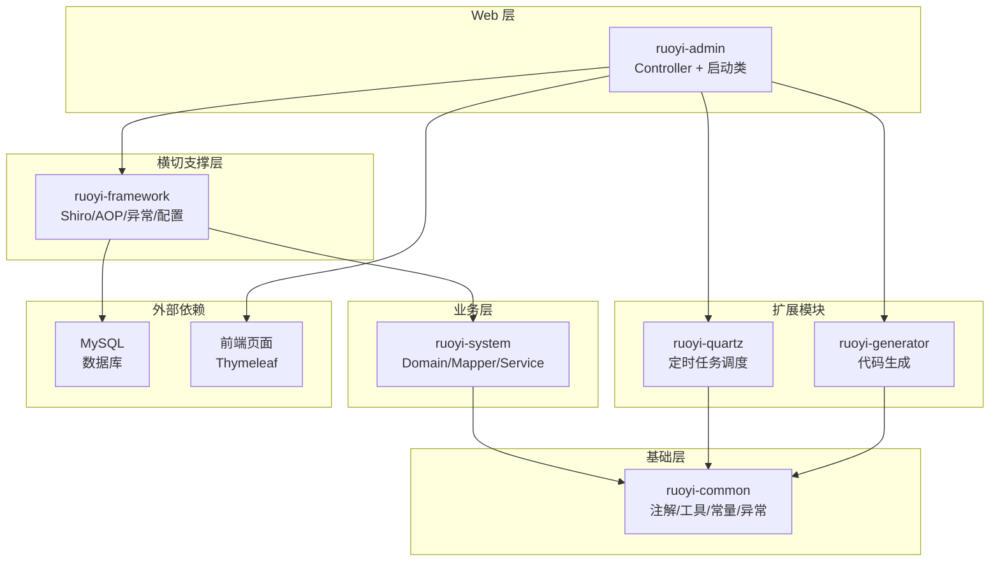

# 架构总览

## 系统概览

RuoYi v4.8.3 是基于 Spring Boot 3.5.14 开发的轻量级 Java 快速开发框架，采用 JDK 17+ 作为运行环境。系统采用经典的分层架构设计，通过多模块 Maven 项目组织代码结构，提供了一套完整的后台管理系统解决方案。

**核心特性：**
- 基于 Spring Boot 3.x 的现代化技术栈
- Apache Shiro 2.2.0 (Jakarta) 安全认证框架
- MyBatis 3.0.5 持久层框架
- Druid 1.2.28 数据库连接池
- Thymeleaf 模板引擎
- 内置代码生成、定时任务、系统监控等实用功能

## 顶层架构图


说明：
- 依赖方向：`ruoyi-admin` → `ruoyi-framework` → `ruoyi-system` → `ruoyi-common`
- `ruoyi-quartz` 和 `ruoyi-generator` 作为独立功能模块，直接依赖 `ruoyi-common`
- `ruoyi-admin` 是唯一可独立运行的模块，负责整合所有子模块

## 顶层模块

### ruoyi-admin（Web 层）

**职责**：系统的唯一可独立运行模块，提供 Web 访问入口和所有 Controller 实现。

**关键内容：**
- 启动类：[`RuoYiApplication.java`](../../RuoYi-Vue/ruoyi-admin/src/main/java/com/ruoyi/RuoYiApplication.java)
- Controller 包：`com.ruoyi.web.controller`（包含 system、monitor、common、tool 等子包）
- 配置文件：[`application.yml`](../../RuoYi-Vue/ruoyi-admin/src/main/resources/application.yml)、[`application-druid.yml`](../../RuoYi-Vue/ruoyi-admin/src/main/resources/application-druid.yml)
- 模板文件：`templates/` 目录存放 Thymeleaf 页面
- 静态资源：`static/` 目录存放前端静态文件

**端口配置**：默认 HTTP 端口 80，可通过 `server.port` 修改

### ruoyi-framework（支撑层）

**职责**：提供横切关注点的统一处理，包括安全认证、AOP 切面、异常处理等。

**关键包结构：**
- `config/`：配置类（[`ShiroConfig`](../../RuoYi-Vue/ruoyi-framework/src/main/java/com/ruoyi/framework/config/ShiroConfig.java)、[`DruidConfig`](../../RuoYi-Vue/ruoyi-framework/src/main/java/com/ruoyi/framework/config/DruidConfig.java)、[`CaptchaConfig`](../../RuoYi-Vue/ruoyi-framework/src/main/java/com/ruoyi/framework/config/CaptchaConfig.java) 等）
- `shiro/`：Shiro 认证核心（[`UserRealm`](../../RuoYi-Vue/ruoyi-framework/src/main/java/com/ruoyi/framework/shiro/UserRealm.java) 等）
- `aspectj/`：AOP 切面（操作日志切面等）
- `interceptor/`：拦截器实现
- `manager/`：异步任务管理器（[`AsyncManager`](../../RuoYi-Vue/ruoyi-framework/src/main/java/com/ruoyi/framework/manager/AsyncManager.java)、[`AsyncFactory`](../../RuoYi-Vue/ruoyi-framework/src/main/java/com/ruoyi/framework/manager/AsyncFactory.java)）
- `web/`：全局异常处理器（[`GlobalExceptionHandler`](../../RuoYi-Vue/ruoyi-framework/src/main/java/com/ruoyi/framework/web/GlobalExceptionHandler.java)）

### ruoyi-system（业务层）

**职责**：核心业务逻辑实现，包含系统管理相关的所有 domain、mapper、service。

**关键包结构：**
- `domain/`：实体类（用户、部门、角色、菜单、岗位、字典、参数、通知等）
- `mapper/`：MyBatis Mapper 接口
- `service/`：业务服务接口与实现
- `work/`：Work 扩展领域的 9 个业务模型

**实体继承体系：**
- `BaseEntity`：普通实体基类（包含 ID、创建时间、更新时间等）
- `TreeEntity extends BaseEntity`：树形结构实体（SysDept、SysMenu，包含 parentId、ancestors、orderNum）

### ruoyi-common（基础层）

**职责**：最底层的通用组件，无内部依赖，提供注解、工具类、常量、异常等基础设施。

**关键包结构：**
- `annotation/`：自定义注解（[`@Log`](../../RuoYi-Vue/ruoyi-common/src/main/java/com/ruoyi/common/annotation/Log.java)、[`@DataScope`](../../RuoYi-Vue/ruoyi-common/src/main/java/com/ruoyi/common/annotation/DataScope.java)、[`@Excel`](../../RuoYi-Vue/ruoyi-common/src/main/java/com/ruoyi/common/annotation/Excel.java)、[`@RepeatSubmit`](../../RuoYi-Vue/ruoyi-common/src/main/java/com/ruoyi/common/annotation/RepeatSubmit.java)、[`@Anonymous`](../../RuoYi-Vue/ruoyi-common/src/main/java/com/ruoyi/common/annotation/Anonymous.java)、[`@Sensitive`](../../RuoYi-Vue/ruoyi-common/src/main/java/com/ruoyi/common/annotation/Sensitive.java) 等）
- `core/`：核心类（[`BaseController`](../../RuoYi-Vue/ruoyi-common/src/main/java/com/ruoyi/common/core/BaseController.java)、[`BaseEntity`](../../RuoYi-Vue/ruoyi-common/src/main/java/com/ruoyi/common/core/BaseEntity.java)、[`TreeEntity`](../../RuoYi-Vue/ruoyi-common/src/main/java/com/ruoyi/common/core/TreeEntity.java)、[`AjaxResult`](../../RuoYi-Vue/ruoyi-common/src/main/java/com/ruoyi/common/core/AjaxResult.java)、[`R<T>`](../../RuoYi-Vue/ruoyi-common/src/main/java/com/ruoyi/common/core/R.java)、[`Ztree`](../../RuoYi-Vue/ruoyi-common/src/main/java/com/ruoyi/common/core/Ztree.java)）
- `constant/`：常量定义
- `utils/`：工具类集合
- `exception/`：异常体系（[`BaseException`](../../RuoYi-Vue/ruoyi-common/src/main/java/com/ruoyi/common/exception/BaseException.java)、[`ServiceException`](../../RuoYi-Vue/ruoyi-common/src/main/java/com/ruoyi/common/exception/ServiceException.java) 等）
- `xss/`：XSS 过滤相关

### ruoyi-quartz（定时任务模块）

**职责**：提供定时任务调度功能，支持在线管理任务（添加、修改、删除）及执行结果日志。

**关键包结构：**
- `config/`：定时任务配置
- `controller/`：任务管理 Controller
- `domain/`：任务实体
- `mapper/` & `service/`：任务持久化
- `task/`：具体任务实现
- `util/`：任务调度工具

### ruoyi-generator（代码生成模块）

**职责**：根据数据库表结构自动生成前后端代码（Java、HTML、XML、SQL），支持 CRUD 操作下载。

**关键包结构：**
- `config/`：代码生成配置
- `controller/`：生成器 Controller
- `domain/`：生成器实体
- `mapper/` & `service/`：生成器持久化
- `util/`：代码生成工具（基于 Velocity 2.3 模板引擎）

## 关键边界

### 模块依赖边界

```
ruoyi-admin (可独立运行)
    ├── ruoyi-framework
    │       └── ruoyi-system
    │               └── ruoyi-common
    ├── ruoyi-quartz
    │       └── ruoyi-common
    └── ruoyi-generator
            └── ruoyi-common
```

**约束规则：**
- 依赖必须单向传递，禁止循环依赖
- 新依赖必须在根 pom.xml 的 `dependencyManagement` 中声明
- `ruoyi-common` 作为最底层，不能依赖任何其他业务模块

### 安全边界

**Shiro 过滤链**：HTTP 请求 → `user` → `kickout` → `onlineSession` → `syncOnlineSession` → `csrfValidateFilter` → Controller

**安全机制：**
- 密码加密：MD5 + salt（`Md5Utils.hash(loginName + password + salt)`）
- 登录失败：错误 5 次锁定 10 分钟（EhCache 计数）
- Session 管理：30 分钟超时，支持并发会话控制
- XSS 过滤：默认开启，匹配 `/system/*`、`/monitor/*`、`/tool/*`（排除 `/system/notice/*`）
- CSRF：默认关闭，白名单 `/druid`
- RememberMe：AES 加密（`CustomCookieRememberMeManager`）

### 数据权限边界

通过 [`@DataScope`](../../RuoYi-Vue/ruoyi-common/src/main/java/com/ruoyi/common/annotation/DataScope.java) 注解实现数据范围控制，支持 5 种范围：
1. 全部数据权限
2. 自定义数据权限
3. 本部门数据权限
4. 本部门及以下数据权限
5. 仅本人数据权限

## 主要链路

### 请求处理链路

```
HTTP 请求 
  → Shiro Filter Chain（认证/授权）
  → Controller（继承 BaseController）
  → Service（@Log 异步记录日志 / @DataScope 数据权限）
  → Mapper（MyBatis XML）
  → MySQL 数据库
  → AjaxResult / TableDataInfo 响应
```

### 操作日志链路

```
Service 方法（@Log 注解）
  → LogAspect 切面拦截
  → AsyncManager 异步任务管理器
  → AsyncFactory 创建日志记录任务
  → 写入 sys_oper_log 表
```

### 文件上传链路

```
前端上传请求
  → /common/upload（10MB 单文件限制）
  → RuoYiConfig.getUploadPath() 获取存储路径
  → 保存到 profile 目录（默认 D:/giencoder/RuoYi-springboot3）
  → 返回文件 URL
```

## 建议阅读顺序

### 入门路径
1. [README.md](../../RuoYi-Vue/README.md) - 项目简介与功能概览
2. [AGENTS.md](../AGENTS.md) - 工程开发指南与约束配置
3. 本文档 - 整体架构理解

### 深入路径
1. [`RuoYiApplication.java`](../../RuoYi-Vue/ruoyi-admin/src/main/java/com/ruoyi/RuoYiApplication.java) - 启动入口
2. [`application.yml`](../../RuoYi-Vue/ruoyi-admin/src/main/resources/application.yml) - 核心配置
3. [`ShiroConfig.java`](../../RuoYi-Vue/ruoyi-framework/src/main/java/com/ruoyi/framework/config/ShiroConfig.java) - 安全配置
4. [`ruoyi-common`](../../RuoYi-Vue/ruoyi-common/src/main/java/com/ruoyi/common/) - 基础组件

### 扩展路径
- 新增业务模块：参考 AGENTS.md 中的"新增业务"流程
- 定时任务开发：参考 `ruoyi-quartz` 模块结构
- 代码生成使用：参考 `ruoyi-generator` 模块

---

## 本文档引用的文件

| 文件路径 | 说明 |
|---------|------|
| [../../RuoYi-Vue/README.md](../../RuoYi-Vue/README.md) | 项目概述与功能介绍 |
| [../../RuoYi-Vue/pom.xml](../../RuoYi-Vue/pom.xml) | Maven 依赖与模块定义 |
| [../../RuoYi-Vue/ruoyi-admin/src/main/java/com/ruoyi/RuoYiApplication.java](../../RuoYi-Vue/ruoyi-admin/src/main/java/com/ruoyi/RuoYiApplication.java) | 应用启动类 |
| [../../RuoYi-Vue/ruoyi-admin/src/main/resources/application.yml](../../RuoYi-Vue/ruoyi-admin/src/main/resources/application.yml) | 应用主配置文件 |
| [../../RuoYi-Vue/ruoyi-admin/src/main/resources/application-druid.yml](../../RuoYi-Vue/ruoyi-admin/src/main/resources/application-druid.yml) | 数据源配置文件 |
| [../AGENTS.md](../AGENTS.md) | 工程开发指南 |
