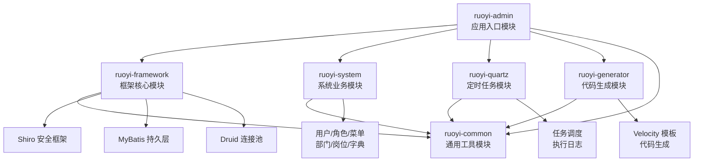

# 架构总览

## 系统概览

本项目为 **RuoYi v4.8.3**，是一套基于 Spring Boot 3 开发的轻量级 Java 快速开发框架。项目采用多模块 Maven 结构，支持完整的后台管理系统功能，包括用户管理、角色权限、菜单配置、代码生成、定时任务、系统监控等核心功能。

- **项目名称**：RuoYi（若依）
- **版本**：4.8.3
- **技术栈**：Spring Boot 3.5.14 + JDK 17 + MyBatis + Shiro + Druid
- **项目类型**：多模块 Maven 项目
- **核心功能**：后台管理系统快速开发框架

项目详细信息请参考 [README.md](../../../README.md)。

## 顶层架构图


说明：
- `ruoyi-admin` 为应用启动入口，依赖所有业务模块
- `ruoyi-framework` 提供框架级配置（Shiro、MyBatis、Druid 等）
- `ruoyi-common` 为所有模块提供通用工具类和基础领域模型
- 箭头方向表示依赖关系

## 顶层模块

### 1. ruoyi-admin（应用入口模块）

**位置**：[`ruoyi-admin/`](../../../ruoyi-admin/)

**职责**：
- 应用启动入口，包含 [`RuoYiApplication.java`](../../../ruoyi-admin/src/main/java/com/ruoyi/RuoYiApplication.java)
- Web 层 Controller 控制器（system、monitor、tool、demo 等）
- 静态资源与模板文件
- 应用配置文件（application.yml、logback.xml 等）

**关键目录**：
- `src/main/java/com/ruoyi/web/controller/`：所有 HTTP 接口控制器
- `src/main/resources/`：配置文件、模板、静态资源
- `src/main/java/com/ruoyi/web/core/config/`：Web 层配置（如 Swagger 配置）

### 2. ruoyi-framework（框架核心模块）

**位置**：[`ruoyi-framework/`](../../../ruoyi-framework/)

**职责**：
- Shiro 安全配置与过滤器链（[`ShiroConfig.java`](../../../ruoyi-framework/src/main/java/com/ruoyi/framework/config/ShiroConfig.java)）
- MyBatis 配置与数据源管理（[`MyBatisConfig.java`](../../../ruoyi-framework/src/main/java/com/ruoyi/framework/config/MyBatisConfig.java)、[`DruidConfig.java`](../../../ruoyi-framework/src/main/java/com/ruoyi/framework/config/DruidConfig.java)）
- AOP 切面（日志、数据权限、重复提交校验）
- 全局异常处理（[`GlobalExceptionHandler.java`](../../../ruoyi-framework/src/main/java/com/ruoyi/framework/web/exception/GlobalExceptionHandler.java)）
- 异步任务管理器（[`AsyncManager.java`](../../../ruoyi-framework/src/main/java/com/ruoyi/framework/manager/AsyncManager.java)）
- 系统监控服务（CPU、内存、磁盘、JVM 等）

**关键组件**：
- `config/`：框架配置类
- `aspectj/`：AOP 切面
- `shiro/`：安全认证与授权
- `datasource/`：动态数据源
- `web/`：Web 层服务与异常处理

### 3. ruoyi-system（系统业务模块）

**位置**：[`ruoyi-system/`](../../../ruoyi-system/)

**职责**：
- 系统核心业务逻辑实现
- 用户、角色、菜单、部门、岗位、字典等实体管理
- 操作日志、登录日志、通知公告等业务功能

**关键目录**：
- `domain/`：实体类（SysUser、SysRole、SysMenu 等）
- `mapper/`：MyBatis 数据访问接口
- `service/`：业务逻辑接口与实现

**主要功能**：
- 用户管理（ISysUserService）
- 角色管理（ISysRoleService）
- 菜单管理（ISysMenuService）
- 部门管理（ISysDeptService）
- 岗位管理（ISysPostService）
- 字典管理（ISysDictDataService、ISysDictTypeService）
- 参数配置（ISysConfigService）
- 通知公告（ISysNoticeService）
- 操作日志（ISysOperLogService）
- 登录日志（ISysLogininforService）

### 4. ruoyi-quartz（定时任务模块）

**位置**：[`ruoyi-quartz/`](../../../ruoyi-quartz/)

**职责**：
- 基于 Quartz 的任务调度框架
- 支持在线添加、修改、删除定时任务
- 任务执行日志记录

**关键组件**：
- `domain/SysJob.java`：任务实体
- `service/ISysJobService.java`：任务调度服务接口
- `task/RyTask.java`：示例任务类
- `util/ScheduleUtils.java`：调度工具类

详细说明请参考 [`ScheduleConfig.java`](../../../ruoyi-quartz/src/main/java/com/ruoyi/quartz/config/ScheduleConfig.java)。

### 5. ruoyi-generator（代码生成模块）

**位置**：[`ruoyi-generator/`](../../../ruoyi-generator/)

**职责**：
- 根据数据库表结构生成前后端代码
- 支持 Java、HTML、XML、SQL 文件生成
- 使用 Velocity 模板引擎

**关键组件**：
- `domain/GenTable.java`：生成表信息实体
- `service/IGenTableService.java`：代码生成服务
- `util/GenUtils.java`：代码生成工具类
- `util/VelocityUtils.java`：Velocity 模板处理

详细说明请参考 [`GenConfig.java`](../../../ruoyi-generator/src/main/java/com/ruoyi/generator/config/GenConfig.java)。

### 6. ruoyi-common（通用工具模块）

**位置**：[`ruoyi-common/`](../../../ruoyi-common/)

**职责**：
- 提供全项目通用的工具类、枚举、异常、注解
- 定义基础领域模型（BaseEntity、TreeEntity、AjaxResult 等）
- 所有其他模块都依赖此模块

**关键目录**：
- `annotation/`：自定义注解（@Log、@DataScope、@Excel 等）
- `core/domain/`：基础领域模型
- `core/controller/`：基础控制器
- `core/page/`：分页相关类
- `enums/`：枚举类型
- `exception/`：自定义异常体系
- `utils/`：工具类集合（文件、日期、字符串、加密等）
- `config/`：通用配置（线程池、数据源上下文等）

## 关键边界

### 模块依赖关系

```
ruoyi-admin (入口)
    ├── ruoyi-framework (框架层)
    │       └── ruoyi-common (通用层)
    ├── ruoyi-system (业务层)
    │       └── ruoyi-common
    ├── ruoyi-quartz (任务调度)
    │       └── ruoyi-common
    ├── ruoyi-generator (代码生成)
    │       └── ruoyi-common
    └── ruoyi-common (基础依赖)
```

### 技术边界

- **安全层**：Shiro 框架负责认证、授权、会话管理（位于 `ruoyi-framework/shiro/`）
- **持久层**：MyBatis + Druid 连接池（配置位于 `ruoyi-framework/config/`）
- **Web 层**：Spring MVC + Thymeleaf 模板引擎（Controller 位于 `ruoyi-admin/web/controller/`）
- **API 文档**：SpringDoc OpenAPI 3（配置位于 `application.yml`）

### 配置边界

主要配置文件：

| 配置文件 | 位置 | 说明 |
|---------|------|------|
| application.yml | [`ruoyi-admin/src/main/resources/`](../../../ruoyi-admin/src/main/resources/) | 应用主配置（端口、Shiro、SpringDoc 等） |
| application-druid.yml | [`ruoyi-admin/src/main/resources/`](../../../ruoyi-admin/src/main/resources/) | 数据源配置 |
| pom.xml | [`ruoyi-admin/`](../../../ruoyi-admin/pom.xml) | 模块依赖配置 |
| logback.xml | [`ruoyi-admin/src/main/resources/`](../../../ruoyi-admin/src/main/resources/) | 日志配置 |

关键配置项（来自 [`application.yml`](../../../ruoyi-admin/src/main/resources/application.yml)）：
- 服务器端口：80
- 上下文路径：/
- JDK 版本：17
- Spring Boot 版本：3.5.14

## 主要链路

### 1. HTTP 请求处理链路

```
HTTP 请求 → Shiro 过滤器链 → Controller → Service → Mapper → 数据库
                ↓
          全局异常处理
                ↓
          返回 AjaxResult
```

- **Shiro 过滤器**：认证、授权、会话验证（[`ShiroConfig.java`](../../../ruoyi-framework/src/main/java/com/ruoyi/framework/config/ShiroConfig.java)）
- **Controller**：位于 `ruoyi-admin/web/controller/`，继承 `BaseController`
- **Service**：位于各业务模块的 `service/` 目录
- **Mapper**：MyBatis 接口，XML 映射文件位于 `resources/mapper/`

### 2. 数据权限控制链路

```
Controller 方法
    ↓
@DataScope 注解（标注数据范围）
    ↓
DataScopeAspect 切面拦截
    ↓
动态拼接 SQL 过滤条件
    ↓
Mapper 执行查询
```

详细说明参考 [`DataScopeAspect.java`](../../../ruoyi-framework/src/main/java/com/ruoyi/framework/aspectj/DataScopeAspect.java) 和 [`@DataScope`](../../../ruoyi-common/src/main/java/com/ruoyi/common/annotation/DataScope.java) 注解。

### 3. 操作日志记录链路

```
Controller 方法
    ↓
@Log 注解（记录操作信息）
    ↓
LogAspect 切面拦截
    ↓
AsyncManager 异步记录
    ↓
写入 sys_oper_log 表
```

详细说明参考 [`LogAspect.java`](../../../ruoyi-framework/src/main/java/com/ruoyi/framework/aspectj/LogAspect.java) 和 [`@Log`](../../../ruoyi-common/src/main/java/com/ruoyi/common/annotation/Log.java) 注解。

### 4. 定时任务调度链路

```
SysJob 任务配置
    ↓
ScheduleConfig 初始化
    ↓
Quartz Scheduler 调度
    ↓
JobInvokeUtil 调用业务方法
    ↓
记录执行日志到 sys_job_log
```

详细说明参考 [`ScheduleConfig.java`](../../../ruoyi-quartz/src/main/java/com/ruoyi/quartz/config/ScheduleConfig.java) 和 [`JobInvokeUtil.java`](../../../ruoyi-quartz/src/main/java/com/ruoyi/quartz/util/JobInvokeUtil.java)。

## 建议阅读顺序

1. **项目入门**：先阅读 [`README.md`](../../../README.md) 了解项目定位与内置功能
2. **快速启动**：查看 [`ruoyi-admin/src/main/resources/application.yml`](../../../ruoyi-admin/src/main/resources/application.yml) 配置说明
3. **核心入口**：阅读 [`RuoYiApplication.java`](../../../ruoyi-admin/src/main/java/com/ruoyi/RuoYiApplication.java) 启动类
4. **框架配置**：深入 [`ruoyi-framework/config/`](../../../ruoyi-framework/src/main/java/com/ruoyi/framework/config/) 了解 Shiro、MyBatis、Druid 配置
5. **业务模块**：浏览 [`ruoyi-system/service/`](../../../ruoyi-system/src/main/java/com/ruoyi/system/service/) 了解核心业务逻辑
6. **工具类**：参考 [`ruoyi-common/utils/`](../../../ruoyi-common/src/main/java/com/ruoyi/common/utils/) 常用工具方法
7. **扩展开发**：阅读 [`ruoyi-generator/`](../../../ruoyi-generator/) 了解代码生成机制

---

## 本文档引用的文件

| 文件 | 路径 |
|------|------|
| README.md | [`../../../README.md`](../../../README.md) |
| RuoYiApplication.java | [`../../../ruoyi-admin/src/main/java/com/ruoyi/RuoYiApplication.java`](../../../ruoyi-admin/src/main/java/com/ruoyi/RuoYiApplication.java) |
| application.yml | [`../../../ruoyi-admin/src/main/resources/application.yml`](../../../ruoyi-admin/src/main/resources/application.yml) |
| pom.xml | [`../../../pom.xml`](../../../pom.xml) |
| ShiroConfig.java | [`../../../ruoyi-framework/src/main/java/com/ruoyi/framework/config/ShiroConfig.java`](../../../ruoyi-framework/src/main/java/com/ruoyi/framework/config/ShiroConfig.java) |
| MyBatisConfig.java | [`../../../ruoyi-framework/src/main/java/com/ruoyi/framework/config/MyBatisConfig.java`](../../../ruoyi-framework/src/main/java/com/ruoyi/framework/config/MyBatisConfig.java) |
| DruidConfig.java | [`../../../ruoyi-framework/src/main/java/com/ruoyi/framework/config/DruidConfig.java`](../../../ruoyi-framework/src/main/java/com/ruoyi/framework/config/DruidConfig.java) |
| ScheduleConfig.java | [`../../../ruoyi-quartz/src/main/java/com/ruoyi/quartz/config/ScheduleConfig.java`](../../../ruoyi-quartz/src/main/java/com/ruoyi/quartz/config/ScheduleConfig.java) |
| GenConfig.java | [`../../../ruoyi-generator/src/main/java/com/ruoyi/generator/config/GenConfig.java`](../../../ruoyi-generator/src/main/java/com/ruoyi/generator/config/GenConfig.java) |
| DataScopeAspect.java | [`../../../ruoyi-framework/src/main/java/com/ruoyi/framework/aspectj/DataScopeAspect.java`](../../../ruoyi-framework/src/main/java/com/ruoyi/framework/aspectj/DataScopeAspect.java) |
| LogAspect.java | [`../../../ruoyi-framework/src/main/java/com/ruoyi/framework/aspectj/LogAspect.java`](../../../ruoyi-framework/src/main/java/com/ruoyi/framework/aspectj/LogAspect.java) |
| JobInvokeUtil.java | [`../../../ruoyi-quartz/src/main/java/com/ruoyi/quartz/util/JobInvokeUtil.java`](../../../ruoyi-quartz/src/main/java/com/ruoyi/quartz/util/JobInvokeUtil.java) |
