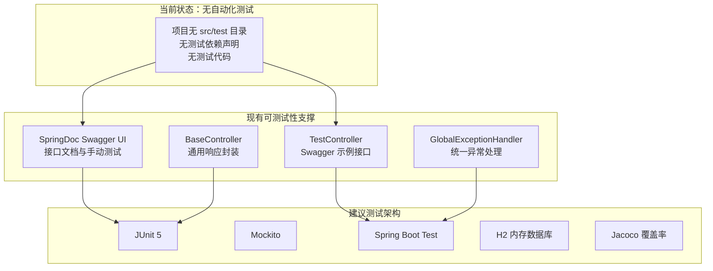
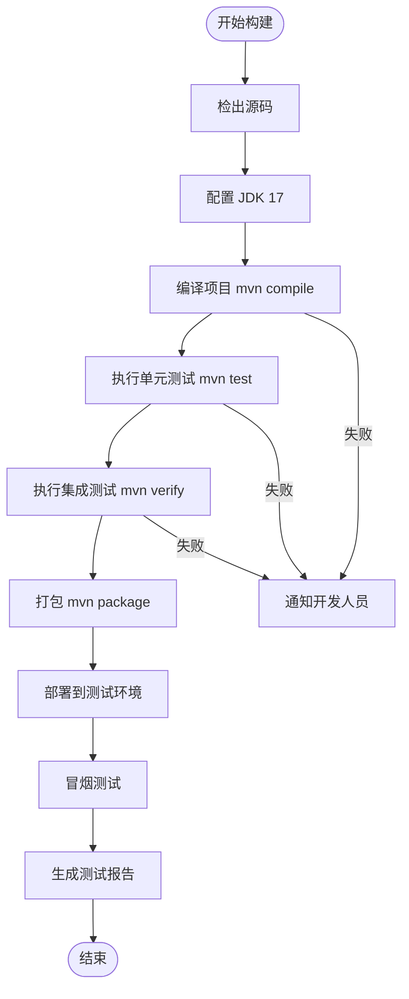
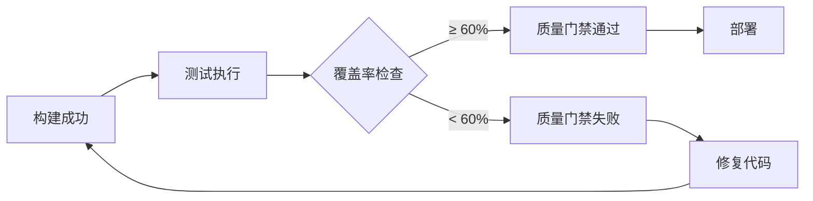

# 测试策略文档

**本文档引用的文件**
- [pom.xml](../../pom.xml)
- [ruoyi-admin/pom.xml](../../ruoyi-admin/pom.xml)
- [application.yml](../../ruoyi-admin/src/main/resources/application.yml)
- [application-druid.yml](../../ruoyi-admin/src/main/resources/application-druid.yml)
- [RuoYiApplication.java](../../ruoyi-admin/src/main/java/com/ruoyi/RuoYiApplication.java)
- [BaseController.java](../../ruoyi-common/src/main/java/com/ruoyi/common/core/controller/BaseController.java)
- [GlobalExceptionHandler.java](../../ruoyi-framework/src/main/java/com/ruoyi/framework/web/exception/GlobalExceptionHandler.java)
- [TestController.java](../../ruoyi-admin/src/main/java/com/ruoyi/web/controller/tool/TestController.java)
- [SwaggerConfig.java](../../ruoyi-admin/src/main/java/com/ruoyi/web/core/config/SwaggerConfig.java)
- [ShiroConfig.java](../../ruoyi-framework/src/main/java/com/ruoyi/framework/config/ShiroConfig.java)
- [ry.bat](../../ry.bat)

## 目录
1. [项目概述](#项目概述)
2. [测试架构概览](#测试架构概览)
3. [测试框架与工具](#测试框架与工具)
4. [测试代码组织结构](#测试代码组织结构)
5. [测试类型与策略](#测试类型与策略)
6. [测试最佳实践](#测试最佳实践)
7. [持续集成与测试流程](#持续集成与测试流程)
8. [测试覆盖率与质量保证](#测试覆盖率与质量保证)
9. [故障排除指南](#故障排除指南)
10. [总结](#总结)

## 项目概述

RuoYi v4.8.3 是基于 Spring Boot 3.5.14 构建的轻量级 Java 快速开发框架，采用 Apache Shiro 2.2.0 认证、MyBatis 3.0.5 持久化、Druid 1.2.28 连接池，前端使用 Thymeleaf 模板引擎。项目当前**未建立自动化测试体系**——所有模块均无 `src/test` 目录，pom.xml 中未声明 `spring-boot-starter-test`、JUnit、Mockito、Jacoco 等测试依赖，也没有任何 `@Test` 注解的测试类。

> 来源：[pom.xml](../../pom.xml)、[ruoyi-admin/pom.xml](../../ruoyi-admin/pom.xml)

## 测试架构概览



**当前测试手段**：
- 通过 SpringDoc Swagger UI（`/swagger-ui.html`）进行接口手动测试
- 通过 Druid 监控页面（`/druid/*`）观察 SQL 执行与连接池状态
- 通过服务启动后的端点验证（`/login`、`/captcha/captchaImage` 等）进行冒烟测试

> 来源：[SwaggerConfig.java](../../ruoyi-admin/src/main/java/com/ruoyi/web/core/config/SwaggerConfig.java)、[TestController.java](../../ruoyi-admin/src/main/java/com/ruoyi/web/controller/tool/TestController.java)、[application.yml](../../ruoyi-admin/src/main/resources/application.yml)(L125-L137)

## 测试框架与工具

### 当前可用工具

| 工具 | 版本 | 用途 | 配置位置 |
|------|------|------|----------|
| SpringDoc OpenAPI | 2.8.17 | 接口文档生成与手动测试 | [application.yml](../../ruoyi-admin/src/main/resources/application.yml)(L125-L137) |
| Druid 监控 | 1.2.28 | SQL 监控与连接池分析 | [application-druid.yml](../../ruoyi-admin/src/main/resources/application-druid.yml)(L42-L60) |
| Maven | 3.6+ | 构建与打包（`mvn clean package -DskipTests`） | [pom.xml](../../pom.xml) |
| Spring Boot Actuator | — | 未启用（可通过依赖引入） | — |

### 建议引入的测试框架

项目基于 Spring Boot 3.5.14，建议在 [pom.xml](../../pom.xml) 的 `<dependencies>` 或各子模块中添加以下测试依赖：

| 框架 | 建议版本 | 用途 |
|------|----------|------|
| `spring-boot-starter-test` | Spring Boot 内置 | 包含 JUnit 5、Mockito、AssertJ、Spring Test |
| `junit-jupiter` | 5.10+ | 单元测试框架 |
| `mockito-core` | 5.x | Mock 对象与行为验证 |
| `h2` | 2.x | 内存数据库，用于集成测试替代 MySQL |
| `jacoco-maven-plugin` | 0.8.x | 代码覆盖率分析 |

> 来源：[pom.xml](../../pom.xml)(L20) Spring Boot 版本 3.5.14，其 BOM 已管理 JUnit 5 和 Mockito 版本

## 测试代码组织结构

### 当前状态

项目所有模块（ruoyi-admin、ruoyi-framework、ruoyi-system、ruoyi-common、ruoyi-quartz、ruoyi-generator）均**无 `src/test` 目录**，不存在任何测试代码。

### 建议目录结构

```
ruoyi-admin/src/test/java/com/ruoyi/
├── controller/                     # Controller 层集成测试
│   ├── system/                     # 系统管理接口测试
│   │   ├── SysUserControllerTest.java
│   │   ├── SysRoleControllerTest.java
│   │   └── SysDeptControllerTest.java
│   └── monitor/                    # 监控模块接口测试
│       └── CacheControllerTest.java
└── RuoYiApplicationTest.java       # 启动上下文测试

ruoyi-framework/src/test/java/com/ruoyi/framework/
├── shiro/                          # Shiro 认证授权测试
│   └── UserRealmTest.java
├── web/exception/                  # 异常处理测试
│   └── GlobalExceptionHandlerTest.java
└── config/                         # 配置类测试
    └── ShiroConfigTest.java

ruoyi-system/src/test/java/com/ruoyi/system/
├── service/                        # Service 层单元测试
│   ├── ISysUserServiceTest.java
│   ├── ISysRoleServiceTest.java
│   └── ISysConfigServiceTest.java
└── mapper/                         # Mapper 层集成测试
    ├── SysUserMapperTest.java
    └── SysRoleMapperTest.java

ruoyi-common/src/test/java/com/ruoyi/common/
├── utils/                          # 工具类单元测试
│   ├── StringUtilsTest.java
│   ├── DateUtilsTest.java
│   └── Md5UtilsTest.java
└── core/                           # 核心类测试
    └── AjaxResultTest.java
```

> 来源：根据 [ruoyi-admin/controller/](../../ruoyi-admin/src/main/java/com/ruoyi/web/controller/)、[ruoyi-framework/](../../ruoyi-framework/src/main/java/com/ruoyi/framework/)、[ruoyi-system/](../../ruoyi-system/src/main/java/com/ruoyi/system/)、[ruoyi-common/](../../ruoyi-common/src/main/java/com/ruoyi/common/) 的包结构推断

## 测试类型与策略

### 手动接口测试（当前唯一手段）

项目通过 SpringDoc Swagger UI 提供接口手动测试能力。[TestController](../../ruoyi-admin/src/main/java/com/ruoyi/web/controller/tool/TestController.java) 是一个 Swagger 示例控制器，暴露了 `/test/user` 下的 CRUD 接口，用于演示接口文档与测试交互。

**Swagger 测试端点**：
- `/swagger-ui.html` — Swagger UI 界面
- `/v3/api-docs` — OpenAPI JSON 文档
- `/test/user/list` — 示例用户列表接口
- `/test/user/{userId}` — 示例用户详情接口

> 来源：[TestController.java](../../ruoyi-admin/src/main/java/com/ruoyi/web/controller/tool/TestController.java)、[SwaggerConfig.java](../../ruoyi-admin/src/main/java/com/ruoyi/web/core/config/SwaggerConfig.java)

### 冒烟测试

项目可通过启动后访问关键端点进行冒烟验证：

| 端点 | 预期状态 | 验证内容 |
|------|----------|----------|
| `/login` | 200 | 登录页面可访问 |
| `/captcha/captchaImage` | 200 | 验证码接口正常 |
| `/swagger-ui.html` | 200 | 接口文档可访问 |
| `/druid/` | 200 | Druid 监控可访问 |

> 来源：[application.yml](../../ruoyi-admin/src/main/resources/application.yml)

### 建议的单元测试策略

针对 ruoyi-common 工具类和 ruoyi-system Service 层，建议采用以下策略：

1. **工具类测试**（ruoyi-common/utils）：纯函数测试，无需 Spring 上下文
   - `StringUtils`、`DateUtils`、`Md5Utils` 等工具方法
   - 使用 JUnit 5 参数化测试覆盖边界条件

2. **Service 层测试**（ruoyi-system/service）：使用 Mockito Mock Mapper 层
   - Mock `SysUserMapper`、`SysRoleMapper` 等依赖
   - 验证业务逻辑（如密码加密、数据权限过滤）

3. **异常处理测试**（ruoyi-framework/web/exception）：
   - 测试 [GlobalExceptionHandler](../../ruoyi-framework/src/main/java/com/ruoyi/framework/web/exception/GlobalExceptionHandler.java) 对各类异常的响应
   - 包括 `ServiceException`、`BindException`、`AuthorizationException`、`DemoModeException`

### 建议的集成测试策略

1. **Controller 集成测试**：使用 `@SpringBootTest` + `MockMvc`
   - 需要处理 Shiro 认证（模拟登录或使用 `@Anonymous` 端点）
   - 使用 H2 内存数据库替代 MySQL

2. **Mapper 集成测试**：使用 `@MybatisTest` + H2
   - 验证 SQL 映射与数据库交互
   - 需要初始化表结构（可从 [sql/ry_20260319.sql](../../sql/ry_20260319.sql) 提取 DDL）

3. **Shiro 认证流程测试**：
   - 测试登录/登出/权限校验完整流程
   - 测试密码错误锁定机制（5 次错误锁 10 分钟）
   - 测试会话并发控制（`maxSession` 配置）

> 来源：[GlobalExceptionHandler.java](../../ruoyi-framework/src/main/java/com/ruoyi/framework/web/exception/GlobalExceptionHandler.java)、[ShiroConfig.java](../../ruoyi-framework/src/main/java/com/ruoyi/framework/config/ShiroConfig.java)、[BaseController.java](../../ruoyi-common/src/main/java/com/ruoyi/common/core/controller/BaseController.java)

## 测试最佳实践

### 1. 测试命名规范

- 测试类命名：`XxxTest.java`（单元测试）、`XxxIT.java`（集成测试）
- 测试方法命名：`should期望结果_when条件`，例如 `shouldReturnError_whenPasswordExceedsMaxRetry`

### 2. Shiro 认证测试处理

由于项目使用 Shiro 进行认证授权，集成测试需要特殊处理：

- 方案一：在测试配置中禁用 Shiro 过滤链
- 方案二：使用 `@Anonymous` 注解标记测试端点
- 方案三：通过 `Subject.Builder` 模拟已认证用户

### 3. 数据库测试隔离

- 集成测试使用 H2 内存数据库，避免污染生产数据
- 测试数据通过 `@Sql` 注解或 DbUnit 加载
- 每个测试方法后回滚事务（`@Transactional` + `@Rollback`）

### 4. Mock 策略

- Service 层测试：Mock Mapper 层依赖
- Controller 层测试：Mock Service 层依赖（单元测试）或使用真实 Service（集成测试）
- 外部依赖（如 IP 地址解析 Yauaa）：始终 Mock

### 5. 演示模式测试

项目有演示模式（`demoEnabled=true`），写操作会抛出 `DemoModeException`。测试需覆盖：
- 演示模式下写操作返回错误
- 非演示模式下写操作正常执行

> 来源：[application.yml](../../ruoyi-admin/src/main/resources/application.yml)(L10)、[GlobalExceptionHandler.java](../../ruoyi-framework/src/main/java/com/ruoyi/framework/web/exception/GlobalExceptionHandler.java)(L144-L148)

## 持续集成与测试流程

### 当前构建流程

项目当前无 CI/CD 工作流配置（`.github/workflows/` 目录不存在），构建与测试依赖手动执行：

```bash
mvn clean compile                      # 编译检查
mvn clean package -DskipTests          # 打包（跳过测试，因无测试代码）
java -jar ruoyi-admin/target/ruoyi-admin.jar  # 运行
```

> 来源：[pom.xml](../../pom.xml)、[ry.bat](../../ry.bat)

### 建议 CI/CD 流程



### 建议 GitHub Actions 配置

基于项目 JDK 17 + Maven 的技术栈，建议在 `.github/workflows/ci.yml` 中配置：

- 触发条件：push/PR 到 main 分支
- JDK：corretto-17（使用 `setup-java@v4`）
- 构建命令：`mvn clean package -B`
- 缓存：Maven 本地仓库

> 来源：[pom.xml](../../pom.xml)(L18) JDK 17、[ry.bat](../../ry.bat) JVM 参数配置

## 测试覆盖率与质量保证

### 当前状态

项目**无代码覆盖率工具**，未配置 Jacoco 或其他覆盖率插件，无法量化测试覆盖情况。

### 建议覆盖率目标

| 层级 | 建议覆盖率 | 优先级 |
|------|-----------|--------|
| ruoyi-common/utils | ≥ 80% | 高 |
| ruoyi-system/service | ≥ 70% | 高 |
| ruoyi-framework/shiro | ≥ 60% | 中 |
| ruoyi-admin/controller | ≥ 50% | 中 |
| ruoyi-system/mapper | ≥ 40% | 低 |

### 建议质量门禁



### 建议代码质量工具

| 工具 | 用途 |
|------|------|
| Jacoco | 代码覆盖率分析 |
| SpotBugs | 静态代码分析 |
| OWASP Dependency Check | 安全漏洞扫描（当前 FastJSON 1.2.83 存在已知漏洞） |
| Maven Enforcer | 依赖冲突检测 |

> 来源：[pom.xml](../../pom.xml)(L28) FastJSON 1.2.83

## 故障排除指南

### 测试环境搭建问题

#### 1. 数据库连接失败
**症状**：集成测试启动时数据库连接超时
**解决方案**：
- 检查 `application-druid.yml` 中的数据库配置
- 集成测试建议使用 H2 内存数据库替代 MySQL
- 确保测试配置文件 `application-test.yml` 使用独立的测试数据源

#### 2. Shiro 认证阻断测试
**症状**：Controller 测试返回 302 重定向到登录页
**解决方案**：
- 在测试配置中通过 `@Anonymous` 注解绕过认证
- 或在测试中先调用登录接口获取 Session
- 或创建测试专用的 Shiro 配置类，禁用过滤链

#### 3. 演示模式干扰测试
**症状**：写操作测试返回"演示模式，不允许操作"
**解决方案**：
- 在测试配置中设置 `ruoyi.demoEnabled=false`
- 或在测试专用的 `application-test.yml` 中关闭演示模式

> 来源：[application.yml](../../ruoyi-admin/src/main/resources/application.yml)(L10)、[GlobalExceptionHandler.java](../../ruoyi-framework/src/main/java/com/ruoyi/framework/web/exception/GlobalExceptionHandler.java)(L144-L148)

### 调试技巧

1. **启用详细日志**：在测试配置中设置 `logging.level.com.ruoyi=debug`
2. **查看 SQL 执行**：通过 Druid 监控（`/druid/*`）观察 SQL 执行情况
3. **Swagger 手动验证**：通过 `/swagger-ui.html` 手动调用接口验证预期行为
4. **Maven 调试**：使用 `mvn test -Dmaven.surefire.debug` 远程调试测试

## 总结

RuoYi v4.8.3 当前**未建立自动化测试体系**，所有模块无测试代码、无测试依赖、无覆盖率工具。项目现有的测试手段仅限于 SpringDoc Swagger UI 手动接口测试和启动后端点冒烟验证。

### 关键现状

1. **无测试代码**：所有模块的 `src/test` 目录均不存在
2. **无测试依赖**：pom.xml 未声明 `spring-boot-starter-test`、JUnit、Mockito 等
3. **无 CI/CD**：无 GitHub Actions 工作流，构建与部署依赖手动操作
4. **无覆盖率分析**：未配置 Jacoco 或其他覆盖率插件

### 建议改进方向

1. **引入测试基础设施**：在根 pom.xml 添加 `spring-boot-starter-test` 依赖，配置 Jacoco 插件
2. **优先测试工具类**：ruoyi-common/utils 下的工具方法最适合作为首批单元测试目标
3. **逐步覆盖 Service 层**：使用 Mockito Mock Mapper 层，验证核心业务逻辑
4. **建立 CI 流水线**：配置 GitHub Actions 自动执行编译与测试
5. **处理 Shiro 认证**：为集成测试设计 Shiro 认证绕过方案
6. **安全漏洞修复**：关注 FastJSON 1.2.83 已知漏洞，建议升级或替换

> 来源：综合 [pom.xml](../../pom.xml)、[ruoyi-admin/pom.xml](../../ruoyi-admin/pom.xml)、[application.yml](../../ruoyi-admin/src/main/resources/application.yml)、[AGENTS.md](../../ruoyi-admin/.gientech/AGENTS.md)
