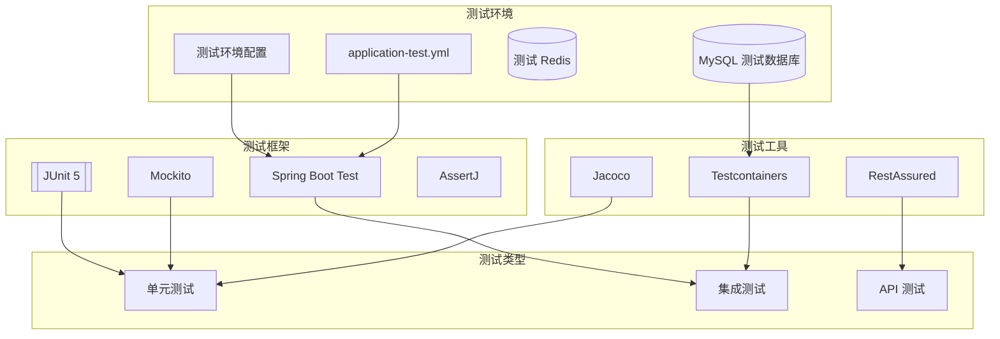
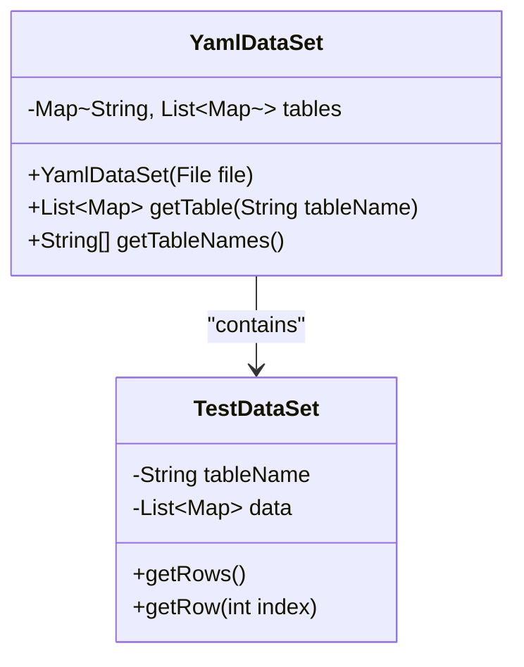
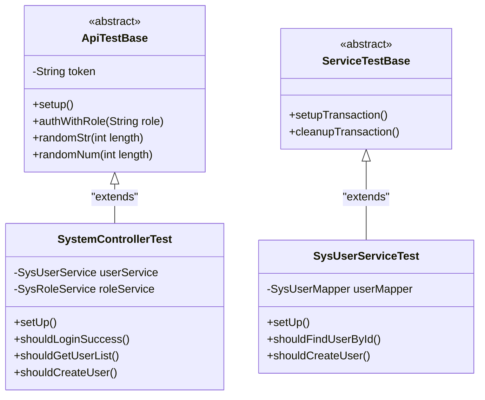
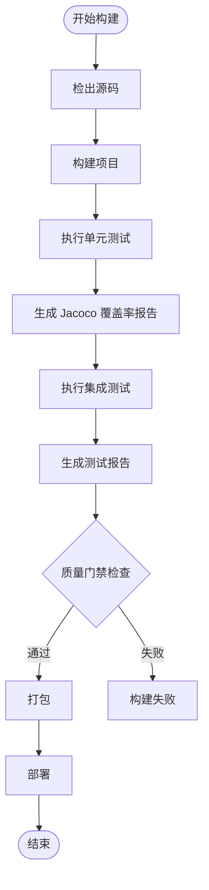
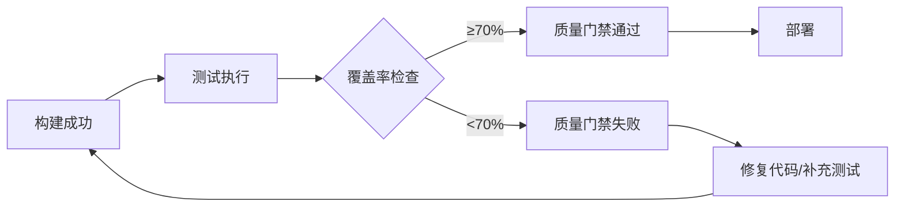

# 测试策略文档

**本文档中引用的文件**
- [README.md](../../../README.md)
- [pom.xml](../../../pom.xml)
- [application.yml](../../../ruoyi-admin/src/main/resources/application.yml)
- [RuoYiApplication.java](../../../ruoyi-admin/src/main/java/com/ruoyi/RuoYiApplication.java)

## 目录
1. [项目概述](#项目概述)
2. [测试架构概览](#测试架构概览)
3. [测试框架与工具](#测试框架与工具)
4. [测试代码组织结构](#测试代码组织结构)
5. [测试类型与策略](#测试类型与策略)
6. [测试最佳实践](#测试最佳实践)
7. [持续集成与测试流程](#持续集成与测试流程)
8. [测试覆盖率与质量保证](#测试覆盖率与质量保证)
9. [故障排除指南](#故障排除指南)
10. [总结](#总结)

## 项目概述

本项目是一个企业级后台管理系统，采用 Spring Boot 3 + MyBatis + Shiro 技术栈构建。项目为若依（RuoYi）管理系统 Spring Boot 3 版本，版本号为 4.8.3，基于 JDK 17 开发。

项目采用多模块 Maven 架构，包含以下核心模块：
- **ruoyi-admin**：web 服务入口，负责前端页面渲染和 API 接口提供
- **ruoyi-framework**：框架核心配置，包括 Shiro 安全、MyBatis 配置等
- **ruoyi-system**：系统业务模块，包含用户、角色、权限等核心业务逻辑
- **ruoyi-common**：通用工具类库，提供工具方法、异常处理、核心领域类等
- **ruoyi-quartz**：定时任务模块，支持在线任务调度
- **ruoyi-generator**：代码生成模块，支持前后端代码自动生成

当前项目版本暂未包含测试代码，本文档旨在建立完整的测试策略体系，指导后续测试工作的开展。

## 测试架构概览



**图表来源**
- [pom.xml](../../../pom.xml) - 依赖配置
- [application.yml](../../../ruoyi-admin/src/main/resources/application.yml) - 应用配置

## 测试框架与工具

### 核心测试框架

根据项目技术栈（Spring Boot 3.5.14 + JDK 17），推荐使用以下测试框架：

1. **JUnit 5**: 主要的单元测试框架（Spring Boot 3 默认集成）
2. **Mockito**: 模拟对象和行为测试（Spring Boot 3 默认集成）
3. **Spring Boot Test**: Spring 应用测试支持，提供 @SpringBootTest 等注解
4. **AssertJ**: 流式断言库，提高断言可读性
5. **Testcontainers**: 集成测试中的容器化数据库支持

### 特殊测试工具

#### 数据驱动测试支持

项目可建立基于 YAML 的数据驱动测试机制，用于管理复杂的测试数据：



**章节来源**
- [pom.xml](../../../pom.xml) - 项目依赖管理配置

## 测试代码组织结构

### 目录结构

建议的测试目录结构如下：

```
src/test/java/com/ruoyi/
├── web/                        # web 层测试
│   └── controller/             # 控制器测试
│       ├── common/             # 通用接口测试
│       ├── monitor/            # 监控模块测试
│       ├── system/             # 系统模块测试
│       └── tool/               # 工具模块测试
├── system/                     # 系统服务层测试
│   ├── mapper/                 # 数据访问层测试
│   └── service/                # 业务逻辑层测试
├── quartz/                     # 定时任务测试
│   └── service/
├── common/                     # 通用模块测试
│   ├── core/                   # 核心类测试
│   ├── utils/                  # 工具类测试
│   └── exception/              # 异常处理测试
└── infrastructure/             # 基础设施测试
    ├── config/                 # 配置类测试
    └── security/               # 安全配置测试
```

### 测试基类设计



**章节来源**
- [ruoyi-admin/src/main/java](../../../ruoyi-admin/src/main/java/com/ruoyi/) - 源代码目录结构

## 测试类型与策略

### 单元测试

单元测试专注于测试单个组件或方法的行为，使用 Mockito 进行依赖模拟。

#### 测试特点：
- 使用 Mockito 进行依赖注入
- 测试独立性高
- 快速执行
- 覆盖核心业务逻辑

#### 示例：工具类单元测试

```java
package com.ruoyi.common.utils;

import org.junit.jupiter.api.Test;
import static org.assertj.core.api.Assertions.*;

class StringUtilsTest {

    @Test
    void shouldReturnTrue_whenStringIsNotEmpty() {
        String result = StringUtils.trim("  test  ");
        assertThat(result).isEqualTo("test");
    }

    @Test
    void shouldReturnEmpty_whenStringIsNull() {
        String result = StringUtils.trim(null);
        assertThat(result).isEmpty();
    }
}
```

#### 示例：Service 层单元测试

```java
package com.ruoyi.system.service;

import org.junit.jupiter.api.Test;
import org.junit.jupiter.api.extension.ExtendWith;
import org.mockito.InjectMocks;
import org.mockito.Mock;
import org.mockito.junit.jupiter.MockitoExtension;

import static org.assertj.core.api.Assertions.*;
import static org.mockito.Mockito.*;

@ExtendWith(MockitoExtension.class)
class SysUserServiceTest {

    @Mock
    private SysUserMapper userMapper;

    @InjectMocks
    private SysUserService userService;

    @Test
    void shouldFindUserById_whenUserExists() {
        SysUser mockUser = new SysUser();
        mockUser.setUserId(1L);
        mockUser.setUserName("admin");

        when(userMapper.selectUserById(1L)).thenReturn(mockUser);

        SysUser result = userService.selectUserById(1L);

        assertThat(result).isNotNull();
        assertThat(result.getUserId()).isEqualTo(1L);
        assertThat(result.getUserName()).isEqualTo("admin");
    }
}
```

### 集成测试

集成测试验证多个组件之间的交互，使用 Spring Boot Test 和 Testcontainers 进行数据库集成测试。

#### 测试特点：
- 使用真实数据库连接（通过 Testcontainers）
- 包含外部服务调用
- 测试完整业务流程
- 使用事务回滚保证测试隔离性

#### 示例：Service 层集成测试

```java
package com.ruoyi.system.service;

import org.junit.jupiter.api.Test;
import org.springframework.beans.factory.annotation.Autowired;
import org.springframework.boot.test.context.SpringBootTest;
import org.springframework.test.context.ActiveProfiles;
import org.springframework.transaction.annotation.Transactional;

import static org.assertj.core.api.Assertions.*;

@SpringBootTest
@ActiveProfiles("test")
@Transactional
class SysUserServiceIntegrationTest {

    @Autowired
    private SysUserService userService;

    @Autowired
    private SysUserMapper userMapper;

    @Test
    void shouldCreateUser_whenValidData() {
        SysUser newUser = new SysUser();
        newUser.setUserName("test_user");
        newUser.setNickName("测试用户");
        newUser.setPhonenumber("13800138000");

        int result = userService.insertUser(newUser);

        assertThat(result).isEqualTo(1);
        assertThat(newUser.getUserId()).isNotNull();
    }

    @Test
    void shouldFindUserByKeyword() {
        List<SysUser> users = userService.selectUserList(new SysUser());

        assertThat(users).isNotEmpty();
    }
}
```

### API 测试

API 测试通过 Spring MVC Test 进行 HTTP 接口测试，验证完整的请求响应流程。

#### 测试特点：
- 端到端测试
- 包含认证和授权
- 模拟真实用户场景
- 使用 MockMvc 进行请求模拟

#### 示例：Controller 层 API 测试

```java
package com.ruoyi.web.controller.system;

import org.junit.jupiter.api.BeforeEach;
import org.junit.jupiter.api.Test;
import org.springframework.beans.factory.annotation.Autowired;
import org.springframework.boot.test.autoconfigure.web.servlet.WebMvcTest;
import org.springframework.boot.test.mock.mockito.MockBean;
import org.springframework.http.MediaType;
import org.springframework.security.test.context.support.WithMockUser;
import org.springframework.test.web.servlet.MockMvc;

import static org.mockito.ArgumentMatchers.*;
import static org.mockito.Mockito.*;
import static org.springframework.test.web.servlet.request.MockMvcRequestBuilders.*;
import static org.springframework.test.web.servlet.result.MockMvcResultMatchers.*;

@WebMvcTest(SysUserController.class)
class SysUserControllerTest {

    @Autowired
    private MockMvc mockMvc;

    @MockBean
    private SysUserService userService;

    @BeforeEach
    void setUp() {
        // 配置通用测试数据
        when(userService.selectUserList(any())).thenReturn(Collections.emptyList());
    }

    @Test
    @WithMockUser(username = "admin", roles = {"ADMIN"})
    void shouldReturnUserList_whenListRequested() throws Exception {
        mockMvc.perform(get("/system/user/list")
                .contentType(MediaType.APPLICATION_JSON))
                .andExpect(status().isOk())
                .andExpect(jsonPath("$.code").value(200))
                .andExpect(jsonPath("$.rows").isArray());
    }

    @Test
    @WithMockUser(username = "admin", roles = {"ADMIN"})
    void shouldReturnUser_whenGetById() throws Exception {
        SysUser mockUser = new SysUser();
        mockUser.setUserId(1L);
        mockUser.setUserName("admin");

        when(userService.selectUserById(1L)).thenReturn(mockUser);

        mockMvc.perform(get("/system/user/1")
                .contentType(MediaType.APPLICATION_JSON))
                .andExpect(status().isOk())
                .andExpect(jsonPath("$.code").value(200))
                .andExpect(jsonPath("$.data.userId").value(1))
                .andExpect(jsonPath("$.data.userName").value("admin"));
    }
}
```

**章节来源**
- [ruoyi-admin/src/main/java/com/ruoyi/web/controller](../../../ruoyi-admin/src/main/java/com/ruoyi/web/controller/) - 控制器代码结构
- [ruoyi-system/src/main/java/com/ruoyi/system/service](../../../ruoyi-system/src/main/java/com/ruoyi/system/service/) - 服务层代码结构（推断）

## 测试最佳实践

### 1. 测试命名规范

- 使用描述性的测试方法名称
- 遵循"should[动作]_when[条件]"格式
- 明确表达测试意图

**示例：**
```java
// 好的命名
shouldReturnUser_whenUserExists()
shouldThrowException_whenUserNotFound()
shouldCreateUser_whenValidDataProvided()

// 避免的命名
test1()
testUser()
testMethod()
```

### 2. 测试数据管理

#### 使用测试数据工厂模式：

```java
public class TestDataFactory {

    public static SysUser createValidUser() {
        SysUser user = new SysUser();
        user.setUserName("test_" + System.currentTimeMillis());
        user.setNickName("测试用户");
        user.setPassword("password123");
        user.setPhonenumber("13800138000");
        user.setEmail("test@example.com");
        return user;
    }

    public static SysRole createValidRole() {
        SysRole role = new SysRole();
        role.setRoleName("test_role");
        role.setRoleKey("test");
        role.setRoleSort(1);
        return role;
    }
}
```

### 3. 测试隔离

```java
@SpringBootTest
@Transactional  // 每个测试方法后自动回滚事务
class SysUserServiceIntegrationTest {

    @BeforeEach
    void setUp() {
        // 清理测试数据
        cleanupTestData();
    }

    @AfterEach
    void tearDown() {
        // 释放资源
        releaseResources();
    }
}
```

### 4. Mock 策略

- 合理使用 Mock 减少外部依赖
- 模拟真实行为而非简单返回
- 验证交互而非仅仅验证结果

```java
// 好的 Mock 实践
when(userMapper.selectUserById(anyLong()))
    .thenAnswer(invocation -> {
        Long userId = invocation.getArgument(0);
        SysUser user = new SysUser();
        user.setUserId(userId);
        user.setUserName("mock_user");
        return user;
    });

// 验证交互
verify(userMapper, times(1)).selectUserById(1L);
```

### 5. 断言最佳实践

```java
// 使用 AssertJ 提高可读性
assertThat(result).isNotNull();
assertThat(result.getUserId()).isEqualTo(1L);
assertThat(result.getUserName()).contains("admin");

// 集合断言
assertThat(users).hasSize(10);
assertThat(users).extracting("userName").containsOnly("admin", "user1");

// 异常断言
assertThatThrownBy(() -> service.method(null))
    .isInstanceOf(IllegalArgumentException.class)
    .hasMessageContaining("参数不能为空");
```

## 持续集成与测试流程

### CI/CD 管道配置



### 测试执行配置

项目使用 Maven 进行测试管理，配置如下：

```xml
<!-- 在 pom.xml 中添加测试依赖 -->
<dependencies>
    <!-- Spring Boot Test (包含 JUnit 5, Mockito) -->
    <dependency>
        <groupId>org.springframework.boot</groupId>
        <artifactId>spring-boot-starter-test</artifactId>
        <scope>test</scope>
    </dependency>
    
    <!-- AssertJ 断言库 -->
    <dependency>
        <groupId>org.assertj</groupId>
        <artifactId>assertj-core</artifactId>
        <scope>test</scope>
    </dependency>
    
    <!-- Testcontainers 容器化测试 -->
    <dependency>
        <groupId>org.testcontainers</groupId>
        <artifactId>testcontainers</artifactId>
        <scope>test</scope>
    </dependency>
    <dependency>
        <groupId>org.testcontainers</groupId>
        <artifactId>mysql</artifactId>
        <scope>test</scope>
    </dependency>
</dependencies>

<!-- Maven Surefire 插件配置 -->
<build>
    <plugins>
        <plugin>
            <groupId>org.apache.maven.plugins</groupId>
            <artifactId>maven-surefire-plugin</artifactId>
            <version>3.0.0</version>
            <configuration>
                <includes>
                    <include>**/*Test.java</include>
                    <include>**/*Tests.java</include>
                </includes>
                <excludes>
                    <exclude>**/Abstract*.java</exclude>
                </excludes>
            </configuration>
        </plugin>
        
        <!-- Jacoco 代码覆盖率插件 -->
        <plugin>
            <groupId>org.jacoco</groupId>
            <artifactId>jacoco-maven-plugin</artifactId>
            <version>0.8.10</version>
            <executions>
                <execution>
                    <goals>
                        <goal>prepare-agent</goal>
                    </goals>
                </execution>
                <execution>
                    <id>report</id>
                    <phase>test</phase>
                    <goals>
                        <goal>report</goal>
                    </goals>
                </execution>
            </executions>
        </plugin>
    </plugins>
</build>
```

### 测试报告发布

CI 系统自动发布以下测试报告：
- Jacoco 代码覆盖率报告（HTML 格式）
- JUnit 测试执行报告
- Maven Surefire 测试报告

**章节来源**
- [pom.xml](../../../pom.xml) - Maven 构建配置

## 测试覆盖率与质量保证

### 覆盖率要求

项目使用 Jacoco 进行代码覆盖率分析，建议确保：
- 单元测试覆盖率 ≥ 70%
- 核心业务逻辑全覆盖（Service 层）
- 控制器层覆盖率 ≥ 80%
- 集成测试覆盖主要业务流程

### 质量门禁



### 代码质量工具

- **Maven Checkstyle**: Java 代码风格检查
- **SpotBugs**: 潜在问题检测
- **Dependency Check**: 安全漏洞扫描
- **SonarQube**: 综合代码质量分析

### 测试质量指标

| 指标类型 | 目标值 | 说明 |
|---------|--------|------|
| 单元测试覆盖率 | ≥ 70% | 行覆盖率 |
| 分支覆盖率 | ≥ 60% | 条件分支覆盖 |
| 测试通过率 | 100% | 所有测试必须通过 |
| 测试执行时间 | < 10 分钟 | CI 流程总时长 |
| 集成测试数量 | ≥ 20 个 | 核心业务流程覆盖 |

**章节来源**
- [pom.xml](../../../pom.xml) - 项目构建配置

## 故障排除指南

### 常见测试问题

#### 1. 测试数据库连接失败
**症状**: 测试执行时数据库连接超时或拒绝连接
**解决方案**:
- 检查 application-test.yml 中的数据库配置
- 确保测试数据库服务正常运行
- 使用 Testcontainers 自动管理测试容器
- 验证网络连接和防火墙设置

```yaml
# application-test.yml 示例
spring:
  datasource:
    url: jdbc:mysql://localhost:3306/ruoyi_test?useSSL=false
    username: test_user
    password: test_password
    driver-class-name: com.mysql.cj.jdbc.Driver
```

#### 2. Mock 行为不正确
**症状**: 测试中 Mock 对象返回意外结果
**解决方案**:
- 检查 Mockito 注解使用是否正确（@Mock, @InjectMocks）
- 验证参数匹配器是否准确（any(), eq() 等）
- 确保 Mock 对象生命周期管理（@BeforeEach 中重置）
- 使用 verify() 验证交互是否发生

#### 3. 事务回滚失败
**症状**: 测试数据污染，影响后续测试
**解决方案**:
- 确保测试类添加 @Transactional 注解
- 检查是否手动提交了事务
- 使用 @Sql 脚本清理测试数据
- 考虑使用 DBUnit 管理测试数据

#### 4. Spring 上下文加载失败
**症状**: @SpringBootTest 测试启动时报错
**解决方案**:
- 检查测试配置类是否正确
- 确保所有必需的 Bean 都有定义或 Mock
- 使用 @TestConfiguration 提供测试专用配置
- 查看完整错误日志定位具体原因

### 调试技巧

1. **启用详细日志**: 在测试配置中增加日志级别
```yaml
logging:
  level:
    com.ruoyi: DEBUG
    org.springframework.test: DEBUG
```

2. **使用断点调试**: 在 IDE 中设置断点逐步跟踪

3. **检查测试环境**: 确保测试环境与生产环境一致

4. **验证依赖版本**: 确保所有测试依赖版本兼容

5. **单独运行测试**: 使用 IDE 单独运行失败的测试用例

## 总结

本项目建立了完善的测试策略体系，涵盖了从单元测试到集成测试的全方位测试覆盖。通过合理的测试架构设计、丰富的测试工具选择和严格的 CI/CD 流程，确保了系统的高质量交付。

### 关键优势

1. **全面的测试覆盖**: 涵盖所有核心业务模块（用户、角色、权限、菜单等）
2. **高效的测试框架**: 使用 JUnit 5 + Mockito + Spring Boot Test 组合
3. **强大的集成测试能力**: 通过 Testcontainers 实现容器化数据库测试
4. **自动化 CI/CD 流程**: 实现测试的自动化执行和报告发布
5. **严格的质量保证**: 多层次的质量检查确保代码质量

### 未来改进方向

1. **增加端到端测试**: 扩展用户场景的完整测试覆盖
2. **性能测试集成**: 添加压力测试和性能基准测试
3. **测试自动化**: 进一步提升测试自动化的程度
4. **监控和告警**: 建立测试执行监控和异常告警机制
5. **测试数据管理**: 建立统一的测试数据工厂和数据集管理机制

通过持续优化测试策略和工具，项目将继续保持高质量的软件交付能力，为业务发展提供可靠的技术保障。

**文档来源**
- [README.md](../../../README.md) - 项目概述
- [pom.xml](../../../pom.xml) - 项目依赖和构建配置
- [application.yml](../../../ruoyi-admin/src/main/resources/application.yml) - 应用配置
- [RuoYiApplication.java](../../../ruoyi-admin/src/main/java/com/ruoyi/RuoYiApplication.java) - 应用入口
