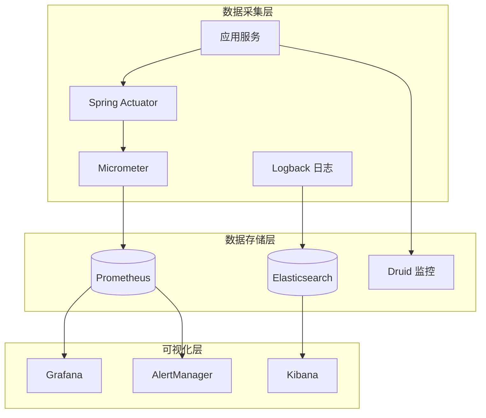

# 监控告警配置文档

**本文档中引用的文件**
- [application.yml](../../../ruoyi-admin/src/main/resources/application.yml)
- [application-druid.yml](../../../ruoyi-admin/src/main/resources/application-druid.yml)
- [部署与运维.md](./部署与运维.md)

## 目录
1. [监控体系概述](#监控体系概述)
2. [Spring Boot Actuator](#spring-boot-actuator)
3. [Prometheus + Grafana](#prometheus--grafana)
4. [日志聚合 (ELK)](#日志聚合-elk)
5. [告警规则配置](#告警规则配置)
6. [Druid 监控](#druid-监控)
7. [自定义监控指标](#自定义监控指标)
8. [监控仪表盘](#监控仪表盘)

## 监控体系概述

### 监控架构



### 监控维度

| 维度 | 监控内容 | 工具 |
|------|----------|------|
| 应用监控 | JVM、线程、HTTP 请求 | Actuator + Prometheus |
| 数据库监控 | 连接池、慢 SQL | Druid + Prometheus |
| 系统监控 | CPU、内存、磁盘 | Node Exporter |
| 日志监控 | 错误日志、业务日志 | ELK |
| 业务监控 | 登录次数、操作频率 | 自定义指标 |

## Spring Boot Actuator

### 依赖配置

```xml
<dependency>
    <groupId>org.springframework.boot</groupId>
    <artifactId>spring-boot-starter-actuator</artifactId>
</dependency>
<dependency>
    <groupId>io.micrometer</groupId>
    <artifactId>micrometer-registry-prometheus</artifactId>
</dependency>
```

### Actuator 配置

参考 [application.yml](../../../ruoyi-admin/src/main/resources/application.yml)：

```yaml
management:
  endpoints:
    web:
      exposure:
        include: health,info,metrics,prometheus,env,loggers
      base-path: /actuator
  endpoint:
    health:
      show-details: always
      probes:
        enabled: true
  health:
    defaults:
      enabled: true
    db:
      enabled: true
    redis:
      enabled: true
    diskspace:
      enabled: true
      threshold: 10MB
  metrics:
    export:
      prometheus:
        enabled: true
    tags:
      application: ruoyi-admin
    distribution:
      percentiles-histogram:
        http.server.requests: true
      percentiles:
        http.server.requests: 0.5, 0.95, 0.99
```

### 关键端点

| 端点 | 路径 | 说明 |
|------|------|------|
| 健康检查 | `/actuator/health` | 应用健康状态 |
| 指标数据 | `/actuator/metrics` | 应用指标列表 |
| Prometheus | `/actuator/prometheus` | Prometheus 格式指标 |
| 环境信息 | `/actuator/env` | 环境变量配置 |
| 日志级别 | `/actuator/loggers` | 日志级别管理 |
| 信息 | `/actuator/info` | 应用信息 |

### 健康检查

```json
// GET /actuator/health
{
  "status": "UP",
  "components": {
    "db": {
      "status": "UP",
      "details": {
        "database": "MySQL",
        "validationQuery": "SELECT 1"
      }
    },
    "redis": {
      "status": "UP",
      "details": {
        "version": "7.0.0"
      }
    },
    "diskSpace": {
      "status": "UP",
      "details": {
        "total": 107374182400,
        "free": 53687091200,
        "threshold": 10485760
      }
    }
  }
}
```

### 自定义健康检查

```java
@Component
public class DatabaseHealthIndicator implements HealthIndicator {
    
    @Autowired
    private DataSource dataSource;
    
    @Override
    public Health health() {
        try (Connection conn = dataSource.getConnection()) {
            if (conn.isValid(3)) {
                return Health.up()
                    .withDetail("database", "MySQL")
                    .withDetail("status", "连接正常")
                    .build();
            }
        } catch (SQLException e) {
            return Health.down()
                .withDetail("error", e.getMessage())
                .build();
        }
        return Health.down().withDetail("status", "连接异常").build();
    }
}
```

## Prometheus + Grafana

### Prometheus 配置

```yaml
# prometheus.yml
global:
  scrape_interval: 15s
  evaluation_interval: 15s
  scrape_timeout: 10s

rule_files:
  - 'alert_rules.yml'

alerting:
  alertmanagers:
    - static_configs:
        - targets: ['alertmanager:9093']

scrape_configs:
  - job_name: 'ruoyi-admin'
    metrics_path: '/actuator/prometheus'
    scrape_interval: 10s
    static_configs:
      - targets: ['ruoyi-admin:8080']
        labels:
          application: 'ruoyi-admin'
          env: 'prod'
          
  - job_name: 'node-exporter'
    static_configs:
      - targets: ['node-exporter:9100']
        labels:
          application: 'node'
          
  - job_name: 'mysql-exporter'
    static_configs:
      - targets: ['mysql-exporter:9104']
        labels:
          application: 'mysql'
          
  - job_name: 'redis-exporter'
    static_configs:
      - targets: ['redis-exporter:9121']
        labels:
          application: 'redis'
```

### Docker Compose 监控栈

```yaml
version: '3.8'

services:
  prometheus:
    image: prom/prometheus:latest
    container_name: prometheus
    ports:
      - "9090:9090"
    volumes:
      - ./prometheus/prometheus.yml:/etc/prometheus/prometheus.yml
      - ./prometheus/alert_rules.yml:/etc/prometheus/alert_rules.yml
      - prometheus-data:/prometheus
    command:
      - '--config.file=/etc/prometheus/prometheus.yml'
      - '--storage.tsdb.path=/prometheus'
      - '--storage.tsdb.retention.time=30d'
      - '--web.enable-lifecycle'
    restart: always
    
  grafana:
    image: grafana/grafana:latest
    container_name: grafana
    ports:
      - "3000:3000"
    volumes:
      - grafana-data:/var/lib/grafana
      - ./grafana/provisioning:/etc/grafana/provisioning
    environment:
      - GF_SECURITY_ADMIN_USER=admin
      - GF_SECURITY_ADMIN_PASSWORD=admin123
    depends_on:
      - prometheus
    restart: always
    
  alertmanager:
    image: prom/alertmanager:latest
    container_name: alertmanager
    ports:
      - "9093:9093"
    volumes:
      - ./alertmanager/alertmanager.yml:/etc/alertmanager/alertmanager.yml
    restart: always
    
  node-exporter:
    image: prom/node-exporter:latest
    container_name: node-exporter
    ports:
      - "9100:9100"
    volumes:
      - /proc:/host/proc:ro
      - /sys:/host/sys:ro
      - /:/rootfs:ro
    command:
      - '--path.procfs=/host/proc'
      - '--path.sysfs=/host/sys'
      - '--path.rootfs=/rootfs'
    restart: always

volumes:
  prometheus-data:
  grafana-data:
```

### Grafana 仪表盘配置

**JVM 监控面板**：
- 堆内存使用率
- GC 频率和耗时
- 线程数
- 类加载数

**HTTP 请求监控面板**：
- 请求 QPS
- 响应时间分布（P50、P95、P99）
- 错误率
- 慢请求

**数据库监控面板**：
- 连接池使用率
- 活跃连接数
- 慢 SQL 数量
- 查询耗时

## 日志聚合 (ELK)

### ELK 架构


### Logback 配置

```xml
<!-- logback-spring.xml -->
<configuration>
    <appender name="LOGSTASH" class="net.logstash.logback.appender.LogstashTcpSocketAppender">
        <destination>logstash:5000</destination>
        <encoder class="net.logstash.logback.encoder.LogstashEncoder">
            <customFields>{"app_name":"ruoyi-admin"}</customFields>
        </encoder>
    </appender>
    
    <appender name="FILE" class="ch.qos.logback.core.rolling.RollingFileAppender">
        <file>/data/logs/application.log</file>
        <rollingPolicy class="ch.qos.logback.core.rolling.TimeBasedRollingPolicy">
            <fileNamePattern>/data/logs/application.%d{yyyy-MM-dd}.log</fileNamePattern>
            <maxHistory>30</maxHistory>
            <totalSizeCap>5GB</totalSizeCap>
        </rollingPolicy>
        <encoder>
            <pattern>%d{yyyy-MM-dd HH:mm:ss.SSS} [%thread] %-5level %logger{50} - %msg%n</pattern>
        </encoder>
    </appender>
    
    <root level="INFO">
        <appender-ref ref="FILE"/>
        <appender-ref ref="LOGSTASH"/>
    </root>
</configuration>
```

### Filebeat 配置

```yaml
# filebeat.yml
filebeat.inputs:
  - type: log
    enabled: true
    paths:
      - /data/logs/application.log
    fields:
      app: ruoyi-admin
      env: prod
    fields_under_root: true
    multiline:
      pattern: '^\d{4}-\d{2}-\d{2}'
      negate: true
      match: after

output.logstash:
  hosts: ["logstash:5000"]
  index: "ruoyi-admin"

logging.level: info
```

### Logstash 配置

```ruby
# logstash.conf
input {
  beats {
    port => 5000
  }
}

filter {
  grok {
    match => {
      "message" => "%{TIMESTAMP_ISO8601:timestamp} \[%{DATA:thread}\] %{LOGLEVEL:level} %{DATA:logger} - %{GREEDYDATA:log_message}"
    }
  }
  
  date {
    match => ["timestamp", "yyyy-MM-dd HH:mm:ss.SSS"]
    target => "@timestamp"
  }
  
  mutate {
    remove_field => ["timestamp", "message"]
  }
}

output {
  elasticsearch {
    hosts => ["elasticsearch:9200"]
    index => "ruoyi-admin-%{+YYYY.MM.dd}"
  }
}
```

### Kibana 常用查询

```
# 错误日志查询
level: ERROR

# 慢请求查询
log_message: "slow" AND level: WARN

# 登录失败查询
log_message: "login" AND log_message: "failed"

# 特定用户操作
logger: "com.ruoyi.web.controller" AND level: INFO
```

## 告警规则配置

### Prometheus 告警规则

```yaml
# alert_rules.yml
groups:
  - name: ruoyi-alerts
    rules:
      # 应用健康告警
      - alert: ApplicationDown
        expr: up{job="ruoyi-admin"} == 0
        for: 1m
        labels:
          severity: critical
        annotations:
          summary: "应用服务宕机"
          description: "应用 {{ $labels.application }} 已宕机超过 1 分钟"
      
      # HTTP 错误率告警
      - alert: HighErrorRate
        expr: rate(http_server_requests_seconds_count{status=~"5.."}[5m]) / rate(http_server_requests_seconds_count[5m]) > 0.05
        for: 5m
        labels:
          severity: warning
        annotations:
          summary: "HTTP 5xx 错误率过高"
          description: "5xx 错误率为 {{ $value | humanizePercentage }}"
      
      # HTTP 响应时间告警
      - alert: HighResponseTime
        expr: histogram_quantile(0.95, rate(http_server_requests_seconds_bucket[5m])) > 2
        for: 5m
        labels:
          severity: warning
        annotations:
          summary: "HTTP P95 响应时间过长"
          description: "P95 响应时间为 {{ $value }}s"
      
      # JVM 堆内存告警
      - alert: HighHeapMemoryUsage
        expr: jvm_memory_used_bytes{area="heap"} / jvm_memory_max_bytes{area="heap"} > 0.85
        for: 5m
        labels:
          severity: warning
        annotations:
          summary: "JVM 堆内存使用率过高"
          description: "堆内存使用率为 {{ $value | humanizePercentage }}"
      
      # JVM 堆内存严重告警
      - alert: CriticalHeapMemoryUsage
        expr: jvm_memory_used_bytes{area="heap"} / jvm_memory_max_bytes{area="heap"} > 0.95
        for: 2m
        labels:
          severity: critical
        annotations:
          summary: "JVM 堆内存即将耗尽"
          description: "堆内存使用率为 {{ $value | humanizePercentage }}"
      
      # GC 频率告警
      - alert: HighGCFrequency
        expr: rate(jvm_gc_pause_seconds_count[5m]) > 10
        for: 5m
        labels:
          severity: warning
        annotations:
          summary: "GC 频率过高"
          description: "GC 频率为 {{ $value }} 次/秒"
      
      # GC 耗时告警
      - alert: LongGCPause
        expr: jvm_gc_pause_seconds_sum > 0.5
        for: 1m
        labels:
          severity: warning
        annotations:
          summary: "GC 暂停时间过长"
          description: "GC 暂停时间为 {{ $value }}s"
      
      # 线程数告警
      - alert: HighThreadCount
        expr: jvm_threads_current > 500
        for: 5m
        labels:
          severity: warning
        annotations:
          summary: "JVM 线程数过多"
          description: "当前线程数为 {{ $value }}"
      
      # 数据库连接池告警
      - alert: HighDatabaseConnectionUsage
        expr: hikaricp_connections_active / hikaricp_connections_max > 0.8
        for: 5m
        labels:
          severity: warning
        annotations:
          summary: "数据库连接池使用率过高"
          description: "连接池使用率为 {{ $value | humanizePercentage }}"
      
      # 系统磁盘空间告警
      - alert: LowDiskSpace
        expr: node_filesystem_avail_bytes{mountpoint="/"} / node_filesystem_size_bytes{mountpoint="/"} < 0.15
        for: 5m
        labels:
          severity: warning
        annotations:
          summary: "磁盘空间不足"
          description: "根分区可用空间为 {{ $value | humanizePercentage }}"
      
      # 系统内存告警
      - alert: HighMemoryUsage
        expr: (1 - node_memory_MemAvailable_bytes / node_memory_MemTotal_bytes) > 0.85
        for: 5m
        labels:
          severity: warning
        annotations:
          summary: "系统内存使用率过高"
          description: "内存使用率为 {{ $value | humanizePercentage }}"
      
      # CPU 使用率告警
      - alert: HighCPUUsage
        expr: 100 - (avg by(instance) (rate(node_cpu_seconds_total{mode="idle"}[5m])) * 100) > 80
        for: 5m
        labels:
          severity: warning
        annotations:
          summary: "CPU 使用率过高"
          description: "CPU 使用率为 {{ $value }}%"
```

### AlertManager 配置

```yaml
# alertmanager.yml
global:
  resolve_timeout: 5m
  
route:
  group_by: ['alertname', 'severity']
  group_wait: 30s
  group_interval: 5m
  repeat_interval: 4h
  receiver: 'default'
  routes:
    - match:
        severity: critical
      receiver: 'critical'
      repeat_interval: 1h
    - match:
        severity: warning
      receiver: 'warning'
      repeat_interval: 4h

receivers:
  - name: 'default'
    webhook_configs:
      - url: 'http://notification-service:8080/alert'
        
  - name: 'critical'
    webhook_configs:
      - url: 'http://notification-service:8080/alert/critical'
    email_configs:
      - to: 'admin@example.com'
        from: 'alert@example.com'
        smarthost: 'smtp.example.com:587'
        auth_username: 'alert@example.com'
        auth_password: 'password'
        
  - name: 'warning'
    webhook_configs:
      - url: 'http://notification-service:8080/alert/warning'

inhibit_rules:
  - source_match:
      severity: 'critical'
    target_match:
      severity: 'warning'
    equal: ['alertname', 'instance']
```

## Druid 监控

### Druid 监控配置

参考 [application-druid.yml](../../../ruoyi-admin/src/main/resources/application-druid.yml)：

```yaml
spring:
  datasource:
    druid:
      stat-view-servlet:
        enabled: true
        url-pattern: /druid/*
        login-username: ruoyi
        login-password: ruoyi123
        reset-enable: false
        allow: 127.0.0.1
        
      web-stat-filter:
        enabled: true
        url-pattern: /*
        exclusions: "*.js,*.gif,*.jpg,*.png,*.css,*.ico,/druid/*"
        
      filter:
        stat:
          enabled: true
          log-slow-sql: true
          slow-sql-millis: 1000
          merge-sql: true
        wall:
          enabled: true
          config:
            multi-statement-allow: true
```

### Druid 监控页面

| 页面 | URL | 说明 |
|------|-----|------|
| 监控首页 | `/druid/index.html` | 数据源概览 |
| SQL 监控 | `/druid/sql.html` | SQL 执行统计 |
| SQL 防火墙 | `/druid/wall.html` | SQL 安全统计 |
| Web 应用 | `/druid/webapp.html` | Web 请求统计 |
| URI 监控 | `/druid/uri.html` | URI 请求统计 |
| Session 监控 | `/druid/session.html` | 会话统计 |
| Spring 监控 | `/druid/spring.html` | Spring Bean 监控 |

### 关键监控指标

- **活跃连接数**：当前正在使用的数据库连接数
- **连接池使用率**：活跃连接 / 最大连接
- **SQL 执行次数**：SQL 语句执行统计
- **慢 SQL 数量**：执行时间超过阈值的 SQL 数量
- **SQL 执行时间**：平均、最大、最小执行时间
- **错误 SQL 数量**：执行失败的 SQL 数量

## 自定义监控指标

### Micrometer 指标定义

```java
@Service
public class BusinessMetricsService {
    
    private final Counter loginCounter;
    private final Counter loginFailedCounter;
    private final Timer apiTimer;
    private final Gauge activeUsersGauge;
    
    public BusinessMetricsService(MeterRegistry registry) {
        // 登录成功计数器
        this.loginCounter = Counter.builder("ruoyi.login.success")
            .description("登录成功次数")
            .tag("type", "auth")
            .register(registry);
        
        // 登录失败计数器
        this.loginFailedCounter = Counter.builder("ruoyi.login.failed")
            .description("登录失败次数")
            .tag("type", "auth")
            .register(registry);
        
        // API 响应时间
        this.apiTimer = Timer.builder("ruoyi.api.request")
            .description("API 请求耗时")
            .tag("type", "api")
            .register(registry);
        
        // 在线用户数
        this.activeUsersGauge = Gauge.builder("ruoyi.users.active", this, 
                value -> getActiveUserCount())
            .description("当前在线用户数")
            .tag("type", "user")
            .register(registry);
    }
    
    public void recordLoginSuccess() {
        loginCounter.increment();
    }
    
    public void recordLoginFailed() {
        loginFailedCounter.increment();
    }
    
    public Timer.Sample startTimer() {
        return Timer.start();
    }
    
    public void stopTimer(Timer.Sample sample) {
        sample.stop(apiTimer);
    }
    
    private double getActiveUserCount() {
        // 获取在线用户数
        Collection<Session> sessions = sessionDAO.getActiveSessions();
        return sessions.size();
    }
}
```

### 使用自定义指标

```java
@RestController
public class SysLoginController {
    
    @Autowired
    private BusinessMetricsService metricsService;
    
    @PostMapping("/login")
    public AjaxResult login(@RequestBody LoginBody loginBody) {
        try {
            loginService.login(loginBody.getUsername(), loginBody.getPassword());
            metricsService.recordLoginSuccess();
            return AjaxResult.success();
        } catch (AuthenticationException e) {
            metricsService.recordLoginFailed();
            return AjaxResult.error(e.getMessage());
        }
    }
}
```

## 监控仪表盘

### Grafana 仪表盘推荐

| 仪表盘 | ID | 说明 |
|--------|-----|------|
| Spring Boot Statistics | 12900 | Spring Boot 应用监控 |
| JVM (Micrometer) | 4701 | JVM 指标监控 |
| MySQL Overview | 7362 | MySQL 数据库监控 |
| Redis Dashboard | 763 | Redis 监控 |
| Node Exporter Full | 1860 | 系统资源监控 |

### 关键监控面板

#### 1. 应用概览面板

```
┌─────────────────────────────────────────────────────┐
│                    应用概览                          │
├──────────┬──────────┬──────────┬────────────────────┤
│ 应用状态  │ QPS      │ P95 延迟 │ 错误率             │
│   UP ✓   │  1.2k    │  156ms   │  0.03%            │
├──────────┴──────────┴──────────┴────────────────────┤
│  [HTTP 请求量图表]                                    │
│  [响应时间分布图表]                                   │
│  [错误率趋势图表]                                    │
└─────────────────────────────────────────────────────┘
```

#### 2. JVM 面板

```
┌─────────────────────────────────────────────────────┐
│                    JVM 监控                          │
├──────────┬──────────┬──────────┬────────────────────┤
│ 堆内存    │ 非堆内存  │ GC 次数  │ 线程数             │
│  512MB   │  128MB   │  12/min  │  85               │
├──────────┴──────────┴──────────┴────────────────────┤
│  [堆内存使用趋势]                                     │
│  [GC 暂停时间趋势]                                    │
│  [线程数趋势]                                        │
└─────────────────────────────────────────────────────┘
```

#### 3. 数据库面板

```
┌─────────────────────────────────────────────────────┐
│                   数据库监控                          │
├──────────┬──────────┬──────────┬────────────────────┤
│ 活跃连接  │ 空闲连接  │ 慢 SQL   │ 连接池使用率       │
│    12    │    8     │    3     │  60%              │
├──────────┴──────────┴──────────┴────────────────────┤
│  [连接池使用趋势]                                     │
│  [SQL 执行时间分布]                                   │
│  [慢 SQL 排行]                                       │
└─────────────────────────────────────────────────────┘
```

## 参考文档
- [application.yml](../../../ruoyi-admin/src/main/resources/application.yml) - 应用配置
- [application-druid.yml](../../../ruoyi-admin/src/main/resources/application-druid.yml) - 数据库配置
- [部署与运维.md](./部署与运维.md) - 部署配置
- [性能优化指南.md](./性能优化指南.md) - 性能优化
