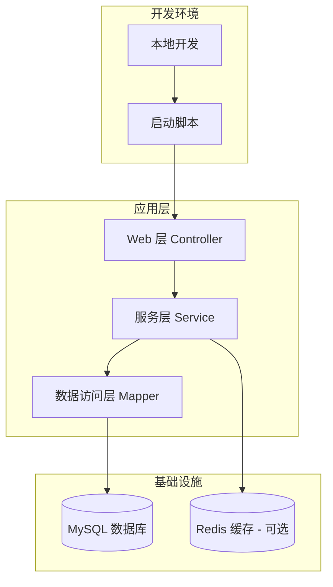
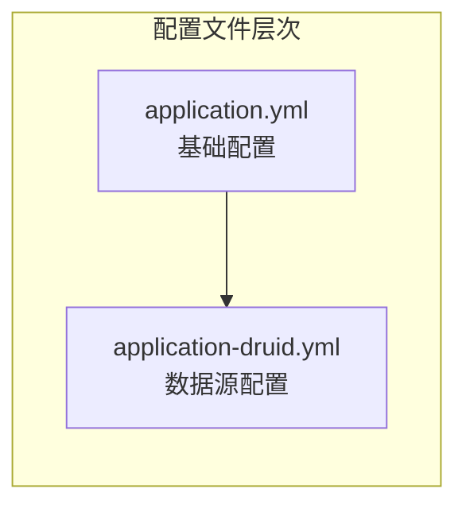

# 部署与运维指南

**本文档中引用的文件**
- [README.md](../../../README.md)
- [RuoYiApplication.java](../../../ruoyi-admin/src/main/java/com/ruoyi/RuoYiApplication.java)
- [application.yml](../../../ruoyi-admin/src/main/resources/application.yml)
- [application-druid.yml](../../../ruoyi-admin/src/main/resources/application-druid.yml)
- [pom.xml](../../../pom.xml)
- [logback.xml](../../../ruoyi-admin/src/main/resources/logback.xml)
- [ry.sh](../../../ry.sh)
- [ry.bat](../../../ry.bat)

## 目录
1. [概述](#概述)
2. [项目架构](#项目架构)
3. [环境配置管理](#环境配置管理)
4. [本地部署](#本地部署)
5. [监控与日志](#监控与日志)
6. [健康检查机制](#健康检查机制)
7. [故障排查指南](#故障排查指南)
8. [运维最佳实践](#运维最佳实践)

## 概述

本指南详细介绍了 RuoYi v4.8.3 的部署与运维流程。该系统是一个基于 Spring Boot 3 开发的轻量级 Java 快速开发框架，支持多环境部署（本地开发、QA 测试、生产环境）。

项目的核心特性包括：
- 基于 Spring Boot 3.5.14 的企业级应用架构 [README.md](../../../README.md)
- 支持 MySQL 数据库和 Druid 连接池的高可用配置
- 完整的 Shiro 2.2.0 权限管理
- 多环境配置管理
- 自动化健康检查和监控

**系统要求**：
- JDK 17+
- MySQL 5.7+
- Maven 3.6+

## 项目架构



**图表来源**
- [项目概述.md](./项目概述.md)
- [application.yml](../../../ruoyi-admin/src/main/resources/application.yml)

## 环境配置管理

### 多环境配置结构

项目采用 Spring Profile 机制管理不同环境配置：



**图表来源**
- [application.yml](../../../ruoyi-admin/src/main/resources/application.yml)
- [application-druid.yml](../../../ruoyi-admin/src/main/resources/application-druid.yml)

### 关键配置项

#### 服务器配置
```yaml
server:
  port: 80
  servlet:
    context-path: /
  tomcat:
    uri-encoding: UTF-8
    accept-count: 1000
    threads:
      max: 800
      min-spare: 100
```

#### 数据库连接配置
```yaml
spring:
  datasource:
    type: com.alibaba.druid.pool.DruidDataSource
    driverClassName: com.mysql.cj.jdbc.Driver
    druid:
      master:
        url: jdbc:mysql://localhost:3306/ry-spring?useUnicode=true&characterEncoding=utf8&zeroDateTimeBehavior=convertToNull&useSSL=true&serverTimezone=GMT%2B8
        username: root
        password: 1234
      initialSize: 5
      minIdle: 10
      maxActive: 20
      maxWait: 60000
      connectTimeout: 30000
      socketTimeout: 60000
```

#### 文件上传配置
```yaml
spring:
  servlet:
    multipart:
      max-file-size: 10MB
      max-request-size: 20MB
```

#### Shiro 安全配置
```yaml
shiro:
  user:
    loginUrl: /login
    unauthorizedUrl: /unauth
    indexUrl: /index
    captchaEnabled: true
    captchaType: math
  session:
    expireTime: 30
    dbSyncPeriod: 1
    validationInterval: 10
    maxSession: -1
  rememberMe:
    enabled: true
```

#### 日志配置
```yaml
logging:
  level:
    com.ruoyi: debug
    org.springframework: warn
```

#### JVM 内存配置（启动脚本）
```bash
JVM_OPTS="-Dname=$AppName -Duser.timezone=Asia/Shanghai 
-Xms512m -Xmx1024m 
-XX:MetaspaceSize=128m -XX:MaxMetaspaceSize=512m 
-XX:+HeapDumpOnOutOfMemoryError 
-XX:+PrintGCDateStamps -XX:+PrintGCDetails 
-XX:NewRatio=1 -XX:SurvivorRatio=30 
-XX:+UseParallelGC -XX:+UseParallelOldGC"
```

**节来源**
- [application.yml](../../../ruoyi-admin/src/main/resources/application.yml)
- [application-druid.yml](../../../ruoyi-admin/src/main/resources/application-druid.yml)
- [ry.sh](../../../ry.sh)

## 本地部署

### 前置准备

1. **安装 JDK 17+**
   ```bash
   java -version
   ```

2. **安装 MySQL 5.7+**
   ```bash
   mysql --version
   ```

3. **创建数据库**
   ```sql
   CREATE DATABASE `ry-spring` DEFAULT CHARACTER SET utf8mb4 COLLATE utf8mb4_general_ci;
   ```

4. **导入初始数据**
   ```bash
   mysql -u root -p ry-spring < sql/ruoyi.sql
   ```

### Maven 构建

```bash
# 清理并打包项目
mvn clean package -DskipTests

# 或者使用项目提供的脚本
bin/package.bat  # Windows
```

### 启动应用

#### Linux/Mac 启动
```bash
# 赋予执行权限
chmod +x ry.sh

# 启动应用
./ry.sh start

# 查看状态
./ry.sh status

# 停止应用
./ry.sh stop

# 重启应用
./ry.sh restart
```

#### Windows 启动
```bat
rem 启动应用
ry.bat start

rem 查看状态
ry.bat status

rem 停止应用
ry.bat stop

rem 重启应用
ry.bat restart
```

#### 直接启动
```bash
# 使用 Java 命令直接启动
java -Duser.timezone=Asia/Shanghai \
     -Xms512m -Xmx1024m \
     -XX:MetaspaceSize=128m -XX:MaxMetaspaceSize=512m \
     -jar ruoyi-admin.jar
```

### 部署验证

1. **访问应用首页**
   ```
   http://localhost:80
   ```

2. **访问 API 文档**
   ```
   http://localhost:80/swagger-ui.html
   ```

3. **访问 Druid 监控台**
   ```
   http://localhost:80/druid/index.html
   用户名：ruoyi
   密码：123456
   ```

**节来源**
- [ry.sh](../../../ry.sh)
- [ry.bat](../../../ry.bat)
- [application.yml](../../../ruoyi-admin/src/main/resources/application.yml)

## 监控与日志

### 日志配置

项目使用 Logback 作为日志框架，配置文件位于 [logback.xml](../../../ruoyi-admin/src/main/resources/logback.xml)：

```xml
<configuration>
    <!-- 日志存放路径 -->
    <property name="log.path" value="/home/ruoyi/logs" />
    
    <!-- 控制台输出 -->
    <appender name="console" class="ch.qos.logback.core.ConsoleAppender">
        <encoder>
            <pattern>%d{HH:mm:ss.SSS} [%thread] %-5level %logger{20} - [%method,%line] - %msg%n</pattern>
        </encoder>
    </appender>
    
    <!-- 系统日志输出 -->
    <appender name="file_info" class="ch.qos.logback.core.rolling.RollingFileAppender">
        <file>${log.path}/sys-info.log</file>
        <rollingPolicy class="ch.qos.logback.core.rolling.TimeBasedRollingPolicy">
            <fileNamePattern>${log.path}/sys-info.%d{yyyy-MM-dd}.log</fileNamePattern>
            <maxHistory>60</maxHistory>
        </rollingPolicy>
    </appender>
    
    <!-- 错误日志输出 -->
    <appender name="file_error" class="ch.qos.logback.core.rolling.RollingFileAppender">
        <file>${log.path}/sys-error.log</file>
        <rollingPolicy class="ch.qos.logback.core.rolling.TimeBasedRollingPolicy">
            <fileNamePattern>${log.path}/sys-error.%d{yyyy-MM-dd}.log</fileNamePattern>
            <maxHistory>60</maxHistory>
        </rollingPolicy>
    </appender>
    
    <!-- 用户操作日志 -->
    <appender name="sys-user" class="ch.qos.logback.core.rolling.RollingFileAppender">
        <file>${log.path}/sys-user.log</file>
        <rollingPolicy class="ch.qos.logback.core.rolling.TimeBasedRollingPolicy">
            <fileNamePattern>${log.path}/sys-user.%d{yyyy-MM-dd}.log</fileNamePattern>
            <maxHistory>60</maxHistory>
        </rollingPolicy>
    </appender>
</configuration>
```

**日志文件说明**：
- `sys-info.log`：系统信息日志（INFO 级别）
- `sys-error.log`：系统错误日志（ERROR 级别）
- `sys-user.log`：用户操作日志

### 监控端点

#### Druid 监控
- **访问地址**：`/druid/index.html`
- **功能**：
  - 数据源监控
  - SQL 执行监控
  - Web 应用监控
  - Spring 应用监控
  - URI 监控
  - Session 监控

#### API 文档
- **访问地址**：`/swagger-ui.html`
- **API 文档 JSON**：`/v3/api-docs`

### 系统监控

系统内置系统监控功能，可监控：
- CPU 使用率
- 内存使用情况
- 磁盘使用情况
- JVM 堆栈信息
- 在线用户状态

**节来源**
- [logback.xml](../../../ruoyi-admin/src/main/resources/logback.xml)
- [application.yml](../../../ruoyi-admin/src/main/resources/application.yml)

## 健康检查机制

### 应用健康检查

#### 启动检查脚本
```bash
#!/bin/bash
# 检查应用是否正常启动
APP_URL="http://localhost:80"
TIMEOUT=300
INTERVAL=10
ELAPSED=0

while [ $ELAPSED -lt $TIMEOUT ]; do
    if curl -f -s -o /dev/null $APP_URL; then
        echo "应用启动成功！"
        exit 0
    fi
    echo "等待应用启动... ($ELAPSED/$TIMEOUT)"
    sleep $INTERVAL
    ELAPSED=$((ELAPSED + INTERVAL))
done

echo "应用启动超时！"
exit 1
```

#### 进程检查
```bash
# 检查应用进程
ps -ef | grep ruoyi-admin.jar | grep -v grep

# 检查端口占用
netstat -tulpn | grep :80
```

### 数据库连接检查

```bash
# 检查 MySQL 服务状态
systemctl status mysqld

# 测试数据库连接
mysql -u root -p -e "SELECT 1 FROM DUAL"

# 检查数据库连接数
mysql -u root -p -e "SHOW STATUS LIKE 'Threads_connected'"
```

### Druid 连接池监控

通过 Druid 监控台查看连接池状态：
- 活跃连接数
- 空闲连接数
- 连接池使用率
- SQL 执行统计
- 慢 SQL 记录（阈值：1000ms）

**节来源**
- [application-druid.yml](../../../ruoyi-admin/src/main/resources/application-druid.yml)
- [ry.sh](../../../ry.sh)

## 故障排查指南

### 常见问题诊断

#### 1. 应用启动失败

**症状**：应用启动后立即退出或报错

**排查步骤**：
```bash
# 查看应用日志
tail -f /home/ruoyi/logs/sys-error.log

# 检查 JVM 参数
ps -ef | grep ruoyi-admin.jar

# 验证数据库连接
mysql -u root -p -e "SHOW DATABASES"

# 检查端口占用
netstat -tulpn | grep :80

# 检查 Java 版本
java -version
```

**常见原因**：
- 数据库连接配置错误
- 端口被占用
- JDK 版本不兼容（需要 JDK 17+）
- 内存不足

#### 2. 数据库连接问题

**症状**：应用无法连接数据库，日志报错

**排查步骤**：
```bash
# 检查 MySQL 服务状态
systemctl status mysqld

# 验证网络连通性
ping localhost

# 检查数据库配置
grep -A 10 "datasource" ruoyi-admin/src/main/resources/application-druid.yml

# 测试数据库连接
mysql -h localhost -u root -p ry-spring

# 检查数据库是否存在
mysql -u root -p -e "SHOW DATABASES LIKE 'ry-spring'"
```

#### 3. 内存不足问题

**症状**：应用频繁崩溃或响应缓慢

**排查步骤**：
```bash
# 检查系统内存
free -h

# 查看 JVM 堆内存使用
jstat -gc <pid> 1000

# 检查容器资源使用（如使用容器）
docker stats <container_name>

# 查看 GC 日志
grep "GC" /home/ruoyi/logs/sys-info.log
```

**解决方案**：
- 调整 JVM 启动参数中的 `-Xms` 和 `-Xmx` 值
- 优化代码中的内存使用
- 增加系统物理内存

#### 4. 日志文件过大

**症状**：磁盘空间不足

**排查步骤**：
```bash
# 检查日志文件大小
ls -lh /home/ruoyi/logs/

# 查看磁盘使用
df -h

# 清理旧日志
find /home/ruoyi/logs -name "*.log" -mtime +30 -delete
```

### 性能优化建议

#### JVM 参数调优
```bash
# 生产环境推荐配置
-Xms1024m -Xmx2048m 
-XX:MetaspaceSize=256m -XX:MaxMetaspaceSize=512m
-XX:+UseG1GC -XX:+UseStringDeduplication
-XX:ConcGCThreads=4 -XX:ParallelGCThreads=8
-XX:InitiatingHeapOccupancyPercent=45
-XX:G1ReservePercent=10 -XX:+AlwaysPreTouch
-Dfile.encoding=UTF-8
```

#### 数据库连接池优化
```yaml
spring:
  datasource:
    druid:
      initialSize: 10
      minIdle: 20
      maxActive: 50
      maxWait: 30000
      timeBetweenEvictionRunsMillis: 30000
      minEvictableIdleTimeMillis: 300000
      maxEvictableIdleTimeMillis: 900000
```

## 运维最佳实践

### 1. 部署前准备

#### 环境检查清单
- [ ] JDK 17+ 已安装并配置 JAVA_HOME
- [ ] MySQL 5.7+ 数据库服务正常运行
- [ ] 数据库 `ry-spring` 已创建并导入初始数据
- [ ] 磁盘空间充足（至少 5GB）
- [ ] 应用端口 80 未被占用
- [ ] 日志目录有写入权限

#### 配置验证
```bash
# 验证 Java 版本
java -version

# 验证数据库连接
mysql -u root -p -e "SELECT 1"

# 检查端口占用
netstat -tulpn | grep :80

# 检查磁盘空间
df -h
```

### 2. 监控告警配置

#### 关键指标监控
- CPU 使用率 > 80%
- 内存使用率 > 85%
- 磁盘使用率 > 90%
- 数据库连接数 > 40（最大连接数的 80%）
- 应用响应时间 > 3 秒

#### 监控脚本示例
```bash
#!/bin/bash
# monitor.sh - 系统监控脚本

LOG_FILE="/var/log/ruoyi_monitor.log"
ALERT_EMAIL="admin@example.com"

# 检查应用进程
if ! pgrep -f "ruoyi-admin.jar" > /dev/null; then
    echo "$(date): 应用进程异常" >> $LOG_FILE
    # 发送邮件告警
    echo "RuoYi 应用进程已停止" | mail -s "告警：应用异常" $ALERT_EMAIL
fi

# 检查磁盘空间
DISK_USAGE=$(df -h / | awk 'NR==2 {print $5}' | sed 's/%//')
if [ $DISK_USAGE -gt 90 ]; then
    echo "$(date): 磁盘使用率过高：${DISK_USAGE}%" >> $LOG_FILE
fi

# 检查内存使用
MEM_USAGE=$(free | grep Mem | awk '{printf("%.0f", $3/$2*100)}')
if [ $MEM_USAGE -gt 85 ]; then
    echo "$(date): 内存使用率过高：${MEM_USAGE}%" >> $LOG_FILE
fi
```

### 3. 日常维护任务

#### 定期任务清单
- [ ] 每日检查应用健康状态
- [ ] 每日查看错误日志
- [ ] 每周清理过期日志（保留 60 天）
- [ ] 每月备份数据库
- [ ] 每季度评估系统性能
- [ ] 每年进行灾难恢复演练

#### 数据库备份脚本
```bash
#!/bin/bash
# backup.sh - 数据库备份脚本

BACKUP_DIR="/backup/mysql"
DATE=$(date +%Y%m%d_%H%M%S)
DB_NAME="ry-spring"
DB_USER="root"
DB_PASS="your_password"

# 创建备份目录
mkdir -p $BACKUP_DIR

# 执行备份
mysqldump -u$DB_USER -p$DB_PASS $DB_NAME > $BACKUP_DIR/${DB_NAME}_${DATE}.sql

# 压缩备份文件
gzip $BACKUP_DIR/${DB_NAME}_${DATE}.sql

# 删除 30 天前的备份
find $BACKUP_DIR -name "*.sql.gz" -mtime +30 -delete

echo "备份完成：${DB_NAME}_${DATE}.sql.gz"
```

#### 日志清理脚本
```bash
#!/bin/bash
# clean_logs.sh - 日志清理脚本

LOG_DIR="/home/ruoyi/logs"
RETENTION_DAYS=60

# 清理过期日志
find $LOG_DIR -name "*.log" -mtime +$RETENTION_DAYS -delete

# 压缩旧日志
find $LOG_DIR -name "*.log" -mtime +7 -exec gzip {} \;

echo "日志清理完成"
```

### 4. 安全加固措施

#### 网络安全
- 使用防火墙限制访问端口
- 启用 HTTPS 加密通信
- 实施 API 限流保护
- 定期更新安全补丁

#### 访问控制
- 修改默认管理员密码
- 实施多因素认证
- 定期轮换密钥
- 监控异常访问行为

#### 数据库安全
```yaml
# 修改默认数据库密码
# application-druid.yml
spring:
  datasource:
    druid:
      master:
        password: <强密码>
      statViewServlet:
        login-username: <自定义用户名>
        login-password: <强密码>
```

### 5. 故障恢复流程

#### 应急响应流程
1. **故障发现**：监控告警触发或用户报告
2. **影响评估**：确定故障范围和影响程度
3. **应急处理**：快速恢复服务（重启、回滚等）
4. **根因分析**：深入调查原因
5. **预防措施**：制定改进方案

#### 应用回滚
```bash
# 停止当前应用
./ry.sh stop

# 备份当前版本
cp ruoyi-admin.jar ruoyi-admin.jar.backup.$(date +%Y%m%d)

# 恢复上一版本
cp ruoyi-admin.jar.previous ruoyi-admin.jar

# 启动应用
./ry.sh start

# 验证启动
./ry.sh status
```

#### 数据恢复
```bash
# 恢复数据库备份
mysql -u root -p ry-spring < /backup/mysql/ry-spring_20260101_120000.sql.gz

# 重启应用服务
./ry.sh restart
```

### 5. 生产发布与回滚流程

#### 5.1 发布前准备
- 确认发布版本号和构建产物来源
- 确认配置文件已经切换到生产环境配置
- 备份当前生产 `ruoyi-admin.jar` 和关键配置文件
- 备份数据库快照，记录备份文件名与发布时间
- 通知相关团队上线时间与回滚预案

#### 5.2 发布步骤
1. 停止当前生产服务：`./ry.sh stop` 或 `ry.bat stop`
2. 备份当前运行包：
   ```bash
   cp ruoyi-admin.jar ruoyi-admin.jar.backup.$(date +%Y%m%d_%H%M%S)
   ```
3. 部署新版本：
   ```bash
   cp /deploy/ruoyi-admin.jar ./ruoyi-admin.jar
   ```
4. 启动新版本：
   ```bash
   ./ry.sh start
   ```
5. 验证应用是否启动成功：
   ```bash
   ./ry.sh status
   ```
6. 验证关键接口与页面：
   - 首页 `/`
   - Swagger `/swagger-ui.html`
   - 登录 `/login`
   - 管理页面 `/system/user`
   - Druid 监控 `/druid/index.html`

#### 5.3 回滚步骤
1. 若发布失败或出现严重故障，立即停止当前服务：`./ry.sh stop`
2. 恢复上一个备份版本：
   ```bash
   cp ruoyi-admin.jar.backup.<timestamp> ruoyi-admin.jar
   ```
3. 启动旧版本：
   ```bash
   ./ry.sh start
   ```
4. 若需要恢复数据库数据：
   ```bash
   mysql -u root -p ry-spring < /backup/mysql/ry-spring_<timestamp>.sql.gz
   ```
5. 验证回滚后服务是否恢复正常，并通知团队。

#### 5.4 发布后验证
- 验证服务正常启动，日志无 ERROR/EXCEPTION
- 验证登录、权限、菜单、用户管理等核心流程正常
- 验证监控页面、Druid 连接池、性能指标正常
- 监控错误日志和应用响应时间

### 6. 部署检查清单

#### 开发环境
- [ ] 数据库连接配置正确
- [ ] 应用成功启动
- [ ] 能够访问首页和 API 文档
- [ ] 日志正常输出

#### 生产环境
- [ ] 使用生产环境配置
- [ ] 数据库使用强密码
- [ ] 启用 HTTPS
- [ ] 配置防火墙规则
- [ ] 设置监控告警
- [ ] 配置日志轮转
- [ ] 准备应急预案

---

通过遵循这些最佳实践和故障排查指南，运维团队可以确保 RuoYi 系统的稳定运行和快速故障恢复。定期的维护和监控是保障系统可靠性的关键。

**节来源**
- [ry.sh](../../../ry.sh)
- [application.yml](../../../ruoyi-admin/src/main/resources/application.yml)
- [application-druid.yml](../../../ruoyi-admin/src/main/resources/application-druid.yml)
- [logback.xml](../../../ruoyi-admin/src/main/resources/logback.xml)
