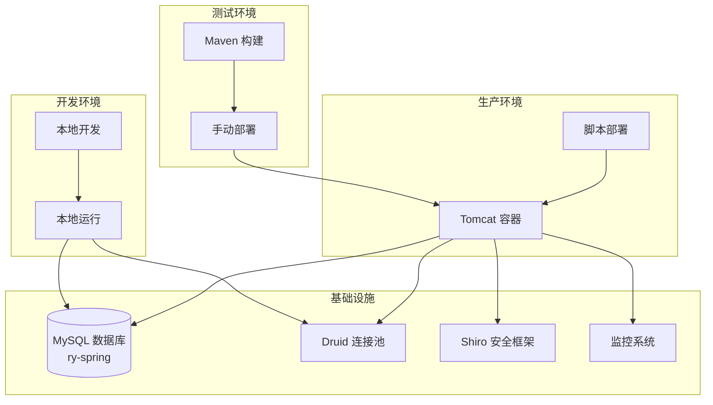
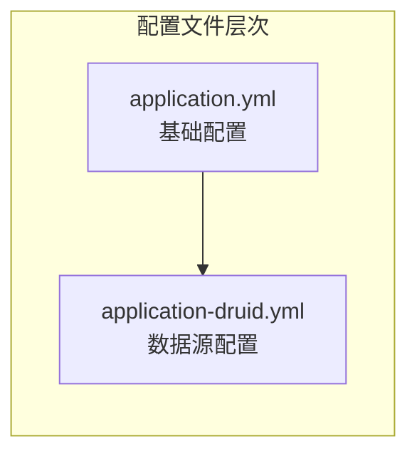

# 部署与运维指南

**本文档中引用的文件**
- [README.md](../../RuoYi-Vue/README.md)
- [application.yml](../../RuoYi-Vue/ruoyi-admin/src/main/resources/application.yml)
- [application-druid.yml](../../RuoYi-Vue/ruoyi-admin/src/main/resources/application-druid.yml)
- [logback.xml](../../RuoYi-Vue/ruoyi-admin/src/main/resources/logback.xml)
- [RuoYiApplication.java](../../RuoYi-Vue/ruoyi-admin/src/main/java/com/ruoyi/RuoYiApplication.java)
- [ry.sh](../../RuoYi-Vue/ry.sh)
- [ry.bat](../../RuoYi-Vue/ry.bat)
- [pom.xml](../../RuoYi-Vue/pom.xml)

## 目录
1. [概述](#概述)
2. [项目架构](#项目架构)
3. [Docker 容器化部署](#docker 容器化部署)
4. [Jenkins 持续集成](#jenkins 持续集成)
5. [Ansible 自动化部署](#ansible 自动化部署)
6. [环境配置管理](#环境配置管理)
7. [监控与日志](#监控与日志)
8. [健康检查机制](#健康检查机制)
9. [故障排查指南](#故障排查指南)
10. [运维最佳实践](#运维最佳实践)

## 概述

本指南详细介绍了 RuoYi v4.8.3 的部署与运维流程。该系统采用 Spring Boot 3.5.14 + JDK 17 构建，支持多环境部署（本地开发、QA 测试、生产环境），基于 MySQL 数据库和 Druid 连接池，集成了 Shiro 安全框架、Thymeleaf 模板引擎、SpringDoc API 文档等核心组件。

项目的核心特性包括：
- 基于 Spring Boot 3.5.14 的企业级应用架构
- 支持 MySQL 数据库和 EhCache 缓存的高可用配置
- 完整的部署脚本支持（Linux/Windows）
- 多环境配置管理（application.yml + application-druid.yml）
- 完整的日志记录和健康检查机制

## 项目架构



**图表来源**
- [README.md](../../RuoYi-Vue/README.md)
- [application.yml](../../RuoYi-Vue/ruoyi-admin/src/main/resources/application.yml)

## Docker 容器化部署

### Docker 镜像构建

项目当前未提供标准 Dockerfile，但可基于以下模板进行容器化：

```dockerfile
FROM openjdk:17-slim
MAINTAINER RuoYi
WORKDIR /app
ENV PORT 80

COPY ruoyi-admin/target/ruoyi-admin.jar app.jar
ENTRYPOINT java ${JAVA_OPTS} -Djava.security.egd=file:/dev/urandom -jar app.jar
```

**关键特性：**
- 基于官方 OpenJDK 17 镜像
- 设置默认端口 80
- 包含必要的 Java 安全配置
- 支持环境变量 JAVA_OPTS 自定义

### Docker Compose 配置

项目当前未提供 Docker Compose 配置文件，但可使用以下基础配置：

```yaml
version: '3'
services:
  db:
    image: mysql:8.0
    tmpfs: /var/lib/mysql:rw
    command: ['--character-set-server=utf8mb4', '--collation-server=utf8mb4_unicode_ci']
    environment:
      - MYSQL_ROOT_PASSWORD=1234
      - MYSQL_DATABASE=ry-spring
    ports:
      - "3306:3306"

  app:
    image: ruoyi-admin:4.8.3
    depends_on:
      - db
    environment:
      - SPRING_DATASOURCE_URL=jdbc:mysql://db:3306/ry-spring
      - SPRING_DATASOURCE_USERNAME=root
      - SPRING_DATASOURCE_PASSWORD=1234
    ports:
      - "80:80"
```

## Jenkins 持续集成

### Jenkins Pipeline 配置

项目当前未提供 Jenkins Pipeline 配置，但可基于以下 Groovy 脚本定义 CI/CD 流水线：

```groovy
pipeline {
    agent any
    stages {
        stage('检出源码') {
            steps {
                git branch: 'main', url: 'https://github.com/ChenLiyan-GT/RuoYi-Vue.git'
            }
        }
        stage('构建项目') {
            steps {
                sh 'mvn clean package -DskipTests -B'
            }
        }
        stage('依赖检查') {
            steps {
                sh 'mvn dependency:tree'
            }
        }
        stage('构建 Docker 镜像') {
            steps {
                sh 'docker build -t ruoyi-admin:4.8.3 .'
            }
        }
        stage('部署到开发环境') {
            steps {
                sh 'docker-compose up -d'
            }
        }
    }
}
```

### 关键阶段说明

#### 1. 源码检出
```groovy
checkout([$class: 'GitSCM', branches: [[name: 'main']],
          userRemoteConfigs: [[url: 'https://github.com/ChenLiyan-GT/RuoYi-Vue.git']]])
```

#### 2. Maven 构建
```bash
mvn clean package -DskipTests -B
```

#### 3. 构建产物
构建完成后生成 `ruoyi-admin/target/ruoyi-admin.jar` 可执行 JAR 文件。

**节来源**
- [pom.xml](../../RuoYi-Vue/pom.xml)

## Ansible 自动化部署

### 主要部署脚本

项目当前未提供 Ansible Playbook，但可使用以下配置实现自动化部署：

```yaml
---
- hosts: "{{ server }}"
  tasks:
    - name: pull image
      command: docker pull ruoyi-admin:4.8.3
      become: true

    - name: kill old container
      docker_container:
        name: ruoyi-admin
        state: absent
      become: true

    - name: start new container
      docker_container:
        name: ruoyi-admin
        image: ruoyi-admin:4.8.3
        restart_policy: always
        env:
          SPRING_PROFILES_ACTIVE: "{{ env }}"
          TZ: "Asia/Shanghai"
          JAVA_OPTS: "{{ java_opts }}"
        ports:
           - "{{ port }}:80"
      become: true
```

### 部署参数配置

#### 变量定义
- `server`: 目标服务器标识（dev/staging/prod）
- `image`: Docker 镜像名称和版本（ruoyi-admin:4.8.3）
- `name`: 容器名称（ruoyi-admin）
- `port`: 外部访问端口（默认 80）
- `env`: Spring Profile 环境配置
- `java_opts`: JVM 启动参数

## 环境配置管理

### 多环境配置结构

项目采用 Spring Profile 机制管理不同环境配置：



**图表来源**
- [application.yml](../../RuoYi-Vue/ruoyi-admin/src/main/resources/application.yml)
- [application-druid.yml](../../RuoYi-Vue/ruoyi-admin/src/main/resources/application-druid.yml)

### 关键配置项

#### 项目相关配置
```yaml
ruoyi:
  name: RuoYi
  version: 4.8.3
  copyrightYear: 2026
  demoEnabled: true
  profile: D:/giencoder/RuoYi-springboot3
  addressEnabled: false
```

#### 服务器配置
```yaml
server:
  port: 80
  servlet:
    context-path: /
  tomcat:
    uri-encoding: UTF-8
    accept-count: 1000
    threads:
      max: 800
      min-spare: 100
```

#### 数据库连接配置
```yaml
spring:
  datasource:
    type: com.alibaba.druid.pool.DruidDataSource
    driverClassName: com.mysql.cj.jdbc.Driver
    druid:
      master:
        url: jdbc:mysql://localhost:3306/ry-spring?useUnicode=true&characterEncoding=utf8&zeroDateTimeBehavior=convertToNull&useSSL=true&serverTimezone=GMT%2B8
        username: root
        password: ***
      initialSize: 5
      minIdle: 10
      maxActive: 20
      maxWait: 60000
```

> 注：生产环境请修改密码并妥善保管。

#### Druid 监控配置
```yaml
druid:
  statViewServlet:
    enabled: true
    url-pattern: /druid/*
    login-username: ruoyi
    login-password: ***
```

#### SpringDoc 配置
```yaml
springdoc:
  api-docs:
    path: /v3/api-docs
  swagger-ui:
    enabled: true
    path: /swagger-ui.html
```

#### JVM 内存配置
生产环境推荐配置（来自 `ry.sh`/`ry.bat`）：
```bash
-Xms512m -Xmx1024m -XX:MetaspaceSize=128m -XX:MaxMetaspaceSize=512m 
-XX:+HeapDumpOnOutOfMemoryError -XX:+PrintGCDateStamps -XX:+PrintGCDetails 
-XX:NewRatio=1 -XX:SurvivorRatio=30 -XX:+UseParallelGC -XX:+UseParallelOldGC 
-Duser.timezone=Asia/Shanghai
```

**节来源**
- [application.yml](../../RuoYi-Vue/ruoyi-admin/src/main/resources/application.yml)
- [application-druid.yml](../../RuoYi-Vue/ruoyi-admin/src/main/resources/application-druid.yml)

## 监控与日志

### 日志配置

项目使用 Logback 作为日志框架，配置如下：

```xml
<configuration>
    <!-- 日志存放路径 -->
    <property name="log.path" value="/home/ruoyi/logs" />
    <!-- 日志输出格式 -->
    <property name="log.pattern" value="%d{HH:mm:ss.SSS} [%thread] %-5level %logger{20} - [%method,%line] - %msg%n" />

    <!-- 控制台输出 -->
    <appender name="console" class="ch.qos.logback.core.ConsoleAppender">
        <encoder>
            <pattern>${log.pattern}</pattern>
        </encoder>
    </appender>
    
    <!-- 系统日志输出 -->
    <appender name="file_info" class="ch.qos.logback.core.rolling.RollingFileAppender">
        <file>${log.path}/sys-info.log</file>
        <rollingPolicy class="ch.qos.logback.core.rolling.TimeBasedRollingPolicy">
            <fileNamePattern>${log.path}/sys-info.%d{yyyy-MM-dd}.log</fileNamePattern>
            <maxHistory>60</maxHistory>
        </rollingPolicy>
        <encoder>
            <pattern>${log.pattern}</pattern>
        </encoder>
        <filter class="ch.qos.logback.classic.filter.LevelFilter">
            <level>INFO</level>
            <onMatch>ACCEPT</onMatch>
            <onMismatch>DENY</onMismatch>
        </filter>
    </appender>
    
    <appender name="file_error" class="ch.qos.logback.core.rolling.RollingFileAppender">
        <file>${log.path}/sys-error.log</file>
        <rollingPolicy class="ch.qos.logback.core.rolling.TimeBasedRollingPolicy">
            <fileNamePattern>${log.path}/sys-error.%d{yyyy-MM-dd}.log</fileNamePattern>
            <maxHistory>60</maxHistory>
        </rollingPolicy>
        <encoder>
            <pattern>${log.pattern}</pattern>
        </encoder>
        <filter class="ch.qos.logback.classic.filter.LevelFilter">
            <level>ERROR</level>
            <onMatch>ACCEPT</onMatch>
            <onMismatch>DENY</onMismatch>
        </filter>
    </appender>
    
    <!-- 用户访问日志输出 -->
    <appender name="sys-user" class="ch.qos.logback.core.rolling.RollingFileAppender">
        <file>${log.path}/sys-user.log</file>
        <rollingPolicy class="ch.qos.logback.core.rolling.TimeBasedRollingPolicy">
            <fileNamePattern>${log.path}/sys-user.%d{yyyy-MM-dd}.log</fileNamePattern>
            <maxHistory>60</maxHistory>
        </rollingPolicy>
        <encoder>
            <pattern>${log.pattern}</pattern>
        </encoder>
    </appender>
    
    <!-- 日志级别控制 -->
    <logger name="com.ruoyi" level="info" />
    <logger name="org.springframework" level="warn" />
    <logger name="org.thymeleaf" level="error"/>
    <logger name="org.springdoc" level="error" />

    <root level="info">
        <appender-ref ref="console" />
    </root>
    
    <!--系统操作日志-->
    <root level="info">
        <appender-ref ref="file_info" />
        <appender-ref ref="file_error" />
    </root>
    
    <!--系统用户操作日志-->
    <logger name="sys-user" level="info">
        <appender-ref ref="sys-user"/>
    </logger>
</configuration>
```

**日志文件分类：**
- `sys-info.log` - 系统 INFO 级别日志
- `sys-error.log` - 系统 ERROR 级别日志
- `sys-user.log` - 用户操作日志

**日志保留策略：**
- 日志保留 60 天
- 按天滚动
- 支持异步输出

**节来源**
- [logback.xml](../../RuoYi-Vue/ruoyi-admin/src/main/resources/logback.xml)

### Actuator 监控端点

项目当前未显式启用 Spring Boot Actuator，但可通过添加依赖并配置以下方式启用监控：

```yaml
management:
  endpoints:
    web:
      exposure:
        include: health,info,metrics,env
  server:
    port: 8081
```

**关键监控端点：**
- `/actuator/health` - 健康状态检查
- `/actuator/info` - 应用信息
- `/actuator/metrics` - 性能指标
- `/actuator/env` - 环境变量

### Druid 监控

项目集成了 Druid 连接池监控，访问地址：`/druid/*`

- 登录用户名：`ruoyi`
- 登录密码：`123456`（生产环境请修改）

监控功能包括：
- 数据源监控
- SQL 监控
- Web 监控
- URI 监控
- Spring 监控
- 慢 SQL 记录（阈值 1000ms）

## 健康检查机制

### HTTP 健康检查

可通过访问以下端点进行健康检查：

- 应用首页：`http://localhost:80/`
- 登录页面：`http://localhost:80/login`
- Swagger 文档：`http://localhost:80/swagger-ui.html`
- Druid 监控：`http://localhost:80/druid/`

### 启动检查脚本

#### Linux 环境（ry.sh）
```bash
#!/bin/sh
AppName=ruoyi-admin.jar

function status()
{
    PID=`ps -ef |grep java|grep $AppName|grep -v grep|wc -l`
    if [ $PID != 0 ];then
        echo "$AppName is running..."
    else
        echo "$AppName is not running..."
    fi
}
```

#### Windows 环境（ry.bat）
```batch
:status
	for /f "usebackq tokens=1-2" %%a in (`jps -l ^| findstr %AppName%`) do (
		set pid=%%a
		set image_name=%%b
	)
	if not defined pid (echo process %AppName% is dead ) else (
		echo %image_name% is running
	)
```

### 健康检查配置

若使用 Ansible 部署，可配置以下健康检查：

```yaml
- name: check server health
  uri:
    url: "http://127.0.0.1:80/login"
    status_code: 200
    timeout: 30
  register: result
  retries: 3
  delay: 10
```

## 故障排查指南

### 常见问题诊断

#### 1. 应用启动失败

**症状**: 应用启动后立即退出

**排查步骤**:
```bash
# 查看控制台日志
tail -f logs/ruoyi-admin.jar.log

# 检查 JVM 进程
jps -l | grep ruoyi-admin

# 验证数据库连接
mysql -h localhost -u root -p -e "USE ry-spring; SELECT 1;"
```

**常见原因**:
- 数据库连接失败
- 端口被占用
- JDK 版本不匹配（需要 JDK 17+）

#### 2. 数据库连接问题

**症状**: 应用无法连接数据库

**排查步骤**:
```bash
# 检查数据库服务状态
systemctl status mysqld

# 验证网络连通性
ping localhost
telnet localhost 3306

# 检查数据库配置
grep -A 10 "datasource" application-druid.yml
```

#### 3. 内存不足问题

**症状**: 应用频繁崩溃或 Full GC

**排查步骤**:
```bash
# 检查 JVM 堆内存使用
jstat -gc <pid> 1000

# 查看系统内存
free -h

# 生成堆转储
jmap -dump:format=b,file=heap.hprof <pid>
```

#### 4. 日志文件过大

**症状**: 磁盘空间不足

**排查步骤**:
```bash
# 查看日志文件大小
ls -lh /home/ruoyi/logs/

# 清理旧日志
find /home/ruoyi/logs/ -name "*.log" -mtime +7 -delete

# 压缩历史日志
find /home/ruoyi/logs/ -name "*.log" -mtime +1 -exec gzip {} \;
```

### 性能优化建议

#### JVM 参数调优
生产环境推荐配置：
```bash
-Xms512m -Xmx1024m -XX:MetaspaceSize=128m -XX:MaxMetaspaceSize=512m 
-XX:+HeapDumpOnOutOfMemoryError -XX:+UseParallelGC -XX:+UseParallelOldGC
```

#### 数据库连接池优化
```yaml
spring:
  datasource:
    druid:
      initialSize: 5
      minIdle: 10
      maxActive: 20
      maxWait: 60000
      timeBetweenEvictionRunsMillis: 60000
      minEvictableIdleTimeMillis: 300000
```

## 运维最佳实践

### 1. 部署前准备

#### 环境检查清单
- [x] JDK 17+ 已安装并配置 JAVA_HOME
- [x] Maven 3.6+ 已安装
- [x] MySQL 5.7+/8.0+ 数据库服务正常
- [x] 磁盘空间充足（至少 2GB）
- [x] 应用端口 80 未被占用

#### 配置验证
```bash
# 验证 JDK 版本
java -version

# 验证 Maven 版本
mvn -version

# 检查端口占用
netstat -tulpn | grep :80
```

### 2. 构建与部署

#### 本地构建
```bash
# 编译项目
mvn clean compile

# 打包项目（跳过测试）
mvn clean package -DskipTests -B

# 查看依赖树
mvn dependency:tree
```

#### 启动应用
```bash
# Linux 环境
nohup java -Xms512m -Xmx1024m -jar ruoyi-admin.jar > logs/app.log 2>&1 &

# Windows 环境
start javaw -Xms512m -Xmx1024m -jar ruoyi-admin.jar
```

#### 使用部署脚本
```bash
# Linux
./ry.sh start
./ry.sh stop
./ry.sh restart
./ry.sh status

# Windows
ry.bat
```

### 3. 监控告警配置

#### 关键指标监控
- CPU 使用率 > 80%
- 内存使用率 > 85%
- 磁盘使用率 > 90%
- 数据库连接数 > 80%
- 慢 SQL 数量 > 10/分钟

#### 日志监控
- ERROR 日志数量突增
- 异常堆栈频繁出现
- 数据库连接失败日志

### 4. 日常维护任务

#### 每日检查清单
- [ ] 检查应用健康状态（访问/login）
- [ ] 查看 ERROR 日志
- [ ] 检查 Druid 监控面板
- [ ] 验证数据库备份

#### 每周维护任务
- [ ] 清理 7 天前的日志
- [ ] 分析慢 SQL
- [ ] 检查系统资源使用趋势

#### 每月维护任务
- [ ] 数据库性能分析
- [ ] 应用性能评估
- [ ] 安全补丁更新

### 5. 安全加固措施

#### 网络安全
- 使用防火墙限制访问端口
- 启用 HTTPS 加密通信
- 配置 CSRF 白名单

#### 访问控制
- 修改默认密码（数据库/Druid）
- 定期轮换密钥
- 限制敏感接口访问

#### 数据安全
```yaml
# 密码加密（Shiro MD5+salt）
# 密码错误 5 次锁定 10 分钟
user:
  password:
    maxRetryCount: 5

# XSS 过滤
xss:
  enabled: true
  urlPatterns: /system/*,/monitor/*,/tool/*
```

### 6. 故障恢复流程

#### 应急响应流程
1. **故障发现**: 监控告警触发或用户反馈
2. **影响评估**: 确定故障范围（单点/全局）
3. **应急处理**: 快速恢复服务（重启/回滚）
4. **根因分析**: 深入调查原因
5. **预防措施**: 制定改进方案

#### 回滚操作
```bash
# 停止当前应用
./ry.sh stop

# 备份当前版本
cp ruoyi-admin.jar ruoyi-admin.jar.bak.$(date +%Y%m%d)

# 恢复上一版本
cp ruoyi-admin.jar.previous ruoyi-admin.jar

# 重启应用
./ry.sh start
```

#### 数据恢复
```bash
# 恢复数据库备份
mysql -u root -p ry-spring < backup.sql

# 重启应用服务
./ry.sh restart
```

通过遵循这些最佳实践和故障排查指南，运维团队可以确保系统的稳定运行和快速故障恢复。定期的维护和监控是保障系统可靠性的关键。

**节来源**
- [ry.sh](../../RuoYi-Vue/ry.sh)
- [ry.bat](../../RuoYi-Vue/ry.bat)
- [application.yml](../../RuoYi-Vue/ruoyi-admin/src/main/resources/application.yml)
- [application-druid.yml](../../RuoYi-Vue/ruoyi-admin/src/main/resources/application-druid.yml)
