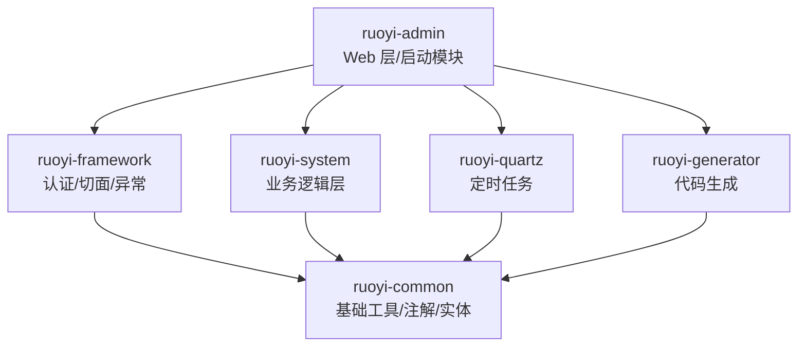

# 项目概述

**本文档引用的文件**
- [README.md](../../README.md)
- [RuoYiApplication.java](../../ruoyi-admin/src/main/java/com/ruoyi/RuoYiApplication.java)(L1-L28)
- [application.yml](../../ruoyi-admin/src/main/resources/application.yml)(L1-L154)
- [pom.xml](../../pom.xml)(L1-L269)
- [AGENTS.md](.gientech/AGENTS.md)

## 目录
1. [简介](#简介)
2. [项目结构](#项目结构)
3. [核心组件](#核心组件)
4. [架构概述](#架构概述)
5. [详细组件分析](#详细组件分析)
6. [依赖分析](#依赖分析)
7. [性能考虑](#性能考虑)
8. [故障排除指南](#故障排除指南)
9. [结论](#结论)

## 简介

- **项目名称**：RuoYi v4.8.3
- **项目定位**：基于 Spring Boot 3 开发的轻量级 Java 快速开发框架，可用于所有的 Web 应用程序，如网站管理后台、网站会员中心、CMS、CRM、OA 等
- **核心特性**：
  1. 用户管理、部门管理、岗位管理、菜单管理、角色管理
  2. 字典管理、参数管理、通知公告、操作日志、登录日志
  3. 在线用户监控、定时任务调度、代码生成、系统接口文档
  4. 服务监控、缓存监控、在线构建器、连接池监视
- **技术栈**：
  - 后端：Spring Boot 3.5.14、JDK 17+、Apache Shiro 2.2.0、MyBatis 3.0.5
  - 数据库：MySQL 5.7+/8.0+、Druid 1.2.28 连接池
  - 前端：Thymeleaf 模板引擎、Hplus 后台主题 UI 框架
  - 其他：PageHelper 分页、FastJSON、Velocity 代码生成、SpringDoc 接口文档、EhCache 缓存

来源：[README.md](../../README.md)、[pom.xml](../../pom.xml)、[AGENTS.md](.gientech/AGENTS.md)

## 项目结构



**模块说明**：

| 模块 | 职责 | 依赖关系 |
|------|------|----------|
| ruoyi-common | 注解/常量/异常/工具类/基础实体（最底层，无内部依赖） | 无 |
| ruoyi-system | 业务 domain/mapper/service + Work 扩展（9 个领域模型） | → common |
| ruoyi-framework | Shiro 认证/AOP 切面/拦截器/全局异常/配置 | → system → common |
| ruoyi-admin | Controller + 启动类 + 模板 + 配置（唯一可独立运行模块） | → framework → system → common |
| ruoyi-quartz | 定时任务调度 | → common |
| ruoyi-generator | 代码生成 | → common |

来源：[pom.xml](../../pom.xml)、[AGENTS.md](.gientech/AGENTS.md)

## 核心组件

- **用户认证模块** — 负责用户登录、权限校验、会话管理。来源：[ruoyi-framework/shiro/](../../ruoyi-framework/src/main/java/com/ruoyi/framework/shiro/)、[ruoyi-admin/controller/system/SysLoginController.java](../../ruoyi-admin/src/main/java/com/ruoyi/web/controller/system/SysLoginController.java)
- **系统管理模块** — 用户、部门、角色、菜单、岗位、字典、参数等核心业务管理。来源：[ruoyi-admin/controller/system/](../../ruoyi-admin/src/main/java/com/ruoyi/web/controller/system/)、[ruoyi-system/domain/](../../ruoyi-system/src/main/java/com/ruoyi/system/domain/)
- **监控模块** — 在线用户、登录日志、操作日志、服务器监控、Druid 连接池监控。来源：[ruoyi-admin/controller/monitor/](../../ruoyi-admin/src/main/java/com/ruoyi/web/controller/monitor/)
- **代码生成模块** — 前后端代码生成（Java、HTML、XML、SQL），支持 CRUD 下载。来源：[ruoyi-generator](../../ruoyi-generator/)
- **定时任务模块** — 在线添加、修改、删除任务调度，包含执行结果日志。来源：[ruoyi-quartz](../../ruoyi-quartz/)
- **Work 扩展模块** — 9 个领域模型扩展（员工、岗位、任务、阶段等）。来源：[ruoyi-system/work/](../../ruoyi-system/src/main/java/com/ruoyi/system/work/)

## 架构概述

```mermaid
graph LR
  Client[客户端] --> Shiro[Shiro Filter Chain]
  Shiro --> Controller[Controller 层<br/>ruoyi-admin]
  Controller --> Service[Service 层<br/>ruoyi-system]
  Service --> Mapper[Mapper 层<br/>MyBatis XML]
  Mapper --> MySQL[(MySQL 数据库)]
  
  Controller -.-> AsyncLog[异步日志<br/>AsyncManager]
  Service -.-> DataScope[数据权限<br/>@DataScope]
  
  subgraph 横切关注点
    Shiro
    AsyncLog
    DataScope
    GlobalException[全局异常处理]
  end
```

**请求流程**：
1. HTTP 请求进入 Shiro Filter Chain（验证码、会话、CSRF 校验）
2. 到达 Controller（继承 BaseController）
3. Service 层处理业务（@Log 异步记录日志、@DataScope 数据权限控制）
4. Mapper 层通过 MyBatis XML 访问数据库
5. 返回 AjaxResult 或 TableDataInfo 响应

来源：[AGENTS.md](.gientech/AGENTS.md)

## 详细组件分析

### 用户管理
- **职责**：用户认证、资料管理、权限分配
- **核心类**：
  - `SysUserController` — 用户 CRUD 操作
  - `SysUser` — 用户实体（继承 BaseEntity）
  - `SysRole` — 角色实体
- **来源**：[SysUserController.java](../../ruoyi-admin/src/main/java/com/ruoyi/web/controller/system/SysUserController.java)、[ruoyi-system/domain/](../../ruoyi-system/src/main/java/com/ruoyi/system/domain/)

### 部门管理
- **职责**：组织机构配置（公司、部门、小组），树结构展现，支持数据权限
- **核心类**：
  - `SysDeptController` — 部门管理
  - `SysDept` — 部门实体（继承 TreeEntity，含 parentId/ancestors/orderNum）
- **来源**：[SysDeptController.java](../../ruoyi-admin/src/main/java/com/ruoyi/web/controller/system/SysDeptController.java)

### 菜单管理
- **职责**：系统菜单配置、操作权限、按钮权限标识
- **核心类**：
  - `SysMenuController` — 菜单管理
  - `SysMenu` — 菜单实体（继承 TreeEntity）
- **来源**：[SysMenuController.java](../../ruoyi-admin/src/main/java/com/ruoyi/web/controller/system/SysMenuController.java)

### Work 扩展模块
- **职责**：员工管理、任务分配、工作阶段、进度跟踪等扩展业务
- **核心实体**：9 个领域模型（WorkEmployee、WorkPosition、WorkJob、WorkStage 等）
- **来源**：[ruoyi-system/work/](../../ruoyi-system/src/main/java/com/ruoyi/system/work/)

## 依赖分析

| 依赖类型 | 名称 | 版本 | 配置位置 |
|----------|------|------|----------|
| **数据库** | MySQL | 5.7+/8.0+ | [application-druid.yml](../../ruoyi-admin/src/main/resources/application-druid.yml) |
| **连接池** | Druid | 1.2.28 | [application.yml](../../ruoyi-admin/src/main/resources/application.yml)(L17-L32) |
| **认证框架** | Apache Shiro | 2.2.0 (Jakarta) | [application.yml](../../ruoyi-admin/src/main/resources/application.yml)(L86-L123) |
| **ORM 框架** | MyBatis | 3.0.5 | [application.yml](../../ruoyi-admin/src/main/resources/application.yml)(L71-L78) |
| **分页插件** | PageHelper | 2.1.1 | [application.yml](../../ruoyi-admin/src/main/resources/application.yml)(L80-L84) |
| **JSON 解析** | FastJSON | 1.2.83 | [pom.xml](../../pom.xml)(L28) |
| **模板引擎** | Thymeleaf | Spring Boot 内置 | [application.yml](../../ruoyi-admin/src/main/resources/application.yml)(L48-L53) |
| **代码生成** | Velocity | 2.3 | [pom.xml](../../pom.xml)(L32) |
| **接口文档** | SpringDoc | 2.8.17 | [application.yml](../../ruoyi-admin/src/main/resources/application.yml)(L125-L137) |
| **缓存** | EhCache | Shiro 内置 | [ehcache-shiro.xml](../../ruoyi-admin/src/main/resources/ehcache/) |
| **Excel 工具** | Apache POI | 4.1.2 | [pom.xml](../../pom.xml)(L31) |
| **浏览器解析** | Yauaa | 8.1.1 | [pom.xml](../../pom.xml)(L25) |

来源：[pom.xml](../../pom.xml)、[application.yml](../../ruoyi-admin/src/main/resources/application.yml)

## 性能考虑

- **Tomcat 线程池配置**：
  - 最大线程数：800
  - 最小空闲线程数：100
  - 排队队列长度：1000
  - 来源：[application.yml](../../ruoyi-admin/src/main/resources/application.yml)(L28-L32)

- **数据库连接池**：Druid 配置（初始 5、最小 10、最大 20）
  - 来源：[application-druid.yml](../../ruoyi-admin/src/main/resources/application-druid.yml)

- **会话管理**：
  - Session 超时时间：30 分钟
  - 同步周期：1 分钟
  - 最大会话数：可配置（默认 -1 不限制）
  - 来源：[application.yml](../../ruoyi-admin/src/main/resources/application.yml)(L110-L120)

- **异步日志**：操作日志通过 AsyncManager 异步写入，避免阻塞主业务流程
  - 来源：[AGENTS.md](.gientech/AGENTS.md)

- **缓存策略**：EhCache 用于 Shiro 授权缓存、密码错误计数缓存
  - 来源：[AGENTS.md](.gientech/AGENTS.md)

## 故障排除指南

### 日志配置
- **日志级别**：
  - `com.ruoyi`: debug
  - `org.springframework`: warn
- **日志配置文件**：[logback.xml](../../ruoyi-admin/src/main/resources/logback.xml)
- 来源：[application.yml](../../ruoyi-admin/src/main/resources/application.yml)(L34-L38)

### 常见问题排查

1. **启动失败**
   - 检查 JDK 版本是否为 17+
   - 检查 MySQL 数据库是否启动，数据库名 `ry-spring` 是否存在
   - 检查 `application-druid.yml` 中数据库账号密码配置

2. **登录失败**
   - 检查验证码配置（`captchaEnabled`、`captchaType`）
   - 检查 Shiro 配置（`loginUrl`、`unauthorizedUrl`）
   - 查看 EhCache 密码错误计数（5 次错误锁定 10 分钟）

3. **权限问题**
   - 检查用户角色权限配置
   - 检查 `@RequiresPermissions` 注解权限标识
   - 查看 Shiro Filter Chain 配置

4. **文件上传失败**
   - 检查 `ruoyi.profile` 配置路径是否存在（默认：`D:/giencoder/RuoYi-springboot3`）
   - 检查文件大小限制（单个 10MB，总 20MB）
   - 来源：[application.yml](../../ruoyi-admin/src/main/resources/application.yml)(L63-L69)

### 健康检查端点
- `/login` — 登录页面（HTTP 200 表示服务正常）
- `/index` — 首页
- `/swagger-ui.html` — 接口文档
- `/druid/*` — Druid 监控（账号：ruoyi/123456）
- `/captcha/captchaImage` — 验证码接口

来源：[AGENTS.md](.gientech/AGENTS.md)

## 结论

RuoYi v4.8.3 是一套成熟的企业级快速开发框架，具备以下特点：

1. **技术栈先进**：基于 Spring Boot 3.5.14 + JDK 17，采用 Jakarta 规范的 Shiro 2.2.0，保持技术前沿性

2. **架构清晰**：分层明确（admin → framework → system → common），模块依赖单向，无循环依赖

3. **功能完备**：内置 18 项核心功能，覆盖用户管理、权限控制、日志监控、代码生成等企业开发刚需场景

4. **安全加固**：Shiro 认证 + 验证码 + MD5 加密 + XSS 过滤 + CSRF 防护 + 数据权限（@DataScope）+ 会话并发控制

5. **扩展性强**：提供 Work 扩展模块（9 个领域模型），支持二次开发；代码生成器可快速生成 CRUD 代码

6. **运维友好**：Druid 连接池监控、服务器监控、异步日志、慢 SQL 检测（1000ms）、完善的日志配置

来源：综合 [README.md](../../README.md)、[AGENTS.md](.gientech/AGENTS.md)、[pom.xml](../../pom.xml)、[application.yml](../../ruoyi-admin/src/main/resources/application.yml)
