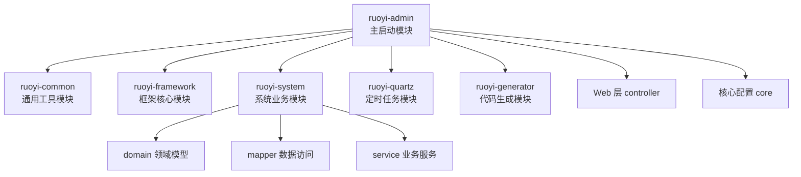
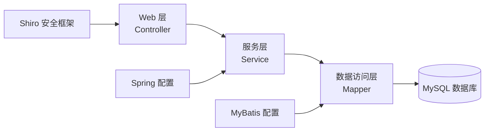

# 项目概述

**本文档引用的文件**
- [README.md](../../../README.md)
- [RuoYiApplication.java](../../../ruoyi-admin/src/main/java/com/ruoyi/RuoYiApplication.java)
- [application.yml](../../../ruoyi-admin/src/main/resources/application.yml)
- [application-druid.yml](../../../ruoyi-admin/src/main/resources/application-druid.yml)
- [pom.xml](../../../pom.xml)

## 目录
1. [简介](#简介)
2. [项目结构](#项目结构)
3. [核心组件](#核心组件)
4. [架构概述](#架构概述)
5. [详细组件分析](#详细组件分析)
6. [依赖分析](#依赖分析)
7. [性能考虑](#性能考虑)
8. [故障排除指南](#故障排除指南)
9. [结论](#结论)

## 简介

RuoYi v4.8.3 是一个基于 Spring Boot 3 开发的轻量级 Java 快速开发框架 [README.md](../../../README.md)。

- **项目名称**：RuoYi（若依）
- **项目定位**：用于所有 Web 应用程序的后台管理系统框架，如网站管理后台、网站会员中心、CMS、CRM、OA 等
- **版本**：4.8.3
- **技术栈**：
  - Spring Boot 3.5.14
  - JDK 17+
  - MyBatis
  - Shiro 2.2.0（权限管理）
  - Druid 1.2.28（数据库连接池）
  - MySQL
  - Thymeleaf（模板引擎）
  - SpringDoc（API 文档）

**核心特性**：
1. 精简易上手，出错概率低
2. 支持移动客户端访问
3. 全部开源，个人及企业免费使用
4. 支持代码生成，可自动生成前后端代码

## 项目结构

### 本节来源
- [README.md](../../../README.md)
- [RuoYiApplication.java](../../../ruoyi-admin/src/main/java/com/ruoyi/RuoYiApplication.java)
- [pom.xml](../../../pom.xml)

## 核心组件

- **ruoyi-admin**：主启动模块，包含 Web 控制器、核心配置与启动类 [RuoYiApplication.java](../../../ruoyi-admin/src/main/java/com/ruoyi/RuoYiApplication.java)
- **ruoyi-common**：通用工具模块，提供公共工具类与常量定义
- **ruoyi-framework**：框架核心模块，包含 Shiro 安全配置、MyBatis 配置等
- **ruoyi-system**：系统业务模块，包含用户、部门、角色、菜单等核心业务逻辑
- **ruoyi-quartz**：定时任务模块，提供在线任务调度功能
- **ruoyi-generator**：代码生成模块，支持前后端代码自动生成

### 本节来源
- 控制器文件：[ruoyi-admin/src/main/java/com/ruoyi/web/controller/](../../../ruoyi-admin/src/main/java/com/ruoyi/web/controller/)
- 服务文件：[ruoyi-system/src/main/java/com/ruoyi/system/service/](../../../ruoyi-system/src/main/java/com/ruoyi/system/service/)
- 模型文件：[ruoyi-system/src/main/java/com/ruoyi/system/domain/](../../../ruoyi-system/src/main/java/com/ruoyi/system/domain/)

## 架构概述

系统采用经典的分层架构：
1. **Web 层**：处理 HTTP 请求，位于 `ruoyi-admin/src/main/java/com/ruoyi/web/controller/`
2. **服务层**：业务逻辑处理，位于 `ruoyi-system/src/main/java/com/ruoyi/system/service/`
3. **数据访问层**：数据库操作，位于 `ruoyi-system/src/main/java/com/ruoyi/system/mapper/`
4. **领域模型层**：实体类定义，位于 `ruoyi-system/src/main/java/com/ruoyi/system/domain/`

### 本节来源
- [application.yml](../../../ruoyi-admin/src/main/resources/application.yml)
- [RuoYiApplication.java](../../../ruoyi-admin/src/main/java/com/ruoyi/RuoYiApplication.java)

## 详细组件分析

### 系统管理模块
- **职责**：用户认证、部门管理、岗位管理、菜单管理、角色管理、字典管理、参数管理、通知公告、操作日志、登录日志等
- **领域模型**：位于 [ruoyi-system/src/main/java/com/ruoyi/system/domain/](../../../ruoyi-system/src/main/java/com/ruoyi/system/domain/)
- **服务实现**：位于 [ruoyi-system/src/main/java/com/ruoyi/system/service/](../../../ruoyi-system/src/main/java/com/ruoyi/system/service/)
- **控制器**：位于 [ruoyi-admin/src/main/java/com/ruoyi/web/controller/system/](../../../ruoyi-admin/src/main/java/com/ruoyi/web/controller/system/)

### 定时任务模块
- **职责**：在线任务调度，支持添加、修改、删除任务，包含执行结果日志
- **位置**：`ruoyi-quartz` 模块

### 代码生成模块
- **职责**：前后端代码自动生成（java、html、xml、sql），支持 CRUD 下载
- **位置**：`ruoyi-generator` 模块

### 监控模块
- **职责**：系统监控（CPU、内存、磁盘、堆栈）、缓存监控、连接池监视、在线用户监控
- **控制器**：位于 [ruoyi-admin/src/main/java/com/ruoyi/web/controller/monitor/](../../../ruoyi-admin/src/main/java/com/ruoyi/web/controller/monitor/)

### 工具模块
- **职责**：系统接口文档生成、在线构建器
- **控制器**：位于 [ruoyi-admin/src/main/java/com/ruoyi/web/controller/tool/](../../../ruoyi-admin/src/main/java/com/ruoyi/web/controller/tool/)

### 本节来源
- 领域模型文件：[ruoyi-system/src/main/java/com/ruoyi/system/domain/](../../../ruoyi-system/src/main/java/com/ruoyi/system/domain/)
- 服务实现类：[ruoyi-system/src/main/java/com/ruoyi/system/service/](../../../ruoyi-system/src/main/java/com/ruoyi/system/service/)
- 控制器文件：[ruoyi-admin/src/main/java/com/ruoyi/web/controller/](../../../ruoyi-admin/src/main/java/com/ruoyi/web/controller/)

## 依赖分析

- **数据库**：MySQL（JDBC 驱动：`com.mysql.cj.jdbc.Driver`）
  - 连接配置见 [application-druid.yml](../../../ruoyi-admin/src/main/resources/application-druid.yml)(L9-L11)
  - 主库 URL：`jdbc:mysql://localhost:3306/ry-spring`
- **连接池**：Druid 1.2.28
  - 初始连接数：5
  - 最小空闲连接：10
  - 最大活跃连接：20
- **权限框架**：Apache Shiro 2.2.0（Jakarta 版本）
- **ORM 框架**：MyBatis（通过 mybatis-spring-boot-starter 3.0.5）
- **模板引擎**：Thymeleaf
- **API 文档**：SpringDoc 2.8.17
- **分页插件**：PageHelper 2.1.1
- **其他依赖**：
  - FastJSON 1.2.83（JSON 处理）
  - Apache POI 4.1.2（Excel 处理）
  - Velocity 2.3（代码生成模板引擎）
  - Oshi 7.3.0（系统信息监控）

### 本节来源
- [application-druid.yml](../../../ruoyi-admin/src/main/resources/application-druid.yml)
- [application.yml](../../../ruoyi-admin/src/main/resources/application.yml)
- [pom.xml](../../../pom.xml)

## 性能考虑

- **Tomcat 线程池配置**：
  - 最大线程数：800
  - 初始线程数：100
  - 接受队列长度：1000
- **数据库连接池优化**：
  - 连接获取超时时间：60 秒
  - 连接超时检测：30 秒
  - 空闲连接检测周期：60 秒
  - 连接最小生存时间：5 分钟
- **Session 管理**：
  - Session 超时时间：30 分钟
  - Session 有效性检测周期：10 分钟
  - 支持限制同一用户最大会话数
- **慢 SQL 监控**：Druid 配置慢 SQL 记录，阈值 1000ms
- **XSS 攻击防护**：启用 XSS 过滤器
- **文件上传限制**：
  - 单个文件最大：10MB
  - 总上传大小限制：20MB

### 本节来源
- [application.yml](../../../ruoyi-admin/src/main/resources/application.yml)
- [application-druid.yml](../../../ruoyi-admin/src/main/resources/application-druid.yml)

## 故障排除指南

- **日志配置**：
  - 日志框架：Logback（配置文件：`logback.xml`）
  - 日志级别：`com.ruoyi` 包为 debug 级别，`org.springframework` 为 warn 级别
- **常见问题排查**：
  1. **启动失败**：检查数据库连接配置（[application-druid.yml](../../../ruoyi-admin/src/main/resources/application-druid.yml)）
  2. **登录失败**：检查 Shiro 配置与用户密码策略（密码错误 5 次锁定 10 分钟）
  3. **权限问题**：检查角色菜单权限分配与数据范围配置
  4. **慢查询**：查看 Druid 监控台（`/druid/*`），登录用户名：`ruoyi`
- **监控端点**：
  - Druid 监控台：`/druid/*`
  - API 文档：`/swagger-ui.html`
  - API 文档 JSON：`/v3/api-docs`

### 本节来源
- [application.yml](../../../ruoyi-admin/src/main/resources/application.yml)
- [application-druid.yml](../../../ruoyi-admin/src/main/resources/application-druid.yml)

## 结论

RuoYi v4.8.3 是一个功能完备的企业级快速开发框架，具备以下特点：

1. **技术栈现代化**：基于 Spring Boot 3.5.14 + JDK 17+，采用 Shiro 2.2.0 Jakarta 版本等最新依赖
2. **功能丰富**：内置用户管理、部门管理、角色权限、定时任务、代码生成等 18 项核心功能
3. **架构清晰**：采用经典的 Web-Service-Mapper 分层架构，模块职责明确
4. **易于扩展**：模块化设计，支持代码生成，可快速构建业务功能
5. **生产就绪**：提供完善的监控、日志、安全防护机制（XSS 防护、密码策略、Session 管理）

该框架适用于需要快速搭建后台管理系统的场景，尤其适合 CMS、CRM、OA 等企业应用开发。
